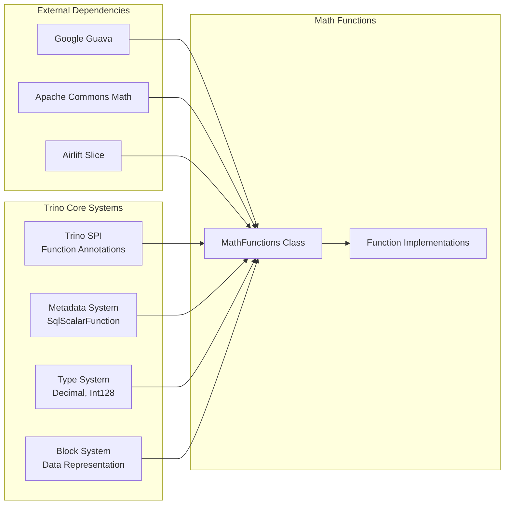
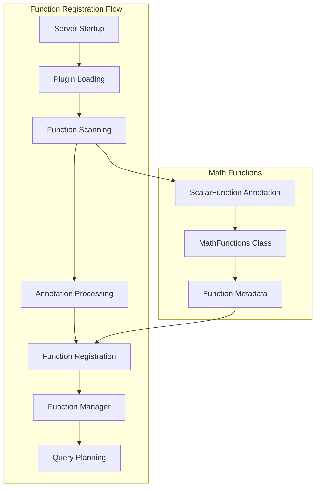

# Math Functions Module

The Math Functions module provides comprehensive mathematical computation capabilities within Trino's SQL function system. It implements a wide range of mathematical operations including basic arithmetic, trigonometric functions, statistical distributions, and advanced numerical computations.

## Overview

The Math Functions module is a core component of Trino's [SQL Functions & Operators](SQL Functions & Operators.md) system, specifically within the Scalar Functions category. It provides over 50 mathematical functions that operate on various numeric types including integers, floating-point numbers, decimals, and real numbers.

## Architecture

### Component Structure

```mermaid
graph TB
    subgraph "Math Functions Module"
        MF[MathFunctions Class]
        
        subgraph "Function Categories"
            BASIC[Basic Arithmetic<br/>abs, mod, sign]
            TRIG[Trigonometric<br/>sin, cos, tan, etc.]
            HYPER[Hyperbolic<br/>sinh, cosh, tanh]
            ROUND[Rounding<br/>round, floor, ceiling]
            EXPON[Exponential<br/>exp, log, power]
            STAT[Statistical<br/>normalCdf, betaCdf, tCdf]
            RANDOM[Random<br/>random functions]
            VECTOR[Vector<br/>cosineSimilarity]
            CONVERT[Conversion<br/>degrees/radians, base]
            UTIL[Utility<br/>isNaN, isFinite, constants]
        end
        
        MF --> BASIC
        MF --> TRIG
        MF --> HYPER
        MF --> ROUND
        MF --> EXPON
        MF --> STAT
        MF --> RANDOM
        MF --> VECTOR
        MF --> CONVERT
        MF --> UTIL
    end
    
    subgraph "Integration Points"
        SPI[Trino SPI]
        SCALAR[Scalar Function Framework]
        TYPE[Type System]
        EXEC[Execution Engine]
    end
    
    MF --> SPI
    MF --> SCALAR
    MF --> TYPE
    MF --> EXEC
```



### Dependencies and Integration



## Core Functionality

### Function Implementation Framework

The Math Functions module leverages Trino's scalar function framework through several key mechanisms:

1. **Annotation-Based Functions**: Uses `@ScalarFunction` annotations to define SQL functions
2. **Type Safety**: Implements functions for specific SQL types with `@SqlType` annotations
3. **Literal Parameters**: Supports decimal precision and scale through `@LiteralParameters`
4. **Constraints**: Enforces type constraints using `@Constraint` annotations

### Data Type Support

The module provides comprehensive support for Trino's numeric types:

- **Integer Types**: TINYINT, SMALLINT, INTEGER, BIGINT
- **Floating Point**: REAL, DOUBLE
- **Decimal Types**: Full support for DECIMAL(p,s) with arbitrary precision
- **Special Values**: NaN, Infinity handling

### Key Function Categories

#### 1. Basic Arithmetic Functions
- **abs()**: Absolute value with overflow protection
- **mod()**: Modulo operation across all numeric types
- **sign()**: Signum function returning -1, 0, or 1

#### 2. Trigonometric Functions
- **Standard**: sin(), cos(), tan()
- **Inverse**: asin(), acos(), atan(), atan2()
- **Hyperbolic**: sinh(), cosh(), tanh()
- **Conversion**: degrees(), radians()

#### 3. Rounding Functions
- **round()**: Multiple implementations for different precision requirements
- **floor()**: Round down to nearest integer
- **ceiling()**: Round up to nearest integer
- **truncate()**: Remove decimal places without rounding

#### 4. Exponential and Logarithmic
- **exp()**: Euler's number raised to power
- **log()**: Natural and base-specific logarithms
- **power()**: Exponentiation with alias 'pow'

#### 5. Statistical Functions
- **Probability Distributions**: normalCdf(), betaCdf(), tCdf(), tPdf()
- **Inverse Functions**: inverseNormalCdf(), inverseBetaCdf()
- **Parameter Validation**: Comprehensive input validation

#### 6. Random Number Generation
- **Thread-Safe**: Uses ThreadLocalRandom for concurrency
- **Multiple Variants**: Different ranges and types
- **Non-deterministic**: Properly marked for query planning

#### 7. Vector Operations
- **cosineSimilarity()**: Sparse vector similarity
- **cosineDistance()**: Distance metric for vectors
- **Map-based**: Operates on SQL MAP types

## Implementation Details

### Decimal Precision Handling

The module implements sophisticated decimal handling:

```java
// Static initialization for decimal rounding
DECIMAL_HALF_UNSCALED_FOR_SCALE = new Int128[Decimals.MAX_PRECISION];
DECIMAL_ALMOST_HALF_UNSCALED_FOR_SCALE = new Int128[Decimals.MAX_PRECISION];
```

### Overflow Protection

Comprehensive overflow checking for all numeric operations:

```java
checkCondition(num != Long.MIN_VALUE, NUMERIC_VALUE_OUT_OF_RANGE, 
    "Value -9223372036854775808 is out of range for abs(bigint)");
```

### Performance Optimizations

- **Static Method Calls**: Direct Java Math library usage where possible
- **Int128 Operations**: Optimized decimal arithmetic
- **Thread-Local Random**: Efficient random number generation
- **Primitive Types**: Minimal boxing for performance

## Error Handling

The module implements robust error handling through Trino's exception system:

- **INVALID_FUNCTION_ARGUMENT**: For invalid parameter values
- **NUMERIC_VALUE_OUT_OF_RANGE**: For overflow conditions
- **Detailed Messages**: Context-specific error descriptions

## Usage Examples

### Basic Mathematical Operations

```sql
-- Absolute value
SELECT abs(-42);  -- Returns 42

-- Trigonometric functions
SELECT sin(3.14159 / 2);  -- Returns ~1.0

-- Rounding operations
SELECT round(3.14159, 2);  -- Returns 3.14
SELECT ceiling(3.14);      -- Returns 4.0
SELECT floor(3.14);        -- Returns 3.0
```

### Statistical Functions

```sql
-- Normal distribution CDF
SELECT normalCdf(0, 1, 1.96);  -- Returns ~0.975

-- Random number generation
SELECT random();        -- Returns random double
SELECT random(100);     -- Returns random int 0-99
```

### Vector Operations

```sql
-- Cosine similarity between sparse vectors
SELECT cosineSimilarity(
    MAP(ARRAY['a', 'b'], ARRAY[1.0, 2.0]),
    MAP(ARRAY['b', 'c'], ARRAY[2.0, 3.0])
);
```

## Integration with Trino Ecosystem

### Function Registration

Math functions are automatically registered through Trino's function framework:



### Query Execution Integration

During query execution, math functions are:

1. **Resolved**: Function calls are bound to implementations
2. **Optimized**: Constant folding and type specialization
3. **Executed**: Direct bytecode execution or compiled expressions
4. **Type-checked**: Runtime type validation

## Testing and Quality Assurance

The module benefits from Trino's comprehensive testing framework:

- **Unit Tests**: Individual function validation
- **Integration Tests**: End-to-end query testing
- **Type Coverage**: All supported numeric types
- **Edge Cases**: Overflow, NaN, infinity handling
- **Performance Tests**: Benchmarking critical functions

## Performance Characteristics

### Computational Complexity

- **Basic Operations**: O(1) constant time
- **Statistical Functions**: Vary by algorithm (typically O(1) to O(n))
- **Vector Operations**: O(n) where n is vector size
- **Decimal Operations**: O(1) with optimized Int128 arithmetic

### Memory Usage

- **Minimal Allocation**: Reuses static constants
- **Thread-Safe**: No shared mutable state
- **Efficient Storage**: Compact decimal representation

## Future Enhancements

Potential areas for expansion include:

- **Additional Distributions**: More statistical distributions
- **Advanced Vector Operations**: Matrix operations, more similarity metrics
- **BigInteger Support**: Arbitrary precision integers
- **Complex Numbers**: Complex arithmetic functions
- **Performance Optimizations**: SIMD operations, vectorization

## Related Documentation

- [SQL Functions & Operators](SQL Functions & Operators.md) - Overview of Trino's function system
- [Function System](Function System.md) - Core function framework details
- [Type System](Type System.md) - Numeric type specifications
- [Query Execution Engine](Query Execution Engine.md) - Function execution context