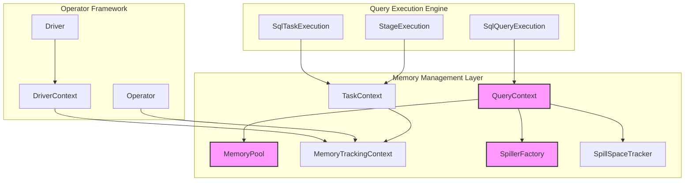
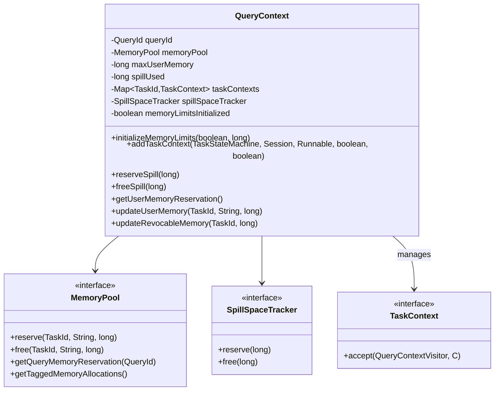
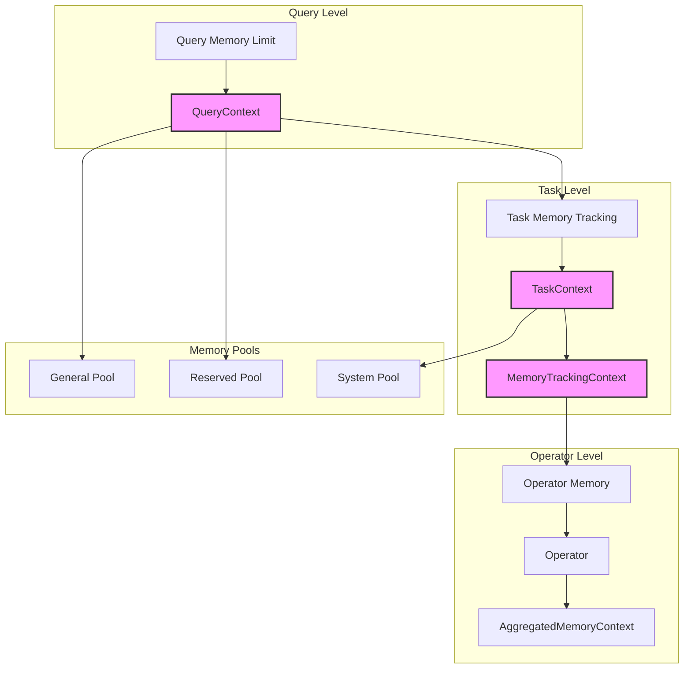
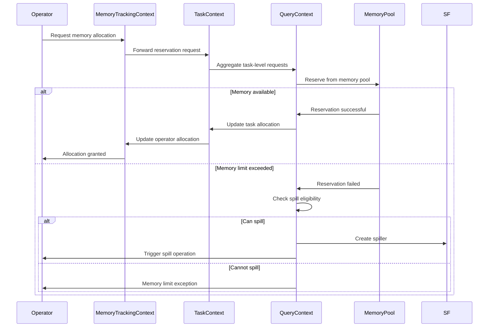
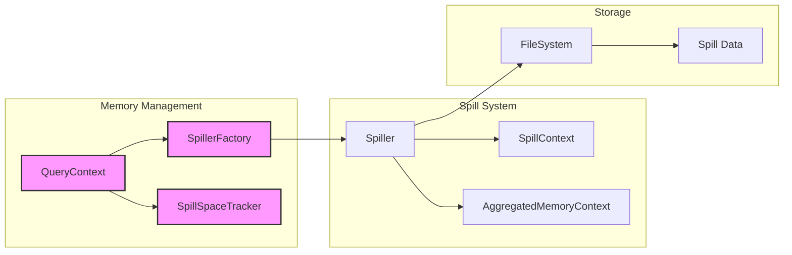

# Memory Management Module

## Introduction

The Memory Management module in Trino is a critical component responsible for managing memory allocation, tracking, and enforcement across query execution. It provides fine-grained control over memory usage at the query, task, and operator levels, ensuring efficient resource utilization and preventing memory exhaustion in distributed query processing environments.

## Architecture Overview

The Memory Management module implements a hierarchical memory tracking system that operates at multiple levels of the query execution stack. It coordinates memory allocation between the query execution engine, operators, and spill-to-disk mechanisms to maintain system stability under memory pressure.



## Core Components

### QueryContext

The `QueryContext` class serves as the central coordinator for memory management at the query level. It manages memory reservations, enforces limits, and coordinates with the spill system when memory pressure occurs.

**Key Responsibilities:**
- Query-level memory limit enforcement
- Memory pool coordination
- Spill space management
- Task context lifecycle management
- Memory allocation tracking and reporting

**Core Features:**
- Thread-safe memory reservation and release operations
- Configurable memory limits with resource overcommit support
- Integration with garbage collection monitoring
- Detailed memory allocation tracking with tagging support



### SpillerFactory

The `SpillerFactory` interface provides the abstraction for creating spillers that can serialize operator data to disk when memory limits are exceeded. This enables queries to continue execution even under memory pressure by offloading data to temporary storage.

**Key Responsibilities:**
- Spiller instance creation
- Type-aware serialization support
- Memory context integration
- Spill context management

## Memory Management Architecture

### Hierarchical Memory Tracking

The memory management system implements a multi-level tracking hierarchy that provides granular control over memory usage:



### Memory Reservation Flow

The memory reservation process follows a coordinated approach across the hierarchy:



## Integration with Query Execution

### Query Lifecycle Integration

The Memory Management module integrates with the query execution lifecycle through several key integration points:

1. **Query Initialization**: Memory limits are established when `QueryContext` is created
2. **Task Creation**: Each task receives its own memory tracking context
3. **Operator Execution**: Operators request memory through their local contexts
4. **Memory Pressure Handling**: Spill operations are triggered when limits are exceeded
5. **Query Cleanup**: All memory is released when the query completes

### Spill-to-Disk Integration

When memory limits are reached, the system can spill data to disk to allow query execution to continue:



## Memory Limit Enforcement

### User Memory Limits

The system enforces user memory limits at the query level through the `QueryContext`:

- **Soft Limits**: Memory reservations may be delayed when limits are approached
- **Hard Limits**: Queries are terminated when hard limits are exceeded
- **Resource Overcommit**: Allows queries to use available cluster memory
- **Tagged Allocations**: Tracks memory usage by allocation category for debugging

### Memory Limit Exceptions

When memory limits are exceeded, the system provides detailed error information:

```java
// Memory limit enforcement with detailed failure information
private void enforceUserMemoryLimit(long allocated, long delta, long maxMemory) {
    if (allocated + delta > maxMemory) {
        throw exceededLocalUserMemoryLimit(
            succinctBytes(maxMemory), 
            getAdditionalFailureInfo(allocated, delta)
        );
    }
}
```

## Performance Considerations

### Memory Allocation Efficiency

The memory management system is designed for high-performance query execution:

- **Lock-Free Operations**: Where possible, memory operations use concurrent data structures
- **Batch Reservations**: Multiple allocations can be batched for efficiency
- **Memory Pool Optimization**: Pre-allocated memory pools reduce allocation overhead
- **GC Integration**: Coordinates with garbage collection to minimize pause times

### Spill Performance

Spill operations are optimized to minimize impact on query performance:

- **Asynchronous Spilling**: Spill operations don't block query execution
- **Incremental Spilling**: Data is spilled incrementally as memory pressure increases
- **Compression**: Spilled data can be compressed to reduce I/O
- **Parallel Recovery**: Multiple threads can read spilled data concurrently

## Configuration and Monitoring

### Memory Configuration

The memory management system supports extensive configuration options:

- **Query Memory Limits**: Per-query memory allocation limits
- **Memory Pool Sizes**: Configuration of general, reserved, and system pools
- **Spill Configuration**: Spill directory, compression, and threshold settings
- **GC Monitoring**: Integration with garbage collection metrics

### Memory Monitoring

The system provides comprehensive memory usage monitoring:

- **Real-time Metrics**: Current memory usage by query, task, and operator
- **Historical Tracking**: Memory usage patterns over time
- **Allocation Tagging**: Detailed breakdown of memory usage by component
- **Spill Metrics**: Amount of data spilled and spill performance statistics

## Dependencies

The Memory Management module has key dependencies on several other Trino modules:

- **[Query Execution Engine](Query Execution Engine.md)**: Integrates with query and task execution
- **[Operator Framework](Query Execution Engine.md)**: Provides memory tracking for operators
- **[Spill System](Query Execution Engine.md)**: Coordinates spill-to-disk operations
- **[Trino SPI](Trino SPI.md)**: Uses SPI types for memory allocation tracking

## Error Handling and Recovery

### Memory Exhaustion Handling

The system implements sophisticated error handling for memory-related issues:

1. **Graceful Degradation**: Attempts to spill data before failing queries
2. **Query Termination**: Provides clear error messages when limits are exceeded
3. **Resource Cleanup**: Ensures all memory is properly released on failure
4. **Cluster Coordination**: Works with the cluster memory manager for global limits

### Recovery Mechanisms

When memory pressure is detected, the system can:

- Trigger operator-specific spill operations
- Reduce concurrent query execution
- Evict cached data
- Request garbage collection
- Terminate low-priority queries

## Future Enhancements

The memory management system is designed to support future enhancements:

- **Adaptive Memory Limits**: Dynamic adjustment based on cluster load
- **Machine Learning Integration**: Predictive memory allocation based on query patterns
- **Tiered Storage**: Integration with multiple storage tiers for spilling
- **Cross-Query Memory Sharing**: Efficient memory reuse between queries
- **Advanced Compression**: Better compression algorithms for spilled data