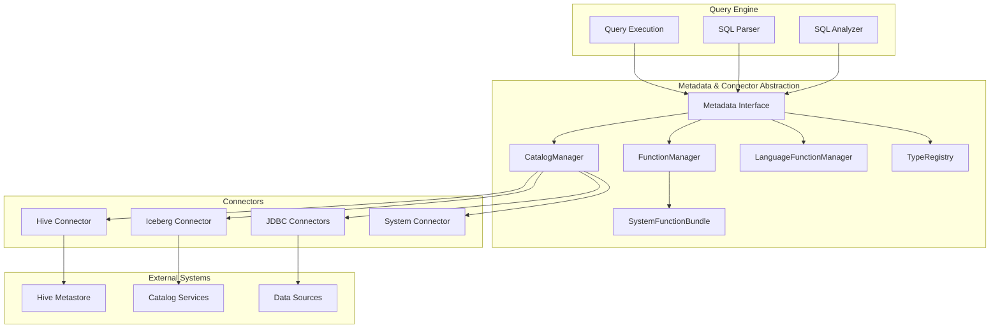
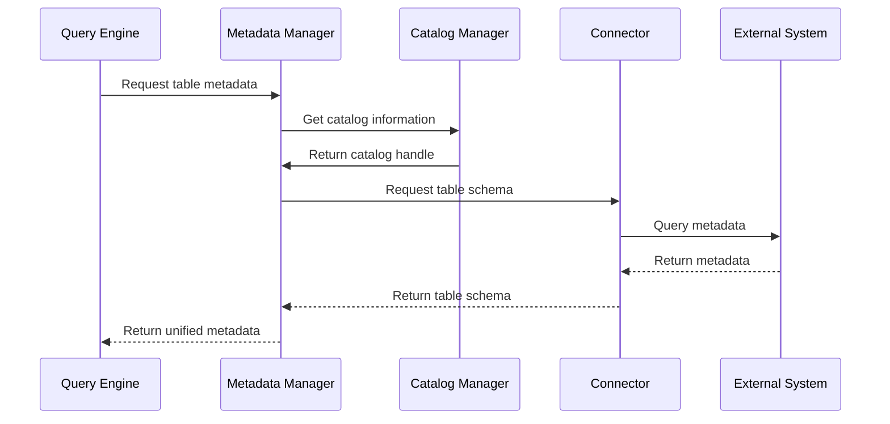

# Metadata & Connector Abstraction Module

## Overview

The Metadata & Connector Abstraction module serves as the central orchestration layer between Trino's query engine and the diverse ecosystem of data connectors. This module provides a unified interface for metadata management, catalog operations, and function resolution, enabling seamless integration with various data sources while maintaining consistency across the system.

## Purpose

The module's primary responsibilities include:
- **Metadata Management**: Centralized management of table schemas, column information, and statistics across all connected data sources
- **Catalog Abstraction**: Unified interface for interacting with different catalog implementations (Hive, Iceberg, JDBC, etc.)
- **Function Resolution**: Management and resolution of built-in, system, and user-defined functions
- **Type System Integration**: Coordination between the type system and connector-specific type mappings
- **Security Integration**: Bridge between Trino's security framework and connector-specific authorization mechanisms

## Architecture

## Core Components

### 1. Metadata Interface
The `Metadata` interface is the primary contract that defines all metadata operations available in Trino. It provides methods for:
- Table and schema management (create, drop, rename)
- Column operations (add, drop, rename, type changes)
- View and materialized view management
- Function resolution and management
- Security operations (privileges, roles, grants)
- Query optimization hints (statistics, constraints)

### 2. Catalog Manager
The `CatalogManager` handles the lifecycle and configuration of all catalogs in the system. It provides:
- Catalog registration and discovery
- Catalog property management
- Active catalog tracking
- Dynamic catalog creation and removal

### 3. Function Manager
The `FunctionManager` is responsible for function resolution and implementation specialization. It features:
- Scalar function implementation caching
- Aggregation function management
- Window function supplier resolution
- Table function processor provider management
- Function dependency resolution

### 4. Language Function Manager
The `LanguageFunctionManager` handles SQL and external language functions:
- SQL function parsing and analysis
- Function compilation and optimization
- Security context management for functions
- Inline function support for query-local definitions

### 5. System Function Bundle
The `SystemFunctionBundle` provides the complete set of built-in Trino functions:
- Mathematical and statistical functions
- String manipulation functions
- Date/time functions
- JSON functions
- Array and map functions
- Aggregation functions
- Window functions

### 6. Type Registry
The `TypeRegistry` manages the type system integration:
- Built-in type registration and management
- Parametric type instantiation
- Type operator verification
- SQL type parsing and resolution

## Data Flow

## Integration Points

### With SQL Analyzer
The metadata module provides the foundation for semantic analysis by:
- Resolving table and column references
- Validating function calls and signatures
- Enforcing security policies
- Providing type information for expressions

### With Query Planner
During query planning, the module:
- Supplies table statistics for cost-based optimization
- Provides partitioning information for distributed execution
- Suggests pushdown opportunities to connectors
- Resolves function implementations for code generation

### With Execution Engine
At execution time, the module:
- Provides specialized function implementations
- Manages connector-specific optimizations
- Handles dynamic filtering and constraint pushdown
- Coordinates with connector transaction management

## Key Features

### Extensibility
- Plugin-based architecture allows custom connectors
- Function extensibility through user-defined functions
- Type system extensibility for custom data types
- Security integration with external authorization systems

### Performance Optimization
- Aggressive caching of metadata and function implementations
- Lazy loading of catalog information
- Statistics-based query optimization
- Pushdown of operations to underlying systems

### Consistency
- Unified metadata interface across all connectors
- Consistent function resolution regardless of source
- Standardized type system integration
- Coherent security model across catalogs

## Related Documentation

- [Trino SPI](Trino%20SPI.md) - Core interfaces and contracts
- [SQL Analyzer, Planner & Optimizer](SQL%20Analyzer,%20Planner%20&%20Optimizer.md) - Query analysis and optimization
- [Query Execution Engine](Query%20Execution%20Engine.md) - Query execution coordination
- [Plugin Architecture](Trino%20SPI.md#plugin-architecture) - Extension mechanisms

## Sub-modules

The Metadata & Connector Abstraction module encompasses several specialized sub-modules:

- **[Metadata Management](Metadata%20Management.md)** - Core metadata operations and table management
- **[Catalog Management](Catalog%20Management.md)** - Catalog lifecycle and configuration management  
- **[Function Management](Function%20Management.md)** - Function resolution, specialization, and execution
- **[Type System Integration](Type%20System%20Integration.md)** - Type registry and operator management

Each sub-module is documented in detail in separate files.