# Metadata Management Module

## Introduction

The Metadata Management module serves as the central abstraction layer for all metadata operations in Trino. It provides a unified interface for managing database objects, security, functions, and statistics across different connectors. This module acts as the bridge between the SQL engine and various data sources, handling everything from table creation and schema management to privilege control and function resolution.

## Architecture Overview

The Metadata Management module is built around the `Metadata` interface, which defines the contract for all metadata operations. The implementation coordinates between multiple specialized managers to provide a cohesive metadata service.

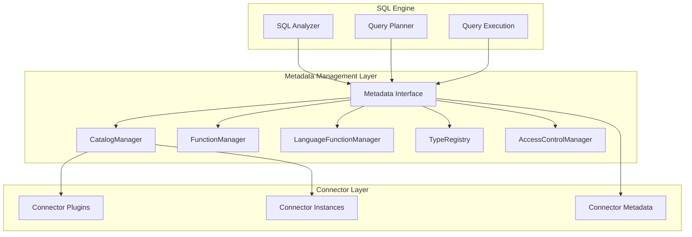
```mermaid
graph TB
    subgraph "Metadata Management Layer"
        MI[Metadata Interface]
        CM[CatalogManager]
        FM[FunctionManager]
        LFM[LanguageFunctionManager]
        TR[TypeRegistry]
        ACM[AccessControlManager]
    end
    
    subgraph "Connector Layer"
        CP[Connector Plugins]
        CO[Connector Instances]
        CMET[Connector Metadata]
    end
    
    subgraph "SQL Engine"
        SA[SQL Analyzer]
        QP[Query Planner]
        QE[Query Execution]
    end
    
    MI --> CM
    MI --> FM
    MI --> LFM
    MI --> TR
    MI --> ACM
    
    CM --> CP
    CM --> CO
    MI --> CMET
    
    SA --> MI
    QP --> MI
    QE --> MI
```

## Core Components

### Metadata Interface

The `Metadata` interface is the primary contract that defines all metadata operations in Trino. It provides methods for:

- **Catalog and Schema Management**: Creating, dropping, and listing catalogs and schemas
- **Table Operations**: Creating, altering, dropping tables, and managing table properties
- **View Management**: Creating, altering, and dropping views and materialized views
- **Function Management**: Resolving and managing functions across different catalogs
- **Security Operations**: Managing roles, privileges, and access control
- **Statistics**: Collecting and managing table statistics for query optimization
- **Query Pushdown**: Applying optimizations like filter pushdown, projection pushdown, and join pushdown

### Key Architectural Patterns

#### 1. Unified Abstraction

The Metadata interface provides a single point of access for all metadata operations, regardless of the underlying connector:

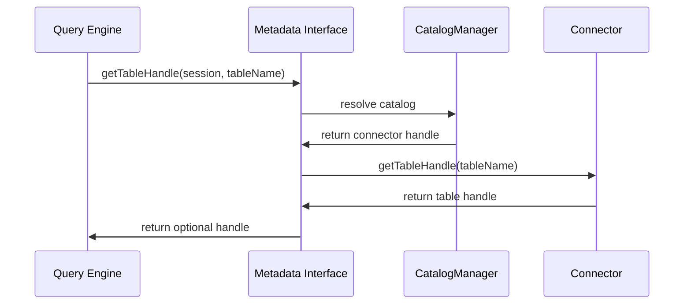
```mermaid
sequenceDiagram
    participant QE as Query Engine
    participant MI as Metadata Interface
    participant CM as CatalogManager
    participant CO as Connector
    
    QE->>MI: getTableHandle(session, tableName)
    MI->>CM: resolve catalog
    CM->>MI: return connector handle
    MI->>CO: getTableHandle(tableName)
    CO->>MI: return table handle
    MI->>QE: return optional handle
```

#### 2. Session-Aware Operations

All metadata operations are session-aware, ensuring proper security context and catalog resolution:

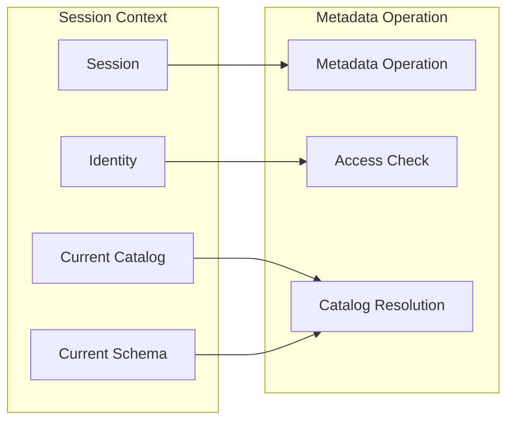
```mermaid
graph LR
    subgraph "Session Context"
        S[Session]
        I[Identity]
        CC[Current Catalog]
        CS[Current Schema]
    end
    
    subgraph "Metadata Operation"
        MO[Metadata Operation]
        AC[Access Check]
        CR[Catalog Resolution]
    end
    
    S --> MO
    I --> AC
    CC --> CR
    CS --> CR
```

#### 3. Connector Delegation

The Metadata interface delegates operations to appropriate connectors while maintaining system-level coordination:

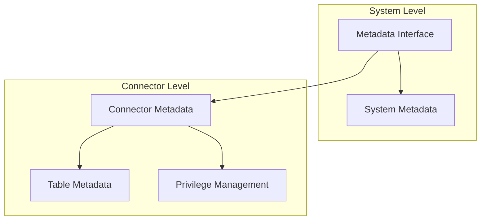
```mermaid
graph TD
    subgraph "System Level"
        MI[Metadata Interface]
        SM[System Metadata]
    end
    
    subgraph "Connector Level"
        CM[Connector Metadata]
        TM[Table Metadata]
        PM[Privilege Management]
    end
    
    MI --> SM
    MI --> CM
    CM --> TM
    CM --> PM
```

## Data Flow Architecture

### Metadata Resolution Flow

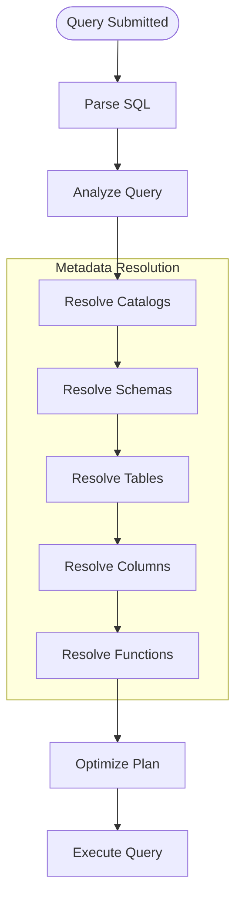
```mermaid
flowchart TD
    Start([Query Submitted])
    Parse[Parse SQL]
    Analyze[Analyze Query]
    
    subgraph "Metadata Resolution"
        RC[Resolve Catalogs]
        RS[Resolve Schemas]
        RT[Resolve Tables]
        RCOL[Resolve Columns]
        RF[Resolve Functions]
    end
    
    Optimize[Optimize Plan]
    Execute[Execute Query]
    
    Start --> Parse
    Parse --> Analyze
    Analyze --> RC
    RC --> RS
    RS --> RT
    RT --> RCOL
    RCOL --> RF
    RF --> Optimize
    Optimize --> Execute
```

### Security Integration Flow

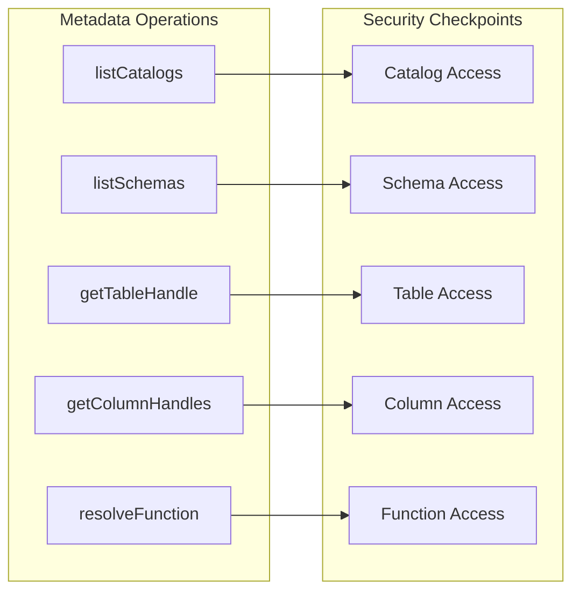
```mermaid
flowchart LR
    subgraph "Security Checkpoints"
        SC1[Catalog Access]
        SC2[Schema Access]
        SC3[Table Access]
        SC4[Column Access]
        SC5[Function Access]
    end
    
    subgraph "Metadata Operations"
        MO1[listCatalogs]
        MO2[listSchemas]
        MO3[getTableHandle]
        MO4[getColumnHandles]
        MO5[resolveFunction]
    end
    
    MO1 --> SC1
    MO2 --> SC2
    MO3 --> SC3
    MO4 --> SC4
    MO5 --> SC5
```

## Component Interactions

### Catalog Management Integration

The Metadata interface works closely with the CatalogManager to handle catalog lifecycle and connector instances:

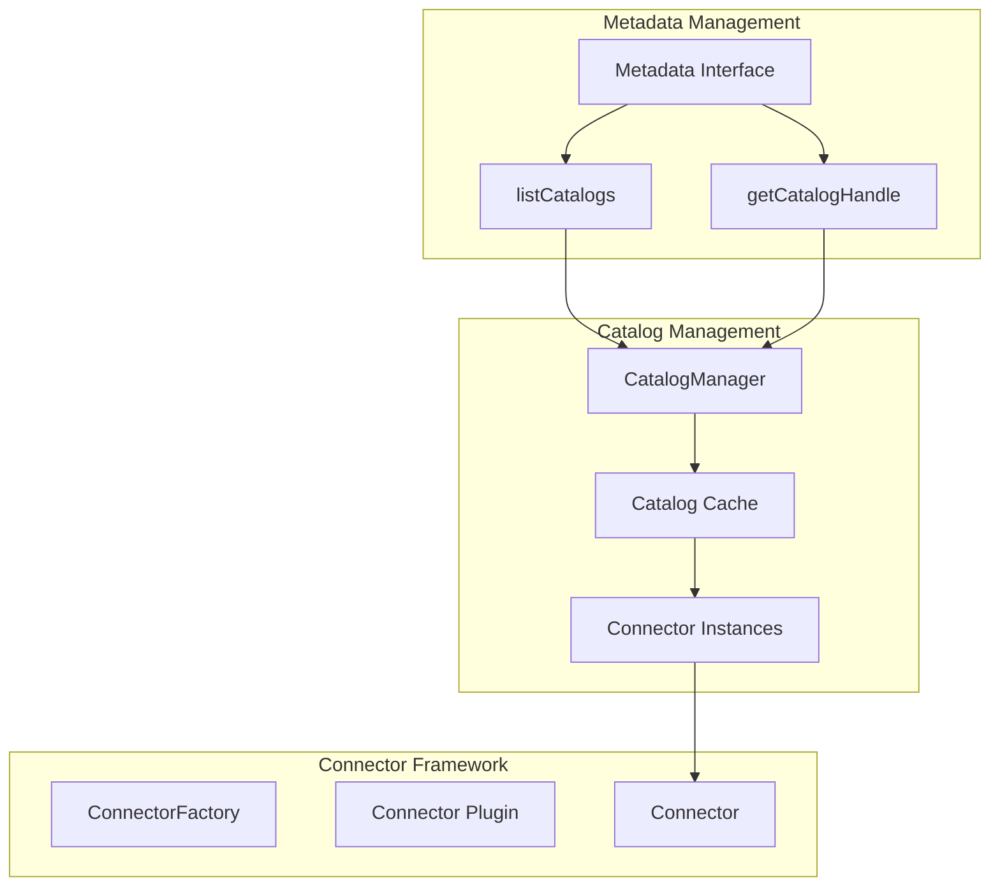
```mermaid
graph TB
    subgraph "Metadata Management"
        MI[Metadata Interface]
        LE[listCatalogs]
        GE[getCatalogHandle]
    end
    
    subgraph "Catalog Management"
        CM[CatalogManager]
        CC[Catalog Cache]
        CI[Connector Instances]
    end
    
    subgraph "Connector Framework"
        CF[ConnectorFactory]
        CP[Connector Plugin]
        CO[Connector]
    end
    
    MI --> LE
    MI --> GE
    LE --> CM
    GE --> CM
    CM --> CC
    CC --> CI
    CI --> CO
```

### Function Resolution Integration

Function resolution involves coordination between multiple managers:

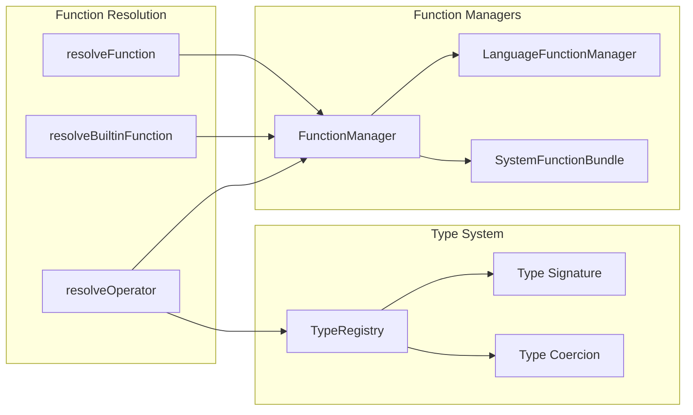
```mermaid
graph LR
    subgraph "Function Resolution"
        RF[resolveFunction]
        RBF[resolveBuiltinFunction]
        RO[resolveOperator]
    end
    
    subgraph "Function Managers"
        FM[FunctionManager]
        LFM[LanguageFunctionManager]
        SFB[SystemFunctionBundle]
    end
    
    subgraph "Type System"
        TR[TypeRegistry]
        TS[Type Signature]
        TC[Type Coercion]
    end
    
    RF --> FM
    RBF --> FM
    RO --> FM
    FM --> LFM
    FM --> SFB
    RO --> TR
    TR --> TS
    TR --> TC
```

## Query Pushdown and Optimization

The Metadata interface plays a crucial role in query optimization by supporting various pushdown operations:

### Pushdown Operations

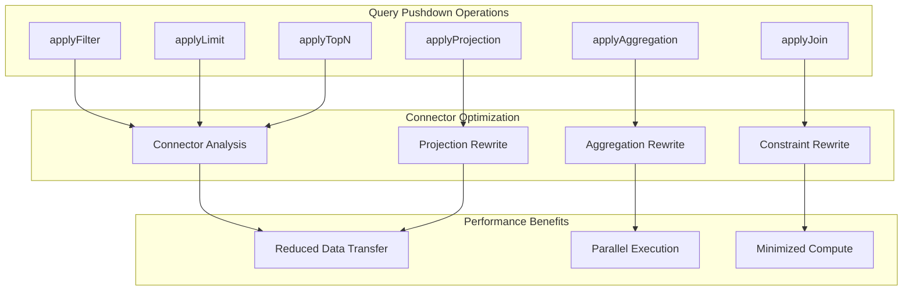
```mermaid
graph TD
    subgraph "Query Pushdown Operations"
        AF[applyFilter]
        AP[applyProjection]
        AA[applyAggregation]
        AJ[applyJoin]
        AL[applyLimit]
        ATN[applyTopN]
    end
    
    subgraph "Connector Optimization"
        CA[Connector Analysis]
        CR[Constraint Rewrite]
        PR[Projection Rewrite]
        AR[Aggregation Rewrite]
    end
    
    subgraph "Performance Benefits"
        RD[Reduced Data Transfer]
        PE[Parallel Execution]
        MC[Minimized Compute]
    end
    
    AF --> CA
    AP --> PR
    AA --> AR
    AJ --> CR
    AL --> CA
    ATN --> CA
    
    CA --> RD
    PR --> RD
    AR --> PE
    CR --> MC
```

### Statistics and Cost-Based Optimization

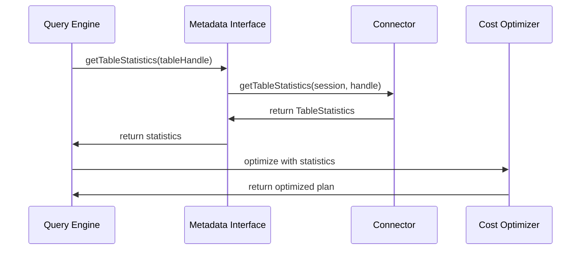
```mermaid
sequenceDiagram
    participant QE as Query Engine
    participant MI as Metadata Interface
    participant CM as Connector
    participant CO as Cost Optimizer
    
    QE->>MI: getTableStatistics(tableHandle)
    MI->>CM: getTableStatistics(session, handle)
    CM->>MI: return TableStatistics
    MI->>QE: return statistics
    QE->>CO: optimize with statistics
    CO->>QE: return optimized plan
```

## Security and Access Control

### Privilege Management

The Metadata interface integrates with the AccessControlManager to provide comprehensive security:

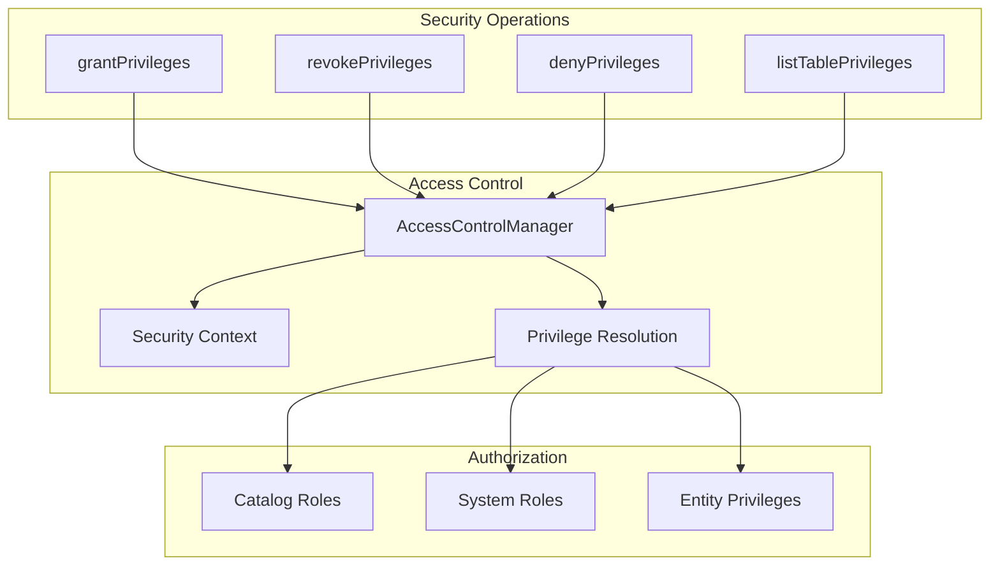
```mermaid
graph TB
    subgraph "Security Operations"
        GP[grantPrivileges]
        RP[revokePrivileges]
        DP[denyPrivileges]
        LTP[listTablePrivileges]
    end
    
    subgraph "Access Control"
        ACM[AccessControlManager]
        SC[Security Context]
        PR[Privilege Resolution]
    end
    
    subgraph "Authorization"
        CR[Catalog Roles]
        SR[System Roles]
        EP[Entity Privileges]
    end
    
    GP --> ACM
    RP --> ACM
    DP --> ACM
    LTP --> ACM
    
    ACM --> SC
    ACM --> PR
    PR --> CR
    PR --> SR
    PR --> EP
```

### Role-Based Access Control

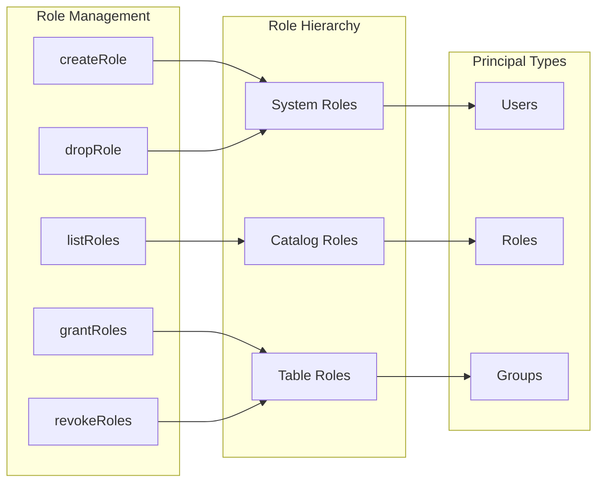
```mermaid
flowchart LR
    subgraph "Role Management"
        CR[createRole]
        DR[dropRole]
        LR[listRoles]
        GR[grantRoles]
        RR[revokeRoles]
    end
    
    subgraph "Role Hierarchy"
        SR[System Roles]
        CR2[Catalog Roles]
        TR[Table Roles]
    end
    
    subgraph "Principal Types"
        U[Users]
        R[Roles]
        G[Groups]
    end
    
    CR --> SR
    DR --> SR
    LR --> CR2
    GR --> TR
    RR --> TR
    
    SR --> U
    CR2 --> R
    TR --> G
```

## Transaction and Concurrency Management

### Table Modification Operations

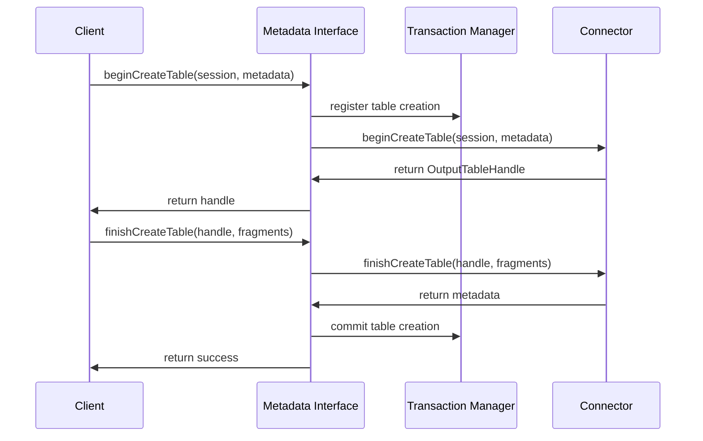
```mermaid
sequenceDiagram
    participant Client
    participant MI as Metadata Interface
    participant TM as Transaction Manager
    participant CO as Connector
    
    Client->>MI: beginCreateTable(session, metadata)
    MI->>TM: register table creation
    MI->>CO: beginCreateTable(session, metadata)
    CO->>MI: return OutputTableHandle
    MI->>Client: return handle
    
    Client->>MI: finishCreateTable(handle, fragments)
    MI->>CO: finishCreateTable(handle, fragments)
    CO->>MI: return metadata
    MI->>TM: commit table creation
    MI->>Client: return success
```

### Merge Operations Support

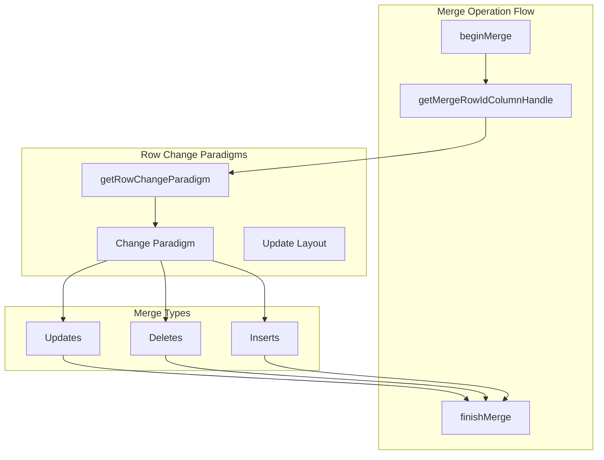
```mermaid
graph TD
    subgraph "Merge Operation Flow"
        BM[beginMerge]
        GRC[getMergeRowIdColumnHandle]
        FM[finishMerge]
    end
    
    subgraph "Row Change Paradigms"
        RCP[getRowChangeParadigm]
        CP[Change Paradigm]
        UL[Update Layout]
    end
    
    subgraph "Merge Types"
        U[Updates]
        D[Deletes]
        I[Inserts]
    end
    
    BM --> GRC
    GRC --> RCP
    RCP --> CP
    CP --> U
    CP --> D
    CP --> I
    U --> FM
    D --> FM
    I --> FM
```

## Integration with Other Modules

### SQL Analyzer Integration

The Metadata interface is extensively used by the SQL Analyzer for semantic analysis:

- **Table Resolution**: `getTableHandle()` for table existence and access
- **Column Resolution**: `getColumnHandles()` and `getColumnMetadata()` for column information
- **Function Resolution**: `resolveFunction()` and `resolveOperator()` for function validation
- **View Resolution**: `getView()` and related methods for view expansion

### Query Planner Integration

The Query Planner uses metadata for optimization decisions:

- **Statistics**: `getTableStatistics()` for cost-based optimization
- **Partitioning**: `applyPartitioning()` and `getCommonPartitioning()` for distributed planning
- **Pushdown**: Various `apply*` methods for connector optimization
- **Layout**: `getInsertLayout()` and `getNewTableLayout()` for data layout optimization

### Execution Engine Integration

The Execution Engine relies on metadata for runtime operations:

- **Table Handles**: For data source identification
- **Column Handles**: For data access patterns
- **Function Metadata**: For function execution
- **Security Context**: For access control enforcement

## Error Handling and Validation

### Exception Handling Strategy

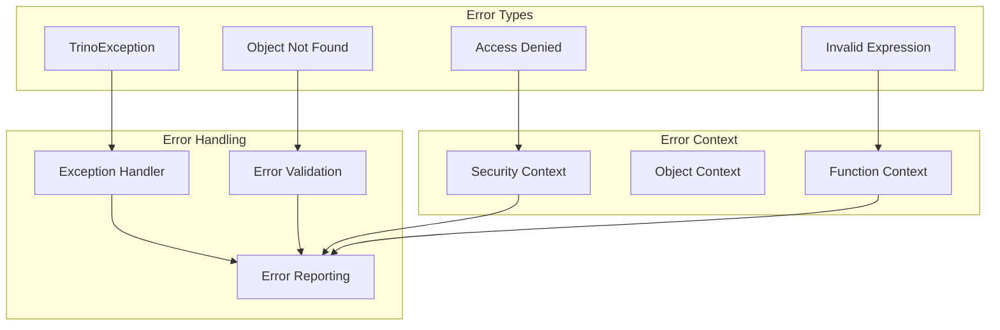
```mermaid
graph TD
    subgraph "Error Types"
        TE[TrinoException]
        ONF[Object Not Found]
        AE[Access Denied]
        IE[Invalid Expression]
    end
    
    subgraph "Error Context"
        SC[Security Context]
        OC[Object Context]
        FC[Function Context]
    end
    
    subgraph "Error Handling"
        EH[Exception Handler]
        ER[Error Reporting]
        EV[Error Validation]
    end
    
    TE --> EH
    ONF --> EV
    AE --> SC
    IE --> FC
    
    EH --> ER
    EV --> ER
    SC --> ER
    FC --> ER
```

## Performance Considerations

### Caching Strategy

The Metadata implementation employs various caching mechanisms:

- **Catalog Cache**: Connector instance caching
- **Function Cache**: Function resolution results
- **Type Cache**: Type resolution and coercion rules
- **Privilege Cache**: Access control decisions

### Batch Operations

Many metadata operations support batch processing for efficiency:

- `listTables()` with prefixes
- `listTableColumns()` for multiple tables
- `getViews()` and `getMaterializedViews()` with prefixes
- `listTablePrivileges()` for privilege enumeration

## Extensibility and Plugin Integration

### Connector Metadata Integration

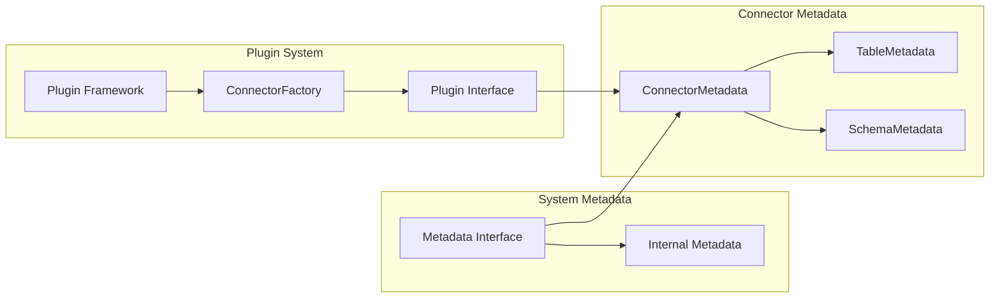
```mermaid
graph LR
    subgraph "System Metadata"
        MI[Metadata Interface]
        IM[Internal Metadata]
    end
    
    subgraph "Connector Metadata"
        CM[ConnectorMetadata]
        TM[TableMetadata]
        SM[SchemaMetadata]
    end
    
    subgraph "Plugin System"
        PF[Plugin Framework]
        CF[ConnectorFactory]
        PI[Plugin Interface]
    end
    
    MI --> IM
    MI --> CM
    CM --> TM
    CM --> SM
    PF --> CF
    CF --> PI
    PI --> CM
```

## Best Practices and Usage Guidelines

### 1. Session Context Management

Always ensure proper session context is maintained when calling metadata operations:

- Use current session for all operations
- Respect catalog and schema context
- Handle security context appropriately

### 2. Error Handling

Handle metadata operation failures gracefully:

- Check for object existence before operations
- Handle access denied exceptions appropriately
- Provide meaningful error messages

### 3. Performance Optimization

Optimize metadata operations for better performance:

- Use batch operations when possible
- Leverage caching mechanisms
- Minimize redundant metadata calls

### 4. Security Considerations

Ensure proper security integration:

- Always perform access control checks
- Respect role-based permissions
- Handle privilege escalation properly

## Connector Metadata Implementation Patterns

### Example: TPC-H Connector Metadata Implementation

The TPC-H connector provides an excellent example of a complete metadata implementation that demonstrates key patterns and best practices:

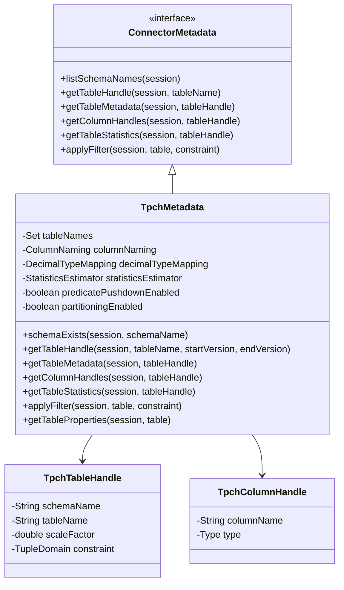
```mermaid
classDiagram
    class TpchMetadata {
        -Set tableNames
        -ColumnNaming columnNaming
        -DecimalTypeMapping decimalTypeMapping
        -StatisticsEstimator statisticsEstimator
        -boolean predicatePushdownEnabled
        -boolean partitioningEnabled
        +schemaExists(session, schemaName)
        +getTableHandle(session, tableName, startVersion, endVersion)
        +getTableMetadata(session, tableHandle)
        +getColumnHandles(session, tableHandle)
        +getTableStatistics(session, tableHandle)
        +applyFilter(session, table, constraint)
        +getTableProperties(session, table)
    }
    
    class ConnectorMetadata {
        <<interface>>
        +listSchemaNames(session)
        +getTableHandle(session, tableName)
        +getTableMetadata(session, tableHandle)
        +getColumnHandles(session, tableHandle)
        +getTableStatistics(session, tableHandle)
        +applyFilter(session, table, constraint)
    }
    
    class TpchTableHandle {
        -String schemaName
        -String tableName
        -double scaleFactor
        -TupleDomain constraint
    }
    
    class TpchColumnHandle {
        -String columnName
        -Type type
    }
    
    ConnectorMetadata <|-- TpchMetadata
    TpchMetadata --> TpchTableHandle
    TpchMetadata --> TpchColumnHandle
```

### Key Implementation Patterns

#### 1. Schema Management Pattern

```java
// Schema existence check with scale factor validation
public boolean schemaExists(ConnectorSession session, String schemaName) {
    return schemaNameToScaleFactor(schemaName) > 0;
}

// Static schema list for predefined schemas
public List<String> listSchemaNames(ConnectorSession session) {
    return SCHEMA_NAMES; // ["tiny", "sf1", "sf100", ...]
}
```

#### 2. Table Handle Creation Pattern

```java
public TpchTableHandle getTableHandle(ConnectorSession session, SchemaTableName tableName, 
                                    Optional<ConnectorTableVersion> startVersion, 
                                    Optional<ConnectorTableVersion> endVersion) {
    // Version check for connectors that don't support versioning
    if (startVersion.isPresent() || endVersion.isPresent()) {
        throw new TrinoException(NOT_SUPPORTED, "This connector does not support versioned tables");
    }
    
    // Validate table name exists
    if (!tableNames.contains(tableName.getTableName())) {
        return null;
    }
    
    // Parse scale factor from schema name
    double scaleFactor = schemaNameToScaleFactor(tableName.getSchemaName());
    if (scaleFactor <= 0) {
        return null;
    }
    
    return new TpchTableHandle(tableName.getSchemaName(), tableName.getTableName(), scaleFactor);
}
```

#### 3. Statistics Estimation Pattern

```java
public TableStatistics getTableStatistics(ConnectorSession session, ConnectorTableHandle tableHandle) {
    TpchTableHandle tpchTableHandle = (TpchTableHandle) tableHandle;
    
    // Get column value restrictions based on constraints
    Map<TpchColumn<?>, List<Object>> columnValuesRestrictions = ImmutableMap.of();
    if (predicatePushdownEnabled) {
        columnValuesRestrictions = getColumnValuesRestrictions(tpchTable, tpchTableHandle.constraint());
    }
    
    // Estimate statistics using connector-specific estimator
    Optional<TableStatisticsData> optionalTableStatisticsData = 
        statisticsEstimator.estimateStats(tpchTable, columnValuesRestrictions, tpchTableHandle.scaleFactor());
    
    // Convert to Trino statistics format
    return optionalTableStatisticsData
        .map(tableStatisticsData -> toTableStatistics(tableStatisticsData, tpchTableHandle, columnHandles))
        .orElse(TableStatistics.empty());
}
```

#### 4. Constraint Application Pattern

```java
public Optional<ConstraintApplicationResult<ConnectorTableHandle>> applyFilter(
        ConnectorSession session, ConnectorTableHandle table, Constraint constraint) {
    
    TpchTableHandle handle = (TpchTableHandle) table;
    TupleDomain<ColumnHandle> oldDomain = handle.constraint();
    
    // Apply connector-specific predicate pushdown
    TupleDomain<ColumnHandle> predicate = TupleDomain.all();
    TupleDomain<ColumnHandle> unenforcedConstraint = constraint.getSummary();
    
    if (predicatePushdownEnabled && handle.tableName().equals(TpchTable.ORDERS.getTableName())) {
        predicate = toTupleDomain(ImmutableMap.of(
            toColumnHandle(OrderColumn.ORDER_STATUS),
            filterValues(orderStatusNullableValues, OrderColumn.ORDER_STATUS, constraint)));
        unenforcedConstraint = filterOutColumnFromPredicate(constraint.getSummary(), 
                                                          toColumnHandle(OrderColumn.ORDER_STATUS));
    }
    
    // Return updated table handle with new constraint
    return Optional.of(new ConstraintApplicationResult<>(
        new TpchTableHandle(handle.schemaName(), handle.tableName(), handle.scaleFactor(),
                           oldDomain.intersect(predicate)),
        unenforcedConstraint,
        constraint.getExpression(),
        false));
}
```

### Advanced Features Implementation

#### 1. Table Partitioning Support

```java
public ConnectorTableProperties getTableProperties(ConnectorSession session, ConnectorTableHandle table) {
    TpchTableHandle tableHandle = (TpchTableHandle) table;
    
    Optional<ConnectorTablePartitioning> tablePartitioning = Optional.empty();
    List<LocalProperty<ColumnHandle>> localProperties = ImmutableList.of();
    
    // Configure partitioning for specific tables
    if (partitioningEnabled && tableHandle.tableName().equals(TpchTable.ORDERS.getTableName())) {
        ColumnHandle orderKeyColumn = columns.get(columnNaming.getName(OrderColumn.ORDER_KEY));
        tablePartitioning = Optional.of(new ConnectorTablePartitioning(
                new TpchPartitioningHandle(TpchTable.ORDERS.getTableName(),
                                         calculateTotalRows(OrderGenerator.SCALE_BASE, tableHandle.scaleFactor())),
                ImmutableList.of(orderKeyColumn),
                true));
        localProperties = ImmutableList.of(new SortingProperty<>(orderKeyColumn, SortOrder.ASC_NULLS_FIRST));
    }
    
    return new ConnectorTableProperties(constraint, tablePartitioning, Optional.empty(), localProperties);
}
```

#### 2. Table Scan Redirection

```java
public Optional<TableScanRedirectApplicationResult> applyTableScanRedirect(
        ConnectorSession session, ConnectorTableHandle table) {
    
    TpchTableHandle handle = (TpchTableHandle) table;
    if (destinationCatalog.isEmpty()) {
        return Optional.empty();
    }
    
    // Create redirection to destination catalog
    CatalogSchemaTableName destinationTable = new CatalogSchemaTableName(
            destinationCatalog.get(),
            destinationSchema.orElse(handle.schemaName()),
            handle.tableName());
    
    return Optional.of(new TableScanRedirectApplicationResult(
            destinationTable,
            ImmutableBiMap.copyOf(getColumnHandles(session, table)).inverse(),
            handle.constraint().transformKeys(TpchColumnHandle.class::cast)
                         .transformKeys(TpchColumnHandle::columnName)));
}
```

### Statistics and Cost-Based Optimization Integration

#### Statistics Collection Framework

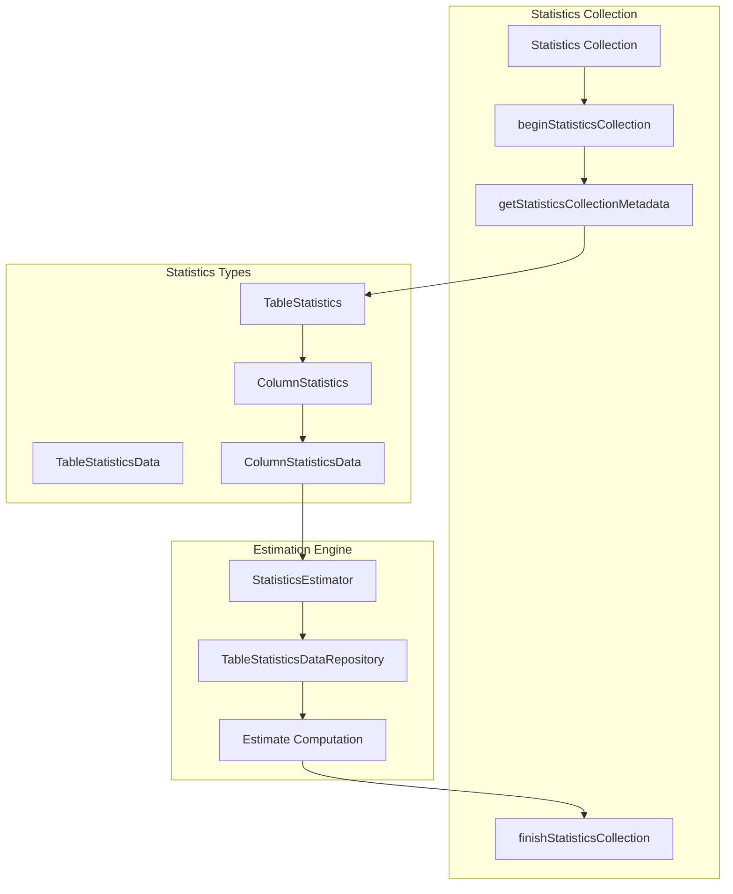
```mermaid
graph TD
    subgraph "Statistics Collection"
        SC[Statistics Collection]
        BSC[beginStatisticsCollection]
        FSC[finishStatisticsCollection]
        GSM[getStatisticsCollectionMetadata]
    end
    
    subgraph "Statistics Types"
        TS[TableStatistics]
        CS[ColumnStatistics]
        TD[TableStatisticsData]
        CSD[ColumnStatisticsData]
    end
    
    subgraph "Estimation Engine"
        SE[StatisticsEstimator]
        TSDR[TableStatisticsDataRepository]
        EC[Estimate Computation]
    end
    
    SC --> BSC
    BSC --> GSM
    GSM --> TS
    TS --> CS
    CS --> CSD
    CSD --> SE
    SE --> TSDR
    TSDR --> EC
    EC --> FSC
```

#### Cost-Based Optimization Support

The metadata system provides essential information for the cost-based optimizer:

- **Row Count Estimates**: Table cardinality information
- **Column Statistics**: Null fractions, distinct values, data size
- **Value Ranges**: Min/max values for numeric columns
- **Histogram Data**: Value distribution patterns
- **Correlation Statistics**: Inter-column relationships

## Error Handling and Validation Patterns

### Metadata Validation

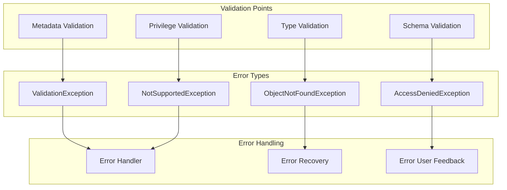
```mermaid
graph TD
    subgraph "Validation Points"
        MV[Metadata Validation]
        TV[Type Validation]
        SV[Schema Validation]
        PV[Privilege Validation]
    end
    
    subgraph "Error Types"
        VE[ValidationException]
        ONF[ObjectNotFoundException]
        AD[AccessDeniedException]
        NS[NotSupportedException]
    end
    
    subgraph "Error Handling"
        EH[Error Handler]
        ER[Error Recovery]
        EU[Error User Feedback]
    end
    
    MV --> VE
    TV --> ONF
    SV --> AD
    PV --> NS
    
    VE --> EH
    ONF --> ER
    AD --> EU
    NS --> EH
```

### Exception Handling Best Practices

1. **Object Not Found**: Return `null` or `Optional.empty()` for missing objects
2. **Access Denied**: Throw `AccessDeniedException` with clear messages
3. **Not Supported**: Throw `TrinoException` with `NOT_SUPPORTED` error code
4. **Invalid Input**: Validate parameters and throw `IllegalArgumentException`

## Performance Optimization Strategies

### Caching Implementation

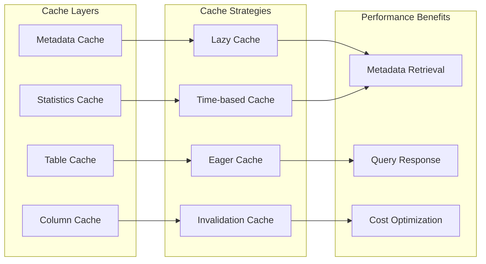
```mermaid
graph LR
    subgraph "Cache Layers"
        MC[Metadata Cache]
        TC[Table Cache]
        CC[Column Cache]
        SC[Statistics Cache]
    end
    
    subgraph "Cache Strategies"
        LC[Lazy Cache]
        EC[Eager Cache]
        IC[Invalidation Cache]
        TC2[Time-based Cache]
    end
    
    subgraph "Performance Benefits"
        MR[Metadata Retrieval]
        QR[Query Response]
        CO[Cost Optimization]
    end
    
    MC --> LC
    TC --> EC
    CC --> IC
    SC --> TC2
    
    LC --> MR
    EC --> QR
    IC --> CO
    TC2 --> MR
```

### Batch Operations

- **Table Listing**: Use prefixes to limit scope
- **Column Metadata**: Batch retrieve for multiple tables
- **Statistics Collection**: Parallel collection from multiple sources
- **Privilege Checking**: Batch validation for multiple objects

## Testing and Validation

### Metadata Testing Framework

```mermaid
graph TD
    subgraph "Testing Components"
        MT[Metadata Testing]
        TV[Table Validation]
        CV[Column Validation]
        SV[Statistics Validation]
        PV[Performance Validation]
    end
    
    subgraph "Test Types"
        UT[Unit Tests]
        IT[Integration Tests]
        PT[Performance Tests]
        RT[Regression Tests]
    end
    
    subgraph "Validation Tools"
        MV[Metadata Validator]
        TV2[Type Validator]
        EV[Expression Validator]
        QV[Query Validator]
    end
    
    MT --> UT
    TV --> IT
    CV --> PT
    SV --> RT
    PV --> UT
    
    UT --> MV
    IT --> TV2
    PT --> EV
    RT --> QV
```

## Related Documentation

- [Trino SPI](Trino%20SPI.md) - Core SPI definitions and interfaces
- [Connector Framework](Connector%20Framework.md) - Connector development and integration
- [SQL Analyzer, Planner & Optimizer](SQL%20Analyzer%2C%20Planner%20%26%20Optimizer.md) - Query analysis and optimization
- [Security Framework](Security%20Framework.md) - Security and access control systems
- [Function System](Function%20System.md) - Function resolution and management
- [Catalog Management](Catalog%20Management.md) - Catalog lifecycle management
- [Function Management](Function%20Management.md) - Function registration and resolution
- [Type System Integration](Type%20System%20Integration.md) - Type system coordination
- [TPC-H Connector](TPC-H%20Connector.md) - Example metadata implementation
- [Query Pushdown](Query%20Pushdown.md) - Optimization techniques and patterns