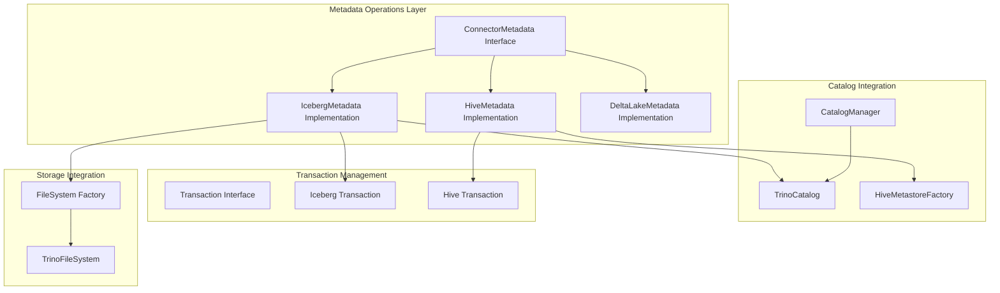
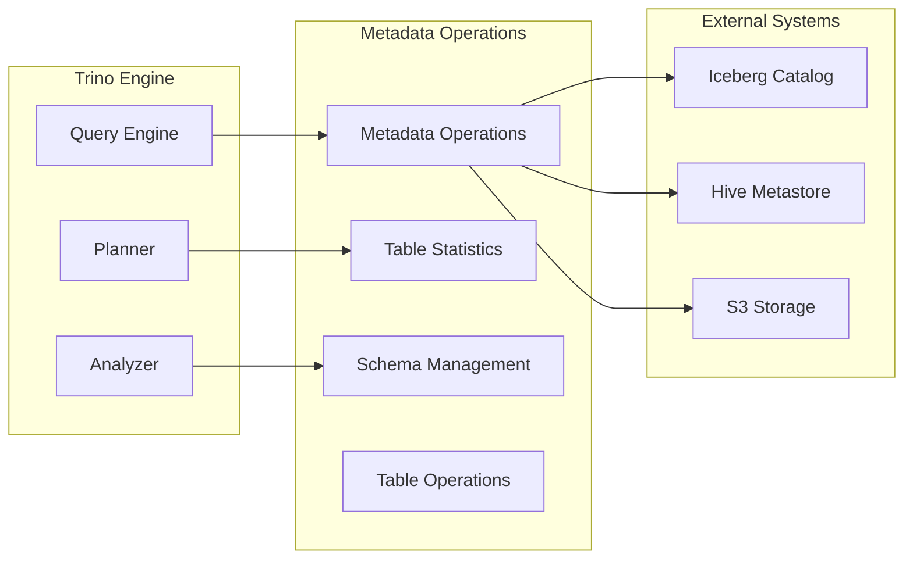
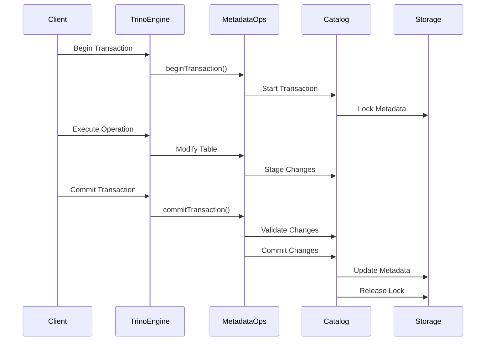
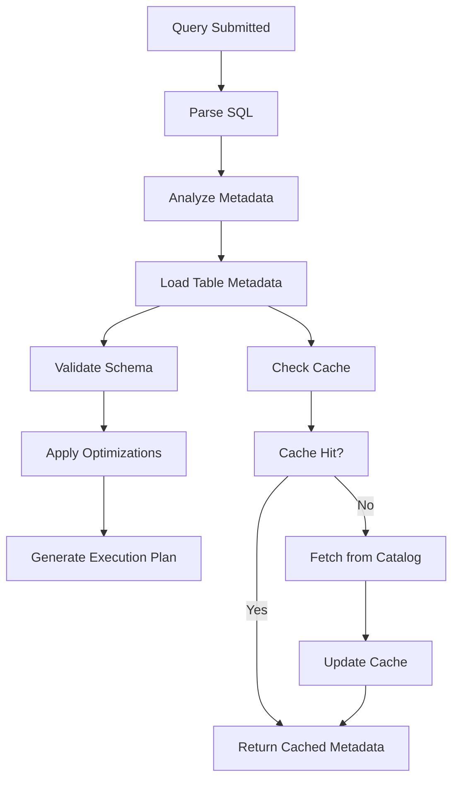
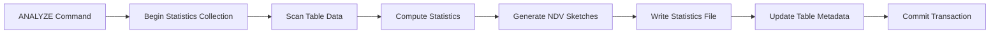
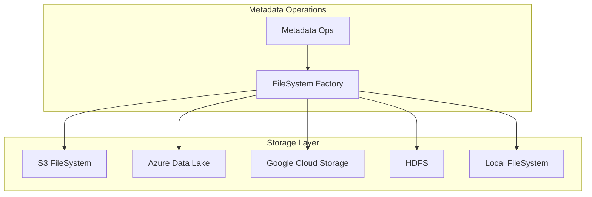
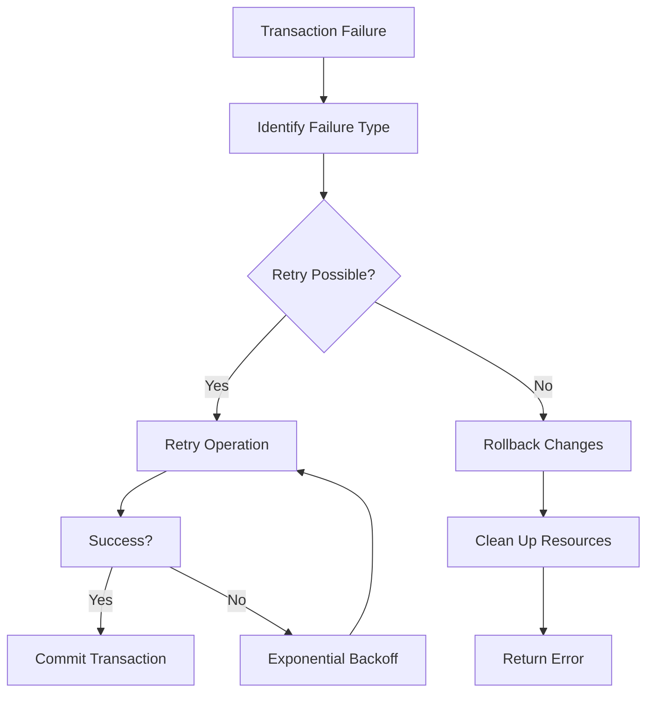

# Metadata Operations Module

## Introduction

The Metadata Operations module is a core component of Trino's connector architecture, responsible for managing all metadata-related operations across different table formats including Iceberg, Hive, and Delta Lake. This module serves as the bridge between Trino's query engine and the underlying table format metadata, handling schema management, table operations, statistics collection, and metadata validation.

The module implements the `ConnectorMetadata` interface from the Trino SPI, providing a standardized way for Trino to interact with different table formats while maintaining consistency across the system. Each connector (Iceberg, Hive, Delta Lake) provides its own implementation of metadata operations tailored to the specific capabilities and requirements of the underlying table format.

## Architecture Overview

The Metadata Operations module is built around several key architectural patterns that ensure flexibility, performance, and reliability in metadata management across different table formats.

### Core Architecture



### Component Relationships



## Core Components

### ConnectorMetadata Interface Implementation

The module implements the `ConnectorMetadata` interface, which defines the contract for all metadata operations in Trino. This interface provides methods for:

- **Schema Management**: Creating, dropping, and renaming schemas
- **Table Operations**: Creating, dropping, renaming tables and views
- **Column Operations**: Adding, dropping, and modifying columns
- **Statistics Management**: Collecting and managing table statistics
- **Transaction Support**: Managing metadata changes within transactions

### IcebergMetadata Implementation

The `IcebergMetadata` class is the primary implementation for Apache Iceberg table format support. It provides comprehensive metadata management capabilities including:

#### Table Management
- **Table Creation**: Supports creating new Iceberg tables with various configurations
- **Table Modification**: Handles schema evolution, partitioning changes, and property updates
- **Table Deletion**: Manages table cleanup and metadata removal
- **Table Statistics**: Collects and maintains table statistics for query optimization

#### Schema Evolution
- **Column Operations**: Add, drop, rename, and modify columns
- **Type Changes**: Support for changing column types with validation
- **Nested Field Support**: Handle complex nested structures and field modifications
- **Partition Evolution**: Manage partitioning scheme changes over time

#### Advanced Features
- **Time Travel**: Support for querying historical table versions
- **Materialized Views**: Create and manage materialized views with incremental refresh
- **Table Procedures**: Execute maintenance procedures like optimize, vacuum, and snapshot management
- **Conflict Resolution**: Handle concurrent modifications with optimistic locking

### HiveMetadata Implementation

The `HiveMetadata` class provides metadata operations for traditional Hive tables, implementing transactional semantics through the `SemiTransactionalHiveMetastore` to work with potentially non-transactional metastore implementations.

### DeltaLakeMetadata Implementation

The `DeltaLakeMetadata` class handles metadata operations for Delta Lake tables, providing similar capabilities adapted for Delta Lake's transaction log-based architecture.

### Transaction Management

The module implements sophisticated transaction management to ensure consistency:



### Metadata Query Flow



### Statistics Collection Flow



## Key Features and Capabilities

### Schema Management

The module provides comprehensive schema management capabilities:

- **Namespace Operations**: Create, drop, and rename schemas with support for nested namespaces
- **Table Lifecycle**: Complete table lifecycle management from creation to deletion
- **Schema Evolution**: Support for backward and forward compatible schema changes
- **Type System**: Rich type mapping between Trino types and storage format types

### Advanced Table Operations

#### Partition Management
- **Dynamic Partitioning**: Support for partition evolution and dynamic partition discovery
- **Partition Pruning**: Intelligent partition elimination based on query predicates
- **Partition Statistics**: Maintain statistics for optimal query planning

#### Time Travel and Versioning
- **Snapshot Management**: Query historical table versions using snapshots
- **Version Control**: Support for temporal queries with version specifications
- **Rollback Capabilities**: Ability to rollback to previous table states

#### Materialized Views
- **Incremental Refresh**: Efficient incremental refresh of materialized views
- **Dependency Tracking**: Track dependencies between materialized views and source tables
- **Freshness Monitoring**: Monitor materialized view freshness and staleness

### Statistics and Optimization

#### Statistics Collection
- **Automatic Collection**: Background statistics collection during write operations
- **Manual Analysis**: Support for manual ANALYZE operations
- **Incremental Updates**: Efficient incremental statistics updates
- **NDV Estimation**: Advanced distinct value estimation using Theta sketches

#### Query Optimization Support
- **Predicate Pushdown**: Intelligent predicate pushdown to storage layer
- **Projection Pushdown**: Column pruning and projection optimization
- **Limit Pushdown**: Early termination support for limit queries
- **Join Optimization**: Statistics-based join ordering and algorithm selection

## Integration Points

### Catalog Integration

The module integrates with various catalog systems:

- **Hive Metastore**: Traditional Hive catalog support
- **Iceberg Catalog**: Native Iceberg catalog implementations
- **Glue Catalog**: AWS Glue Data Catalog integration
- **Custom Catalogs**: Extensible catalog interface for custom implementations

### Storage Integration



### Security Integration

The module supports comprehensive security features:

- **Access Control**: Fine-grained access control at schema, table, and column levels
- **Authentication**: Integration with various authentication mechanisms
- **Authorization**: Role-based access control with principal management
- **Audit Logging**: Comprehensive audit logging for compliance requirements

## Performance Optimizations

### Caching Strategies

The module implements multiple caching layers to optimize performance:

- **Metadata Cache**: Caches table metadata to avoid repeated catalog lookups
- **Statistics Cache**: Caches computed statistics for query planning
- **Schema Cache**: Caches schema information for frequently accessed tables
- **File Listing Cache**: Caches file system listings for performance

### Batch Operations

- **Bulk Metadata Operations**: Batch processing for multiple table operations
- **Parallel Statistics Collection**: Concurrent statistics collection for large tables
- **Asynchronous Operations**: Non-blocking metadata operations for better responsiveness

### Memory Management

- **Streaming Operations**: Stream large metadata results to avoid memory issues
- **Incremental Processing**: Process metadata changes incrementally
- **Resource Cleanup**: Automatic cleanup of temporary resources and caches

## Error Handling and Recovery

### Exception Handling

The module implements comprehensive error handling:

- **Validation Errors**: Detailed validation of metadata operations
- **Conflict Resolution**: Handle concurrent modification conflicts
- **Recovery Mechanisms**: Automatic recovery from transient failures
- **Graceful Degradation**: Continue operation with reduced functionality when possible

### Transaction Recovery



## Configuration and Extensibility

### Configuration Options

The module supports extensive configuration:

- **Catalog Properties**: Configure catalog-specific behavior
- **Table Properties**: Set table-level configuration options
- **Session Properties**: Runtime configuration per query session
- **System Properties**: Global system-wide configuration

### Extension Points

- **Custom Catalogs**: Implement custom catalog integrations
- **Type Mappings**: Custom type conversion between Trino and storage formats
- **Statistics Providers**: Custom statistics collection implementations
- **Access Control**: Custom authorization and authentication mechanisms

## Monitoring and Observability

### Metrics Collection

The module provides comprehensive metrics:

- **Operation Metrics**: Track metadata operation performance
- **Cache Metrics**: Monitor cache hit rates and performance
- **Error Metrics**: Track error rates and types
- **Resource Usage**: Monitor memory and CPU usage

### Logging and Debugging

- **Structured Logging**: Detailed logging with structured data
- **Debug Mode**: Verbose logging for troubleshooting
- **Audit Trails**: Complete audit trail for compliance
- **Performance Profiling**: Built-in performance profiling capabilities

## Best Practices

### Schema Design

- **Partition Strategy**: Choose appropriate partitioning for query patterns
- **Column Types**: Use appropriate data types for optimal performance
- **Schema Evolution**: Plan for future schema changes
- **Naming Conventions**: Follow consistent naming conventions

### Performance Optimization

- **Statistics Collection**: Regular statistics collection for optimal query plans
- **Cache Tuning**: Tune cache sizes based on workload patterns
- **Batch Operations**: Use batch operations for bulk metadata changes
- **Concurrent Operations**: Leverage concurrent operations where appropriate

### Operational Considerations

- **Backup Strategy**: Implement metadata backup and recovery procedures
- **Monitoring**: Set up comprehensive monitoring and alerting
- **Capacity Planning**: Plan for metadata storage and processing capacity
- **Disaster Recovery**: Implement disaster recovery procedures

## Related Documentation

- [Trino SPI](Trino SPI.md) - Core Service Provider Interface
- [Connector Framework](Connector Framework.md) - Connector architecture and implementation
- [SQL Analyzer, Planner & Optimizer](SQL Analyzer, Planner & Optimizer.md) - Query planning and optimization
- [Iceberg Connector](Iceberg Connector.md) - Iceberg-specific connector implementation
- [Hive Connector](Hive Connector.md) - Hive-specific connector implementation
- [Metadata & Connector Abstraction](Metadata & Connector Abstraction.md) - Higher-level metadata management

## Implementation Details

### IcebergMetadata Key Methods

Based on the provided code, the `IcebergMetadata` implementation includes several critical methods:

#### Table Handle Creation
```java
public ConnectorTableHandle getTableHandle(
    ConnectorSession session,
    SchemaTableName tableName,
    Optional<ConnectorTableVersion> startVersion,
    Optional<ConnectorTableVersion> endVersion)
```

This method supports time travel queries by allowing version specifications and handles different table types including materialized views and system tables.

#### Schema Evolution
```java
public void addColumn(ConnectorSession session, ConnectorTableHandle tableHandle, ColumnMetadata column, ColumnPosition position)
public void dropColumn(ConnectorSession session, ConnectorTableHandle tableHandle, ColumnHandle column)
public void renameColumn(ConnectorSession session, ConnectorTableHandle tableHandle, ColumnHandle source, String target)
```

These methods provide comprehensive schema evolution capabilities with proper validation and transaction support.

#### Statistics Management
```java
public ConnectorAnalyzeMetadata getStatisticsCollectionMetadata(
    ConnectorSession session, 
    ConnectorTableHandle tableHandle, 
    Map<String, Object> analyzeProperties)
```

This method enables advanced statistics collection using Theta sketches for accurate distinct value estimation.

#### Table Procedures
```java
public Optional<ConnectorTableExecuteHandle> getTableHandleForExecute(
    ConnectorSession session,
    ConnectorAccessControl accessControl,
    ConnectorTableHandle connectorTableHandle,
    String procedureName,
    Map<String, Object> executeProperties,
    RetryMode retryMode)
```

This method supports various table maintenance procedures including OPTIMIZE, EXPIRE_SNAPSHOTS, REMOVE_ORPHAN_FILES, and more.

### Transaction Management

The implementation uses Apache Iceberg's native transaction support:

```java
private void beginTransaction(Table icebergTable)
{
    verify(transaction == null, "transaction already set");
    transaction = catalog.newTransaction(icebergTable);
}
```

Transactions are managed carefully to ensure consistency and provide rollback capabilities when operations fail.

### Error Handling

The implementation includes comprehensive error handling with specific error codes:

- `ICEBERG_CATALOG_ERROR` - Catalog-related errors
- `ICEBERG_COMMIT_ERROR` - Transaction commit failures
- `ICEBERG_FILESYSTEM_ERROR` - File system operation errors
- `ICEBERG_INVALID_METADATA` - Metadata validation errors

### Performance Optimizations

The implementation includes several performance optimizations:

1. **Parallel Metadata Operations**: Uses executor services for parallel file operations
2. **Incremental Statistics**: Supports incremental statistics updates
3. **Caching**: Implements caching for table statistics
4. **Batch Processing**: Processes metadata operations in batches

This comprehensive metadata management system ensures reliable, efficient, and secure handling of all metadata operations across different table formats while maintaining consistency and providing excellent performance characteristics.