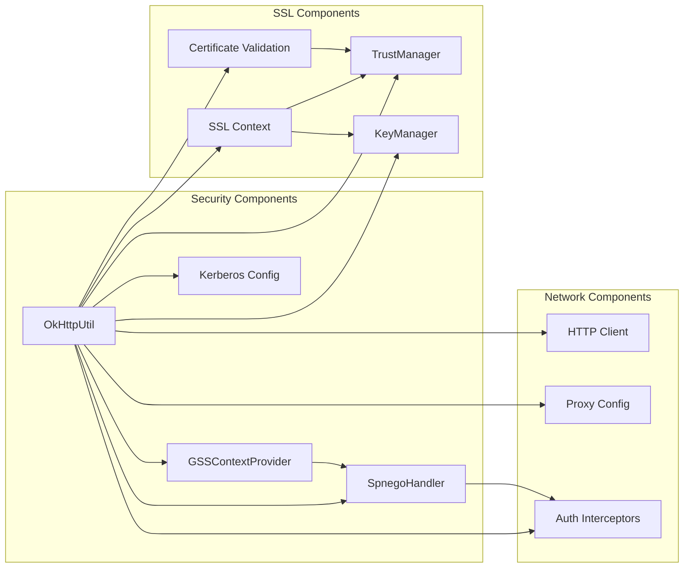
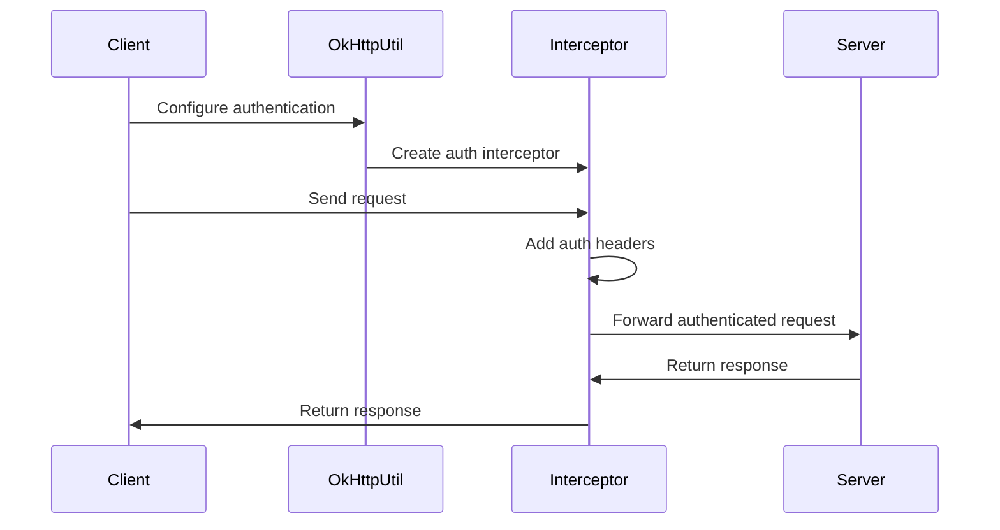
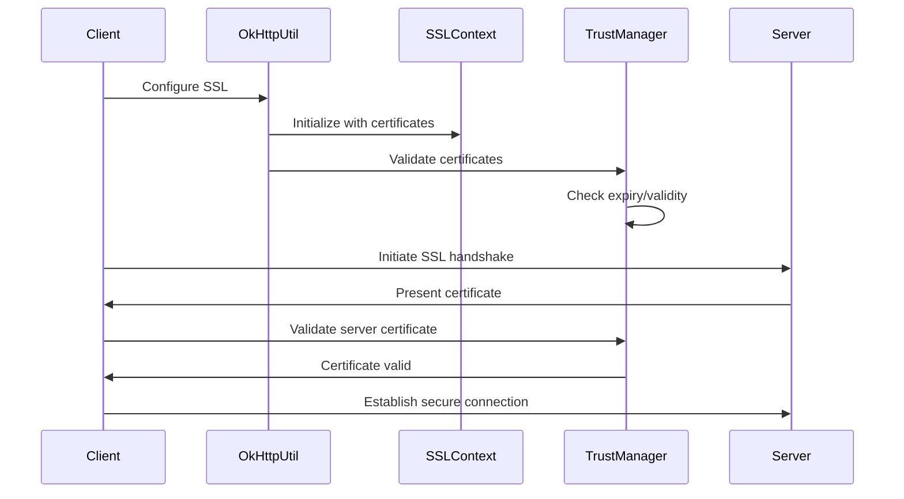
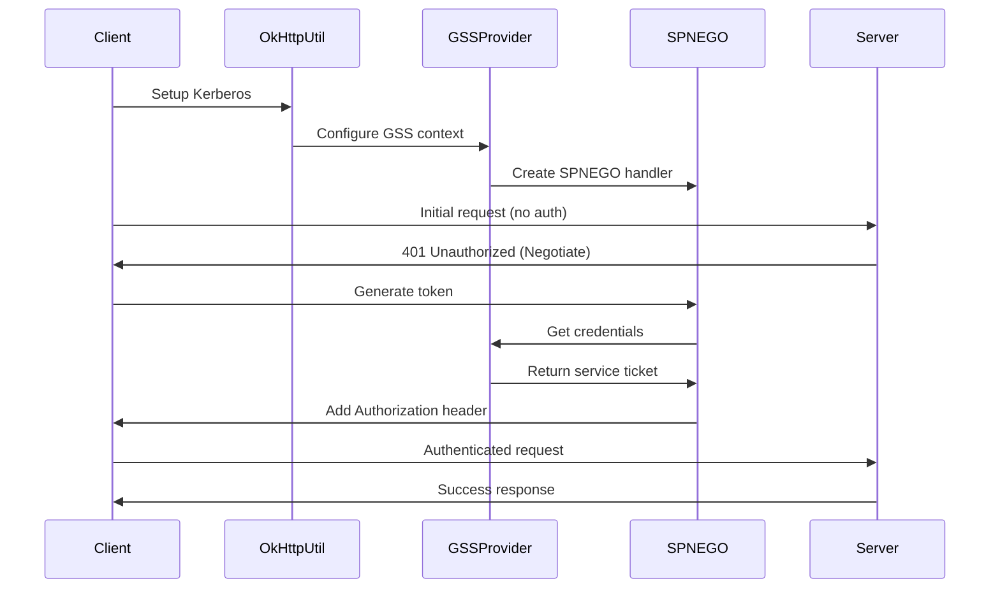

# Network & Security Module

## Introduction

The Network & Security module in Trino provides comprehensive network communication and security infrastructure for client connections. This module is primarily implemented through the `OkHttpUtil` utility class, which offers a centralized approach to configuring HTTP clients with various security protocols, authentication mechanisms, and network settings.

The module serves as the foundation for secure communication between Trino clients and servers, supporting multiple authentication methods, SSL/TLS configurations, proxy settings, and enterprise-grade security features like Kerberos authentication.

## Architecture

### Core Architecture

```mermaid
graph TB
    subgraph "Network & Security Module"
        OK[OkHttpUtil]
        
        subgraph "Authentication Methods"
            BA[Basic Auth]
            TA[Token Auth]
            KER[Kerberos Auth]
            UA[User Agent]
        end
        
        subgraph "SSL/TLS Configuration"
            SSL[SSL Setup]
            CERT[Certificate Validation]
            SYS[System Keystore]
            PEM[PEM Support]
        end
        
        subgraph "Network Configuration"
            PROXY[Proxy Setup]
            TIMEOUT[Timeout Settings]
            COOKIE[Cookie Management]
            LOG[HTTP Logging]
        end
        
        OK --> BA
        OK --> TA
        OK --> KER
        OK --> UA
        OK --> SSL
        OK --> CERT
        OK --> SYS
        OK --> PEM
        OK --> PROXY
        OK --> TIMEOUT
        OK --> COOKIE
        OK --> LOG
    end
    
    subgraph "Client Applications"
        CLI[Trino CLI]
        JDBC[JDBC Driver]
        CLIENT[Client Library]
    end
    
    OK --> CLI
    OK --> JDBC
    OK --> CLIENT
```



### Component Relationships



## Core Components

### OkHttpUtil Class

The `OkHttpUtil` class is a comprehensive utility that provides static methods for configuring OkHttpClient instances with various security and network settings. It serves as the central configuration point for all HTTP client security needs in the Trino ecosystem.

#### Key Responsibilities:
- **Authentication Configuration**: Basic auth, token-based auth, and Kerberos authentication
- **SSL/TLS Setup**: Certificate validation, keystore/truststore configuration, and insecure SSL options
- **Network Settings**: Proxy configuration, timeout settings, and cookie management
- **Enterprise Integration**: System keystore support, platform-specific certificate stores

### Authentication Methods

#### Basic Authentication
```java
public static Interceptor basicAuth(String user, String password)
```
- Validates username format (no colons allowed)
- Uses HTTP Basic Authentication scheme
- Returns an OkHttp interceptor for request authentication

#### Token Authentication
```java
public static Interceptor tokenAuth(String accessToken)
```
- Supports Bearer token authentication
- Validates token characters (ASCII 33-126)
- Adds Authorization header with Bearer prefix

#### Kerberos Authentication
```java
public static void setupKerberos(OkHttpClient.Builder clientBuilder, ...)
```
- Supports both constrained and unconstrained delegation
- Integrates with SPNEGO protocol
- Configurable service principal patterns
- Multiple credential sources (keytab, credential cache, delegated credentials)

### SSL/TLS Configuration

#### Certificate Validation
The module implements comprehensive certificate validation:
- **Certificate Expiry Checking**: Validates that certificates are not expired
- **Certificate Validity**: Ensures certificates are currently valid
- **Keystore Validation**: Validates all certificates in keystores

#### Platform-Specific Keystore Support
- **macOS**: KeychainStore integration
- **Windows**: Windows-MY and Windows-ROOT certificate stores
- **Cross-platform**: Standard Java keystore formats

#### SSL Configuration Modes
1. **Secure SSL**: Full certificate validation with custom truststores
2. **Insecure SSL**: Trust-all certificates (development/testing only)
3. **System SSL**: Uses platform-specific certificate stores
4. **PEM Support**: Direct PEM file reading for certificates and keys

### Network Configuration

#### Proxy Support
- **HTTP Proxy**: Standard HTTP proxy configuration
- **SOCKS Proxy**: SOCKS proxy support with HostAndPort configuration
- **Proxy Authentication**: Integrated with authentication interceptors

#### Timeout Management
```java
public static void setupTimeouts(OkHttpClient.Builder clientBuilder, int timeout, TimeUnit unit)
```
- Configures connect, read, and write timeouts uniformly
- Supports various time units for flexibility

#### HTTP Logging
- **Multiple Log Levels**: NONE, BASIC, HEADERS, BODY
- **Network Interceptor**: Uses OkHttp's network-level logging
- **Configurable Output**: Logs to standard error by default

## Data Flow

### Authentication Flow



### SSL Handshake Flow



### Kerberos Authentication Flow



## Integration Points

### Client Library Integration
The Network & Security module is integrated into the [Trino Client Library](Trino%20Client%20Library.md) and provides the underlying security infrastructure for:
- **StatementClient**: Secure query execution
- **QueryResults**: Encrypted result transmission
- **ClientSession**: Authenticated session management

### JDBC Driver Integration
In the [Trino JDBC Driver](Trino%20JDBC%20Driver.md), this module enables:
- **Connection Security**: Secure database connections
- **Authentication**: JDBC driver authentication methods
- **SSL Configuration**: Database SSL/TLS settings

### CLI Integration
The [Trino CLI](Trino%20CLI.md) utilizes this module for:
- **Command-line Authentication**: User credential handling
- **Secure Connections**: Encrypted CLI-to-server communication
- **Proxy Support**: Corporate proxy configurations

## Security Considerations

### Certificate Management
- **Validation**: All certificates are validated for expiry and authenticity
- **Platform Integration**: Uses system certificate stores when available
- **PEM Support**: Direct reading of PEM-encoded certificates and private keys

### Authentication Security
- **Credential Protection**: Secure handling of authentication credentials
- **Token Validation**: Character validation for bearer tokens
- **Kerberos Integration**: Enterprise-grade Kerberos with delegation support

### Network Security
- **SSL/TLS**: Full SSL/TLS support with configurable validation
- **Proxy Security**: Secure proxy authentication
- **Hostname Verification**: Configurable hostname verification for SSL connections

## Configuration Examples

### Basic Authentication Setup
```java
OkHttpClient.Builder builder = new OkHttpClient.Builder();
builder.addInterceptor(OkHttpUtil.basicAuth("username", "password"));
```

### SSL Configuration with Custom Truststore
```java
OkHttpClient.Builder builder = new OkHttpClient.Builder();
OkHttpUtil.setupSsl(builder, 
    Optional.of("/path/to/keystore"),
    Optional.of("keystore-password"),
    Optional.of("JKS"),
    false,  // useSystemKeyStore
    Optional.of("/path/to/truststore"),
    Optional.of("truststore-password"),
    Optional.of("JKS"),
    false   // useSystemTrustStore
);
```

### Kerberos Configuration
```java
OkHttpClient.Builder builder = new OkHttpClient.Builder();
OkHttpUtil.setupKerberos(builder,
    "HTTP/trino-server@EXAMPLE.COM",
    "trino-server",
    true,   // useCanonicalHostname
    Optional.of("user@EXAMPLE.COM"),
    Optional.of(new File("/etc/krb5.conf")),
    Optional.of(new File("/path/to/keytab")),
    Optional.empty(),  // credentialCache
    false,  // delegatedKerberos
    Optional.empty()   // gssCredential
);
```

## Error Handling

The module implements comprehensive error handling for security-related operations:

- **Certificate Errors**: Detailed validation error messages
- **Authentication Failures**: Clear error reporting for auth issues
- **SSL Configuration Errors**: Comprehensive SSL setup error handling
- **Kerberos Errors**: GSS-API error propagation and handling

## Performance Considerations

- **Connection Pooling**: Leverages OkHttp's built-in connection pooling
- **Certificate Caching**: Efficient certificate validation and caching
- **Kerberos Ticket Caching**: Supports credential cache for performance
- **Minimal Overhead**: Lightweight interceptors for authentication

## Dependencies

This module has dependencies on:
- **OkHttp**: Core HTTP client library
- **Guava**: Utility libraries for common operations
- **GSS-API**: For Kerberos authentication support
- **Java Security**: Standard Java security and SSL/TLS APIs

The Network & Security module provides the essential security foundation that enables secure communication across all Trino client applications, ensuring data protection and authentication integrity in distributed query processing environments.