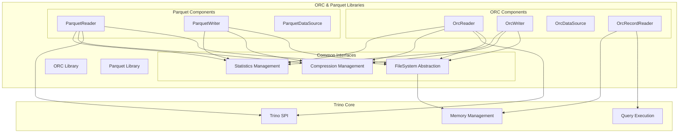
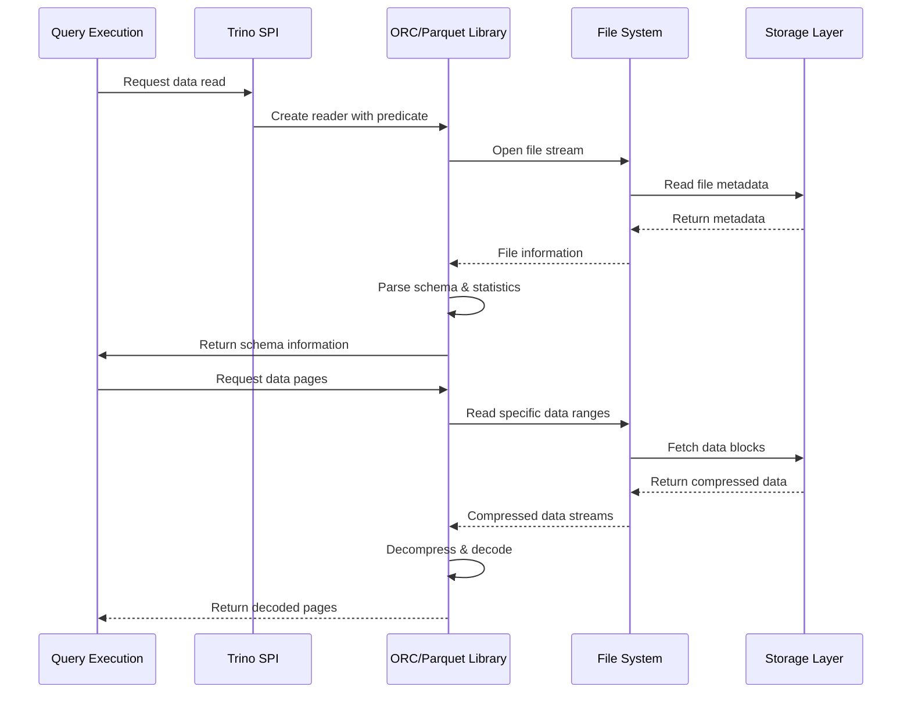

# ORC & Parquet Libraries

## Overview

The ORC & Parquet Libraries module provides high-performance columnar data format readers and writers for Trino. This module implements optimized readers and writers for two of the most popular columnar storage formats in the big data ecosystem: **ORC (Optimized Row Columnar)** and **Parquet**. These libraries are fundamental to Trino's ability to efficiently query large datasets stored in distributed file systems.

## Purpose and Core Functionality

The module serves as Trino's primary interface for reading and writing columnar data formats, offering:

- **High-performance ORC format support** with advanced features like predicate pushdown, column pruning, and vectorized reading
- **Comprehensive Parquet format support** with similar optimization capabilities
- **Memory-efficient streaming** for processing large files without loading entire datasets into memory
- **Advanced compression support** including Snappy, GZIP, LZO, and ZLIB
- **Schema evolution support** for handling schema changes in datasets over time
- **Statistics and metadata utilization** for query optimization

## Architecture Overview

## Module Structure

The ORC & Parquet Libraries module consists of two primary sub-modules:

### 1. ORC Library (`lib.trino-orc`)
Provides comprehensive ORC format support with advanced reading and writing capabilities.

**Key Components:**
- **OrcReader**: High-performance ORC file reader with predicate pushdown and column pruning
- **OrcWriter**: Efficient ORC file writer with compression and statistics support
- **OrcDataSource**: Abstraction for ORC data sources with memory management
- **OrcRecordReader**: Streaming record reader for processing large ORC files

**[Detailed ORC Library Documentation](ORC Library.md)** - Comprehensive guide to ORC format implementation, architecture, and usage patterns.

### 2. Parquet Library (`lib.trino-parquet`)
Implements Parquet format support with similar optimization features.

**Key Components:**
- **ParquetReader**: Optimized Parquet file reader with vectorized reading
- **ParquetWriter**: Parquet file writer with advanced compression options
- **ParquetDataSource**: Data source abstraction for Parquet files

**[Detailed Parquet Library Documentation](Parquet Library.md)** - Complete reference for Parquet format support, performance optimizations, and integration details.

## Integration with Trino Ecosystem

The ORC & Parquet Libraries integrate deeply with Trino's query execution engine:

### Query Planning Integration
- **Statistics Integration**: Leverages column statistics for cost-based optimization
- **Predicate Pushdown**: Pushes filtering operations to the storage layer
- **Column Pruning**: Reads only required columns to minimize I/O

### Memory Management
- **Streaming Processing**: Processes large files without loading entire datasets
- **Memory Context Integration**: Works with Trino's memory management system
- **Buffer Management**: Efficient buffer pooling and reuse

### Connector Integration
The libraries are used by multiple Trino connectors:
- **Hive Connector**: Primary user for HDFS and object storage
- **Iceberg Connector**: Modern table format with ORC/Parquet support
- **Delta Lake Connector**: Lakehouse format with Parquet backing

## Performance Optimizations

### Vectorized Reading
Both ORC and Parquet readers implement vectorized reading capabilities that process data in batches, significantly improving performance compared to row-by-row processing.

### Compression Optimization
- **Multiple Compression Algorithms**: Support for Snappy, GZIP, LZO, ZLIB
- **Adaptive Compression**: Automatic selection based on data characteristics
- **Dictionary Encoding**: Efficient encoding for repetitive string data

### Statistics Utilization
- **Min/Max Statistics**: Skip irrelevant data blocks during queries
- **Bloom Filters**: Advanced filtering for high-cardinality columns
- **Column Statistics**: Detailed statistics for query optimization

## Data Flow Architecture

## Error Handling and Validation

### Data Integrity
- **Checksum Validation**: Verifies data integrity during reads
- **Schema Validation**: Ensures compatibility between file schema and query schema
- **Format Validation**: Validates file format compliance

### Error Recovery
- **Graceful Degradation**: Continues processing when possible despite errors
- **Detailed Error Reporting**: Provides comprehensive error information
- **Corruption Detection**: Identifies and reports file corruption

## Configuration and Tuning

### Reader Options
- **Batch Size Control**: Configurable batch sizes for optimal memory usage
- **Predicate Pushdown**: Enable/disable predicate filtering at storage level
- **Column Projection**: Control column selection and projection

### Writer Options
- **Compression Selection**: Choice of compression algorithms
- **Stripe Size Control**: Configurable stripe sizes for optimal performance
- **Statistics Collection**: Control over statistics collection and storage

## Dependencies

The ORC & Parquet Libraries module depends on:
- **Trino SPI**: For type system and connector integration
- **FileSystem Abstraction Layer**: For storage access
- **Memory Management**: For efficient memory usage
- **Compression Libraries**: For various compression algorithms

## Related Documentation

- [FileSystem Abstraction Layer](FileSystem Abstraction Layer.md) - Storage interface used by ORC/Parquet
- [Hive Connector](Hive Connector.md) - Primary consumer of ORC/Parquet libraries
- [Iceberg Connector](Iceberg Connector.md) - Modern table format using these libraries
- [Trino SPI](Trino SPI.md) - Service provider interface for integration