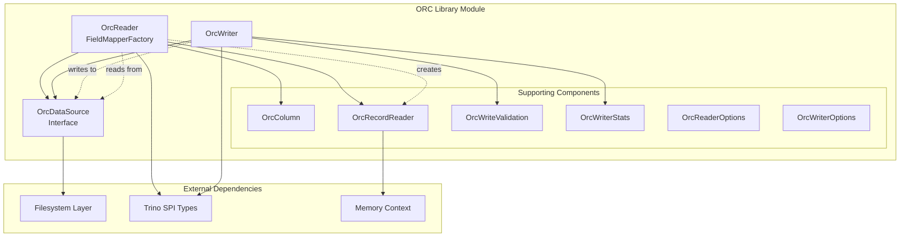
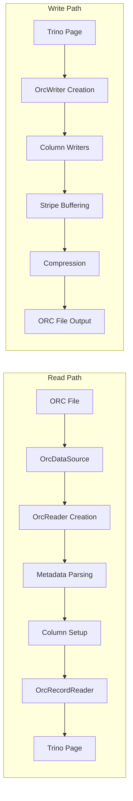
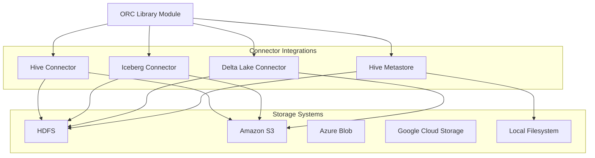

# ORC Library Module Documentation

## Introduction

The ORC (Optimized Row Columnar) Library module provides comprehensive support for reading and writing ORC files within the Trino ecosystem. ORC is a self-describing, type-aware columnar file format designed for Hadoop workloads, offering efficient compression, predicate pushdown, and vectorized query execution. This module serves as the foundation for ORC file processing across various Trino connectors, including Hive, Iceberg, and Delta Lake.

The library implements a complete ORC file format specification with advanced features including columnar compression, bloom filters, statistics collection, and write validation. It provides both high-level APIs for simple file operations and low-level APIs for fine-grained control over ORC file processing.

## Architecture Overview

The ORC Library module is built around three core architectural components that work together to provide comprehensive ORC file processing capabilities:

### Core Components

#### 1. OrcReader (FieldMapperFactory)
The `OrcReader` class serves as the primary entry point for reading ORC files. It provides:
- **File Format Detection**: Automatic ORC file validation and version checking
- **Metadata Parsing**: Extraction of file metadata, footer information, and column statistics
- **Column Projection**: Support for reading specific columns and nested fields
- **Predicate Pushdown**: Integration with Trino's predicate evaluation system
- **Memory Management**: Efficient memory usage with configurable batch sizes
- **Validation Support**: Optional write validation for data integrity verification

#### 2. OrcWriter
The `OrcWriter` class provides comprehensive ORC file writing capabilities:
- **Columnar Writing**: Efficient column-oriented data serialization
- **Compression Support**: Multiple compression algorithms (SNAPPY, ZLIB, LZ4, ZSTD)
- **Dictionary Encoding**: Automatic dictionary compression for string columns
- **Statistics Collection**: Built-in column statistics and bloom filter generation
- **Stripe Management**: Configurable stripe sizes and row group boundaries
- **Write Validation**: Optional validation mode for ensuring data integrity

#### 3. OrcDataSource
The `OrcDataSource` interface abstracts the underlying data storage:
- **Storage Abstraction**: Support for various storage systems (HDFS, S3, local filesystem)
- **Efficient I/O**: Optimized read operations with caching and prefetching
- **Memory Management**: Configurable memory allocation for different data sizes
- **Performance Monitoring**: Built-in metrics for read bytes and timing information

## Component Relationships



## Data Flow Architecture



## Key Features and Capabilities

### Reading Capabilities

#### File Format Support
- **ORC Version Compatibility**: Supports ORC files from various Hive versions
- **Compression Formats**: SNAPPY, ZLIB, LZ4, ZSTD compression algorithms
- **Type System**: Full integration with Trino's type system
- **Schema Evolution**: Support for schema changes and column reordering

#### Performance Optimizations
- **Vectorized Reading**: Batch processing with configurable batch sizes (up to 8K rows)
- **Predicate Pushdown**: Early filtering using column statistics and bloom filters
- **Column Projection**: Reading only required columns to minimize I/O
- **Lazy Materialization**: Deferred loading of complex nested structures

#### Memory Management
- **Configurable Batching**: Dynamic batch size adjustment based on memory constraints
- **Memory Tracking**: Integration with Trino's memory context system
- **Efficient Caching**: Smart caching for small files and frequently accessed data

### Writing Capabilities

#### Data Organization
- **Stripe-Based Storage**: Configurable stripe sizes for optimal compression and query performance
- **Row Group Boundaries**: Fine-grained data organization within stripes
- **Column Statistics**: Automatic collection of min/max values, null counts, and distinct values
- **Bloom Filters**: Configurable bloom filter generation for string columns

#### Compression and Encoding
- **Dictionary Encoding**: Automatic dictionary compression for low-cardinality string columns
- **Compression Algorithms**: Support for multiple compression codecs with configurable compression levels
- **Adaptive Encoding**: Dynamic switching between encoding schemes based on data characteristics

#### Write Validation
- **Data Integrity**: Optional validation mode to verify written data integrity
- **Statistics Validation**: Verification of collected statistics against actual data
- **Format Compliance**: Ensures written files conform to ORC specification

## Integration with Trino Ecosystem

### Connector Integration

The ORC Library module serves as the foundation for ORC file processing across multiple Trino connectors:



### Type System Integration

The ORC Library seamlessly integrates with Trino's type system through the [Trino SPI](Trino SPI.md):

- **Type Mapping**: Automatic conversion between ORC types and Trino types
- **Complex Types**: Support for nested structures (STRUCT, ARRAY, MAP, UNION)
- **Type Evolution**: Handling of schema changes and type conversions
- **Null Handling**: Proper null value representation and processing

### Memory Management Integration

Integration with Trino's memory management system through [Query Execution Engine](Query Execution Engine.md):

- **Memory Context**: Integration with `AggregatedMemoryContext` for memory tracking
- **Resource Management**: Configurable memory limits for different operations
- **Spill Support**: Integration with Trino's spilling mechanism for large operations

## Configuration and Options

### OrcReaderOptions

The `OrcReaderOptions` class provides configuration for ORC reading operations:

- **Tiny Stripe Threshold**: Maximum size for in-memory caching of small files
- **Max Merge Distance**: Configuration for optimizing disk reads
- **Max Buffer Size**: Maximum buffer size for reading operations
- **Lazy Read Small Ranges**: Optimization for small random reads

### OrcWriterOptions

The `OrcWriterOptions` class provides configuration for ORC writing operations:

- **Stripe Size Configuration**: Minimum and maximum stripe sizes
- **Row Group Size**: Number of rows per row group
- **Dictionary Memory Limits**: Maximum memory for dictionary encoding
- **Compression Settings**: Compression algorithm and buffer size configuration
- **Bloom Filter Configuration**: Bloom filter false positive probability and column selection

## Performance Characteristics

### Reading Performance

- **Sequential Scans**: Optimized for sequential columnar data access patterns
- **Random Access**: Efficient random access through column indexes and statistics
- **Predicate Evaluation**: Early filtering reduces data transfer and processing
- **Vectorized Processing**: Batch processing improves CPU efficiency

### Writing Performance

- **Streaming Writes**: Efficient streaming write operations with configurable buffering
- **Dictionary Optimization**: Automatic dictionary compression for string data
- **Parallel Processing**: Support for parallel column writing operations
- **Memory Efficiency**: Configurable memory usage patterns for different data sizes

## Error Handling and Validation

### Read Validation

- **Format Validation**: Comprehensive ORC format validation during file opening
- **Schema Validation**: Verification of column types and schema consistency
- **Data Integrity**: Optional validation of read data against stored statistics
- **Corruption Detection**: Early detection and reporting of file corruption

### Write Validation

- **Format Compliance**: Ensures written files conform to ORC specification
- **Statistics Validation**: Verification of collected statistics against actual data
- **Round-trip Testing**: Optional validation through read-after-write testing
- **Metadata Integrity**: Validation of file metadata and user properties

## Usage Examples

### Basic Reading Pattern

```java
// Create OrcDataSource
OrcDataSource dataSource = new FileOrcDataSource(file, readerOptions);

// Create OrcReader
Optional<OrcReader> orcReader = OrcReader.createOrcReader(dataSource, readerOptions);

// Create record reader
OrcRecordReader recordReader = orcReader.createRecordReader(
    readColumns,
    readTypes,
    false, // appendRowNumberColumn
    predicate,
    timeZone,
    memoryContext,
    initialBatchSize,
    exceptionTransform
);

// Read data
while (true) {
    SourcePage page = recordReader.nextPage();
    if (page == null) {
        break;
    }
    // Process page
}
```

### Basic Writing Pattern

```java
// Create OrcWriter
OrcWriter writer = new OrcWriter(
    orcDataSink,
    columnNames,
    types,
    orcTypes,
    compression,
    writerOptions,
    userMetadata,
    validate,
    validationMode,
    writerStats
);

// Write data
for (Page page : pages) {
    writer.write(page);
}

// Close writer
writer.close();
```

## Dependencies and Integration Points

### Internal Dependencies

- **[Trino SPI](Trino SPI.md)**: Type system and connector interfaces
- **[Query Execution Engine](Query Execution Engine.md)**: Memory management and execution context
- **[Filesystem Abstraction Layer](Filesystem Abstraction Layer.md)**: Storage system abstraction

### External Dependencies

- **Apache ORC Format**: Implementation of ORC file format specification
- **Compression Libraries**: Support for various compression algorithms
- **Memory Management**: Integration with Trino's memory management system

## Future Enhancements

### Planned Improvements

- **Enhanced Statistics**: More sophisticated column statistics collection
- **Advanced Encoding**: Support for additional encoding schemes
- **Performance Optimizations**: Further optimization of read/write operations
- **Cloud Integration**: Enhanced integration with cloud storage systems

### Extension Points

- **Custom Encodings**: Plugin architecture for custom column encodings
- **Statistics Collectors**: Extensible statistics collection framework
- **Validation Framework**: Pluggable validation and verification modules
- **Storage Adapters**: Extensible storage system integration

## Conclusion

The ORC Library module provides a comprehensive, high-performance foundation for ORC file processing within the Trino ecosystem. Its robust architecture, extensive feature set, and seamless integration with Trino's type system and execution engine make it an essential component for data lake analytics and big data processing workloads. The module's focus on performance, reliability, and extensibility ensures it can handle the demanding requirements of modern analytical workloads while maintaining compatibility with existing ORC file formats and tools.