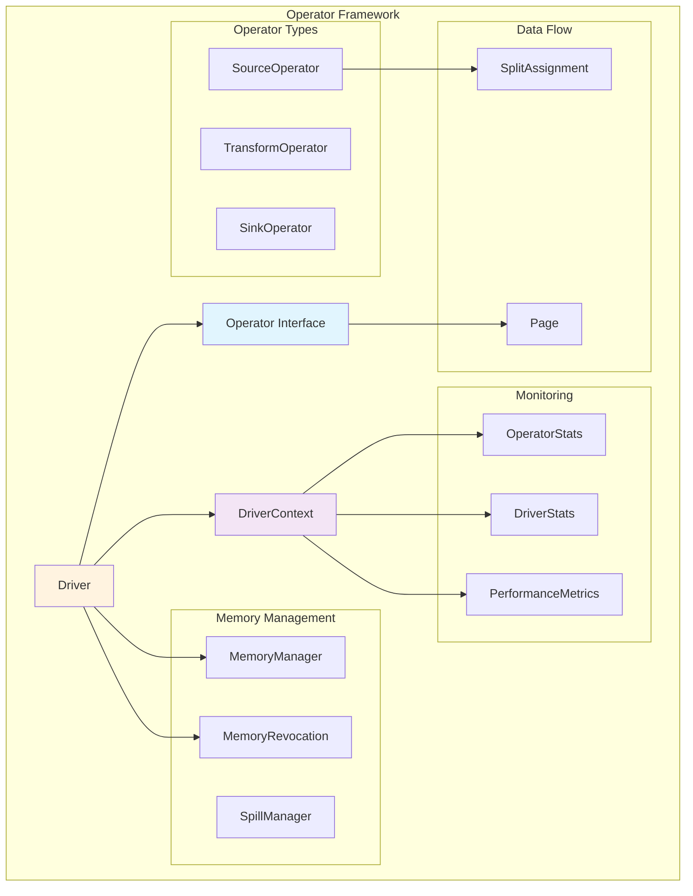
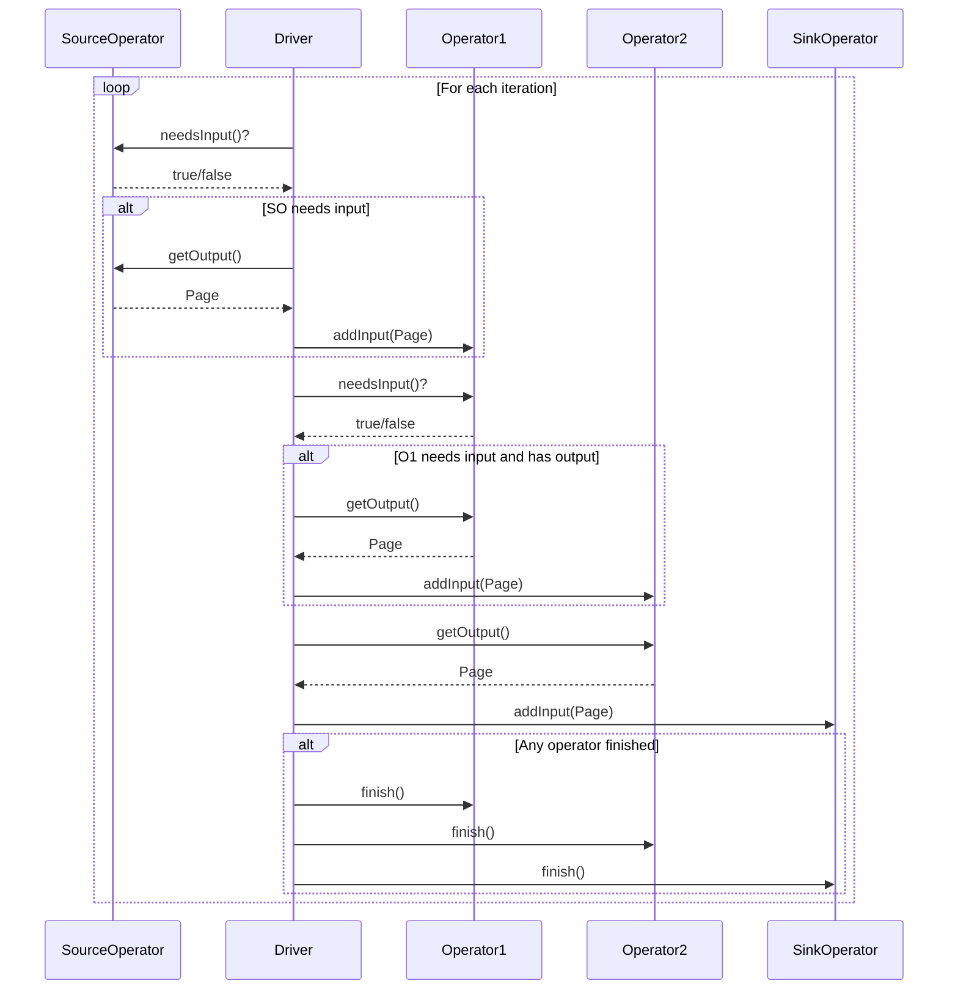
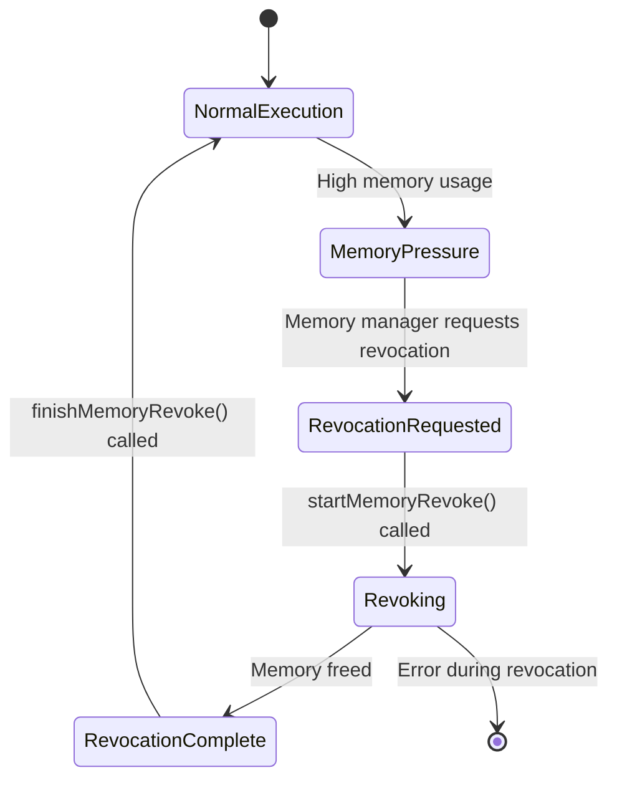
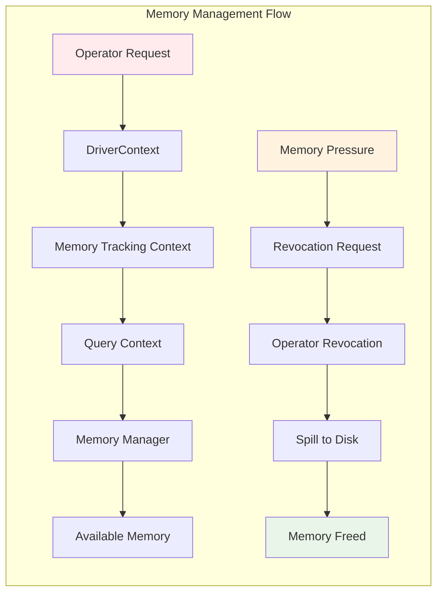
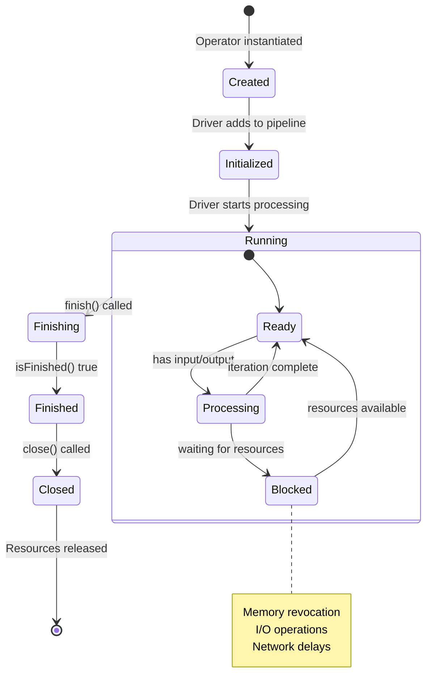
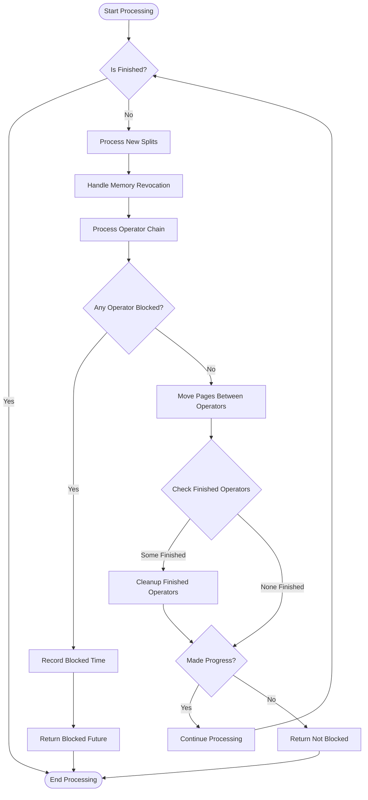
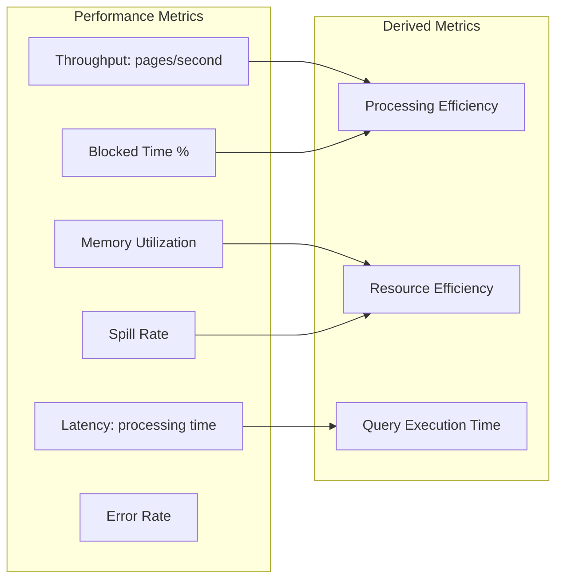

# Operator Framework

## Introduction

The Operator Framework is a core component of Trino's query execution engine that provides the fundamental building blocks for executing query plans. It implements a pipeline-based execution model where data flows through a series of operators, each performing specific transformations or operations on the data. The framework is designed for high-performance, concurrent execution with sophisticated memory management and resource control mechanisms.

## Overview

The Operator Framework serves as the execution layer that translates logical query plans into physical data processing operations. It manages the lifecycle of operators, coordinates data flow between them, handles memory allocation and revocation, and provides monitoring and statistics collection capabilities. The framework is built around the concept of drivers that orchestrate the execution of operator pipelines.

## Architecture

### Core Components

The framework consists of three primary components that work together to execute query plans:

#### Operator Interface
The `Operator` interface defines the contract for all data processing operations in Trino. It provides methods for:
- **Data Flow Management**: `needsInput()`, `addInput(Page)`, and `getOutput()` methods handle the flow of data pages between operators
- **Lifecycle Management**: `finish()` and `isFinished()` methods control operator completion
- **Memory Management**: `startMemoryRevoke()` and `finishMemoryRevoke()` methods handle memory pressure situations
- **Blocking Operations**: `isBlocked()` method allows operators to signal when they cannot proceed

#### Driver Class
The `Driver` class orchestrates the execution of a pipeline of operators. It manages:
- **Operator Coordination**: Ensures data flows correctly between operators in the pipeline
- **Split Processing**: Handles dynamic split assignment updates for source operators
- **Memory Revocation**: Coordinates memory revocation requests across all operators
- **Lifecycle Management**: Manages operator creation, execution, and cleanup
- **Blocking State**: Tracks when operators are blocked and manages execution accordingly

#### DriverContext Class
The `DriverContext` provides execution context and monitoring capabilities:
- **Resource Tracking**: Monitors memory usage, CPU time, and I/O statistics
- **Performance Metrics**: Collects detailed execution statistics for each operator
- **Memory Management**: Coordinates with the memory management system for allocation and revocation
- **Timeout Handling**: Manages execution timeouts and blocked operator detection

### Architecture Diagram

## Data Flow Architecture

The Operator Framework implements a pull-based execution model where data flows through operators in a pipeline:

## Memory Management

The framework implements sophisticated memory management to handle large-scale data processing:

### Memory Revocation Process

### Memory Allocation Flow

## Operator Lifecycle

### Operator States and Transitions

## Driver Execution Model

### Processing Loop

The Driver implements a sophisticated processing loop that handles various execution scenarios:

## Integration with Other Modules

### Query Execution Engine Integration

The Operator Framework is tightly integrated with the [Query Execution Engine](Query%20Execution%20Engine.md):

- **SqlTaskExecution**: Creates and manages Driver instances for task execution
- **StageExecution**: Coordinates multiple drivers across worker nodes
- **TaskStatus**: Reports execution status and statistics from drivers

### Memory Management Integration

The framework works with the [Memory Management](Memory%20Management.md) system:

- **QueryContext**: Provides memory allocation context for drivers
- **MemoryTrackingContext**: Tracks memory usage at the operator level
- **SpillerFactory**: Handles spilling to disk during memory revocation

### Plan Optimizer Integration

Operators are created based on optimized query plans from the [SQL Analyzer, Planner & Optimizer](SQL%20Analyzer%2C%20Planner%20%26%20Optimizer.md):

- **PlanNode**: Logical plan nodes are converted to physical operators
- **SubPlan**: Distributed execution plans are broken into operator pipelines
- **StatsCalculator**: Provides cost estimates for operator execution

## Performance Characteristics

### Throughput Optimization

The framework implements several optimizations for high-throughput processing:

- **Page-based Processing**: Operators work with batches of rows (pages) to amortize overhead
- **Vectorized Execution**: Pages are columnar data structures enabling vectorized operations
- **Pipelined Execution**: Multiple operators execute concurrently within a driver
- **Adaptive Blocking**: Smart blocking detection prevents unnecessary context switches

### Memory Efficiency

Memory management features ensure efficient resource utilization:

- **Revocable Memory**: Operators can allocate memory that can be revoked under pressure
- **Spill-to-Disk**: Excess data is spilled to disk when memory limits are reached
- **Memory Pools**: Separate memory pools for different types of allocations
- **Garbage Collection Awareness**: Memory allocation patterns are optimized for GC behavior

### Concurrency Control

The framework provides sophisticated concurrency mechanisms:

- **Lock-Free Data Structures**: Minimizes synchronization overhead
- **Thread Affinity**: Operators can be pinned to specific threads for cache efficiency
- **Work Stealing**: Idle threads can steal work from busy threads
- **Backpressure**: Natural backpressure through the pull-based execution model

## Monitoring and Observability

### Runtime Statistics

The framework collects comprehensive statistics during execution:

- **Timing Information**: Wall clock time, CPU time, and blocked time per operator
- **Data Volume**: Input/output data size and position counts
- **Memory Usage**: User memory, revocable memory, and spilled data size
- **Blocking Reasons**: Detailed information about why operators are blocked

### Performance Metrics

Key performance indicators tracked by the framework:

## Error Handling

### Exception Management

The framework implements robust error handling mechanisms:

- **Operator Isolation**: Failures in one operator don't affect others
- **Graceful Degradation**: Memory revocation failures don't crash the query
- **Resource Cleanup**: Ensures all resources are properly released on failure
- **Error Propagation**: Errors are properly propagated through the execution hierarchy

### Recovery Mechanisms

Recovery strategies implemented in the framework:

- **Memory Revocation Recovery**: Automatic retry of failed memory revocations
- **Split Processing Recovery**: Handles failures in split assignment updates
- **Operator Lifecycle Recovery**: Ensures operators are properly cleaned up on failure
- **Driver Restart**: Failed drivers can be restarted without affecting the entire query

## Best Practices

### Operator Implementation

When implementing custom operators:

1. **Memory Management**: Always respect memory limits and implement revocation properly
2. **Blocking Operations**: Use non-blocking I/O and properly signal blocking state
3. **Error Handling**: Implement comprehensive error handling and cleanup
4. **Performance**: Optimize for page-based processing and minimize per-row overhead
5. **Resource Management**: Properly manage all resources including memory, file handles, and network connections

### Driver Configuration

For optimal driver performance:

1. **Pipeline Sizing**: Size operator pipelines appropriately for the workload
2. **Memory Limits**: Set appropriate memory limits based on available resources
3. **Timeout Configuration**: Configure appropriate timeouts for blocked operations
4. **Concurrency Levels**: Tune the number of concurrent drivers based on hardware capabilities
5. **Split Assignment**: Optimize split assignment strategies for data locality

## Future Enhancements

### Planned Improvements

The Operator Framework continues to evolve with planned enhancements:

- **Adaptive Execution**: Dynamic optimization based on runtime statistics
- **Advanced Vectorization**: Enhanced vectorized execution for complex operations
- **Machine Learning Integration**: ML-based optimization for operator scheduling
- **Cloud-Native Features**: Better integration with cloud storage and compute services
- **Real-time Processing**: Enhanced support for streaming and real-time analytics

### Research Directions

Active research areas for the framework:

- **Hardware Acceleration**: Integration with GPUs and specialized processors
- **Distributed Memory Management**: Enhanced memory management across distributed nodes
- **Query Compilation**: Advanced code generation techniques for operator optimization
- **Energy Efficiency**: Power-aware execution strategies for large-scale deployments