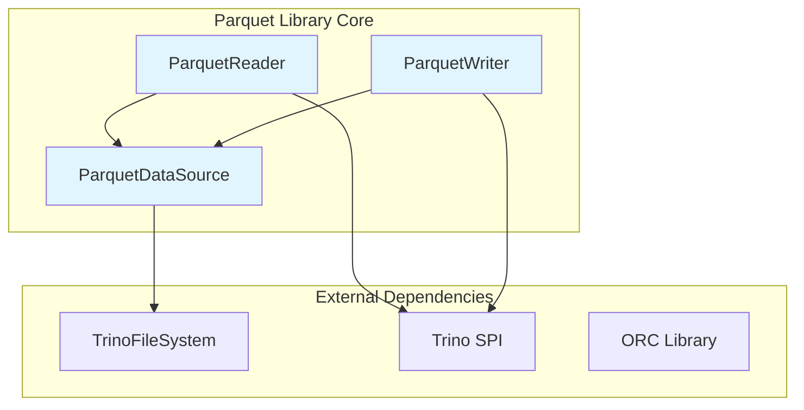
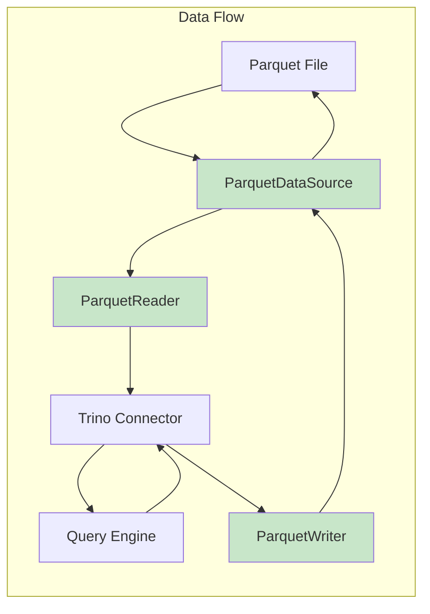
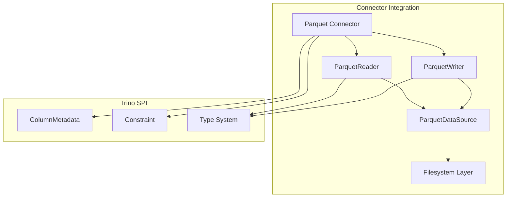
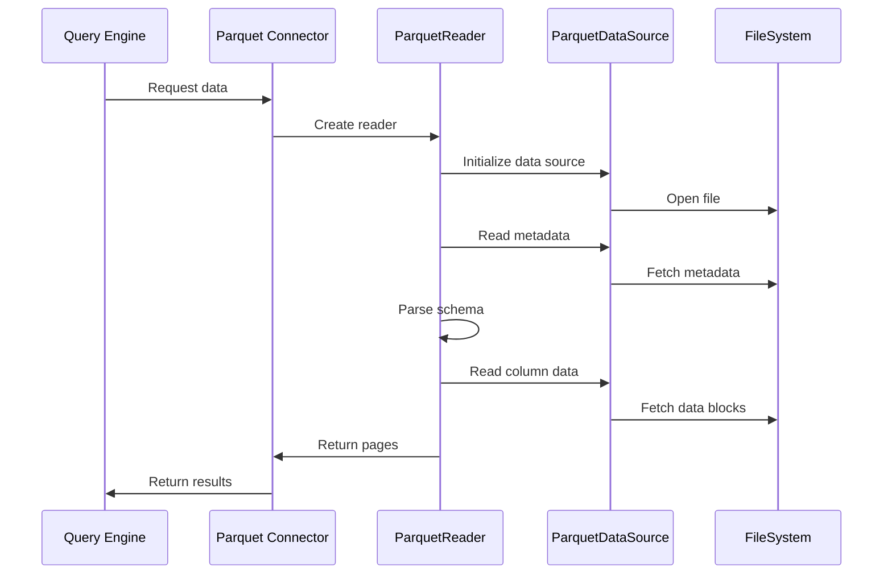
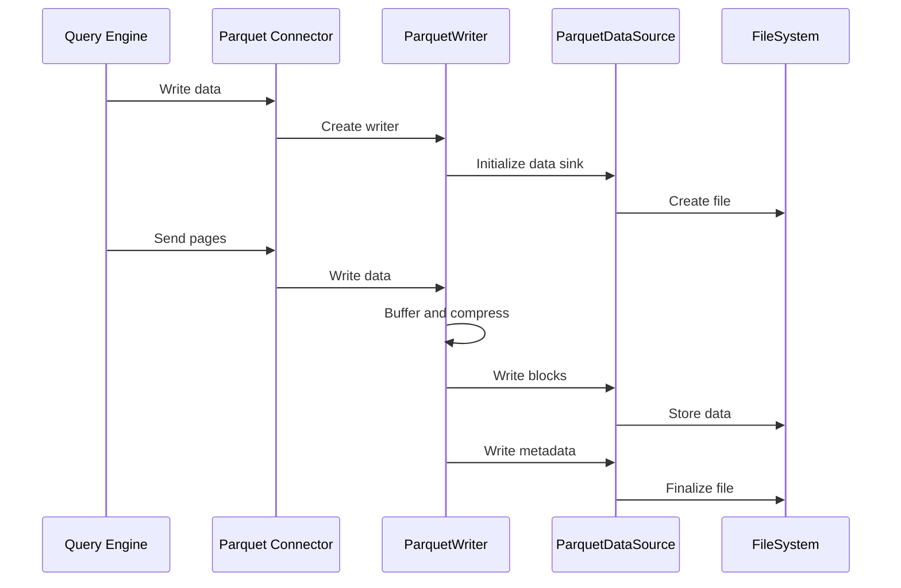

# Parquet Library

The Parquet Library module provides comprehensive support for reading and writing Apache Parquet files within the Trino ecosystem. It serves as a foundational component for efficient columnar data processing, offering high-performance I/O operations and seamless integration with Trino's distributed query execution engine.

## Overview

The Parquet Library implements a complete Parquet file format handler that enables Trino connectors to efficiently process columnar data stored in Parquet format. The module provides both reading and writing capabilities, with optimized performance for analytical workloads and support for complex data types, compression algorithms, and predicate pushdown operations.

## Architecture

### Core Components

The Parquet Library is built around three primary components that work together to provide comprehensive Parquet file handling:

### Component Relationships

## Core Components

### ParquetReader

The `ParquetReader` class provides the primary interface for reading Parquet files within Trino. It implements efficient columnar data reading with support for:

- **Column Pruning**: Only reads required columns to minimize I/O
- **Predicate Pushdown**: Applies filters at the file level to reduce data transfer
- **Vectorized Reading**: Processes data in batches for optimal performance
- **Complex Data Types**: Supports nested structures, arrays, maps, and structs
- **Compression Support**: Handles various compression codecs (SNAPPY, GZIP, LZO, etc.)

The reader integrates with Trino's [Type System](Trino%20SPI.md#type-system) to provide seamless data type mapping between Parquet schema and Trino's internal representation.

### ParquetWriter

The `ParquetWriter` class handles the creation and writing of Parquet files with features including:

- **Columnar Storage**: Efficient storage format optimized for analytical queries
- **Compression Options**: Multiple compression algorithms with configurable settings
- **Statistics Collection**: Automatic gathering of column statistics for query optimization
- **Schema Evolution**: Support for schema changes and backward compatibility
- **Memory Management**: Efficient buffering and batch processing

### ParquetDataSource

The `ParquetDataSource` interface abstracts the underlying storage mechanism, providing:

- **Storage Abstraction**: Unified interface for different storage systems (HDFS, S3, Azure, GCS)
- **Seekable Reads**: Efficient random access to file segments
- **Async I/O**: Non-blocking I/O operations for better performance
- **Caching Support**: Integration with Trino's caching mechanisms

## Integration with Trino Ecosystem

### Connector Integration

The Parquet Library integrates seamlessly with Trino's [Connector Framework](Trino%20SPI.md#connector-framework):

### Query Execution Integration

The library works with Trino's [Query Execution Engine](Query%20Execution%20Engine.md) to provide:

- **Split Generation**: Efficient partitioning of Parquet files for parallel processing
- **Page Processing**: Integration with Trino's [Page-based data processing](Trino%20SPI.md#data-processing-framework)
- **Operator Integration**: Seamless integration with Trino's operator framework
- **Memory Management**: Coordination with Trino's memory management system

## Data Flow Architecture

### Reading Process

### Writing Process

## Performance Optimizations

### Column Pruning

The library implements sophisticated column pruning to minimize I/O by:
- Analyzing query projections to identify required columns
- Skipping unnecessary column chunks during reading
- Reducing memory footprint and network transfer

### Predicate Pushdown

Integration with Trino's [Constraint system](Trino%20SPI.md#connector-framework) enables:
- Early filtering at the storage level
- Minimization of data transfer to query engine
- Leveraging Parquet's built-in statistics for efficient filtering

### Vectorized Processing

The library supports vectorized processing through:
- Batch reading of column data
- SIMD operations where applicable
- Integration with Trino's [Page-based processing](Trino%20SPI.md#data-processing-framework)

## File Format Support

### Parquet Versions

The library supports multiple Parquet format versions with backward compatibility:
- Parquet 1.0 (original format)
- Parquet 2.0 (with enhanced features)
- Latest Parquet specifications

### Compression Algorithms

Comprehensive compression support including:
- **SNAPPY**: Fast compression with reasonable compression ratios
- **GZIP**: Higher compression ratios with slower speeds
- **LZO**: Fast compression suitable for real-time applications
- **BROTLI**: Modern compression with excellent ratios
- **ZSTD**: High-performance modern compression

### Data Types

Full support for Parquet's rich type system:
- **Primitive Types**: BOOLEAN, INT32, INT64, FLOAT, DOUBLE, BINARY, FIXED_LEN_BYTE_ARRAY
- **Logical Types**: UTF8, DECIMAL, DATE, TIME, TIMESTAMP, JSON, BSON
- **Complex Types**: LIST, MAP, STRUCT, UNION
- **Nested Structures**: Arbitrary nesting of complex types

## Error Handling and Recovery

### Data Integrity

The library implements comprehensive data integrity checks:
- **Checksum Validation**: Verification of page and column checksums
- **Schema Validation**: Ensuring compatibility between file schema and expected schema
- **Statistics Validation**: Cross-validation of column statistics

### Error Recovery

Robust error handling mechanisms:
- **Partial Read Recovery**: Ability to skip corrupted sections
- **Fallback Mechanisms**: Alternative reading strategies for problematic files
- **Detailed Error Reporting**: Comprehensive error messages for debugging

## Configuration and Tuning

### Performance Tuning

Key configuration parameters for optimal performance:
- **Batch Size**: Control over data batching for vectorized processing
- **Buffer Sizes**: Memory allocation for read/write operations
- **Compression Levels**: Trade-offs between speed and compression ratio
- **Parallelism**: Degree of parallel processing for large files

### Memory Management

Integration with Trino's [Memory Management](Query%20Execution%20Engine.md#memory-management):
- **Query Context**: Respect for query-level memory limits
- **Spilling Support**: Ability to spill to disk when memory is constrained
- **Resource Tracking**: Accurate reporting of memory usage

## Testing and Quality Assurance

### Test Coverage

Comprehensive testing strategy including:
- **Unit Tests**: Individual component testing
- **Integration Tests**: End-to-end testing with various connectors
- **Performance Tests**: Benchmarking against reference implementations
- **Compatibility Tests**: Validation against different Parquet implementations

### Quality Metrics

Continuous monitoring of:
- **Read/Write Performance**: Throughput and latency measurements
- **Memory Efficiency**: Memory usage patterns and optimization
- **Error Rates**: Frequency and types of processing errors
- **Compatibility**: Success rates with various Parquet files

## Future Enhancements

### Planned Features

- **Enhanced Encryption**: Support for Parquet encryption standards
- **Bloom Filters**: Integration with Parquet bloom filter optimizations
- **Column Indexes**: Leveraging advanced indexing features
- **Async I/O**: Enhanced asynchronous I/O capabilities

### Performance Improvements

- **Vectorized Decoding**: Enhanced SIMD utilization
- **Predictive I/O**: Intelligent prefetching of column data
- **Compression Optimization**: Adaptive compression selection
- **Memory Pooling**: Advanced memory management techniques

## Related Documentation

- [Trino SPI](Trino%20SPI.md) - Core interfaces and extension points
- [Query Execution Engine](Query%20Execution%20Engine.md) - Query processing framework
- [Filesystem Abstraction Layer](Filesystem%20Abstraction%20Layer.md) - Storage abstraction
- [ORC Library](ORC%20Library.md) - Similar library for ORC format
- [Hive Connector](Hive%20Connector.md) - Primary user of Parquet Library
- [Iceberg Connector](Iceberg%20Connector.md) - Modern table format using Parquet