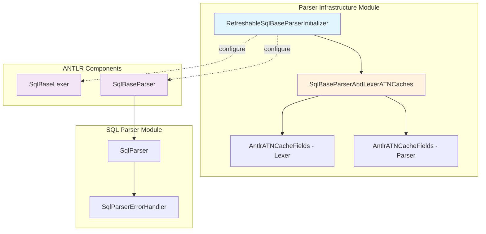
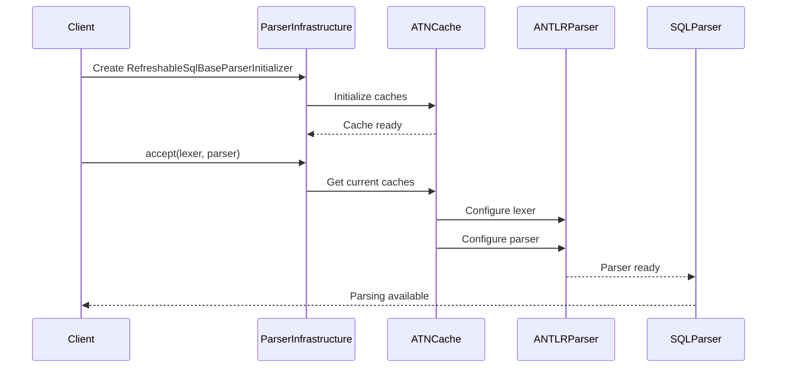
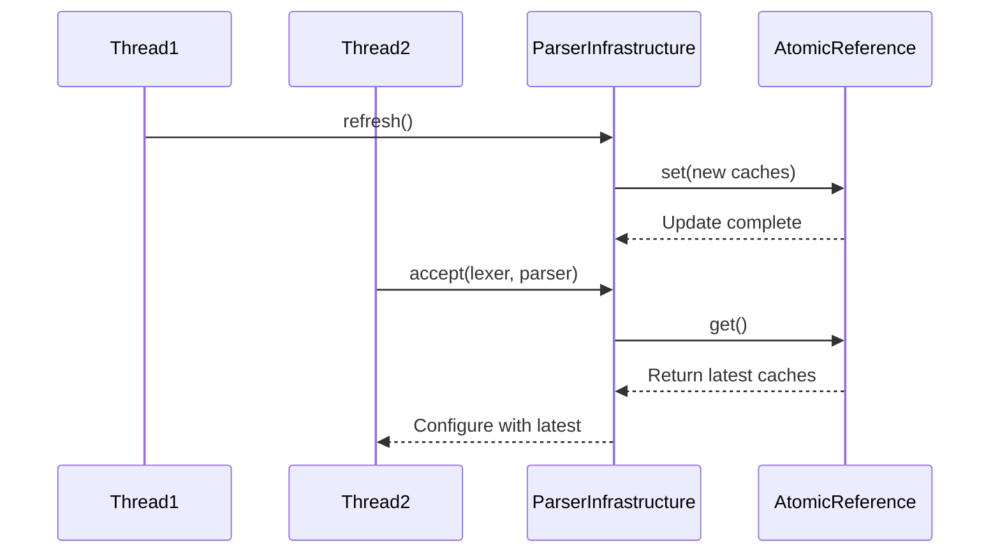
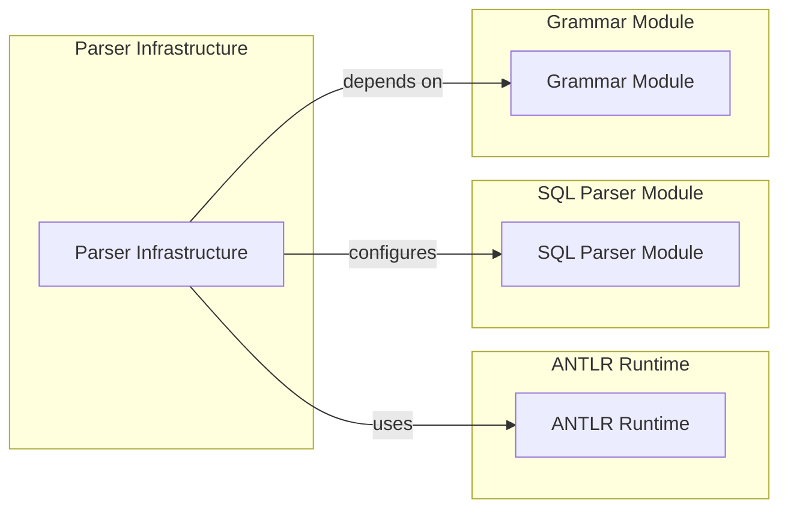
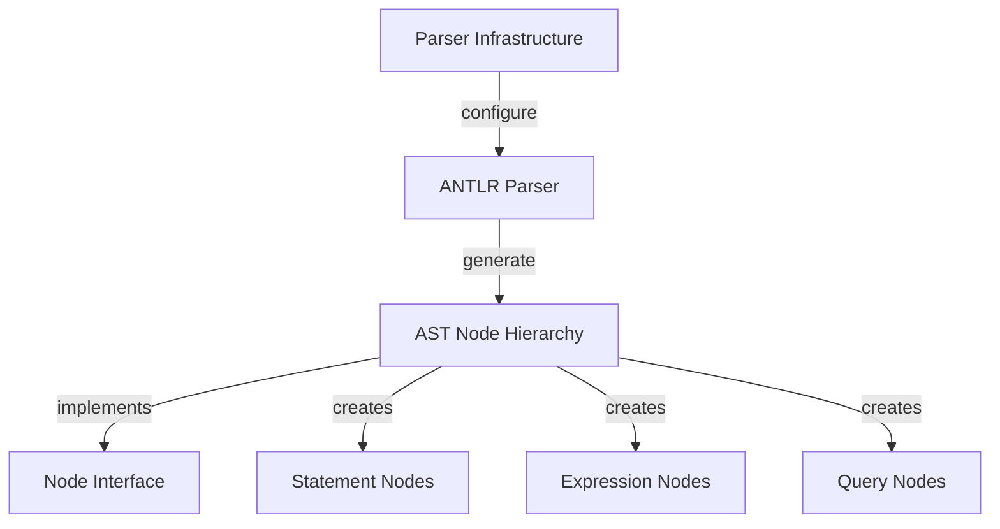
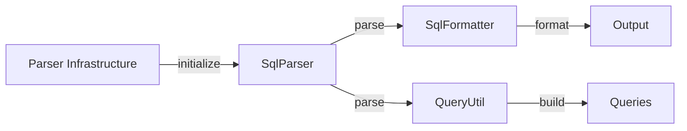

# Parser Infrastructure Module

## Introduction

The Parser Infrastructure module is a critical component of Trino's SQL processing pipeline, responsible for initializing and managing the SQL parser components. It provides thread-safe initialization and caching mechanisms for the ANTLR-based SQL parser, ensuring efficient and reliable parsing of SQL statements across the system.

## Overview

The Parser Infrastructure module serves as the foundation for SQL parsing in Trino, providing:

- **Thread-safe parser initialization**: Ensures concurrent access to parser components without race conditions
- **ATN cache management**: Optimizes parser performance through intelligent caching of ATN (Augmented Transition Network) structures
- **Parser refresh capabilities**: Allows dynamic refresh of parser caches for runtime optimization
- **Integration point**: Connects the ANTLR-generated parser with Trino's parsing framework

## Architecture

### Core Components

#### RefreshableSqlBaseParserInitializer

The `RefreshableSqlBaseParserInitializer` is the primary component of this module, implementing a thread-safe initialization strategy for SQL parser components.

**Key Features:**
- Thread-safe implementation using `AtomicReference` for cache management
- BiConsumer interface for configuring both lexer and parser components
- Automatic cache refresh capability
- Integration with ANTLR-generated parser components

### Architecture Diagram



## Component Details

### RefreshableSqlBaseParserInitializer

```java
@ThreadSafe
public final class RefreshableSqlBaseParserInitializer
        implements BiConsumer<SqlBaseLexer, SqlBaseParser>
```

**Responsibilities:**
- Initialize and manage parser ATN caches
- Provide thread-safe access to parser configuration
- Enable runtime refresh of parser caches
- Configure both lexer and parser components atomically

**Key Methods:**
- `refresh()`: Refreshes the internal caches with new ATN configurations
- `accept(SqlBaseLexer, SqlBaseParser)`: Configures provided lexer and parser instances

### Cache Management

The module uses a nested static class `SqlBaseParserAndLexerATNCaches` to manage separate caches for lexer and parser ATN structures:

```java
private static final class SqlBaseParserAndLexerATNCaches
{
    public final AntlrATNCacheFields lexer = new AntlrATNCacheFields(SqlBaseLexer._ATN);
    public final AntlrATNCacheFields parser = new AntlrATNCacheFields(SqlBaseParser._ATN);
}
```

## Data Flow

### Parser Initialization Flow



### Cache Refresh Flow



## Dependencies

### Internal Dependencies

The Parser Infrastructure module depends on several key components:

- **ANTLR Generated Classes**: `SqlBaseLexer` and `SqlBaseParser` from the grammar module
- **ATN Cache Fields**: `AntlrATNCacheFields` for managing parser state
- **Error Handling**: Integration with Trino's error handling framework

### External Dependencies



## Integration with SQL Parser Module

The Parser Infrastructure module integrates closely with the broader [SQL Parser & AST](SQL Parser & AST.md) module:

### Relationship with AST Node Hierarchy

The initialized parser components are used to generate AST nodes:



### Integration with SQL Formatting

Parser infrastructure supports SQL formatting utilities:



## Performance Considerations

### Thread Safety

The module uses `AtomicReference` to ensure thread-safe access to parser caches:

- **Lock-free operations**: No synchronized blocks, reducing contention
- **Atomic updates**: Cache refreshes are atomic operations
- **Consistent state**: Readers always see a consistent cache state

### Memory Management

- **Lazy initialization**: Caches are created only when needed
- **Immutable caches**: Once created, cache contents are immutable
- **Garbage collection**: Old cache instances are eligible for GC after refresh

## Error Handling

The Parser Infrastructure module integrates with Trino's error handling framework:

- **Parser errors**: Delegated to [SqlParserErrorHandler](SQL Parser & AST.md)
- **Configuration errors**: Handled through Trino's exception framework
- **Runtime errors**: Managed by the calling parser components

## Testing and Validation

The module is designed for testability:

- **Unit tests**: Individual component testing
- **Integration tests**: Full parser initialization testing
- **Concurrency tests**: Multi-threaded access validation
- **Performance tests**: Cache performance benchmarking

## Future Enhancements

Potential improvements to the Parser Infrastructure module:

1. **Dynamic grammar loading**: Support for runtime grammar updates
2. **Cache statistics**: Expose cache hit/miss ratios
3. **Configurable cache sizes**: Allow tuning of cache parameters
4. **Multiple parser instances**: Support for different SQL dialects
5. **Hot reload**: Dynamic parser updates without restart

## Related Documentation

- [SQL Parser & AST](SQL Parser & AST.md) - The parent module containing AST nodes and SQL formatting
- [SQL Analyzer, Planner & Optimizer](SQL Analyzer, Planner & Optimizer.md) - Components that use the parsed SQL
- [Trino SPI](Trino SPI.md) - Service provider interface for plugins

## Conclusion

The Parser Infrastructure module provides a robust, thread-safe foundation for SQL parsing in Trino. Its design emphasizes performance, reliability, and maintainability, making it an essential component of Trino's query processing pipeline. The module's cache management and thread-safety features ensure that Trino can handle high-concurrency SQL parsing workloads efficiently.