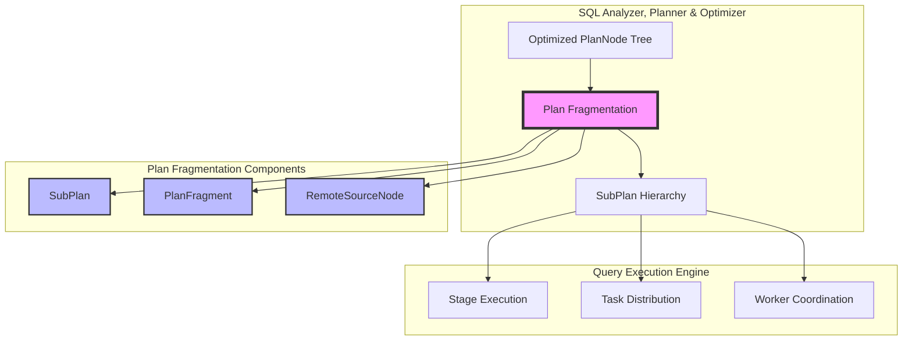
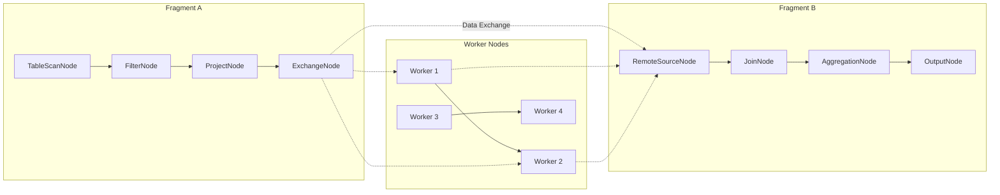
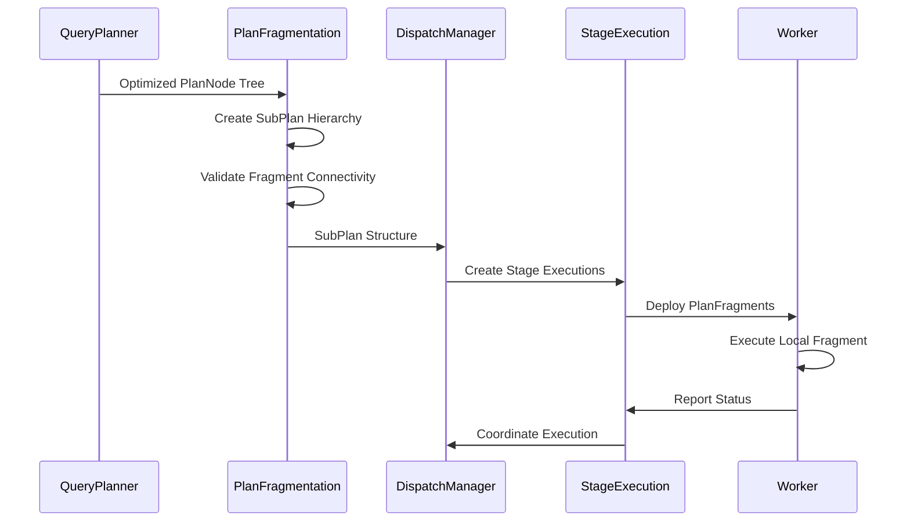

# Plan Fragmentation Module

## Introduction

The Plan Fragmentation module is a critical component of Trino's distributed query execution engine, responsible for breaking down optimized logical query plans into executable fragments that can be distributed across the cluster. This module transforms the unified query plan tree into a hierarchical structure of SubPlans, each containing a PlanFragment that can be executed independently on different worker nodes.

The fragmentation process is essential for enabling parallel execution and data distribution in Trino's distributed architecture, ensuring optimal resource utilization and query performance across the cluster.

## Architecture Overview

The Plan Fragmentation module sits at the intersection of query planning and execution, serving as the bridge between the logical query optimization phase and the physical execution phase.

## Core Components

### SubPlan

The `SubPlan` class represents a hierarchical node in the fragmented query execution tree. Each SubPlan contains a PlanFragment and references to its child SubPlans, forming a tree structure that mirrors the distributed execution flow.

**Key Responsibilities:**
- Encapsulates a single PlanFragment within the execution hierarchy
- Maintains references to child SubPlans for distributed execution coordination
- Provides validation and sanity checking for fragment connectivity
- Enables traversal and analysis of the complete fragmented plan tree

**Core Methods:**
- `getAllFragments()`: Flattens the hierarchical structure to retrieve all PlanFragments
- `sanityCheck()`: Validates that exchange nodes properly reference child fragments
- `getFragment()`: Accesses the contained PlanFragment
- `getChildren()`: Retrieves child SubPlans for distributed execution

### PlanFragment

The `PlanFragment` class represents a self-contained unit of execution that can be distributed to worker nodes. It contains all the information needed to execute a portion of the query plan, including the root PlanNode, partitioning information, and execution metadata.

**Key Components:**
- **Root PlanNode**: The logical execution plan for this fragment
- **Partitioning Scheme**: How data should be distributed across workers
- **Remote Source Nodes**: References to other fragments that provide input data
- **Symbols and Types**: Output schema and data types
- **Statistics and Costs**: Optimization metadata for execution planning

**Key Features:**
- Immutable design for thread-safe distribution across workers
- Support for various partitioning strategies (hash, round-robin, single)
- Integration with cost-based optimization through statistics
- Support for both system and connector-specific partitioning

### RemoteSourceNode

The `RemoteSourceNode` represents the boundary between different PlanFragments, indicating where data exchange occurs between distributed execution stages.

**Purpose:**
- Defines data flow dependencies between fragments
- Specifies exchange types (hash, round-robin, broadcast)
- Enables coordination of distributed execution stages
- Supports retry policies for fault tolerance

## Data Flow Architecture

## Fragmentation Process

### 1. Plan Analysis
The fragmentation process begins with analyzing the optimized PlanNode tree to identify natural boundaries for distribution. These boundaries typically occur at:
- Exchange nodes that require data redistribution
- Join operations that need distributed processing
- Aggregation operations that benefit from parallel execution

### 2. Fragment Creation
Based on the analysis, the system creates PlanFragments that:
- Minimize data movement across the network
- Balance workload across worker nodes
- Respect data locality when possible
- Consider resource constraints and optimization goals

### 3. SubPlan Hierarchy Construction
The fragments are organized into a SubPlan tree that:
- Establishes execution dependencies between fragments
- Defines data flow relationships through RemoteSourceNodes
- Enables coordinated execution across the cluster

### 4. Validation and Optimization
The final step involves:
- Sanity checking fragment connectivity and dependencies
- Optimizing fragment boundaries for performance
- Validating partitioning schemes and data distribution

## Integration with Query Execution

## Key Design Principles

### 1. Hierarchical Structure
The SubPlan tree mirrors the logical execution flow while enabling distributed coordination. Each level in the hierarchy represents a stage in the distributed execution pipeline.

### 2. Immutable Design
Both SubPlan and PlanFragment are immutable, ensuring thread-safe distribution across workers and preventing race conditions during execution.

### 3. Clear Separation of Concerns
- **SubPlan**: Manages hierarchical relationships and execution coordination
- **PlanFragment**: Contains execution logic and local optimization
- **RemoteSourceNode**: Defines inter-fragment communication boundaries

### 4. Extensibility
The module supports various partitioning strategies, exchange types, and execution policies through a plugin-friendly architecture.

## Performance Considerations

### Fragment Granularity
- **Too Fine**: Excessive network overhead and coordination complexity
- **Too Coarse**: Limited parallelism and resource underutilization
- **Optimal**: Balances parallelism with network efficiency

### Data Locality
The fragmentation process considers data locality to minimize network traffic by:
- Co-locating fragments with their input data sources
- Minimizing cross-node data movement
- Leveraging partition pruning and predicate pushdown

### Resource Management
Fragment boundaries are chosen to:
- Balance memory usage across workers
- Optimize CPU utilization
- Consider disk I/O patterns
- Respect query resource limits

## Error Handling and Fault Tolerance

### Validation Mechanisms
- **Sanity Checks**: Ensure fragment connectivity and data flow consistency
- **Type Validation**: Verify symbol and type consistency across fragments
- **Partition Validation**: Confirm partitioning scheme compatibility

### Fault Recovery
- **Retry Policies**: Configurable retry behavior for failed fragment execution
- **Stage Recovery**: Ability to re-execute failed stages without restarting the entire query
- **Progress Tracking**: Monitoring fragment execution status for failure detection

## Dependencies and Integration

The Plan Fragmentation module integrates closely with:

- **[Query Planner & Optimizer](SQL Analyzer, Planner & Optimizer.md)**: Receives optimized PlanNode trees and provides fragmented execution plans
- **[Query Execution Engine](Query Execution Engine.md)**: Supplies execution-ready fragments to stage and task management
- **[Trino SPI](Trino SPI.md)**: Leverages type system, connector framework, and partitioning abstractions

## Future Enhancements

### Adaptive Fragmentation
Dynamic adjustment of fragment boundaries based on runtime statistics and cluster conditions.

### Machine Learning Integration
Using historical execution data to optimize fragmentation strategies for specific query patterns and data characteristics.

### Advanced Partitioning Strategies
Support for more sophisticated partitioning schemes that consider data skew, network topology, and resource availability.

## Conclusion

The Plan Fragmentation module is fundamental to Trino's distributed execution capabilities, transforming logical query plans into executable fragments that can be efficiently distributed across the cluster. Its hierarchical design, immutable architecture, and comprehensive validation mechanisms ensure reliable and performant distributed query execution while maintaining the flexibility needed for diverse workloads and deployment scenarios.