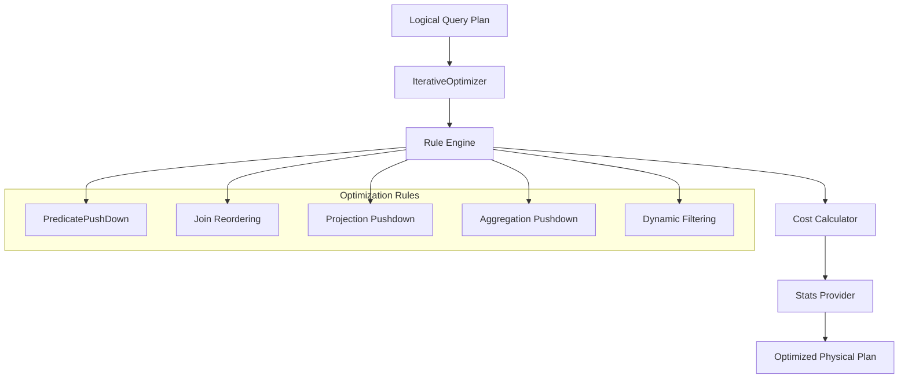

# Plan Optimizer Module

## Overview

The Plan Optimizer module is a critical component of Trino's SQL query processing engine that transforms logical query plans into optimized physical execution plans. It applies a series of optimization rules and transformations to improve query performance, reduce resource consumption, and enable efficient distributed execution.

## Purpose

The primary goals of the Plan Optimizer are to:
- Transform logical query plans into optimal physical execution strategies
- Minimize data movement and processing costs across the distributed cluster
- Apply rule-based and cost-based optimizations
- Enable predicate pushdown and early filtering
- Optimize join strategies and ordering
- Reduce memory usage and improve query response times

## Architecture

The Plan Optimizer follows an iterative optimization approach with the following high-level architecture:

## Core Components

### 1. Iterative Optimizer Framework
The `IterativeOptimizer` is the main optimization engine that applies transformation rules iteratively until no further improvements can be made. It uses a memoization structure to track plan alternatives and avoid redundant computations.

### 2. Rule-Based Optimization Engine
The rule engine applies a set of predefined optimization rules to transform query plans. Each rule targets specific patterns in the plan and applies transformations that improve performance.

### 3. Cost-Based Optimization
The optimizer uses statistical information and cost models to choose between alternative execution strategies. It considers factors like data size, selectivity, and resource requirements.

### 4. Predicate Pushdown
One of the most critical optimizations, predicate pushdown moves filtering operations as close to the data source as possible, reducing the amount of data processed in later stages.

## Sub-modules

### [Iterative Optimization Framework](Iterative%20Optimization%20Framework.md)
The core optimization engine that applies transformation rules iteratively using a memoization-based approach. This framework provides the foundation for all optimization activities, managing the optimization context, tracking changes, and coordinating rule application.

### [Rule-Based Optimization](Rule-Based%20Optimization.md)
The rule engine that applies specific optimization patterns and transformations to query plans. This system defines the interface for optimization rules and provides the mechanism for pattern matching and plan transformation.

### [Predicate Pushdown Optimizer](Predicate%20Pushdown%20Optimizer.md)
A specialized optimizer that pushes filtering operations down to the data sources for early data reduction. This is one of the most impactful optimizations, significantly reducing data volume and processing requirements.

### [Cost and Statistics Framework](Cost%20and%20Statistics%20Framework.md)
Provides cost estimation and statistical analysis for choosing optimal execution strategies. This framework enables cost-based optimization decisions by providing accurate estimates of data sizes, selectivity, and processing costs.

## Key Optimization Strategies

### Predicate Pushdown
Moves WHERE clause conditions and join predicates as close to the data source as possible, enabling:
- Early data filtering at the storage layer
- Reduced data transfer across the network
- Better utilization of storage system capabilities

### Join Optimization
Optimizes join operations through:
- Join reordering based on cost estimates
- Selection of optimal join algorithms (hash, nested loop, etc.)
- Dynamic filtering for broadcast joins
- Outer-to-inner join conversion when possible

### Projection Pushdown
Eliminates unnecessary columns early in the execution pipeline, reducing memory usage and network traffic.

### Aggregation Optimization
Pushes aggregations closer to data sources and enables partial aggregations to reduce data volume.

## Integration with Other Modules

The Plan Optimizer integrates closely with:

- **[SQL Analyzer, Planner & Optimizer](SQL%20Analyzer%2C%20Planner%20%26%20Optimizer.md)**: Receives logical plans and provides optimized physical plans
- **[Query Execution Engine](Query%20Execution%20Engine.md)**: The optimized plans are executed by the execution engine
- **[Cost & Statistics](SQL%20Analyzer%2C%20Planner%20%26%20Optimizer.md#cost--statistics)**: Uses statistical information for cost-based decisions
- **[Metadata & Connector Abstraction](Metadata%20%26%20Connector%20Abstraction.md)**: Leverages connector capabilities for pushdown operations

## Performance Considerations

### Optimization Timeout
The optimizer includes timeout mechanisms to prevent excessive optimization time for complex queries. The timeout is configurable and provides detailed statistics about which rules consumed the most time.

### Rule Prioritization
Rules are applied in an order that maximizes early benefits while avoiding infinite optimization loops. The system tracks rule effectiveness and can adapt the application order.

### Memory Management
The optimizer uses efficient data structures and memoization to minimize memory overhead during the optimization process.

## Monitoring and Debugging

The optimizer provides extensive monitoring capabilities:
- Rule application statistics and timing
- Plan transformation tracking
- Cost estimation accuracy
- Optimization timeout reporting
- Detailed plan before/after comparisons

## Configuration

Key configuration options include:
- Optimization timeout settings
- Enable/disable specific optimization rules
- Cost model parameters
- Statistics collection behavior
- Dynamic filtering thresholds

This modular design allows for easy extension with new optimization rules and strategies while maintaining backward compatibility and stability.