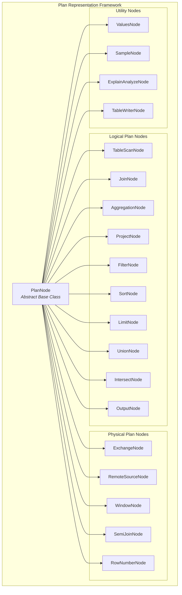
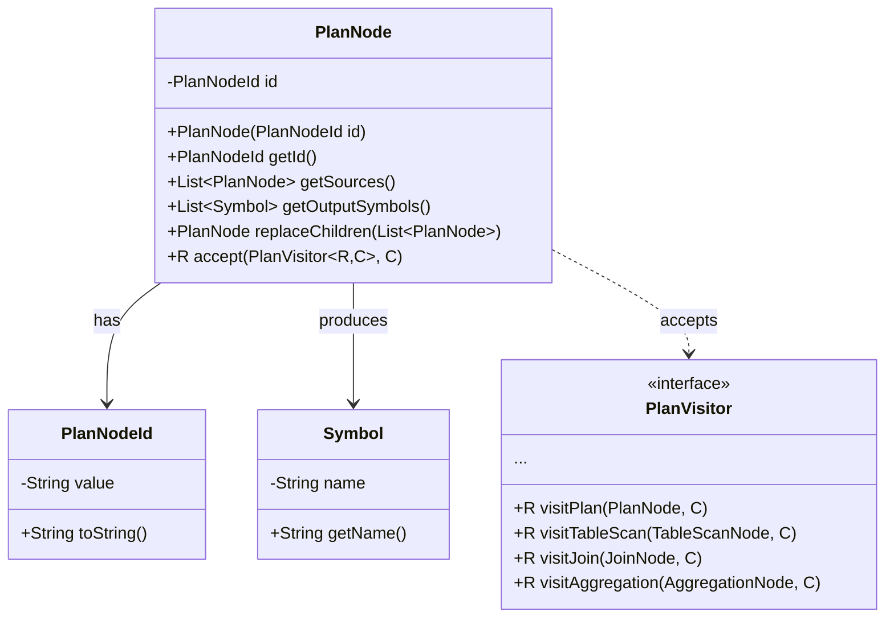
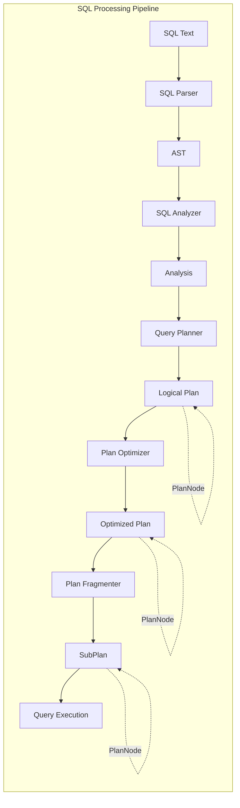
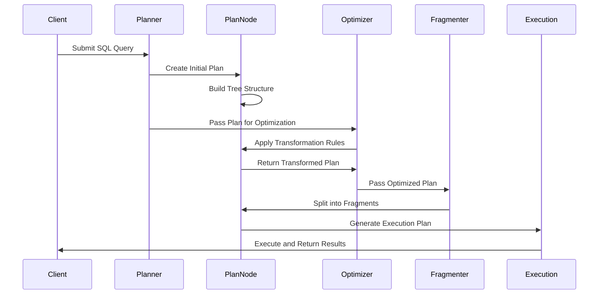

# Plan Representation Framework

## Introduction

The Plan Representation Framework is a core component of Trino's SQL query processing engine that provides the foundational data structures and abstractions for representing query execution plans. This framework defines the hierarchical tree structure used to model all aspects of query execution, from high-level logical operations to low-level physical execution details.

As a critical bridge between the SQL Analyzer and the Query Execution Engine, the Plan Representation Framework enables Trino to transform parsed SQL queries into executable plans that can be efficiently distributed across the cluster for parallel processing.

## Architecture Overview

The framework is built around the central `PlanNode` abstraction, which serves as the base class for all plan nodes in the execution tree. Each plan node represents a specific operation in the query execution pipeline, such as table scans, joins, aggregations, filters, and data exchanges.



## Core Components

### PlanNode Abstract Base Class

The `PlanNode` class is the foundation of the entire framework, providing:

- **Unique Identification**: Each plan node has a `PlanNodeId` for tracking and reference
- **Tree Structure**: Support for hierarchical relationships through `getSources()` and `replaceChildren()`
- **Symbol Management**: Output symbols that define the schema of data produced by the node
- **Visitor Pattern**: Extensible processing through the `PlanVisitor` interface
- **Serialization**: JSON serialization support for plan persistence and transmission



## Plan Node Types

### Logical Plan Nodes

Logical plan nodes represent high-level query operations that are independent of the physical execution strategy:

#### TableScanNode
Represents reading data from a table, including:
- Table metadata and layout
- Column references and projections
- Filter pushdown predicates
- Partition pruning information

#### JoinNode
Represents join operations between two or more relations:
- Join type (INNER, LEFT, RIGHT, FULL)
- Join criteria and conditions
- Distribution type (REPLICATED, PARTITIONED, AUTOMATIC)

#### AggregationNode
Represents grouping and aggregation operations:
- Grouping keys and expressions
- Aggregate functions (SUM, COUNT, AVG, etc.)
- Pre-aggregated vs. final aggregation stages

#### ProjectNode
Represents column projections and expressions:
- Expression evaluations
- Column aliasing
- Computed columns

#### FilterNode
Represents row-level filtering operations:
- Predicate expressions
- Filter pushdown optimization
- Dynamic filter integration

### Physical Plan Nodes

Physical plan nodes represent specific execution strategies and distribution patterns:

#### ExchangeNode
Represents data redistribution between stages:
- Exchange types (GATHER, REPARTITION, REPLICATE)
- Partitioning schemes
- Streaming vs. materialized exchanges

#### RemoteSourceNode
Represents data consumption from remote stages:
- Source stage identification
- Output buffer management
- Network transfer optimization

#### WindowNode
Represents window function computations:
- Window specifications (PARTITION BY, ORDER BY, FRAME)
- Window function implementations
- Streaming vs. batch execution

### Utility Nodes

Utility nodes provide supporting functionality:

#### ValuesNode
Represents inline value sets:
- Constant value rows
- Parameter substitution
- Test data generation

#### SampleNode
Represents data sampling operations:
- Sampling methods (BERNOULLI, SYSTEM)
- Sampling percentages
- Stratified sampling

## Integration with Query Processing Pipeline

The Plan Representation Framework integrates with other Trino modules through well-defined interfaces:



### Query Planning Integration

The framework works closely with the [Query Planner & Plan Representation](Query%20Planner%20&%20Plan%20Representation.md) module:

- **PlanNode Construction**: The planner creates plan nodes based on semantic analysis
- **Symbol Resolution**: Output symbols are resolved and validated
- **Type Inference**: Data types are propagated through the plan tree
- **Cost Estimation**: Statistics are attached to plan nodes for optimization

### Optimization Integration

The framework supports the [Plan Optimizer](Plan%20Optimizer.md) module through:

- **Rule Application**: Plan nodes provide interfaces for rule-based transformations
- **Property Derivation**: Nodes expose logical and physical properties
- **Cost Model Integration**: Nodes support cost computation and comparison
- **Pattern Matching**: Node hierarchies support complex pattern recognition

### Execution Integration

The framework bridges to the [Query Execution Engine](Query%20Execution%20Engine.md) via:

- **Plan Fragmentation**: Logical plans are split into executable fragments
- **Operator Translation**: Plan nodes are converted to physical operators
- **Stage Boundaries**: Exchange nodes define execution stage boundaries
- **Parallel Execution**: Node properties guide parallel execution strategies

## Data Flow and Processing



## Key Features and Capabilities

### Extensibility

The framework provides multiple extension points:

- **Custom Plan Nodes**: New node types can be added for specialized operations
- **Visitor Pattern**: New processing logic can be added without modifying nodes
- **Rule-Based Optimization**: New optimization rules can transform plan structures
- **Property System**: Custom properties can be attached to plan nodes

### Serialization and Persistence

Plan nodes support comprehensive serialization:

- **JSON Serialization**: Complete plan trees can be serialized to JSON
- **Cross-Node Transmission**: Plans can be sent between coordinator and workers
- **Plan Caching**: Serialized plans can be cached for repeated execution
- **Debugging Support**: Human-readable plan representations for troubleshooting

### Performance Optimization

The framework includes several performance optimizations:

- **Immutable Design**: Plan nodes are immutable, enabling safe sharing and caching
- **Symbol Interning**: Common symbols are interned to reduce memory usage
- **Lazy Evaluation**: Properties are computed on-demand to reduce overhead
- **Memory Efficiency**: Compact data structures minimize memory footprint

## Usage Patterns

### Plan Construction

```java
// Example of building a simple table scan plan
TableScanNode tableScan = new TableScanNode(
    new PlanNodeId("table_scan"),
    tableHandle,
    outputSymbols,
    columnHandles,
    Optional.of(predicate),
    Optional.empty() // no constraint
);
```

### Plan Traversal

```java
// Example of visiting plan nodes
public class SymbolExtractor
    extends PlanVisitor<Void, Set<Symbol>>
{
    @Override
    public Void visitProject(ProjectNode node, Set<Symbol> context)
    {
        context.addAll(node.getOutputSymbols());
        return super.visitProject(node, context);
    }
}
```

### Plan Transformation

```java
// Example of replacing plan node children
PlanNode newNode = node.replaceChildren(
    ImmutableList.of(newChild1, newChild2)
);
```

## Testing and Validation

The framework includes comprehensive testing support:

- **Plan Assertion Utilities**: Helper methods for validating plan structures
- **Plan Matching**: Pattern matching for complex plan validation
- **Symbol Validation**: Automatic validation of symbol usage and scoping
- **Property Validation**: Verification of logical and physical properties

## Dependencies and Related Modules

The Plan Representation Framework has dependencies on several other Trino modules:

- **[Trino SPI](Trino%20SPI.md)**: For type system, connector interfaces, and data structures
- **[SQL Analyzer, Planner & Optimizer](SQL%20Analyzer,%20Planner%20&%20Optimizer.md)**: For query analysis and optimization integration
- **[Query Execution Engine](Query%20Execution%20Engine.md)**: For execution plan generation
- **[SQL Parser & AST](SQL%20Parser%20&%20AST.md)**: For expression and statement representation

## Future Enhancements

The framework continues to evolve with planned enhancements:

- **Adaptive Query Processing**: Dynamic plan modification during execution
- **Machine Learning Integration**: ML-based plan optimization and cost estimation
- **Vectorized Execution**: Enhanced support for vectorized processing
- **Cloud-Native Features**: Optimizations for cloud and serverless environments

## Conclusion

The Plan Representation Framework serves as the backbone of Trino's query processing architecture, providing a flexible and extensible foundation for representing, optimizing, and executing complex SQL queries. Its well-designed abstractions enable sophisticated query optimization while maintaining clear separation of concerns across the query processing pipeline.