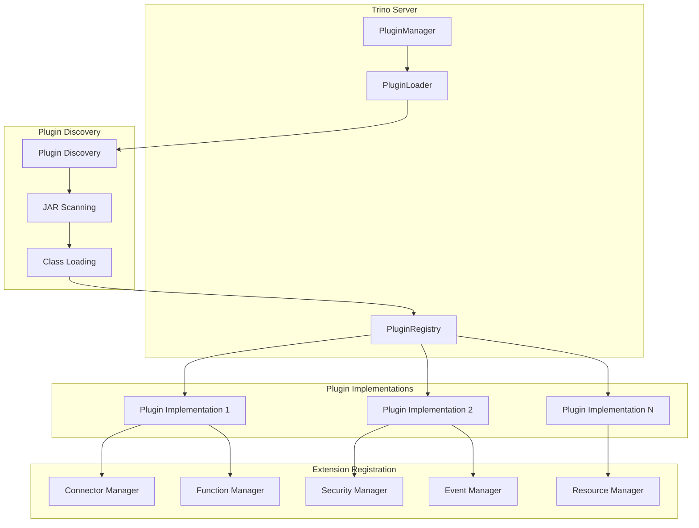
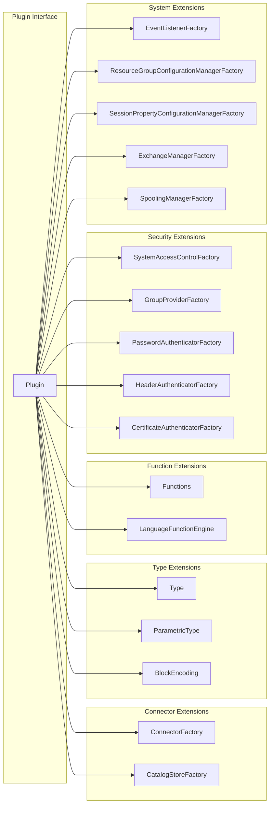
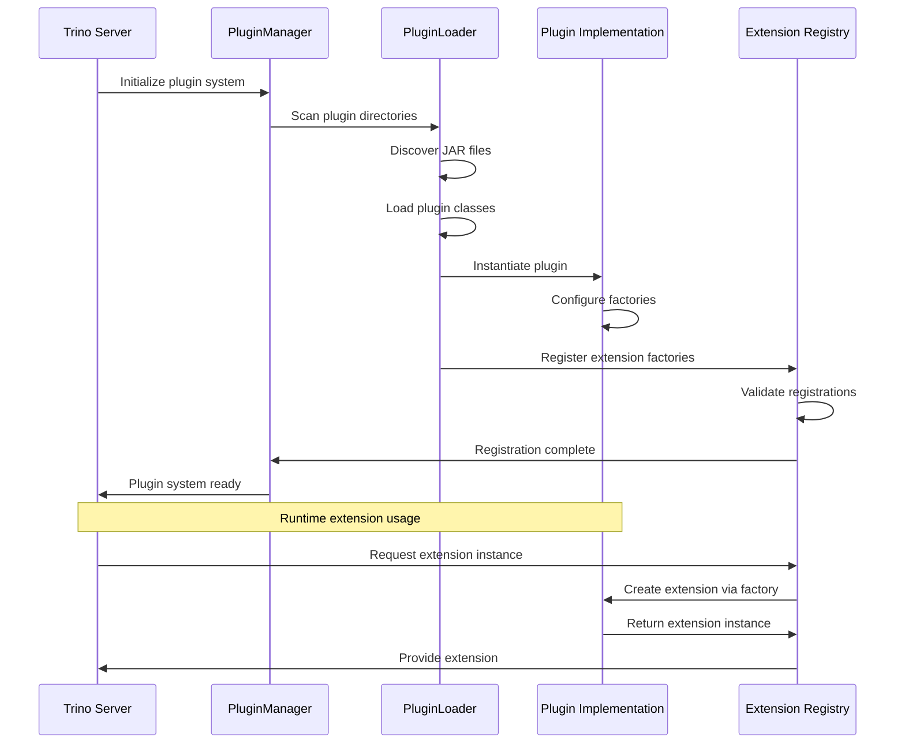
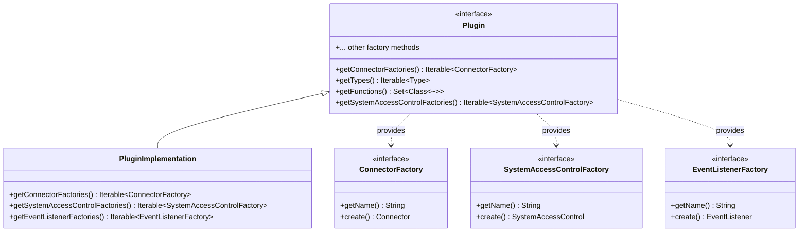

# Plugin Architecture

The Plugin Architecture module is the foundation of Trino's extensibility system, providing a standardized interface for extending Trino's functionality through plugins. This module defines the core `Plugin` interface that serves as the entry point for all Trino plugins, enabling dynamic loading and registration of various extension points including connectors, functions, security components, and system services.

## Overview

The Plugin Architecture enables Trino to be extended at runtime without modifying the core system. Plugins can provide new data source connectors, custom functions, security implementations, event listeners, and various other system extensions. The architecture follows a factory pattern where plugins provide factories for creating specific extension instances, allowing Trino to discover and instantiate extensions dynamically.

## Core Components

### Plugin Interface

The `Plugin` interface is the central contract that all Trino plugins must implement. It serves as a registry of extension factories that Trino queries during plugin loading to discover available extensions.

**Key Responsibilities:**
- Provide factories for creating connectors to external data sources
- Register custom data types and block encodings
- Supply user-defined functions and language function engines
- Register security and authentication components
- Provide event listeners and resource management components
- Register session property and exchange managers

**Extension Categories:**
- **Connector Factories**: Enable connection to external data sources (databases, file systems, etc.)
- **Type System Extensions**: Custom data types and parametric types
- **Function Extensions**: User-defined functions and language function engines
- **Security Extensions**: Authentication, authorization, and access control
- **System Extensions**: Event listeners, resource groups, session management
- **Data Processing Extensions**: Block encodings and spooling managers

## Architecture

### Plugin Loading Architecture

### Plugin Extension Points

## Component Relationships

### Plugin Lifecycle

### Extension Factory Pattern

## Integration with Trino System

### Plugin Manager Integration

The Plugin Architecture integrates with Trino's PluginManager (referenced in [Trino Server & API](Trino%20Server%20&%20API.md)) which handles:
- Plugin discovery and loading from configured directories
- JAR file scanning and class loading
- Plugin instantiation and lifecycle management
- Extension factory registration with appropriate managers

### Extension Point Integration

Each extension type integrates with specific Trino subsystems:

- **Connector Factories**: Register with [Connector Manager](Metadata%20&%20Connector%20Abstraction.md) for data source connectivity
- **Functions**: Register with [Function Manager](Metadata%20&%20Connector%20Abstraction.md) for query execution
- **Security Components**: Register with [Access Control Manager](Trino%20Server%20&%20API.md) for authentication/authorization
- **Event Listeners**: Register with event system for query lifecycle monitoring
- **Types**: Register with [Type Registry](Metadata%20&%20Connector%20Abstraction.md) for type system extensions

## Plugin Development

### Implementation Guidelines

1. **Factory Pattern**: Implement appropriate factory interfaces for desired extensions
2. **Configuration**: Support configuration through Trino's configuration system
3. **Lifecycle Management**: Properly manage resources and cleanup
4. **Error Handling**: Provide meaningful error messages for configuration issues
5. **Testing**: Implement comprehensive tests using [Trino Testing Framework](Trino%20Testing%20Framework.md)

### Common Extension Patterns

- **Connector Plugins**: Implement `ConnectorFactory` and related connector interfaces
- **Function Plugins**: Provide function classes and optionally `LanguageFunctionEngine`
- **Security Plugins**: Implement appropriate security factory interfaces
- **Utility Plugins**: Combine multiple extension types for comprehensive functionality

## Dependencies

The Plugin Architecture depends on:
- **Trino SPI**: Core service provider interfaces and extension contracts
- **Plugin Manager**: Server-side component for plugin lifecycle management
- **Extension Registries**: Various managers that consume plugin-provided factories

Related modules that extend the Plugin Architecture:
- [Connector Framework](Connector%20Framework.md) - Connector-specific plugin extensions
- [Function System](Function%20System.md) - Function-specific plugin extensions
- [Security Framework](Security%20Framework.md) - Security-specific plugin extensions
- [Type System](Type%20System.md) - Type-specific plugin extensions

## Configuration and Deployment

Plugins are deployed as JAR files in Trino's plugin directory structure. The PluginManager scans these directories and loads plugins according to the configured plugin loading strategy. Each plugin can provide configuration through standard Trino configuration mechanisms.

For detailed information about specific plugin types and their implementation patterns, refer to the individual connector and extension module documentation.