# Plugin Integration Module Documentation

## Introduction

The Plugin Integration module serves as the foundation for Trino's extensible architecture, providing the core interfaces and mechanisms that enable third-party developers to create custom connectors, functions, and system components. This module defines the Service Provider Interface (SPI) that all Trino plugins must implement, establishing a standardized contract between the Trino engine and external plugin implementations.

The module's primary purpose is to abstract the complexity of Trino's internal operations while providing a clean, stable API for plugin development. It enables seamless integration of new data sources, custom functions, security providers, and other system extensions without requiring modifications to the core Trino engine.

### Core Example: IcebergPlugin Implementation

The `IcebergPlugin` serves as a prime example of plugin implementation, demonstrating the key integration patterns:

```java
public class IcebergPlugin implements Plugin {
    @Override
    public Iterable<ConnectorFactory> getConnectorFactories() {
        return ImmutableList.of(new IcebergConnectorFactory());
    }
    
    @Override
    public Set<Class<?>> getFunctions() {
        return ImmutableSet.of(IcebergThetaSketchForStats.class);
    }
}
```

This implementation showcases the two primary extension points: connector factories for data source integration and function registration for custom SQL functions.

## Architecture Overview

The Plugin Integration architecture is built around several key design principles:

1. **Service Provider Interface Pattern**: Defines clear contracts between Trino and plugins
2. **Modular Component Design**: Separates concerns into distinct, reusable components
3. **Type Safety**: Provides strong typing throughout the plugin ecosystem
4. **Extensibility**: Allows plugins to extend functionality at multiple integration points

### Core Plugin Architecture

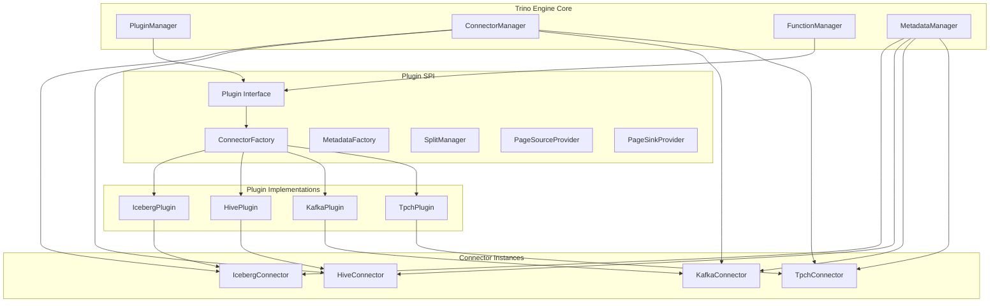

### Plugin Lifecycle Management

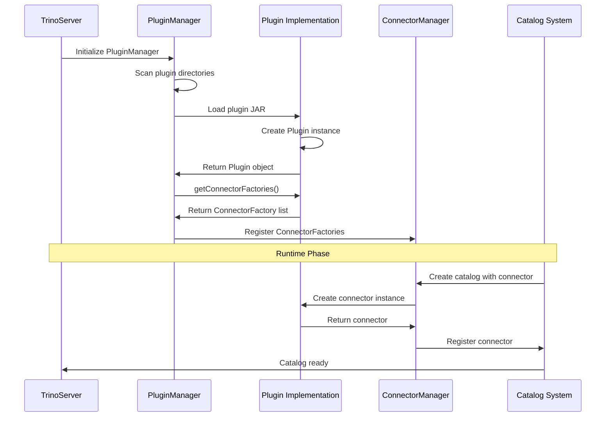

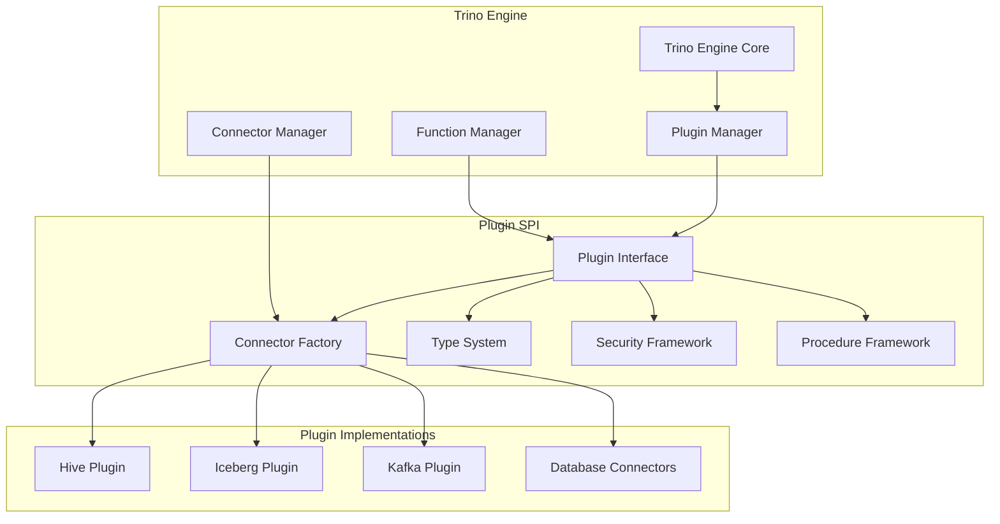

## Core Components

### Plugin Interface

The `Plugin` interface is the entry point for all Trino plugins. It serves as the primary contract that plugin implementations must fulfill to be recognized by the Trino system.

**Key Responsibilities:**
- Provide connector factories for creating connector instances
- Register custom functions and procedures
- Define plugin-specific types and security providers
- Manage plugin lifecycle and resources

**Implementation Example - IcebergPlugin (from core code):**

```java
public class IcebergPlugin implements Plugin {
    @Override
    public Iterable<ConnectorFactory> getConnectorFactories() {
        return ImmutableList.of(new IcebergConnectorFactory());
    }
    
    @Override
    public Set<Class<?>> getFunctions() {
        return ImmutableSet.of(IcebergThetaSketchForStats.class);
    }
}
```

This implementation demonstrates the two primary extension points: connector factories for data source integration and function registration for custom SQL functions.

### Connector Framework

The Connector Framework provides the infrastructure for building data source connectors, abstracting the complexity of data access patterns and query execution.

**Key Interfaces:**
- `ConnectorFactory`: Creates connector instances
- `ConnectorMetadata`: Handles metadata operations (tables, schemas, columns)
- `ConnectorSplitManager`: Manages data partitioning and split generation
- `ConnectorPageSourceProvider`: Provides data reading capabilities
- `ConnectorPageSinkProvider`: Handles data writing operations

### Type System

The Type System defines how data types are represented and handled across the Trino ecosystem, ensuring consistency between the engine and plugins.

**Core Type Components:**
- `Type`: Base interface for all data types
- `Block`: Columnar data storage format
- `Page`: Collection of blocks representing a set of rows
- `ColumnMetadata`: Schema information for columns

### Security Framework

The Security Framework enables plugins to implement custom authentication and authorization mechanisms.

**Security Components:**
- `ConnectorIdentity`: Represents user identity within connectors
- Access control interfaces for fine-grained permission management
- Authentication providers for custom credential validation

## Data Flow Architecture

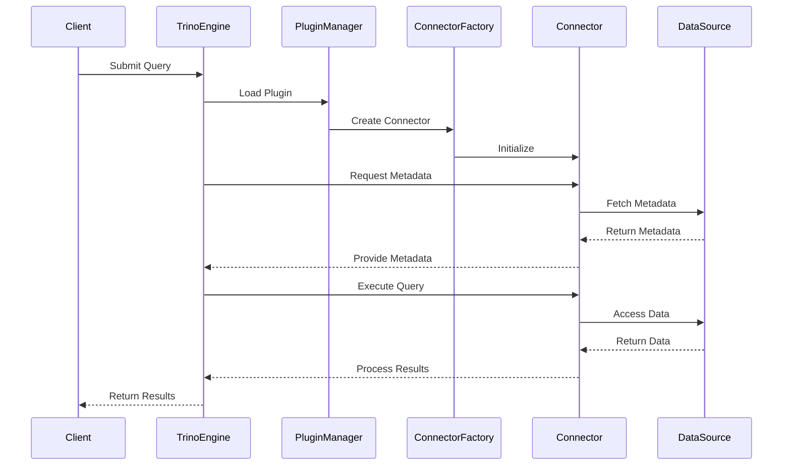

## Component Interactions

### Plugin Discovery and Loading

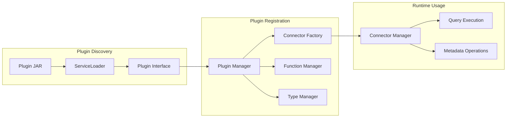

### Query Execution Flow with Plugins

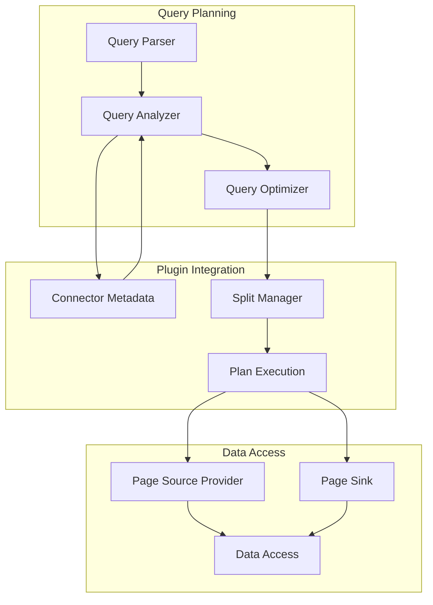

## Plugin Types and Categories

### Data Source Connectors

Data source connectors enable Trino to query external data systems. Each connector is implemented as a plugin that provides the necessary components for data access, metadata management, and query execution.

| Connector Type | Plugin Implementation | Data Source | Key Features |
|----------------|----------------------|-------------|--------------|
| **Iceberg** | IcebergPlugin | Apache Iceberg tables | ACID transactions, time travel, schema evolution, partition evolution |
| **Hive** | HivePlugin | Hive/HDFS ecosystem | Partition pruning, bucket optimization, ORC/Parquet optimization |
| **Delta Lake** | DeltaLakePlugin | Delta Lake tables | ACID transactions, unified batch/streaming, time travel |
| **Kafka** | KafkaPlugin | Apache Kafka | Real-time streaming, schema registry integration, exactly-once semantics |
| **Base JDBC** | BaseJdbcPlugin | JDBC-compatible databases | Standardized SQL access, connection pooling, type mapping |

**Example: IcebergPlugin Integration**

The IcebergPlugin demonstrates advanced connector patterns:

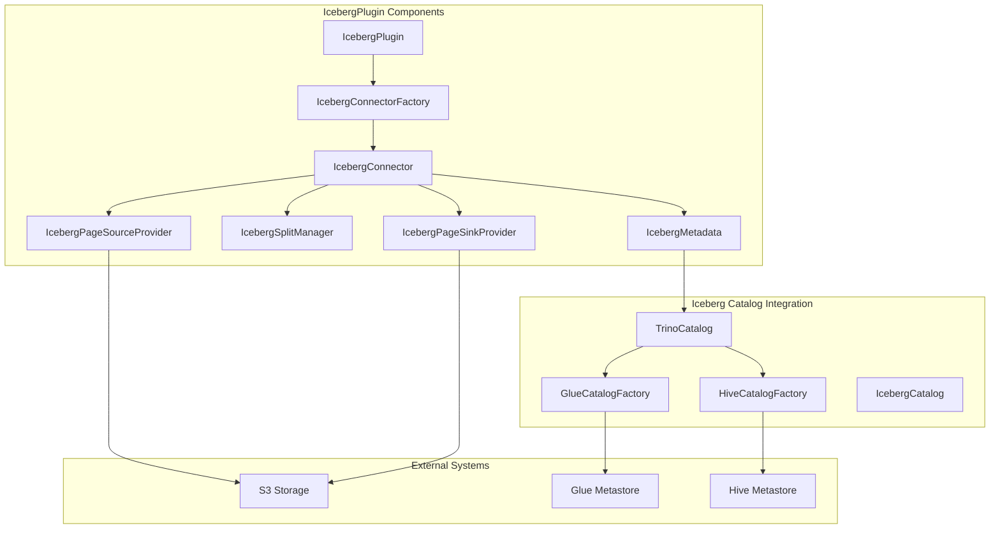

### Testing and Development Connectors

| Connector | Plugin | Purpose | Characteristics |
|-----------|--------|---------|-----------------|
| **TPC-H** | TpchPlugin | Benchmarking | Standardized test data, performance testing |
| **TPC-DS** | TpcdsPlugin | Decision support testing | Complex queries, analytical workloads |

### Base Infrastructure

| Component | Plugin | Function | Integration Level |
|-----------|--------|----------|-------------------|
| **Base JDBC** | BaseJdbcPlugin | JDBC database abstraction | Foundation for database connectors |

## Integration Points

### 1. Connector Integration

Plugins integrate with Trino through the Connector API, which provides standardized interfaces for:

- **Metadata Management**: Table discovery, schema operations, column information
- **Data Access**: Reading and writing data in the connector's native format
- **Transaction Management**: Supporting ACID properties where applicable
- **Optimization**: Providing statistics and pushdown capabilities

**Example: IcebergPlugin Metadata Integration**

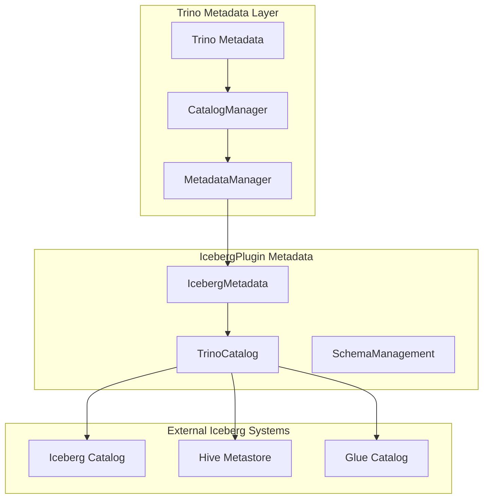

### 2. Function Integration

Custom functions extend Trino's built-in function library through:

- **Scalar Functions**: Single-row, single-value operations
- **Aggregate Functions**: Multi-row aggregation operations
- **Window Functions**: Partition-based analytical operations
- **Table Functions**: Functions that return entire tables

**Example: IcebergPlugin Function Registration**

The IcebergPlugin registers the `IcebergThetaSketchForStats` function, which provides specialized statistical capabilities for Iceberg tables:

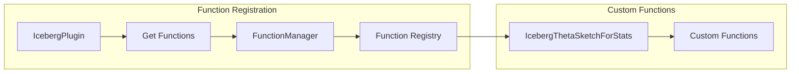

### 3. Type System Integration

Plugins can introduce custom data types by implementing:

- **Type Interfaces**: Defining type behavior and properties
- **Serialization**: Converting between internal and external representations
- **Operators**: Defining operations on custom types
- **Comparisons**: Implementing ordering and equality logic

## Plugin Development Process

### Development Framework

The Plugin Development Framework provides comprehensive tools and utilities for building Trino plugins:

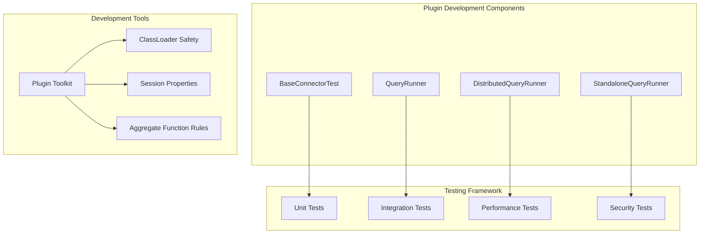

### Plugin Toolkit Integration

The Plugin Toolkit provides base implementations and utilities for plugin development:

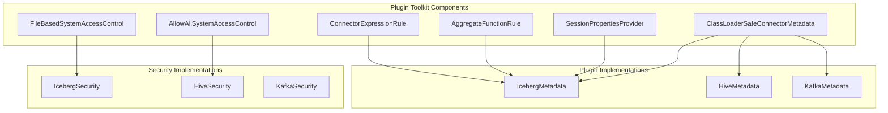

## Integration with Other Modules

### SQL Parser Integration

The Plugin Integration module works closely with the [SQL Parser & AST](SQL%20Parser%20&%20AST.md) module to handle plugin-specific SQL extensions:

- **Custom Functions**: Plugins register functions that integrate with the parser's function resolution
- **Connector-specific Syntax**: Special handling for connector-specific SQL extensions
- **Procedure Calls**: Integration with the parser for stored procedure execution

**Example: IcebergPlugin Function Integration**

The `IcebergThetaSketchForStats` function registered by IcebergPlugin integrates with the SQL parser to provide specialized statistical functions:

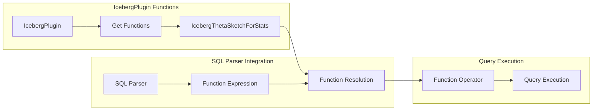

### Query Planning Integration

Integration with the [SQL Analyzer, Planner & Optimizer](SQL%20Analyzer%2C%20Planner%20&%20Optimizer.md) module:

- **Metadata Resolution**: Plugin metadata feeds into the analyzer's scope resolution
- **Cost-based Optimization**: Plugin-provided statistics influence plan optimization
- **Pushdown Optimization**: Connector-specific pushdown rules integrate with the optimizer

### Execution Engine Integration

The Plugin Integration module provides the data access layer for the [Query Execution Engine](Query%20Execution%20Engine.md):

- **Split Generation**: Connectors provide splits that drive task execution
- **Data Reading**: PageSource implementations feed data to operators
- **Data Writing**: PageSink implementations handle result persistence

### Security Framework Integration

Integration with the [Trino Server & API](Trino%20Server%20&%20API.md) security components:

- **Access Control**: Plugin-specific access control integrates with the server's security manager
- **Authentication**: Connector-specific authentication mechanisms
- **Authorization**: Integration with external authorization systems

## Error Handling and Resilience

The Plugin Integration module implements several mechanisms to ensure system stability:

### 1. Plugin Isolation
- ClassLoader isolation prevents plugin conflicts
- Resource management prevents memory leaks
- Graceful degradation when plugins fail

### 2. Error Propagation
- Standardized error reporting through TrinoException
- Contextual error information for debugging
- Fallback mechanisms for critical operations

### 3. Recovery Mechanisms
- Plugin restart capabilities
- Connection pooling and retry logic
- Circuit breaker patterns for failing plugins

## Performance Considerations

### 1. Plugin Loading
- Lazy loading of plugin components
- Caching of frequently used metadata
- Connection pooling for data sources

### 2. Query Optimization
- Pushdown of operations to connectors
- Statistics-based optimization
- Parallel execution support

### 3. Memory Management
- Streaming data processing
- Configurable memory limits
- Spilling to disk for large operations

## Security Model

### 1. Authentication Integration
- Pluggable authentication providers
- Support for various authentication mechanisms
- Credential management and rotation

### 2. Authorization Framework
- Fine-grained access control
- Role-based permissions
- Row and column-level security

### 3. Data Protection
- Encryption in transit and at rest
- Data masking and anonymization
- Audit logging for compliance

## Configuration Management

### 1. Plugin Configuration
- Property-based configuration
- Environment variable support
- Dynamic configuration updates

### 2. Connector-Specific Settings
- Catalog configuration files
- Connection string parameters
- Performance tuning options

### 3. Runtime Configuration
- Session-level overrides
- Query-level hints
- Dynamic resource allocation

## Monitoring and Observability

### 1. Metrics Collection
- Plugin performance metrics
- Connector-specific statistics
- Resource utilization tracking

### 2. Health Checks
- Plugin availability monitoring
- Connection health validation
- Automatic failure detection

### 3. Logging and Tracing
- Structured logging support
- Distributed tracing integration
- Debug and diagnostic capabilities

## Best Practices

### 1. Plugin Design
- Follow interface segregation principles
- Implement proper resource cleanup
- Provide comprehensive error handling
- Document configuration options

### 2. Performance Optimization
- Implement pushdown capabilities
- Use appropriate data types
- Leverage parallel processing
- Cache frequently accessed data

### 3. Security Implementation
- Validate all inputs
- Implement proper authentication
- Follow principle of least privilege
- Secure sensitive configuration

## Related Documentation

- [Trino SPI](Trino%20SPI.md) - Core Service Provider Interface definitions
- [Connector Framework](Connector%20Framework.md) - Detailed connector implementation guide
- [Type System](Type%20System.md) - Type system architecture and implementation
- [Security Framework](Security%20Framework.md) - Security integration patterns
- [Function System](Function%20System.md) - Custom function development
- [Metadata & Connector Abstraction](Metadata%20&%20Connector%20Abstraction.md) - Metadata management patterns
- [SQL Parser & AST](SQL%20Parser%20&%20AST.md) - SQL parsing and function resolution
- [SQL Analyzer, Planner & Optimizer](SQL%20Analyzer%2C%20Planner%20&%20Optimizer.md) - Query planning and optimization integration
- [Query Execution Engine](Query%20Execution%20Engine.md) - Execution engine integration points
- [Trino Server & API](Trino%20Server%20&%20API.md) - Server infrastructure and REST API integration
- [Plugin Toolkit](Plugin%20Toolkit.md) - Development utilities and base implementations

## Conclusion

The Plugin Integration module is fundamental to Trino's extensibility and flexibility. By providing well-defined interfaces and comprehensive support for custom implementations, it enables the Trino ecosystem to grow and adapt to diverse data processing needs. Understanding this module is essential for developers who want to extend Trino's capabilities through custom plugins or connectors.