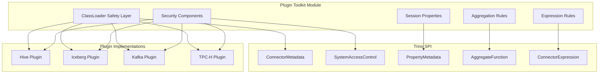
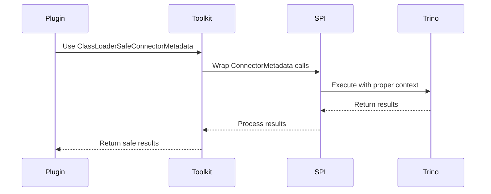

# Plugin Toolkit Module

## Overview

The Plugin Toolkit module provides essential utilities and base implementations for developing Trino plugins. It serves as a foundational library that simplifies plugin development by offering common patterns, security implementations, and utility classes that plugin developers can leverage.

## Purpose

The Plugin Toolkit module aims to:
- Provide a standardized set of utilities for plugin development
- Offer secure and tested implementations of common plugin patterns
- Simplify the development of connectors, security providers, and other plugin types
- Ensure consistent behavior across different plugins
- Reduce code duplication in plugin implementations

## Architecture



## Core Components

### 1. ClassLoader Safety Layer
The `ClassLoaderSafeConnectorMetadata` provides thread-safe wrapper functionality for connector metadata operations, ensuring proper classloader context management during plugin operations.

**Key Features:**
- Thread-safe metadata operations
- Automatic classloader context switching
- Delegation pattern for all metadata methods
- Comprehensive error handling

### 2. Security Components
Provides pluggable security implementations for access control:

- **FileBasedSystemAccessControl**: Rule-based access control using configuration files
- **AllowAllSystemAccessControl**: Permissive access control for development/testing

### 3. Session Properties Management
The `SessionPropertiesProvider` interface enables plugins to expose configurable session properties to users.

### 4. Aggregation and Expression Rules
Framework for implementing custom aggregation pushdown and expression rewriting rules:

- **AggregateFunctionRule**: Enables pushdown of aggregate functions to connectors
- **ConnectorExpressionRule**: Facilitates expression rewriting and optimization

## Sub-modules

### [Security Framework](Security Framework.md)
Provides comprehensive security implementations including file-based access control and permissive access control for different deployment scenarios.

### [ClassLoader Safety](ClassLoader Safety.md)
Ensures thread-safe operations across plugin boundaries with proper classloader context management.

### [Session Management](Session Management.md)
Offers utilities for managing session properties and configuration in plugins.

### [Query Optimization Rules](Query Optimization Rules.md)
Provides frameworks for implementing aggregation pushdown and expression rewriting to optimize query performance.

## Integration with Trino SPI

The Plugin Toolkit components integrate seamlessly with the Trino SPI:



## Usage Patterns

### Security Implementation
```java
// Using FileBasedSystemAccessControl
SystemAccessControl accessControl = new FileBasedSystemAccessControl.Factory()
    .create(config, context);
```

### ClassLoader Safety
```java
// Wrapping connector metadata
ConnectorMetadata safeMetadata = new ClassLoaderSafeConnectorMetadata(
    delegateMetadata, 
    classLoader
);
```

### Session Properties
```java
// Implementing session properties provider
public class MySessionProperties implements SessionPropertiesProvider {
    @Override
    public List<PropertyMetadata<?>> getSessionProperties() {
        // Return session properties
    }
}
```

## Benefits

1. **Reduced Development Time**: Pre-built implementations for common patterns
2. **Enhanced Security**: Tested security implementations
3. **Thread Safety**: Built-in thread safety mechanisms
4. **Consistency**: Standardized behavior across plugins
5. **Maintainability**: Centralized utility implementations
6. **Performance**: Optimized implementations for common operations

## Dependencies

The Plugin Toolkit module depends on:
- Trino SPI for core interfaces
- Airlift framework for dependency injection
- Google Guava for utility functions

## Related Documentation

- [Trino SPI](Trino SPI.md) - Core service provider interfaces
- [Connector Framework](Trino SPI.md#connector-framework) - Connector development framework
- [Security Framework](Trino SPI.md#security-framework) - Security-related SPI components

## Best Practices

1. **Always use ClassLoaderSafeConnectorMetadata** for thread safety
2. **Implement appropriate security controls** based on deployment requirements
3. **Leverage session properties** for user-configurable plugin behavior
4. **Use aggregation rules** to enable query pushdown optimizations
5. **Follow established patterns** from existing toolkit implementations