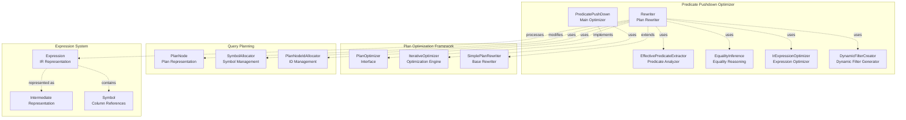
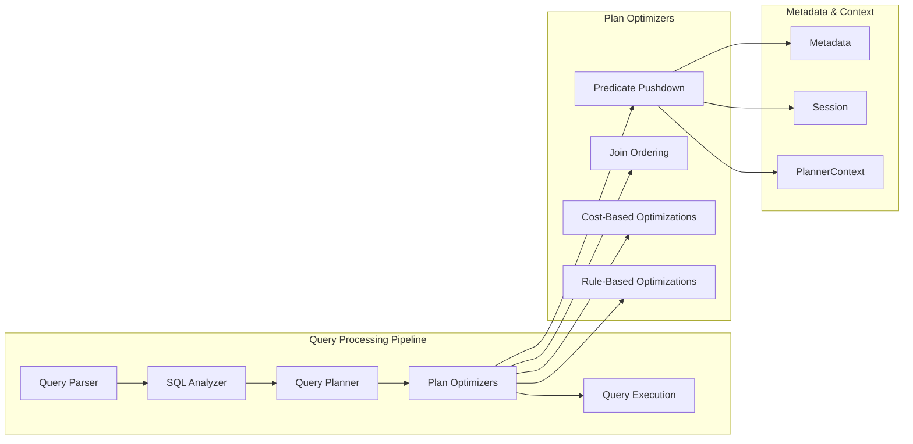
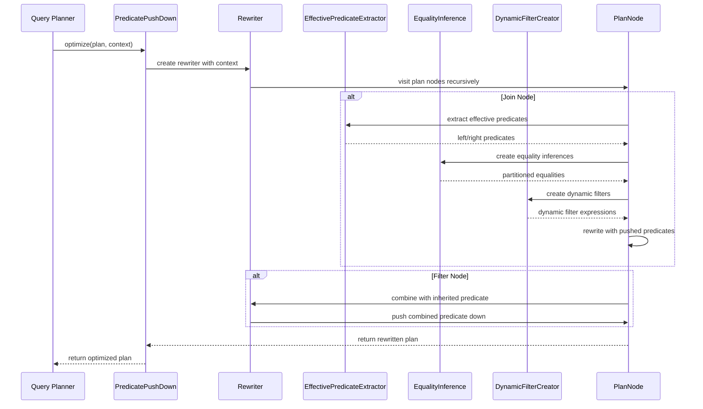
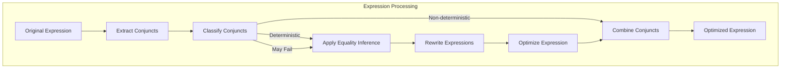
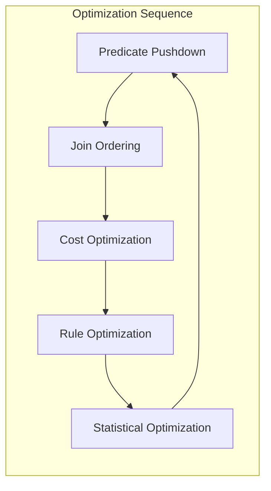

# Predicate Pushdown Optimizer

## Introduction

The Predicate Pushdown Optimizer is a critical component of Trino's query optimization framework that pushes filter predicates as close to the data source as possible. This optimization technique significantly reduces the amount of data processed by moving filtering operations earlier in the query execution plan, thereby improving query performance and reducing resource consumption.

## Overview

Predicate pushdown is a fundamental query optimization strategy that analyzes WHERE clauses and other filtering conditions, then rewrites the query plan to apply these filters at the earliest possible stage. The optimizer handles complex scenarios including:

- **Join operations**: Pushing predicates through different join types (INNER, LEFT, RIGHT, FULL)
- **Subqueries**: Optimizing predicates in semi-join and filtering operations
- **Aggregations**: Handling predicates on grouping keys and aggregate results
- **Window functions**: Managing predicates on partitioned data
- **Dynamic filtering**: Creating runtime filters for join operations
- **Cross-system optimization**: Pushing predicates to external data sources

## Architecture

### Core Components

### Integration with Trino Architecture

## Key Components

### PredicatePushDown Class

The main optimizer class that implements the `PlanOptimizer` interface. It orchestrates the predicate pushdown process by:

- **Configuration Management**: Handles session properties for table properties usage and dynamic filtering
- **Context Initialization**: Sets up the optimization context with symbol allocators and ID allocators
- **Plan Rewriting**: Delegates to the internal `Rewriter` class for actual plan transformation

### Rewriter Class

The core transformation engine that extends `SimplePlanRewriter`. It implements visit methods for different plan node types:

#### Join Processing
- **Inner Joins**: Pushes predicates to both sides when possible
- **Outer Joins**: Handles LEFT, RIGHT, and FULL joins with predicate preservation semantics
- **Join Type Conversion**: Converts outer joins to inner joins when predicates eliminate null-supplying rows
- **Dynamic Filtering**: Creates runtime filters for join operations

#### Specialized Node Handling
- **Window Functions**: Pushes predicates on partition keys
- **Aggregations**: Handles predicates on grouping keys
- **Semi-Joins**: Optimizes IN/EXISTS subqueries
- **Unnest Operations**: Manages predicates on replicated symbols
- **Set Operations**: Handles UNION, INTERSECT, EXCEPT

### Supporting Components

#### EffectivePredicateExtractor
Analyzes plan nodes to extract predicates that can be effectively pushed down, considering:
- Table constraints and properties
- Column statistics and metadata
- Partition information
- Index availability

#### EqualityInference
Performs logical inference on equality predicates to:
- Derive new equalities from existing ones
- Partition predicates based on symbol scopes
- Rewrite expressions using inferred equalities
- Handle transitive equality relationships

#### IrExpressionOptimizer
Optimizes expressions in the intermediate representation:
- Constant folding and simplification
- Cast elimination and unwrapping
- Boolean expression normalization
- Expression canonicalization

## Data Flow

### Predicate Pushdown Process

### Expression Processing Pipeline

## Optimization Strategies

### Join Predicate Pushdown

The optimizer employs sophisticated strategies for different join types:

#### Inner Joins
- Pushes predicates to both left and right sides
- Handles equality and non-equality predicates
- Manages predicates that may fail during evaluation
- Creates dynamic filters for runtime optimization

#### Outer Joins
- **Left Outer**: Pushes predicates to left side, limited pushdown to right
- **Right Outer**: Pushes predicates to right side, limited pushdown to left
- **Full Outer**: Minimal pushdown to preserve null-supplying semantics
- **Conversion to Inner**: Converts outer joins when predicates eliminate null rows

#### Semi-Joins
- **Filtering Semi-Joins**: Handles IN/EXISTS with predicate pushdown
- **Non-Filtering Semi-Joins**: Optimizes uncorrelated subqueries
- **Dynamic Filtering**: Creates runtime filters for semi-join operations

### Expression Optimization

The optimizer performs several expression-level optimizations:

#### Conjunct Management
- **Extraction**: Breaks complex expressions into simple conjuncts
- **Classification**: Categorizes conjuncts by determinism and failure potential
- **Inference**: Derives new predicates using equality relationships
- **Rewriting**: Transforms expressions using inferred equalities

#### Dynamic Filtering
- **Join Filter Creation**: Generates runtime filters for join operations
- **Symbol Mapping**: Maps build-side symbols to probe-side expressions
- **Type Handling**: Ensures type compatibility in dynamic filters
- **Null Safety**: Handles null values in dynamic filtering

### Cross-System Optimization

The optimizer interfaces with connector-specific optimizations:

#### Table Properties
- **Partition Pruning**: Uses table partitioning information
- **Index Utilization**: Leverages available indexes
- **Constraint Pushdown**: Pushes predicates to storage systems
- **Statistics Integration**: Uses column statistics for optimization

#### Connector Integration
- **Metadata Queries**: Retrieves connector-specific optimization capabilities
- **Predicate Translation**: Converts Trino expressions to connector formats
- **Cost Estimation**: Integrates with cost-based optimization
- **Runtime Adaptation**: Adjusts optimization based on runtime statistics

## Configuration and Session Properties

### Key Configuration Options

| Property | Description | Default |
|----------|-------------|---------|
| `predicate_pushdown_use_table_properties` | Use table properties for pushdown | `true` |
| `enable_dynamic_filtering` | Enable dynamic filtering for joins | `true` |
| `allow_unsafe_pushdown` | Allow pushdown of expressions that may fail | `false` |

### Performance Tuning

The optimizer's behavior can be tuned through session properties:
- **Dynamic Filtering**: Controls runtime filter generation
- **Table Properties**: Enables connector-specific optimizations
- **Unsafe Pushdown**: Allows aggressive optimization for complex expressions
- **Expression Simplification**: Controls expression rewriting aggressiveness

## Error Handling and Safety

### Expression Failure Handling

The optimizer implements safety mechanisms for expressions that may fail:

#### Failure Classification
- **Type Errors**: Expressions with potential type mismatches
- **Division by Zero**: Mathematical operations with zero denominators
- **Overflow**: Operations that may exceed type ranges
- **Invalid Operations**: Operations undefined for certain values

#### Safety Strategies
- **Conservative Pushdown**: Avoids pushing potentially failing expressions
- **Runtime Guards**: Adds protective filters when necessary
- **Fallback Mechanisms**: Provides alternative execution paths
- **Error Reporting**: Captures and reports optimization failures

### Semantic Preservation

The optimizer ensures query semantics are preserved:
- **Null Handling**: Maintains correct null semantics in outer joins
- **Determinism**: Preserves non-deterministic expression evaluation
- **Order Sensitivity**: Respects operation ordering requirements
- **Side Effects**: Avoids pushing expressions with side effects

## Performance Characteristics

### Optimization Benefits

Predicate pushdown provides significant performance improvements:

#### Data Reduction
- **Early Filtering**: Reduces data volume early in execution
- **Partition Pruning**: Eliminates unnecessary partition scans
- **Index Usage**: Leverages indexes for efficient filtering
- **Memory Efficiency**: Reduces memory requirements for processing

#### Execution Efficiency
- **Reduced Network Traffic**: Minimizes data transfer in distributed execution
- **CPU Optimization**: Reduces processing overhead
- **I/O Optimization**: Minimizes disk reads and writes
- **Cache Efficiency**: Improves cache utilization

### Optimization Costs

The optimization process involves computational overhead:
- **Plan Analysis**: Time spent analyzing predicate relationships
- **Expression Rewriting**: Cost of transforming expressions
- **Metadata Queries**: Overhead of retrieving table properties
- **Memory Usage**: Memory required for inference and rewriting

## Integration with Other Optimizers

### Optimization Pipeline

The predicate pushdown optimizer works in conjunction with other optimizers:

### Inter-Optimizer Dependencies

- **Join Ordering**: Provides optimized join orders for predicate pushdown
- **Cost Estimation**: Supplies cost models for optimization decisions
- **Statistics**: Provides data distribution information
- **Expression Simplification**: Prepares expressions for optimization

## Testing and Validation

### Test Coverage

The optimizer includes comprehensive test coverage:
- **Unit Tests**: Individual component testing
- **Integration Tests**: End-to-end optimization scenarios
- **Regression Tests**: Prevents optimization bugs
- **Performance Tests**: Validates optimization benefits

### Validation Mechanisms

- **Plan Comparison**: Compares optimized and unoptimized plans
- **Result Verification**: Ensures query results remain correct
- **Performance Benchmarking**: Measures optimization impact
- **Fuzz Testing**: Tests edge cases and unusual scenarios

## Future Enhancements

### Planned Improvements

- **Advanced Inference**: More sophisticated equality inference
- **Cost Integration**: Better integration with cost-based optimization
- **Machine Learning**: ML-based optimization decisions
- **Adaptive Optimization**: Runtime optimization adjustment

### Research Areas

- **Predicate Selectivity**: Better estimation of predicate selectivity
- **Multi-Column Statistics**: Utilizing multi-column statistics
- **Query Feedback**: Learning from query execution feedback
- **Connector Optimization**: Enhanced connector-specific optimizations

## Related Documentation

- [SQL Analyzer, Planner & Optimizer](SQL%20Analyzer%2C%20Planner%20%26%20Optimizer.md) - Overview of the optimization framework
- [Query Execution Engine](Query%20Execution%20Engine.md) - Execution of optimized plans
- [SQL Intermediate Representation](SQL%20Intermediate%20Representation.md) - Expression representation and optimization
- [Metadata & Connector Abstraction](Metadata%20%26%20Connector%20Abstraction.md) - Connector integration for predicate pushdown

## References

- **Trino Documentation**: [https://trino.io/docs](https://trino.io/docs)
- **Optimization Papers**: Research papers on predicate pushdown techniques
- **Performance Studies**: Benchmarks and performance analysis
- **Connector Development**: Guide for implementing connector-specific optimizations