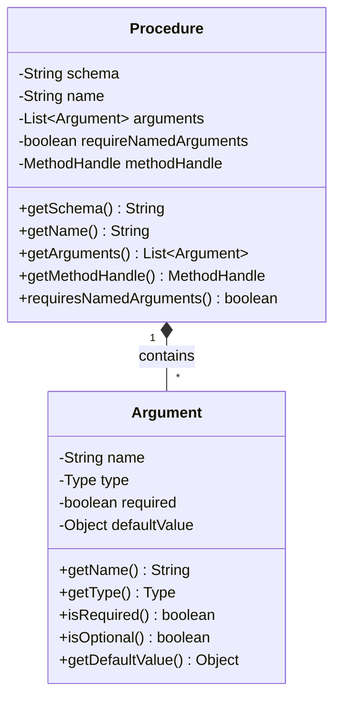
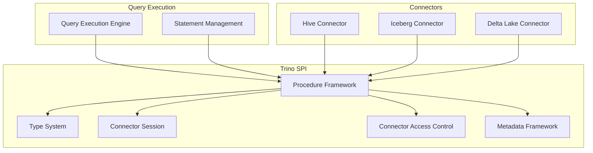
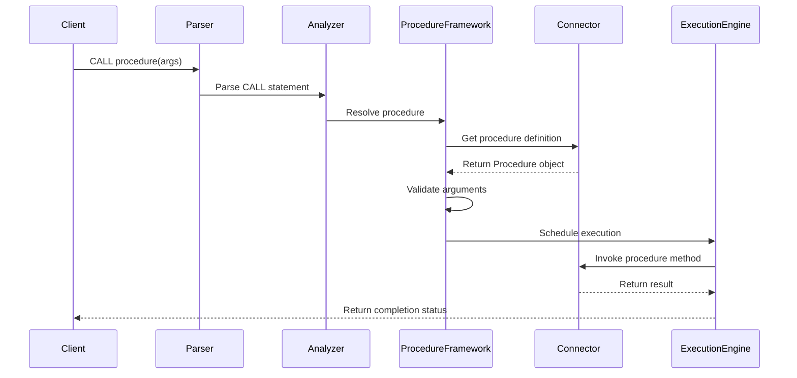
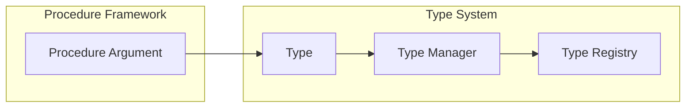
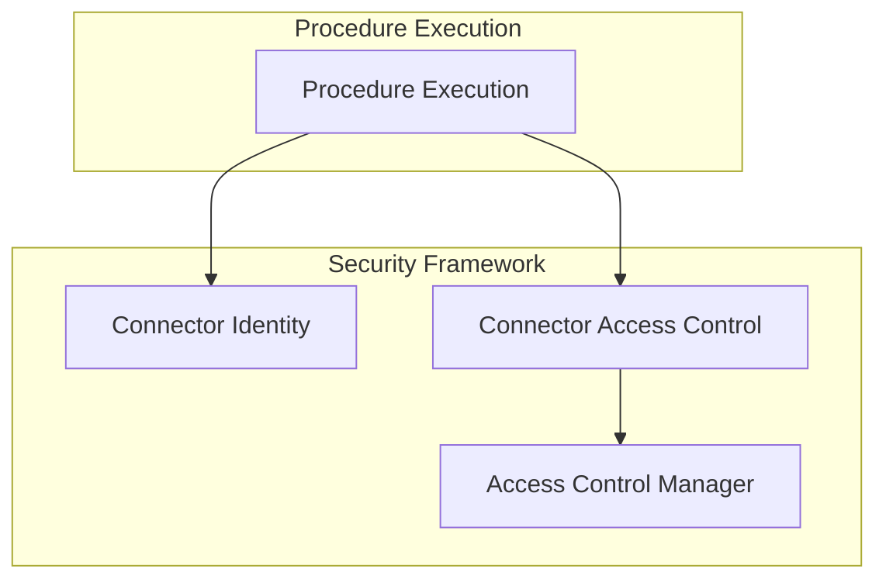

# Procedure Framework

The Procedure Framework provides a standardized mechanism for defining and executing stored procedures in Trino. It enables connectors to expose custom procedural logic that can be invoked through SQL `CALL` statements, allowing for administrative operations, data maintenance tasks, and complex operations that go beyond standard SQL queries.

## Overview

The Procedure Framework serves as the foundation for implementing stored procedures across different connectors in the Trino ecosystem. It defines a contract between the Trino engine and connectors that wish to expose procedural capabilities, ensuring consistent behavior and integration with the overall query execution pipeline.

## Core Architecture

### Procedure Class Structure

The framework centers around the `Procedure` class, which encapsulates all necessary information for procedure execution:

### Key Components

1. **Procedure Metadata**: Schema, name, and argument definitions
2. **Argument Specification**: Type-safe parameter definitions with optional/required semantics
3. **Method Handle**: Java MethodHandle for reflective invocation of procedure implementation
4. **Validation Logic**: Comprehensive validation for procedure definitions

## Integration with Trino Architecture

### Relationship to Other Frameworks

### Procedure Execution Flow

## Procedure Definition and Validation

### Argument Validation Rules

The framework enforces several validation rules to ensure procedure consistency:

1. **Unique Argument Names**: All argument names must be unique within a procedure
2. **Argument Ordering**: Optional arguments must follow required arguments
3. **Method Signature Matching**: The implementation method must match the argument specification
4. **Return Type**: Procedure methods must return void
5. **Fixed Arity**: Methods must have fixed parameter counts (no varargs)

### Type System Integration

Procedures integrate with Trino's [Type System](Type System.md) for argument type definitions:

## Connector Integration

### Procedure Registration

Connectors register procedures through their metadata providers, which are discovered by the Trino engine during connector initialization. The registration process involves:

1. **Procedure Definition**: Creating `Procedure` objects with appropriate metadata
2. **Method Binding**: Associating Java methods with procedure definitions using `MethodHandle`
3. **Schema Organization**: Organizing procedures within connector-specific schemas

### Built-in Procedures

Many connectors provide built-in procedures for common operations:

- **Hive Connector**: Table optimization, partition management
- **Iceberg Connector**: Table maintenance, snapshot management
- **Delta Lake Connector**: Vacuum operations, table optimization

## Security and Access Control

### Integration with Security Framework

The Procedure Framework integrates with Trino's [Security Framework](Security Framework.md) to ensure proper authorization:

### Access Control Points

1. **Procedure Resolution**: Checking if the user has permission to execute the procedure
2. **Argument Validation**: Ensuring access to referenced objects (tables, schemas, etc.)
3. **Execution Authorization**: Final authorization check before procedure invocation

## Error Handling and Diagnostics

### Exception Handling

The framework provides comprehensive error handling for various failure scenarios:

- **Invalid Arguments**: Type mismatches, missing required arguments
- **Authorization Failures**: Insufficient permissions for procedure execution
- **Runtime Errors**: Exceptions thrown during procedure execution
- **Validation Errors**: Procedure definition validation failures

### Diagnostic Information

Procedures can provide detailed error messages and diagnostic information through:

- **Exception Messages**: Descriptive error messages for troubleshooting
- **Validation Feedback**: Detailed validation failure information
- **Execution Context**: Access to session and context information

## Best Practices

### Procedure Design

1. **Clear Naming**: Use descriptive names that indicate procedure purpose
2. **Argument Design**: Minimize required arguments, provide sensible defaults
3. **Error Handling**: Provide clear error messages and recovery suggestions
4. **Documentation**: Document procedure behavior, side effects, and usage examples

### Performance Considerations

1. **Resource Management**: Properly manage resources (connections, file handles)
2. **Transaction Boundaries**: Understand transaction implications of procedure execution
3. **Concurrency**: Handle concurrent execution scenarios appropriately
4. **Progress Reporting**: For long-running procedures, provide progress information

## Testing and Validation

### Unit Testing

Connectors should provide comprehensive unit tests for their procedures:

- **Argument Validation**: Test all validation scenarios
- **Error Conditions**: Verify proper error handling
- **Success Cases**: Test successful execution paths
- **Edge Cases**: Handle boundary conditions and special inputs

### Integration Testing

Integration tests should verify:

- **End-to-End Execution**: Full procedure execution through SQL interface
- **Security Integration**: Proper authorization enforcement
- **Transaction Behavior**: Correct transaction handling
- **Resource Cleanup**: Proper resource management and cleanup

## Future Enhancements

### Potential Improvements

1. **Result Set Support**: Allow procedures to return result sets
2. **Asynchronous Execution**: Support for non-blocking procedure execution
3. **Progress Monitoring**: Enhanced progress reporting for long-running procedures
4. **Procedure Chaining**: Support for calling procedures from within other procedures
5. **Dynamic Procedures**: Runtime procedure registration and discovery

### Extensibility

The framework is designed to be extensible, allowing for:

- **Custom Argument Types**: Support for connector-specific argument types
- **Advanced Validation**: Custom validation logic for complex scenarios
- **Execution Hooks**: Pre/post execution hooks for monitoring and auditing
- **Result Processing**: Custom result processing and formatting

## Related Documentation

- [Type System](Type System.md) - For understanding argument type definitions
- [Connector Framework](Connector Framework.md) - For connector development and integration
- [Security Framework](Security Framework.md) - For security and access control details
- [Plugin Architecture](Plugin Architecture.md) - For plugin development guidelines
- [Query Execution Engine](Query Execution Engine.md) - For execution flow details