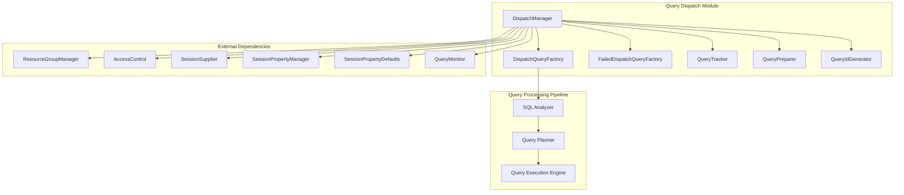
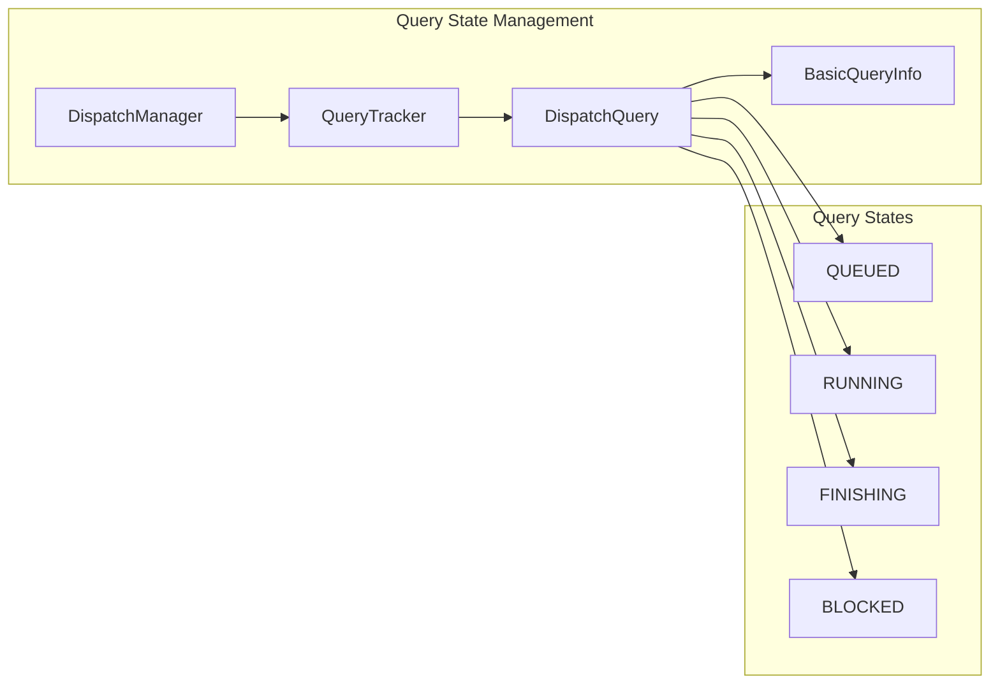
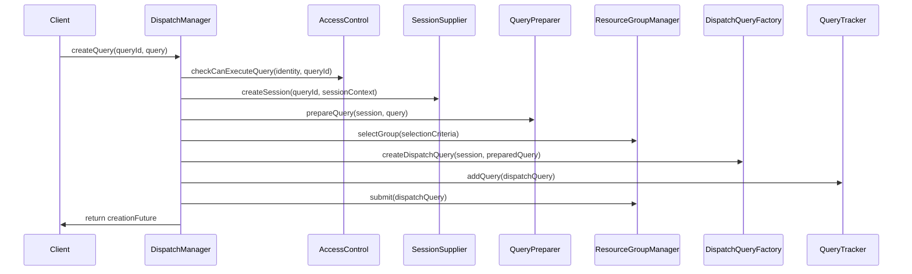
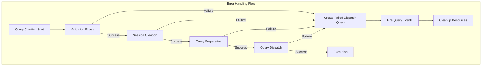

# Query Dispatch Module

## Introduction

The Query Dispatch module serves as the central entry point for query processing in Trino, managing the initial stages of query lifecycle from submission to execution. It acts as the primary coordinator between client requests and the internal query processing pipeline, ensuring proper authentication, authorization, resource management, and query preparation before queries are handed off to execution engines.

## Architecture Overview

The Query Dispatch module is built around the `DispatchManager` class, which orchestrates the entire query dispatch process. The module integrates with multiple Trino subsystems to provide a comprehensive query admission and preparation service.

## Core Components

### DispatchManager

The `DispatchManager` is the central component that coordinates all query dispatch operations. It provides the following key functionalities:

- **Query Admission**: Validates and admits incoming queries into the system
- **Session Management**: Creates and manages query sessions with proper authentication
- **Resource Group Assignment**: Assigns queries to appropriate resource groups for resource management
- **Query Preparation**: Prepares queries for execution through the `QueryPreparer`
- **Error Handling**: Creates failed dispatch queries when errors occur during preparation
- **Lifecycle Management**: Tracks query state transitions and manages query cleanup

#### Key Methods

- `createQuery()`: Main entry point for query submission
- `createQueryInternal()`: Internal method handling query creation logic
- `waitForDispatched()`: Waits for query to be dispatched to execution engine
- `cancelQuery()`: Cancels a running query
- `failQuery()`: Fails a query with a specific cause

### Query Tracking and Management

The module uses a `QueryTracker` to manage active queries and provides comprehensive monitoring capabilities:

## Query Dispatch Process Flow

The query dispatch process follows a well-defined sequence of operations:

## Integration with Other Modules

### Security Framework Integration

The Query Dispatch module integrates with the [Security Framework](Security Framework.md) through:

- **AccessControl**: Validates query execution permissions
- **Session Security**: Manages authenticated sessions and identity propagation
- **Principal Handling**: Processes user principals and groups for authorization

### Resource Management Integration

Integration with the resource management system includes:

- **ResourceGroupManager**: Assigns queries to resource groups based on selection criteria
- **Session Property Defaults**: Applies system-level session properties
- **Query Queuing**: Manages query admission and queuing policies

### Session Management Integration

The module works closely with session management components:

- **SessionSupplier**: Creates authenticated sessions from client context
- **SessionPropertyManager**: Manages session-level configuration
- **SessionPropertyDefaults**: Applies default properties based on resource groups

## Error Handling and Recovery

The Query Dispatch module implements comprehensive error handling:

### Error Scenarios

1. **Query Length Validation**: Queries exceeding maximum length are rejected
2. **Authentication Failures**: Invalid credentials prevent session creation
3. **Authorization Failures**: Insufficient permissions block query execution
4. **Query Preparation Errors**: Syntax or semantic errors in SQL statements
5. **Resource Group Assignment Failures**: Unable to assign query to resource group
6. **Dispatch Failures**: Errors during query submission to execution engine

## Monitoring and Observability

The module provides extensive monitoring capabilities:

### Query Statistics

- **Queued Queries**: Number of queries waiting for execution
- **Running Queries**: Currently executing queries
- **Finishing Queries**: Queries in completion phase
- **Progressing Queries**: Running queries making progress
- **Blocked Queries**: Running queries that are blocked

### Performance Metrics

- **Query Creation Time**: Time taken to create and dispatch queries
- **Resource Group Assignment Time**: Time to assign queries to resource groups
- **Session Creation Time**: Time to establish authenticated sessions
- **Query Preparation Time**: Time to parse and validate SQL statements

### Distributed Tracing

The module integrates with OpenTelemetry for distributed tracing:

- **Query Span Creation**: Creates spans for query lifecycle tracking
- **Context Propagation**: Maintains trace context across async operations
- **Error Recording**: Records exceptions and error states in traces

## Configuration and Tuning

### Key Configuration Parameters

- **Max Query Length**: Maximum allowed query text length
- **Dispatcher Query Pool Size**: Thread pool size for query dispatch operations
- **Stats Update Interval**: Frequency of statistics updates

### Resource Management

- **Bounded Executor**: Limits concurrent dispatch operations
- **Query Tracker**: Manages query lifecycle and cleanup
- **Memory Management**: Handles query metadata and state information

## Dependencies

The Query Dispatch module depends on several core Trino modules:

- **[SQL Parser & AST](SQL Parser & AST.md)**: For query parsing and validation
- **[SQL Analyzer, Planner & Optimizer](SQL Analyzer, Planner & Optimizer.md)**: For query analysis and preparation
- **[Metadata & Connector Abstraction](Metadata & Connector Abstraction.md)**: For metadata operations
- **[Trino Server & API](Trino Server & API.md)**: For server integration and REST API support

## Future Enhancements

Potential areas for improvement include:

1. **Advanced Queuing Policies**: More sophisticated query admission control
2. **Predictive Resource Allocation**: ML-based resource group assignment
3. **Query Prioritization**: Dynamic query priority management
4. **Multi-tenant Isolation**: Enhanced isolation between different tenants
5. **Query Caching**: Intelligent query result caching at dispatch level