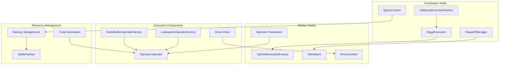
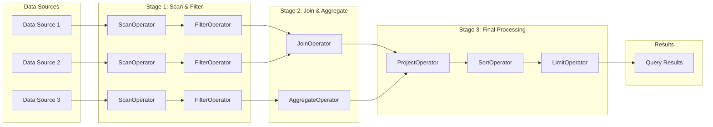
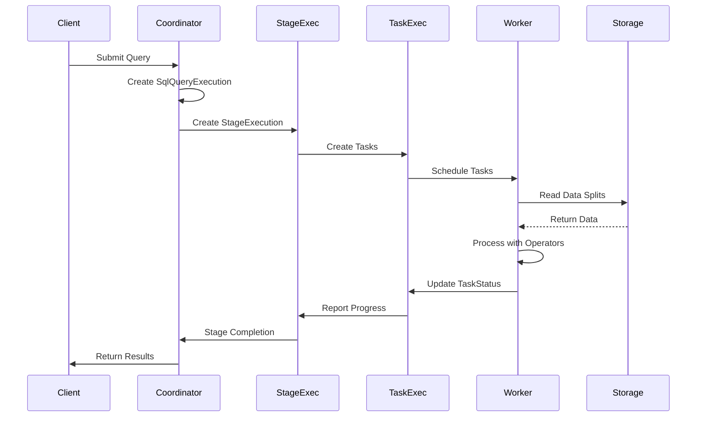

# Query Execution Engine

## Introduction

The Query Execution Engine is the core runtime component of Trino that executes distributed SQL queries across multiple data sources. It transforms optimized query plans into distributed execution tasks, manages query lifecycle, coordinates parallel execution across worker nodes, and handles data movement and processing operations. This module serves as the bridge between the logical query plans generated by the SQL Analyzer, Planner & Optimizer and the actual distributed computation that processes data.

## Architecture Overview

The Query Execution Engine follows a distributed execution model with a coordinator-worker architecture. The system breaks down complex queries into smaller executable units (stages and tasks) that can be distributed across multiple worker nodes for parallel processing.

## Core Components

### Query Execution Management

The query execution management layer orchestrates the entire query lifecycle from submission to completion.

#### SqlQueryExecutionFactory
The `SqlQueryExecutionFactory` is the entry point for query execution. It creates `SqlQueryExecution` instances that manage the complete query lifecycle, including:
- Query state management and transitions
- Stage creation and coordination
- Resource allocation and cleanup
- Error handling and failure recovery
- Query statistics collection and reporting

#### StageExecution
`StageExecution` manages the execution of individual query stages. Each stage represents a logical unit of work that can be distributed across multiple tasks. Key responsibilities include:
- Task scheduling and distribution to worker nodes
- Stage state tracking and coordination
- Data shuffling and exchange between stages
- Fault tolerance through task re-execution
- Performance monitoring and adaptive execution

#### SqlTaskExecutionFactory
The `SqlTaskExecutionFactory` creates task-level execution contexts on worker nodes. Tasks are the smallest units of execution that process splits of data. The factory manages:
- Task initialization and configuration
- Operator pipeline creation
- Memory and resource allocation
- Task lifecycle management
- Task status reporting

#### TaskStatus
`TaskStatus` provides real-time information about task execution state, including:
- Task execution progress and completion status
- Memory usage and resource consumption
- Processing statistics (rows processed, execution time)
- Error information and failure details
- Worker node assignment and location

### Operator Framework

The operator framework provides the execution primitives for data processing operations.

#### Operator Interface
The `Operator` interface defines the contract for all data processing operations in Trino. Operators are the fundamental building blocks that:
- Process data in a pipelined fashion
- Implement relational algebra operations (filter, project, join, aggregate)
- Handle memory management and spilling
- Provide execution statistics and progress tracking
- Support cancellation and resource cleanup

#### Driver Framework
The `Driver` class orchestrates the execution of operator pipelines. It manages:
- Operator lifecycle and execution scheduling
- Data flow between operators in a pipeline
- Memory management and spilling coordination
- Execution context and state management
- Performance monitoring and adaptive execution

#### DriverContext and BlockedMonitor
`DriverContext` provides the execution context for drivers, while `BlockedMonitor` tracks when operators are blocked waiting for resources or data. Together they enable:
- Resource usage tracking and accounting
- Deadlock detection and resolution
- Performance optimization and tuning
- Query progress monitoring
- Resource allocation decisions

### Join Operations

Specialized operators for efficient distributed join processing.

#### HashBuilderOperatorFactory
Creates operators that build hash tables for join operations. These operators:
- Construct in-memory hash tables from build-side data
- Handle memory pressure through spilling to disk
- Optimize hash table organization for probe operations
- Support different join types (inner, outer, semi)
- Provide statistics for join optimization

#### LookupJoinOperatorFactory
Creates operators that perform the probe phase of hash joins. These operators:
- Probe hash tables built by HashBuilderOperator
- Handle different join algorithms (broadcast, distributed)
- Support complex join conditions and expressions
- Manage memory for intermediate results
- Provide join performance metrics

### Memory Management

Comprehensive memory management system for query execution.

#### QueryContext
`QueryContext` manages memory allocation and tracking at the query level. It provides:
- Query-level memory pool management
- Memory limit enforcement and monitoring
- Spilling decisions based on memory pressure
- Resource allocation coordination
- Memory usage statistics and reporting

#### SpillerFactory
The `SpillerFactory` creates spilling mechanisms for operators when memory limits are exceeded. It supports:
- Disk-based spilling for memory-intensive operations
- Configurable spilling strategies and thresholds
- Spill file management and cleanup
- Performance optimization for spill operations
- Integration with different storage systems

### Code Generation

Runtime code generation for optimized query execution.

#### RowExpressionCompiler.Context
Provides the context for compiling row expressions into efficient Java bytecode. This enables:
- Runtime optimization of expression evaluation
- Specialized code generation for specific data types
- Vectorized expression evaluation
- Reduced interpretation overhead
- Adaptive optimization based on runtime statistics

## Data Flow Architecture

The Query Execution Engine implements a distributed data flow model where data moves through a network of operators organized in pipelines.

## Query Execution Process Flow

The execution process follows a well-defined pipeline from query submission to result delivery.

## Integration with Other Modules

### SQL Analyzer, Planner & Optimizer
The Query Execution Engine receives optimized query plans from the [SQL Analyzer, Planner & Optimizer](SQL%20Analyzer%2C%20Planner%20%26%20Optimizer.md) module. The integration includes:
- **PlanNode Execution**: Physical plan nodes are mapped to specific operator implementations
- **Statistics Integration**: Cost estimates guide execution strategy selection
- **Rule-Based Optimization**: Optimizer rules influence execution plan structure
- **Iterative Optimization**: Runtime statistics feed back into optimization decisions

### Trino SPI
Execution components interact with the [Trino SPI](Trino%20SPI.md) for data access and processing:
- **Connector Integration**: Operators use SPI interfaces to read and write data
- **Type System**: Data types defined in SPI guide operator behavior
- **Function Framework**: Custom functions are executed within operator contexts
- **Security Framework**: Access control is enforced during data processing

### Metadata & Connector Abstraction
The [Metadata & Connector Abstraction](Metadata%20%26%20Connector%20Abstraction.md) module provides essential services:
- **Metadata Access**: Table schemas, partitions, and statistics are retrieved
- **Split Management**: Data splits are assigned to tasks for processing
- **Transaction Coordination**: Multi-table operations are coordinated
- **Catalog Integration**: Cross-catalog queries are executed

## Performance Features

### Adaptive Execution
The engine implements several adaptive execution strategies:
- **Dynamic Partition Pruning**: Join results dynamically filter partitions
- **Runtime Filter Optimization**: Bloom filters are created and applied during execution
- **Adaptive Join Selection**: Join algorithms are selected based on runtime statistics
- **Memory-Adaptive Processing**: Operators adjust their behavior based on available memory

### Parallel Processing
Comprehensive parallel processing capabilities include:
- **Pipeline Parallelism**: Multiple operators execute concurrently in pipelines
- **Data Parallelism**: Large datasets are partitioned across multiple tasks
- **Task Parallelism**: Independent tasks execute simultaneously
- **Node Parallelism**: Multiple worker nodes process data in parallel

### Resource Management
Sophisticated resource management ensures efficient utilization:
- **Memory Pools**: Query, task, and operator-level memory allocation
- **CPU Scheduling**: Fair scheduling of CPU-intensive operations
- **Network Optimization**: Efficient data shuffling between stages
- **I/O Optimization**: Parallel I/O operations and caching strategies

## Fault Tolerance

### Failure Recovery
The execution engine implements comprehensive failure recovery mechanisms:
- **Task Retry**: Failed tasks are automatically retried on the same or different workers
- **Stage Recovery**: Entire stages can be re-executed in case of failures
- **Query Recovery**: Critical failures trigger query-level recovery strategies
- **Worker Failover**: Tasks are redistributed when workers become unavailable

### Error Handling
Robust error handling ensures system stability:
- **Graceful Degradation**: Operations continue with reduced resources
- **Error Propagation**: Errors are properly reported up the execution hierarchy
- **Resource Cleanup**: Failed operations properly release allocated resources
- **Diagnostic Information**: Detailed error information is collected for debugging

## Monitoring and Observability

### Execution Metrics
Comprehensive metrics collection provides visibility into execution performance:
- **Task Metrics**: Processing time, memory usage, rows processed
- **Operator Metrics**: Individual operator performance statistics
- **Stage Metrics**: Data volume, execution time, parallelism levels
- **Query Metrics**: End-to-end performance and resource consumption

### Progress Tracking
Real-time progress tracking enables monitoring and optimization:
- **Task Progress**: Percentage completion of individual tasks
- **Stage Progress**: Overall stage execution status
- **Query Progress**: High-level query completion estimates
- **Resource Utilization**: Memory, CPU, and I/O usage tracking

## Configuration and Tuning

### Execution Parameters
Key configuration parameters for execution tuning:
- **Task Concurrency**: Number of concurrent tasks per worker
- **Memory Limits**: Query, task, and operator memory allocations
- **Network Buffers**: Buffer sizes for data shuffling
- **Spilling Thresholds**: Memory pressure points for spilling

### Performance Tuning
Optimization strategies for different workloads:
- **Join Optimization**: Broadcast vs. distributed join selection
- **Aggregation Strategies**: Streaming vs. hash-based aggregation
- **Scan Optimization**: Column pruning and predicate pushdown
- **Exchange Optimization**: Data partitioning and shuffling strategies

This comprehensive execution framework enables Trino to efficiently process complex analytical queries across diverse data sources while maintaining high performance, fault tolerance, and resource efficiency.