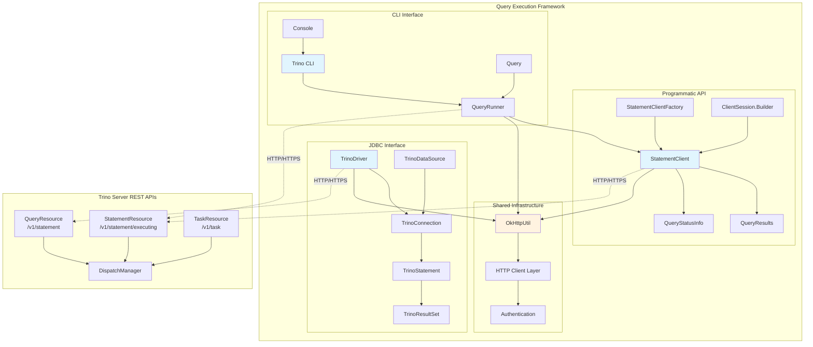
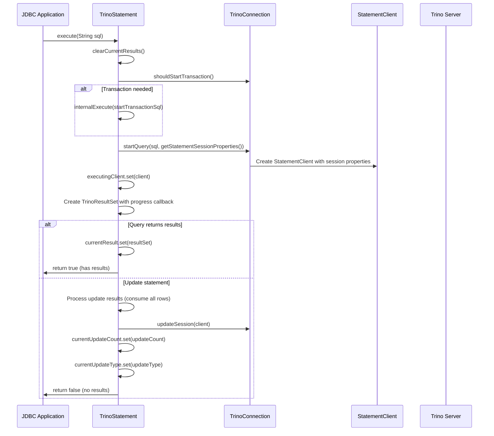
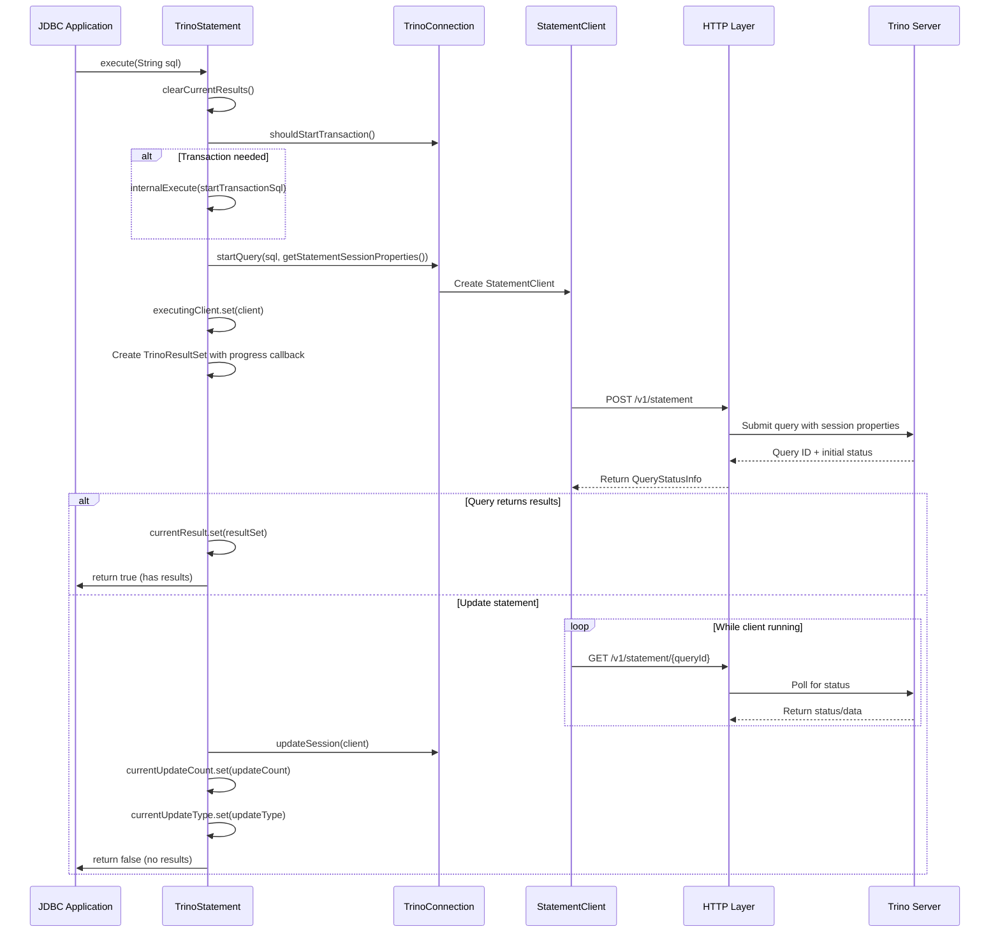
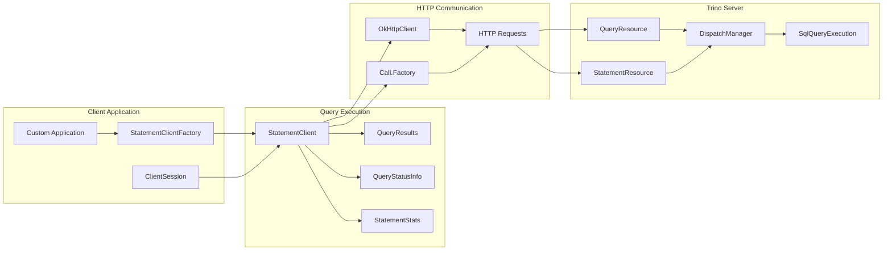
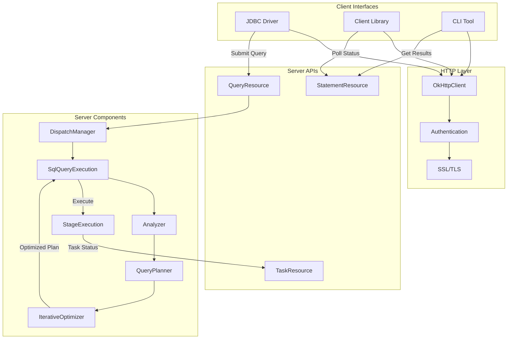
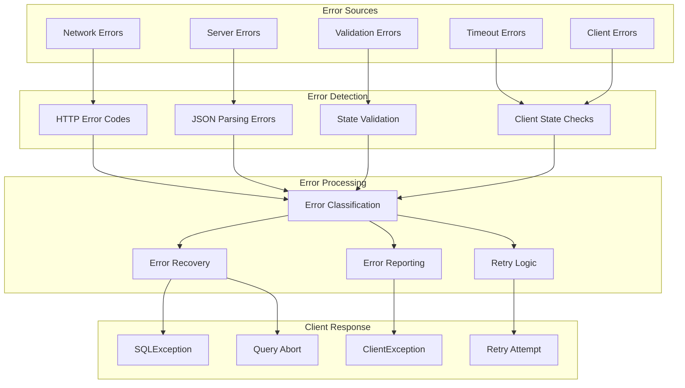

# Query Execution Framework

## Introduction

The Query Execution Framework is a comprehensive client-side system that provides multiple interfaces for executing SQL queries against Trino clusters. This framework encompasses the JDBC driver, client library, and CLI components that form the primary interface between applications and the Trino distributed query engine.

The framework handles the complete lifecycle of query execution, from initial statement submission through result retrieval and session management. It manages HTTP communications, result streaming, client-side state tracking, and provides both standards-compliant JDBC interfaces and programmatic APIs for custom applications.

Built around the `StatementClient` interface and JDBC-compliant components, the framework abstracts the complexity of interacting with Trino's REST API while providing clean interfaces for query execution, asynchronous processing, result pagination, session property management, and comprehensive error handling.

## Architecture Overview

The Query Execution Framework consists of three main client-side interfaces that work together to provide comprehensive query execution capabilities:

### Core Components

1. **Trino JDBC Driver** - Provides standards-compliant JDBC connectivity for Java applications
2. **Trino Client Library** - Offers programmatic API through StatementClient for custom applications  
3. **Trino CLI** - Command-line interface for interactive query execution and scripting

### High-Level Architecture



## Core Components

### JDBC Driver Components

#### TrinoDriver
The `TrinoDriver` class serves as the entry point for JDBC connectivity, automatically registering itself with the Java DriverManager and extending the `NonRegisteringTrinoDriver` to provide seamless integration with standard JDBC applications.

**Key Features:**
- Automatic driver registration during class loading
- JDBC 4.0+ compliant implementation
- Exception handling during registration with proper logging
- Extends base driver functionality for Trino-specific features

**Registration Process:**
```java
static {
    try {
        DriverManager.registerDriver(new TrinoDriver());
    }
    catch (SQLException e) {
        Logger.getLogger(TrinoDriver.class.getPackage().getName())
                .log(Level.SEVERE, "Failed to register driver", e);
        throw new RuntimeException(e);
    }
}
```

#### TrinoStatement
The `TrinoStatement` class is the core JDBC component responsible for executing SQL statements and managing query lifecycle. It implements the standard JDBC Statement interface while providing Trino-specific functionality for distributed query execution.

**Key Responsibilities:**
- SQL statement execution (queries, updates, DDL)
- Result set management with streaming support
- Query timeout and resource management
- Real-time progress monitoring
- Warning and error handling
- Transaction coordination with automatic transaction initiation

**State Management:**
The `TrinoStatement` maintains several atomic references to ensure thread safety and proper state management:
- `executingClient` - Tracks the active StatementClient during query execution
- `currentResult` - Holds the current TrinoResultSet
- `currentUpdateCount` - Stores update operation counts (-1 for queries)
- `currentUpdateType` - Records the type of update operation (INSERT, UPDATE, etc.)
- `progressCallback` - Manages progress monitoring callbacks
- `maxRows`, `queryTimeoutSeconds`, `fetchSize` - JDBC compliance settings

**Query Execution Process:**


**Advanced Features:**
- **Progress Monitoring**: `setProgressMonitor(Consumer<QueryStats>)` for real-time query progress
- **Partial Cancellation**: `partialCancel()` for cancelling only the leaf stage
- **Session Property Integration**: Automatic query timeout via `query_max_run_time`
- **Warning Management**: Comprehensive warning collection and reporting

#### TrinoConnection
Manages the connection lifecycle and session state, coordinating with the Trino server to maintain connection validity and handle session properties, catalog/schema changes, and transaction state.

#### TrinoResultSet
Provides access to query results with standard JDBC ResultSet interface, handling data type conversions, result pagination, and streaming for large result sets.

### Client Library Components

#### StatementClient Interface
The `StatementClient` interface is the central abstraction that defines the contract for query execution in the programmatic API. It provides comprehensive methods for managing query lifecycle, retrieving results, and handling session state changes.

**Key Responsibilities:**
- **Query Lifecycle Management**: Track query execution state from submission to completion
- **Result Retrieval**: Provide access to query results and metadata through `currentRows()` and `currentStatusInfo()`
- **Session Management**: Handle catalog, schema, and session property changes via `getSetCatalog()`, `getSetSchema()`, `getSetSessionProperties()`
- **Error Handling**: Detect and report client errors via `isClientError()` and server-side issues
- **Resource Management**: Ensure proper cleanup of resources via Closeable interface

**Core Methods:**
- `isRunning()`, `isFinished()`: Query state tracking
- `advance()`: Progress to next result set
- `currentRows()`, `currentStatusInfo()`: Result access
- `getSetCatalog()`, `getSetSchema()`, `getSetSessionProperties()`: Session changes
- `cancelLeafStage()`, `close()`: Query control

#### StatementClientFactory
The `StatementClientFactory` provides static factory methods for creating `StatementClient` instances with different HTTP client configurations and capabilities.

**Factory Method Variations:**
```java
// Basic HTTP Call Factory
newStatementClient(Call.Factory httpCallFactory, Call.Factory segmentHttpCallFactory, 
                   ClientSession session, String query)

// OkHttpClient with Capabilities  
newStatementClient(OkHttpClient httpClient, Call.Factory segmentHttpCallFactory,
                   ClientSession session, String query, Optional<Set<String>> clientCapabilities)
```

**Design Benefits:**
- **Flexibility**: Support for different HTTP client configurations
- **Capability Negotiation**: Optional client capability specification for feature negotiation
- **Resource Management**: Proper separation of HTTP resources for main queries and segment fetching
- **Backward Compatibility**: Multiple method signatures for different use cases

### CLI Components

#### QueryRunner
The `QueryRunner` orchestrates query execution in the CLI environment, handling user input, query submission, result formatting, and interactive features. It leverages the StatementClient internally while providing a user-friendly command-line interface.

#### Console
The `Console` component provides the interactive command-line interface with features like command history, syntax highlighting, result pagination, and formatted output display.

#### Query Processing
The `Query` class handles individual query execution within the CLI, managing the interaction between user input and the underlying StatementClient.

## Data Flow Architecture

### JDBC Query Execution Flow



### Client Library Data Flow



## Integration with Trino Server

### REST API Integration

The framework integrates with multiple Trino server endpoints to provide comprehensive query execution capabilities:



### Key Integration Points

1. **Query Submission** - JDBC and client library submit queries through QueryResource POST `/v1/statement`
2. **Status Polling** - Clients poll StatementResource GET `/v1/statement/executing/{queryId}` for query status and results
3. **Task Coordination** - TaskResource manages distributed task execution and worker coordination
4. **Session Management** - All components coordinate through the DispatchManager for session state
5. **Authentication** - HTTP layer handles various authentication mechanisms (LDAP, Kerberos, OAuth)

## Error Handling and Resilience

### Multi-Layer Error Handling Architecture



### Error Types and Handling Strategies

1. **Network Errors**
   - Connection failures, timeouts, network partitions
   - Automatic retry with exponential backoff
   - Circuit breaker pattern for persistent failures

2. **Server Errors**
   - Query failures, resource exhaustion, internal server errors
   - Proper error propagation through SQLException
   - Graceful degradation when possible

3. **Validation Errors**
   - SQL syntax errors, permission violations, type mismatches
   - Immediate error reporting to client
   - Detailed error messages with context

4. **Timeout Errors**
   - Query timeout, connection timeout, idle timeout
   - Configurable timeout settings
   - Proper cancellation and cleanup

5. **Client Errors**
   - Invalid state transitions, resource exhaustion
   - Client-side validation and error detection
   - Proper resource cleanup via Closeable interface

## Performance and Scalability Features

### Connection Pooling and Management
The framework supports sophisticated connection pooling through the `TrinoDataSource` component, enabling efficient reuse of HTTP connections in application server environments. The JDBC driver automatically manages connection lifecycle and provides connection pooling capabilities for high-throughput applications.

### Result Streaming and Pagination
Results are streamed to clients as they become available, reducing memory usage and improving response times for large result sets. The framework implements automatic pagination for large queries and supports configurable fetch sizes for optimal memory usage.

### Asynchronous Execution and Progress Monitoring
The client library supports asynchronous query execution, enabling non-blocking operation patterns in applications. Real-time query progress tracking through the `setProgressMonitor()` API allows applications to provide user feedback during long-running queries.

### Memory Management
The framework implements efficient memory management for large result sets through:
- **Streaming Results**: Real-time result delivery as data becomes available
- **Pagination**: Automatic result set pagination for large queries  
- **Resource Cleanup**: Guaranteed cleanup via Closeable interface
- **Configurable Limits**: Memory usage limits and timeout configurations

## Security Integration

### Authentication Support
The framework integrates with Trino's security model through multiple authentication mechanisms:
- **Password Authentication**: Integration with server-side password authenticators
- **Certificate-Based Authentication**: Support for client certificate authentication
- **Token-Based Authentication**: Support for JWT and OAuth tokens
- **Kerberos Authentication**: Enterprise-grade Kerberos integration

### Authorization and Access Control
- **Role Management**: Support for role-based access control through `getSetRoles()`
- **User Impersonation**: Capability for user authorization changes
- **Session Security**: Secure handling of session tokens and credentials
- **Permission Enforcement**: Client-side validation of access permissions

### Network Security
- **TLS/SSL Support**: Encrypted communication with Trino servers
- **Certificate Validation**: Proper certificate chain validation
- **Secure Defaults**: Security-focused default configurations
- **Credential Management**: Secure storage and handling of user credentials

## Configuration and Session Management

### JDBC Configuration
The JDBC driver supports comprehensive configuration through connection strings and properties:

```java
// Connection string with parameters
String url = "jdbc:trino://localhost:8080/catalog/schema?user=admin&password=secret&SSL=true";

// Session properties via JDBC
statement.setQueryTimeout(300); // 5 minutes
statement.setMaxRows(1000);
statement.setFetchSize(100);
```

### Client Session Management
The client library provides flexible session configuration through `ClientSession.Builder`:

```java
ClientSession session = ClientSession.builder()
    .server(URI.create("https://trino-server:8443"))
    .catalog("hive")
    .schema("default")
    .timeZone(ZoneId.of("America/New_York"))
    .locale(Locale.US)
    .user("admin")
    .clientCapabilities(Set.of("legacy_datetime", "legacy_round_n"))
    .build();
```

### Session Property Integration
The framework automatically handles session property changes during query execution:
- **Catalog/Schema Changes**: Tracked via `getSetCatalog()` and `getSetSchema()`
- **Session Properties**: Managed through `getSetSessionProperties()`
- **Role Changes**: Handled via `getSetRoles()`
- **Transaction State**: Coordinated through `getStartedTransactionId()`

## Dependencies and Related Modules

### Direct Dependencies
- [Trino Server & API](Trino Server & API.md) - Provides REST endpoints and server infrastructure for query submission and status polling
- [Trino SPI](Trino SPI.md) - Defines interfaces for plugins and connectors that the framework interacts with
- [SQL Parser & AST](SQL Parser & AST.md) - Handles SQL parsing and validation on the server side

### Runtime Dependencies  
- [SQL Analyzer, Planner & Optimizer](SQL Analyzer, Planner & Optimizer.md) - Processes and optimizes queries before execution
- [Query Execution Engine](Query Execution Engine.md) - Executes the optimized query plans on the server
- [Metadata & Connector Abstraction](Metadata & Connector Abstraction.md) - Manages metadata and connector interactions

### Client Usage Patterns
- **JDBC Applications**: Use the JDBC driver for standard database connectivity and ORM integration
- **Custom Applications**: Leverage the client library for programmatic access with fine-grained control
- **Interactive Users**: Utilize the CLI for ad-hoc query execution and exploration
- **Scripting**: Employ CLI for automated scripts and batch processing

## Best Practices and Usage Patterns

### JDBC Best Practices

**Connection Management:**
```java
// Use try-with-resources for automatic cleanup
try (Connection conn = DriverManager.getConnection(url, props);
     Statement stmt = conn.createStatement()) {
    
    // Set appropriate timeouts
    stmt.setQueryTimeout(300); // 5 minutes
    stmt.setMaxRows(10000); // Limit result size
    
    // Execute query
    try (ResultSet rs = stmt.executeQuery("SELECT * FROM table")) {
        while (rs.next()) {
            // Process results
        }
    }
} catch (SQLException e) {
    // Handle errors appropriately
    logger.error("Query failed", e);
}
```

**Progress Monitoring:**
```java
TrinoStatement trinoStmt = (TrinoStatement) stmt;
trinoStmt.setProgressMonitor(stats -> {
    System.out.printf("Progress: %.1f%% complete%n", 
        stats.getProgressPercentage());
});
```

### Client Library Best Practices

**Basic Query Execution:**
```java
// Create client session
ClientSession session = ClientSession.builder()
    .server(URI.create("http://trino-server:8080"))
    .catalog("hive")
    .schema("default")
    .build();

// Execute query with proper resource management
try (StatementClient client = StatementClientFactory
        .newStatementClient(httpClient, session, "SELECT * FROM table")) {
    
    while (client.isRunning() && !client.isClientError()) {
        if (client.advance()) {
            ResultRows rows = client.currentRows();
            // Process results
            rows.forEach(row -> processRow(row));
        }
    }
    
    // Handle errors
    if (client.isClientError()) {
        throw new RuntimeException("Client error occurred");
    }
}
```

**Session Management:**
```java
// Track and apply session changes
Optional<String> newCatalog = client.getSetCatalog();
if (newCatalog.isPresent()) {
    session = ClientSession.builder(session)
        .catalog(newCatalog.get())
        .build();
}

Map<String, String> newProperties = client.getSetSessionProperties();
// Apply session property changes to future queries
```

### Performance Optimization

**Connection Pooling:**
- Use `TrinoDataSource` for connection pooling in application servers
- Configure appropriate pool sizes based on workload
- Monitor connection usage and adjust settings as needed

**Query Optimization:**
- Use prepared statements for repeated queries
- Set appropriate fetch sizes for result sets
- Implement progress monitoring for long-running queries
- Handle cancellations properly to avoid resource waste

**Error Handling:**
- Implement comprehensive error handling for network and server errors
- Use appropriate retry strategies for transient failures
- Log errors with sufficient context for debugging
- Implement circuit breaker patterns for reliability

## Monitoring and Observability

### Query Statistics and Metrics
The framework provides comprehensive query execution statistics through:
- **Real-time Metrics**: Live query execution statistics via `StatementStats`
- **Performance Data**: Query timing and resource usage information
- **Progress Tracking**: Query execution progress indicators
- **Error Metrics**: Comprehensive error tracking and reporting

### Client Instrumentation
- **HTTP Metrics**: Network-level performance metrics for connection monitoring
- **Resource Usage**: Client-side resource consumption tracking
- **Logging Integration**: Structured logging for debugging and monitoring
- **Tracing Support**: Distributed tracing for query execution analysis

### Integration Points
The framework integrates with monitoring systems through:
- **JMX Metrics**: Exposed metrics for JMX-based monitoring
- **Logging Framework**: Structured logging with configurable levels
- **Custom Metrics**: Extension points for custom metric collection
- **Health Checks**: Built-in health check endpoints for load balancers

This comprehensive framework provides the foundation for all client-side query execution in Trino, offering multiple interfaces (JDBC, programmatic API, and CLI) that cater to different use cases while maintaining consistency, reliability, and performance across all access patterns.