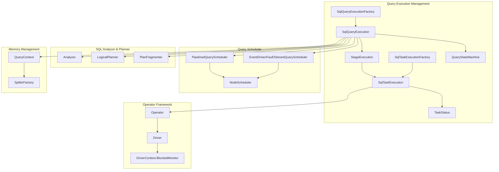
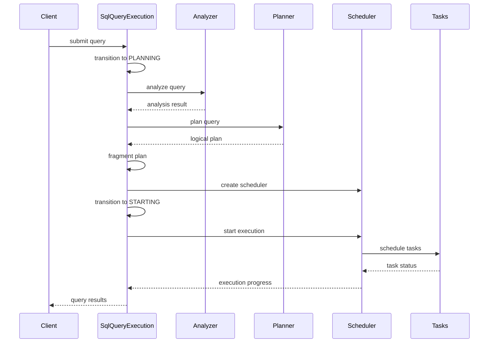
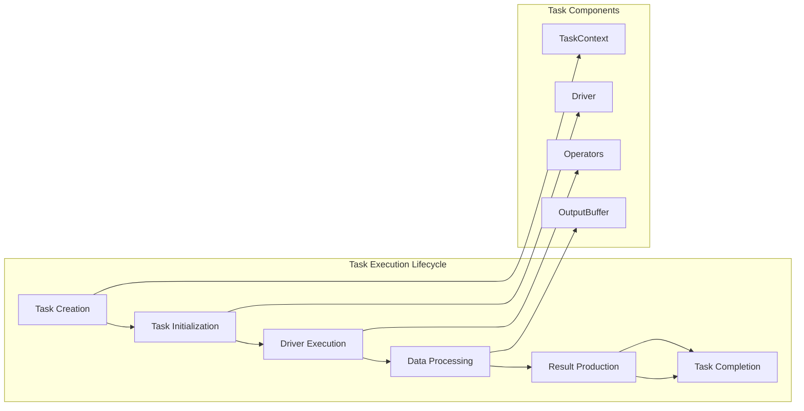
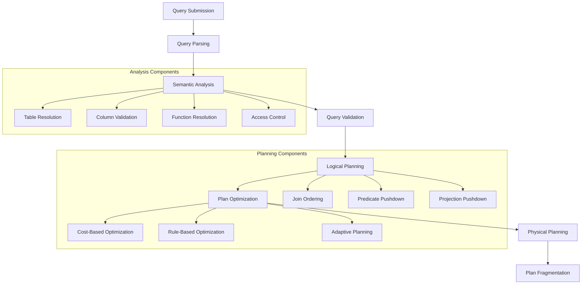
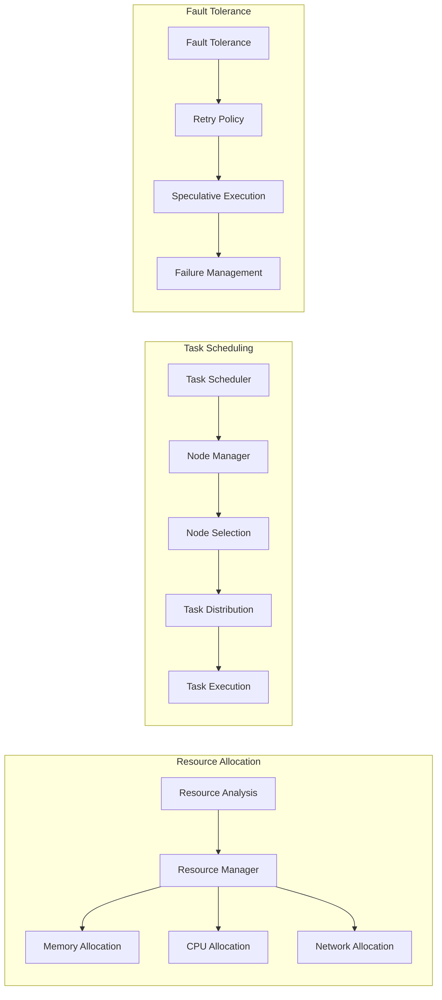
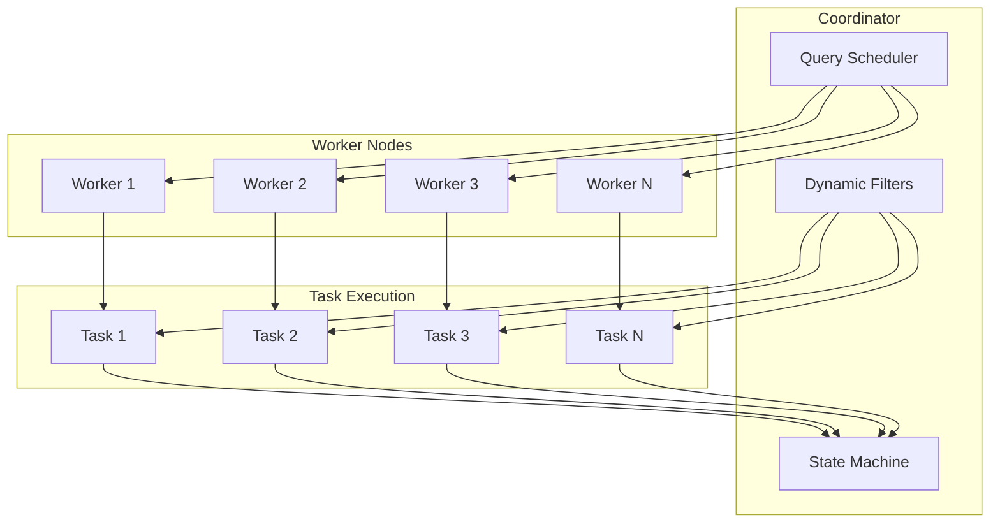
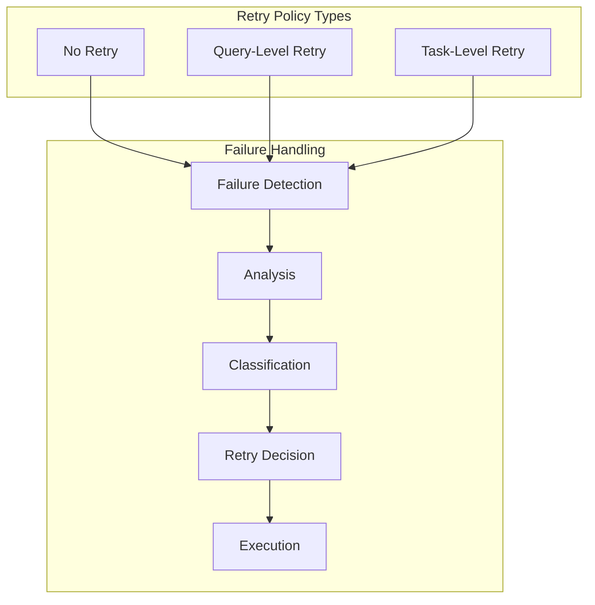
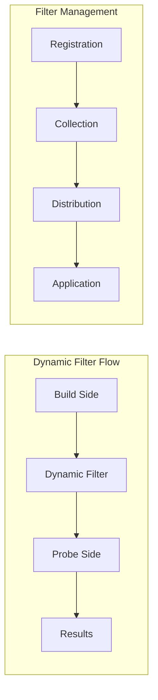

# Query Execution Management Module

## Introduction

The Query Execution Management module is the core orchestration layer of Trino's distributed query execution engine. It manages the complete lifecycle of SQL query execution, from initial planning through distributed execution to final completion. This module coordinates between the SQL analyzer, planner, scheduler, and execution components to ensure efficient and reliable query processing across the Trino cluster.

## Architecture Overview

The Query Execution Management module serves as the central coordination point for all query execution activities in Trino. It integrates multiple subsystems including query planning, resource management, task scheduling, and fault tolerance mechanisms to provide a robust distributed SQL execution environment.

## Core Components

### SqlQueryExecution

The `SqlQueryExecution` class is the primary implementation of the `QueryExecution` interface. It orchestrates the entire query execution lifecycle, managing transitions between different execution phases and coordinating with various subsystems.

**Key Responsibilities:**
- Query analysis and validation using the SQL analyzer
- Query planning and optimization through the logical planner
- Distributed plan fragmentation and scheduling
- Resource allocation and memory management
- Dynamic filter management for query optimization
- Fault tolerance and retry handling
- Query state management and progress tracking

**Execution Flow:**

### SqlQueryExecutionFactory

The factory class responsible for creating `SqlQueryExecution` instances. It encapsulates the dependency injection configuration and provides a standardized way to instantiate query execution objects with all required dependencies.

**Dependencies Managed:**
- Planner context and analyzer factory
- Node scheduling and partitioning managers
- Plan optimizers and fragmenters
- Remote task factory and execution policies
- Statistics and cost calculators
- Dynamic filter service and memory managers

### StageExecution

Manages the execution of individual query stages within the distributed execution plan. Each stage represents a portion of the query that can be executed in parallel across multiple worker nodes.

**Key Functions:**
- Stage state management and lifecycle tracking
- Task coordination within the stage
- Data shuffling and exchange management
- Stage-level resource allocation
- Progress monitoring and statistics collection

### SqlTaskExecution & SqlTaskExecutionFactory

Handles the execution of individual tasks within query stages. Tasks are the fundamental units of work that execute on worker nodes, processing data and producing results.

**Task Execution Model:**

### TaskStatus

Provides comprehensive status information for individual tasks, including execution state, resource usage, performance metrics, and failure information.

**Status Information:**
- Task state and version tracking
- Memory reservation and peak usage
- Driver execution statistics
- Output data size and buffer status
- Garbage collection metrics
- Dynamic filter version tracking
- Failure information and error details

## Query Execution Lifecycle

### Phase 1: Query Analysis and Planning

The query execution begins with comprehensive analysis and planning:

### Phase 2: Resource Allocation and Scheduling

Once the plan is finalized, the system allocates resources and schedules execution:

### Phase 3: Distributed Execution

The actual distributed execution involves coordinated task execution across worker nodes:

## Integration with Other Modules

### SQL Analyzer, Planner & Optimizer

The Query Execution Management module heavily depends on the [SQL Analyzer, Planner & Optimizer](SQL%20Analyzer%2C%20Planner%20%26%20Optimizer.md) module for query processing:

- **Analysis Integration**: Uses `Analyzer` and `StatementAnalyzer.Visitor` for semantic analysis
- **Planning Integration**: Leverages `LogicalPlanner` and `QueryPlanner.PlanAndMappings` for plan generation
- **Optimization Integration**: Applies `PlanOptimizer` rules through `IterativeOptimizer.Context`
- **Statistics Integration**: Uses `StatsCalculator` and `PlanNodeStatsEstimate.Builder` for cost-based optimization

### Operator Framework

Integrates with the [Operator Framework](Operator%20Framework.md) for task execution:

- **Operator Execution**: Manages `Operator.Operator` instances within tasks
- **Driver Coordination**: Controls `Driver.Driver` execution lifecycle
- **Blocked Task Monitoring**: Uses `DriverContext.BlockedMonitor` for handling blocked operations

### Memory Management

Coordinates with the [Memory Management](Memory%20Management.md) subsystem:

- **Query Context**: Manages `QueryContext.QueryContext` for query-level resource allocation
- **Spilling Support**: Integrates with `SpillerFactory.SpillerFactory` for memory-intensive operations
- **Memory Tracking**: Monitors memory usage through `TaskStatus` memory reservation metrics

### Join Operations

Leverages specialized join operators for efficient distributed joins:

- **Hash Joins**: Uses `HashBuilderOperator.HashBuilderOperatorFactory` for hash table construction
- **Lookup Joins**: Employs `LookupJoinOperatorFactory.LookupJoinOperatorFactory` for probe operations
- **Distributed Coordination**: Manages join execution across multiple worker nodes

## Fault Tolerance and Retry Mechanisms

### Retry Policies

The module supports multiple retry policies for handling failures:

### Speculative Execution

Implements speculative execution for handling slow tasks:

- **Backup Task Launching**: Launches backup tasks for slow-running operations
- **Resource Management**: Manages additional resource allocation for speculative tasks
- **Result Deduplication**: Ensures only one result is used when multiple tasks complete

### Failure Recovery

Comprehensive failure recovery mechanisms:

- **Task Failure Handling**: Manages individual task failures through `failTask()` method
- **Stage Failure Recovery**: Handles stage-level failures with appropriate retry logic
- **Query Failure Management**: Transitions query to failed state with detailed error information

## Performance Optimization Features

### Dynamic Filtering

Implements dynamic filtering for join optimization:

### Adaptive Planning

Supports adaptive query planning for dynamic optimization:

- **Runtime Statistics Collection**: Gathers execution statistics during query runtime
- **Plan Adaptation**: Adjusts execution plan based on observed data characteristics
- **Cost Model Updates**: Updates cost estimates based on actual execution data

### Exchange Optimization

Optimizes data exchange between stages:

- **Exchange Manager**: Uses `ExchangeManagerRegistry` for efficient data shuffling
- **Partitioning Strategies**: Implements various data partitioning algorithms
- **Network Optimization**: Minimizes network traffic through intelligent data placement

## Monitoring and Observability

### Query State Management

Comprehensive query state tracking through `QueryStateMachine`:

- **State Transitions**: Monitors all query state changes with timestamps
- **Progress Tracking**: Tracks execution progress across all stages and tasks
- **Resource Monitoring**: Monitors memory, CPU, and network resource usage
- **Performance Metrics**: Collects detailed performance statistics

### Task Status Reporting

Detailed task status information through `TaskStatus`:

- **Execution Metrics**: Tracks task execution time, CPU usage, and throughput
- **Memory Statistics**: Monitors memory allocation and peak usage
- **Failure Information**: Captures detailed failure information and stack traces
- **Dynamic Filter Updates**: Tracks dynamic filter version and application status

### Distributed Tracing

Integration with distributed tracing for end-to-end visibility:

- **Span Creation**: Creates spans for major execution phases
- **Context Propagation**: Propagates trace context across distributed components
- **Performance Analysis**: Enables detailed performance analysis and bottleneck identification

## Configuration and Tuning

### Execution Policies

Configurable execution policies for different workload types:

- **Policy Selection**: Supports multiple execution policies (e.g., phased, all-at-once)
- **Resource Allocation**: Configurable resource allocation strategies
- **Scheduling Behavior**: Customizable scheduling algorithms and priorities

### Memory Management

Configurable memory management parameters:

- **Query Memory Limits**: Per-query memory allocation limits
- **Task Memory Quotas**: Individual task memory constraints
- **Spilling Thresholds**: Memory thresholds for spilling to disk
- **GC Monitoring**: Garbage collection behavior monitoring and tuning

### Scheduling Parameters

Tunable scheduling parameters for optimal performance:

- **Split Batch Size**: Number of splits scheduled in each batch
- **Node Selection Strategy**: Algorithm for selecting worker nodes
- **Task Parallelism**: Degree of parallelism for task execution
- **Retry Configuration**: Retry attempt limits and backoff strategies

## Error Handling and Diagnostics

### Exception Management

Comprehensive exception handling throughout the execution pipeline:

- **Typed Exceptions**: Specific exception types for different failure categories
- **Error Propagation**: Proper error propagation across distributed components
- **Failure Context**: Rich context information for debugging failures
- **Recovery Actions**: Automated recovery actions where applicable

### Diagnostic Information

Detailed diagnostic information for troubleshooting:

- **Query Plans**: Access to logical and physical query plans
- **Execution Statistics**: Comprehensive execution statistics and metrics
- **Failure Details**: Detailed failure information with stack traces
- **Resource Usage**: Historical resource usage patterns

### Logging and Auditing

Structured logging and auditing capabilities:

- **Query Lifecycle Events**: Logging of major query lifecycle events
- **Performance Metrics**: Logging of key performance metrics
- **Error Events**: Structured error logging with context
- **Audit Trail**: Complete audit trail for compliance and analysis

This comprehensive approach to query execution management ensures that Trino can efficiently handle complex distributed SQL queries while providing robust fault tolerance, performance optimization, and operational visibility.