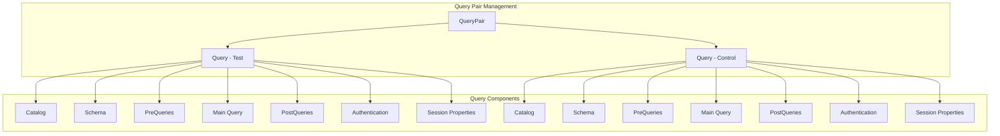
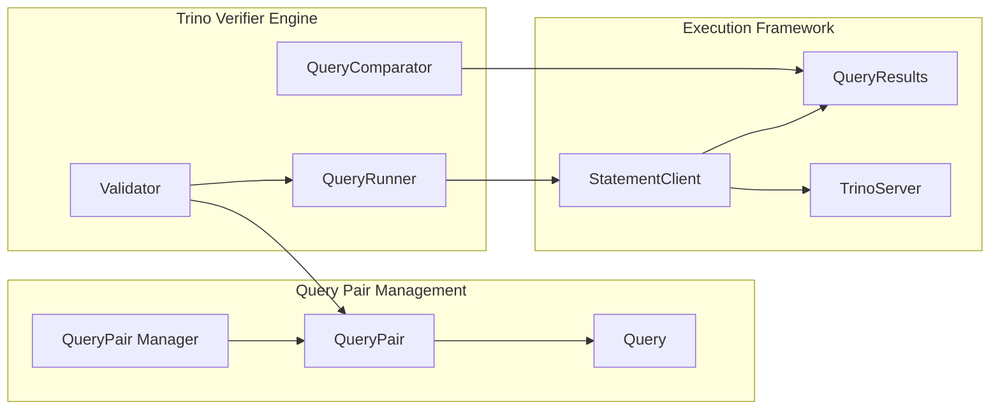
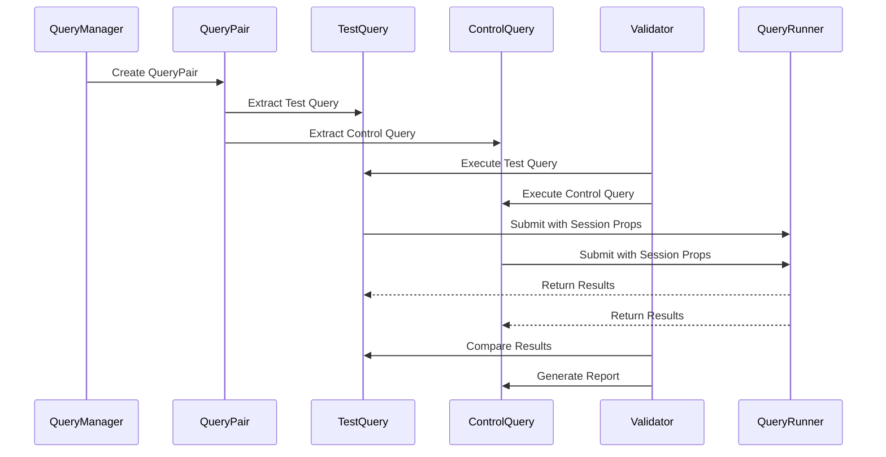

# Query Pair Management Module

## Introduction

The Query Pair Management module is a core component of the Trino Verifier system that handles the definition, organization, and management of query pairs used for validation testing. This module provides the fundamental data structures for comparing query execution results between test and control environments, enabling comprehensive validation of query correctness and performance.

## Overview

Query pairs represent the primary unit of work in the Trino Verifier system. Each query pair consists of two queries - a "test" query and a "control" query - that should produce equivalent results when executed against different Trino configurations, versions, or environments. The module provides a clean abstraction for managing these pairs along with their associated metadata, execution context, and configuration parameters.

## Core Components

### QueryPair Class

The `QueryPair` class is the central component that encapsulates a pair of queries for validation testing:

```java
public class QueryPair
{
    private final String suite;
    private final String name;
    private final Query test;
    private final Query control;
    
    // Constructor and getter methods
}
```

**Key Attributes:**
- **suite**: Logical grouping identifier for organizing related query pairs
- **name**: Unique identifier within the suite for the query pair
- **test**: The test query configuration to be validated
- **control**: The reference query configuration for comparison

### Query Class

The `Query` class represents individual query configurations with comprehensive execution context:

```java
public class Query
{
    private final String catalog;
    private final String schema;
    private final List<String> preQueries;
    private final String query;
    private final List<String> postQueries;
    private final String username;
    private final String password;
    private final Map<String, String> sessionProperties;
    
    // Constructor, getters, and utility methods
}
```

**Key Attributes:**
- **catalog**: Target catalog for query execution
- **schema**: Target schema within the catalog
- **preQueries**: Setup queries executed before the main query
- **query**: The main SQL query to execute
- **postQueries**: Cleanup queries executed after the main query
- **username**: Authentication username
- **password**: Authentication password
- **sessionProperties**: Session-level configuration parameters

## Architecture

### Component Relationships



### Integration with Trino Verifier System



## Data Flow

### Query Pair Processing Pipeline



## Key Features

### 1. Comprehensive Query Context
Each query within a pair carries complete execution context including catalog, schema, authentication credentials, and session properties, enabling testing across different environments and configurations.

### 2. Multi-Stage Query Execution
Support for pre-queries and post-queries allows for proper setup and cleanup operations, ensuring consistent testing environments and proper resource management.

### 3. SQL Normalization
The Query class includes built-in SQL normalization that standardizes whitespace and removes trailing semicolons, ensuring consistent query comparison regardless of formatting differences.

### 4. Immutable Data Structures
Both QueryPair and Query classes use immutable data structures, providing thread safety and preventing accidental modification during execution.

## Usage Patterns

### Basic Query Pair Creation
```java
Query testQuery = new Query(
    "test_catalog",
    "test_schema",
    Arrays.asList("SET SESSION optimize_hash_generation = true"),
    "SELECT count(*) FROM test_table",
    Arrays.asList(),
    "test_user",
    "test_password",
    ImmutableMap.of("optimize_hash_generation", "true")
);

Query controlQuery = new Query(
    "control_catalog",
    "control_schema",
    Arrays.asList("SET SESSION optimize_hash_generation = false"),
    "SELECT count(*) FROM control_table",
    Arrays.asList(),
    "control_user",
    "control_password",
    ImmutableMap.of("optimize_hash_generation", "false")
);

QueryPair pair = new QueryPair("performance_test", "count_optimization", testQuery, controlQuery);
```

### Suite-Based Organization
Query pairs are organized into suites for logical grouping and batch processing:
- **Performance Suites**: Compare query execution times
- **Correctness Suites**: Validate result accuracy
- **Regression Suites**: Detect functional changes
- **Compatibility Suites**: Test across different versions

## Integration Points

### Trino Verifier Engine
The Query Pair Management module integrates with the broader Trino Verifier system through:

- **[Validator](Trino Verifier.md)**: Uses QueryPair instances for execution and comparison
- **[QueryRunner](Trino Testing Framework.md)**: Executes individual Query objects
- **[StatementClient](Trino Client Library.md)**: Handles communication with Trino servers

### Configuration Management
Query pairs support extensive configuration through session properties, enabling testing of:
- Feature flags and experimental optimizations
- Memory and resource limits
- Query planning strategies
- Execution engine settings

## Error Handling

The module provides robust error handling for:
- **Invalid Query Syntax**: SQL normalization prevents formatting issues
- **Authentication Failures**: Proper credential validation
- **Missing Catalogs/Schemas**: Early validation of execution context
- **Session Property Conflicts**: Resolution of incompatible settings

## Performance Considerations

### Memory Efficiency
- Immutable data structures reduce memory overhead
- Lazy initialization of query execution components
- Efficient string handling for SQL normalization

### Scalability
- Lightweight objects suitable for large test suites
- Support for parallel query pair execution
- Minimal overhead for query comparison operations

## Security Features

### Credential Management
- Secure handling of authentication credentials
- Support for different authentication mechanisms per query
- Isolation of test and control environments

### Session Isolation
- Independent session properties for test and control queries
- Prevention of cross-environment contamination
- Secure property transmission to Trino servers

## Testing and Validation

The Query Pair Management module includes comprehensive testing for:
- SQL normalization edge cases
- Session property validation
- Authentication mechanism compatibility
- Multi-environment execution scenarios

## Future Enhancements

Potential improvements to the module include:
- **Parameterized Queries**: Support for dynamic query generation
- **Template-Based Configuration**: Reusable query templates
- **Advanced Scheduling**: Time-based and dependency-driven execution
- **Metrics Collection**: Enhanced performance and correctness metrics
- **Integration APIs**: RESTful interfaces for external tool integration

## Related Documentation

- [Trino Verifier](Trino Verifier.md) - Complete verification system overview
- [Trino Testing Framework](Trino Testing Framework.md) - Testing infrastructure
- [Trino Client Library](Trino Client Library.md) - Client communication layer
- [SQL Parser & AST](SQL Parser & AST.md) - Query parsing and analysis
- [Query Execution Engine](Query Execution Engine.md) - Query execution infrastructure