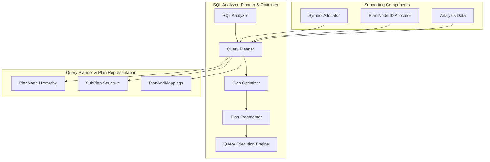
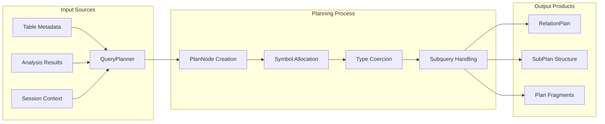

# Query Planner & Plan Representation Module

## Overview

The Query Planner & Plan Representation module is a core component of Trino's SQL execution engine, responsible for transforming analyzed SQL queries into executable query plans. This module bridges the gap between the SQL Analyzer and the Query Execution Engine, converting abstract syntax trees (AST) and semantic analysis into concrete execution plans that can be distributed and executed across the Trino cluster.

## Purpose and Core Functionality

The primary responsibilities of this module include:

1. **Query Plan Generation**: Transforming analyzed SQL queries into logical execution plans
2. **Plan Representation**: Providing a hierarchical, tree-based structure to represent query execution plans
3. **Plan Optimization Integration**: Serving as the foundation for query optimization techniques
4. **Plan Fragmentation**: Supporting the division of plans into distributable fragments
5. **Plan Serialization**: Enabling plan serialization for distributed execution

## Architecture Overview

## Core Components

### 1. Query Planning Engine

The Query Planning Engine is the main orchestration component that transforms analyzed SQL queries into executable plans. It handles the complete spectrum of SQL operations with sophisticated features for complex query scenarios.

**Key Capabilities:**
- **SELECT Query Planning**: Complex expressions, aggregations, window functions, and recursive queries
- **DML Operation Planning**: DELETE, UPDATE, and MERGE operations with constraint validation
- **Expression Management**: Type coercion, subquery handling, and symbol allocation
- **Advanced Features**: Window functions with frame bounds, pattern recognition, and grouping sets

For detailed information, see [Query Planning Engine](Query%20Planning%20Engine.md).

### 2. Plan Representation Framework

The Plan Representation Framework provides the foundational tree structure for representing query execution plans. It offers a hierarchical, type-safe model that supports plan serialization, traversal, and transformation.

**Core Features:**
- **Hierarchical Structure**: Tree-based representation of query execution steps
- **Type Safety**: JSON-annotated serialization with strong typing
- **Extensibility**: Visitor pattern for plan analysis and transformation
- **Symbol Management**: Comprehensive data flow tracking through symbols

For detailed information, see [Plan Representation Framework](Plan%20Representation%20Framework.md).

### 3. Plan Fragmentation

The Plan Fragmentation component manages the division of query plans into distributable fragments that can be executed independently across the Trino cluster.

**Key Functions:**
- **Fragment Creation**: Dividing plans into executable units
- **Dependency Management**: Tracking fragment relationships and data flow
- **Validation**: Ensuring fragment consistency and correctness
- **Distribution Support**: Preparing fragments for cluster-wide execution

For detailed information, see [Plan Fragmentation](Plan%20Fragmentation.md)

## Plan Node Types

The module supports a comprehensive set of plan node types, each representing a specific operation in the query execution pipeline:

### Data Access Nodes
- **TableScanNode**: Reading data from tables
- **IndexSourceNode**: Index-based data access
- **ValuesNode**: In-memory value generation

### Transformation Nodes
- **ProjectNode**: Column projection and expression evaluation
- **FilterNode**: Row filtering based on predicates
- **AggregationNode**: Grouping and aggregation operations
- **WindowNode**: Window function computation

### Data Organization Nodes
- **SortNode**: Result ordering
- **LimitNode**: Result limiting
- **TopNNode**: Combined sorting and limiting
- **UnionNode**: Set union operations

### Join and Relationship Nodes
- **JoinNode**: Table joining operations
- **SemiJoinNode**: Semi-join operations
- **CorrelatedJoinNode**: Correlated subquery joins

### Advanced Operation Nodes
- **MergeWriterNode**: MERGE statement execution
- **PatternRecognitionNode**: Complex pattern matching
- **TableWriterNode**: Data modification operations

## Data Flow and Dependencies

## Integration with Other Modules

### SQL Analyzer Integration
The Query Planner receives analyzed query information from the [SQL Analyzer](SQL%20Analyzer.md) module, including:
- Resolved table and column references
- Type information and coercion requirements
- Subquery analysis results
- Window function specifications

### Plan Optimizer Integration
The generated plans serve as input to the [Plan Optimizer](Plan%20Optimizer.md) module, which:
- Applies transformation rules to improve plan efficiency
- Pushes down predicates and projections
- Reorders joins for optimal performance
- Estimates costs and statistics

### Query Execution Integration
The final plans are consumed by the [Query Execution Engine](Query%20Execution%20Engine.md), which:
- Distributes plan fragments to worker nodes
- Orchestrates parallel execution
- Manages data shuffling and coordination
- Handles fault tolerance and recovery

## Key Design Patterns

### 1. Builder Pattern
The module extensively uses builder patterns for constructing complex plan nodes, ensuring:
- Immutable plan structures
- Type-safe construction
- Optional parameter handling

### 2. Visitor Pattern
Plan traversal and transformation use the visitor pattern, enabling:
- Extensible plan analysis
- Rule-based optimization
- Plan serialization and debugging

### 3. Symbol Management
Comprehensive symbol tracking ensures:
- Correct data flow representation
- Type safety throughout the plan
- Efficient memory usage

## Performance Considerations

### Plan Complexity Management
- **Subquery Flattening**: Converting correlated subqueries to joins where possible
- **Predicate Pushdown**: Moving filters closer to data sources
- **Projection Pruning**: Eliminating unnecessary column projections

### Memory Efficiency
- **Symbol Reuse**: Minimizing symbol allocation overhead
- **Plan Sharing**: Reusing common sub-plans
- **Lazy Evaluation**: Deferring expensive operations when possible

### Distributed Execution Support
- **Partitioning Awareness**: Understanding data distribution requirements
- **Exchange Node Placement**: Optimizing data shuffling operations
- **Parallelism Optimization**: Maximizing concurrent execution opportunities

## Error Handling and Validation

The module implements comprehensive error handling for:
- **Type Mismatches**: Invalid type coercions and conversions
- **Schema Validation**: Table and column existence verification
- **Constraint Violations**: Check constraint and NOT NULL violations
- **Resource Limits**: Recursion depth and complexity limits

## Future Enhancements

Potential areas for improvement include:
- **Adaptive Query Planning**: Dynamic plan adjustment based on runtime statistics
- **Machine Learning Integration**: AI-driven plan optimization
- **Advanced Join Algorithms**: Support for emerging join techniques
- **Vectorized Execution Planning**: Optimized plans for vectorized operations

## Related Documentation

- [SQL Analyzer](SQL%20Analyzer.md) - Provides analyzed query input to the planner
- [Plan Optimizer](Plan%20Optimizer.md) - Consumes generated plans for optimization
- [Query Execution Engine](Query%20Execution%20Engine.md) - Executes the final optimized plans
- [SQL Intermediate Representation](SQL%20Intermediate%20Representation.md) - Expression representation used in plans