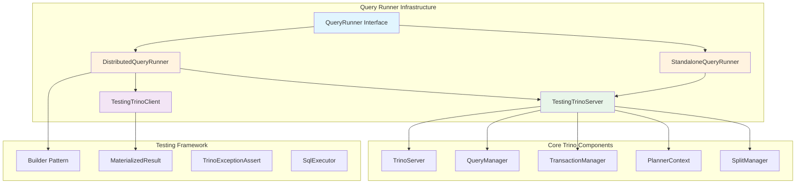
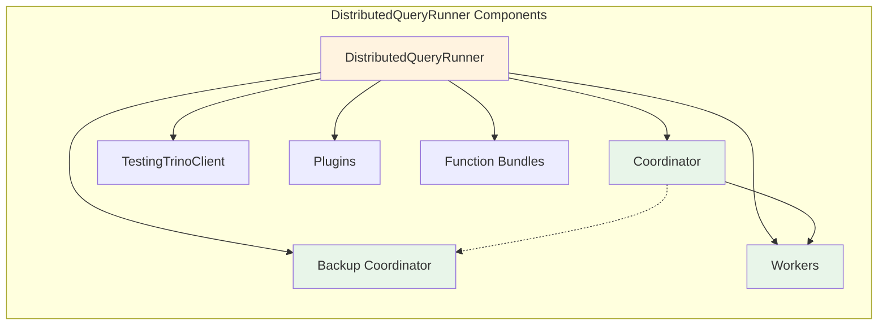
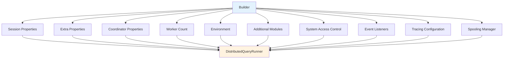
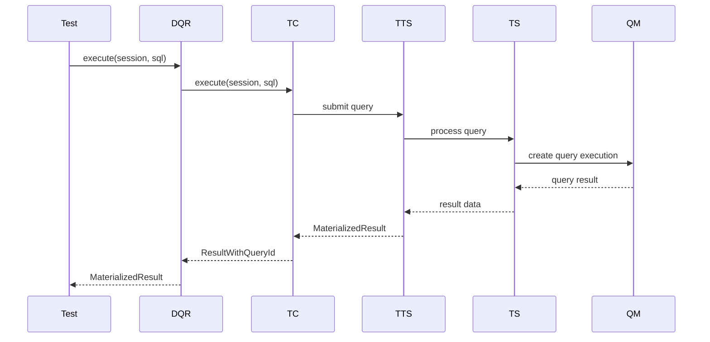

# Query Runner Infrastructure

## Introduction

The Query Runner Infrastructure module provides the foundational testing framework for Trino, enabling comprehensive testing of SQL queries, connector functionality, and distributed query execution. This module is essential for validating Trino's correctness, performance, and reliability across different deployment scenarios.

The infrastructure supports both standalone and distributed testing environments, allowing developers to test everything from simple SQL queries to complex distributed operations with multiple workers, coordinators, and backup coordinators.

## Architecture Overview

The Query Runner Infrastructure is built around several key architectural components that work together to provide a comprehensive testing environment:



## Core Components

### QueryRunner Interface
The `QueryRunner` interface defines the contract for all query execution implementations, providing a unified API for:
- SQL query execution and result retrieval
- Session management and configuration
- Transaction handling
- Plan creation and analysis
- Resource management and cleanup

### DistributedQueryRunner
The `DistributedQueryRunner` is the primary implementation supporting distributed testing scenarios:



#### Key Features:
- **Multi-node Testing**: Supports coordinator, backup coordinator, and multiple worker nodes
- **Dynamic Scaling**: Ability to add/remove workers during testing
- **Plugin Management**: Install and manage plugins across all nodes
- **Function Management**: Add custom function bundles
- **Catalog Management**: Create and configure catalogs
- **Failure Injection**: Simulate node failures and network issues
- **Tracing Support**: OpenTelemetry integration for performance analysis

### Builder Pattern Implementation
The `DistributedQueryRunner.Builder` provides a fluent interface for configuration:



### TestingTrinoServer
The `TestingTrinoServer` wraps the production `TrinoServer` with testing-specific functionality:

- **Resource Management**: Automatic cleanup and lifecycle management
- **Configuration Override**: Test-specific configuration properties
- **Plugin Installation**: Dynamic plugin loading
- **Failure Simulation**: Task failure injection capabilities
- **Metrics Collection**: Performance and tracing data collection

## Data Flow Architecture



## Key Capabilities

### 1. Distributed Testing
- Multi-node cluster simulation
- Coordinator and worker node management
- Backup coordinator support for high availability testing
- Dynamic node addition/removal
- Worker restart simulation

### 2. Configuration Management
- Session property configuration
- System property overrides
- Coordinator-specific settings
- Worker-specific settings
- Environment-specific configurations

### 3. Plugin and Function Management
- Dynamic plugin installation
- Function bundle management
- Catalog creation and configuration
- Connector-specific testing

### 4. Query Execution and Analysis
- SQL query execution with result validation
- Plan creation and analysis
- Query ID tracking
- Performance metrics collection
- Concurrent query management

### 5. Failure Testing
- Task failure injection
- Node failure simulation
- Network partition testing
- Error type specification

### 6. Observability and Tracing
- OpenTelemetry integration
- Distributed tracing support
- Query completion events
- Performance metrics collection
- Span data export

## Integration with Other Modules

### SQL Parser & AST Integration
The Query Runner Infrastructure integrates with the [SQL Parser & AST](SQL Parser & AST.md) module for:
- SQL parsing and validation
- AST node analysis
- Query formatting and utilities

### SQL Analyzer, Planner & Optimizer Integration
Integration with [SQL Analyzer, Planner & Optimizer](SQL Analyzer, Planner & Optimizer.md) provides:
- Query analysis and validation
- Plan creation and optimization
- Statistics calculation
- Cost-based optimization testing

### Query Execution Engine Integration
The infrastructure leverages the [Query Execution Engine](Query Execution Engine.md) for:
- Query execution management
- Stage and task coordination
- Operator framework utilization
- Memory management testing

### Metadata & Connector Abstraction Integration
Integration with [Metadata & Connector Abstraction](Metadata & Connector Abstraction.md) enables:
- Catalog management
- Connector testing
- Function management
- Type system integration

## Testing Patterns and Best Practices

### 1. Basic Query Testing
```java
@Test
public void testSimpleQuery()
{
    try (QueryRunner runner = DistributedQueryRunner.builder(session).build()) {
        MaterializedResult result = runner.execute("SELECT 1");
        assertThat(result.getRowCount()).isEqualTo(1);
    }
}
```

### 2. Connector Testing
```java
@Test
public void testConnector()
{
    try (QueryRunner runner = DistributedQueryRunner.builder(session).build()) {
        runner.createCatalog("test", "test-connector", ImmutableMap.of());
        MaterializedResult result = runner.execute("SELECT * FROM test.schema.table");
        // Validate results
    }
}
```

### 3. Distributed Testing
```java
@Test
public void testDistributedQuery()
{
    try (QueryRunner runner = DistributedQueryRunner.builder(session)
            .setWorkerCount(3)
            .build()) {
        // Test distributed operations
        MaterializedResult result = runner.execute("SELECT count(*) FROM large_table");
        // Validate distributed execution
    }
}
```

### 4. Failure Testing
```java
@Test
public void testFailureHandling()
{
    try (QueryRunner runner = DistributedQueryRunner.builder(session).build()) {
        // Inject failure
        runner.injectTaskFailure("token", stageId, partitionId, attemptId, 
                                 InjectedFailureType.TASK_FAILURE, Optional.empty());
        // Test failure handling
    }
}
```

## Performance and Scalability Considerations

### Resource Management
- Automatic resource cleanup via Closer pattern
- Concurrent query limiting
- Memory usage optimization
- Connection pooling

### Test Isolation
- Independent test environments
- Clean state between tests
- Resource isolation
- Configuration isolation

### Scalability Features
- Support for large cluster testing
- Concurrent query execution
- Distributed coordination
- Efficient resource utilization

## Configuration Reference

### Essential Properties
```properties
# Query timeout
query.client.timeout=10m

# Thread configuration for testing
exchange.http-client.min-threads=1
exchange.page-buffer-client.max-callback-threads=5

# Memory management
task.max-index-memory=16kB

# Coordinator settings
node-scheduler.include-coordinator=true
join-distribution-type=PARTITIONED
```

### Testing-Specific Properties
```properties
# Web UI authentication for parallel testing
web-ui.authentication.type=fixed
web-ui.user=admin

# Tracing configuration
tracing.enabled=true
tracing.exporter.endpoint=http://localhost:4317
```

## Troubleshooting and Debugging

### Common Issues
1. **Resource Leaks**: Ensure proper cleanup using try-with-resources
2. **Concurrent Access**: Use appropriate locking mechanisms
3. **Configuration Conflicts**: Verify property precedence
4. **Plugin Loading**: Check plugin compatibility and dependencies

### Debugging Tools
- Query plan analysis
- Performance metrics collection
- Distributed tracing
- Log analysis
- Resource monitoring

## Future Enhancements

### Planned Improvements
- Enhanced failure simulation capabilities
- Improved performance profiling
- Better integration with CI/CD pipelines
- Advanced query optimization testing
- Enhanced security testing features

### Extension Points
- Custom testing client implementations
- Plugin-specific test frameworks
- Custom failure injection strategies
- Advanced tracing and monitoring integration

The Query Runner Infrastructure module serves as the backbone for Trino's testing ecosystem, providing a robust, scalable, and flexible framework for validating the system's functionality across various deployment scenarios and use cases.