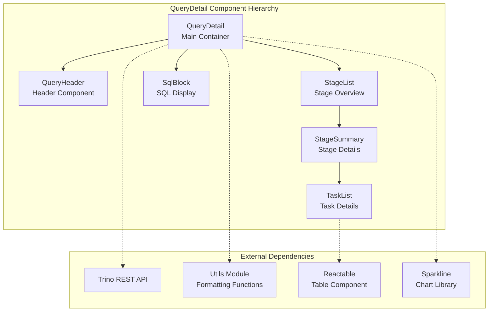
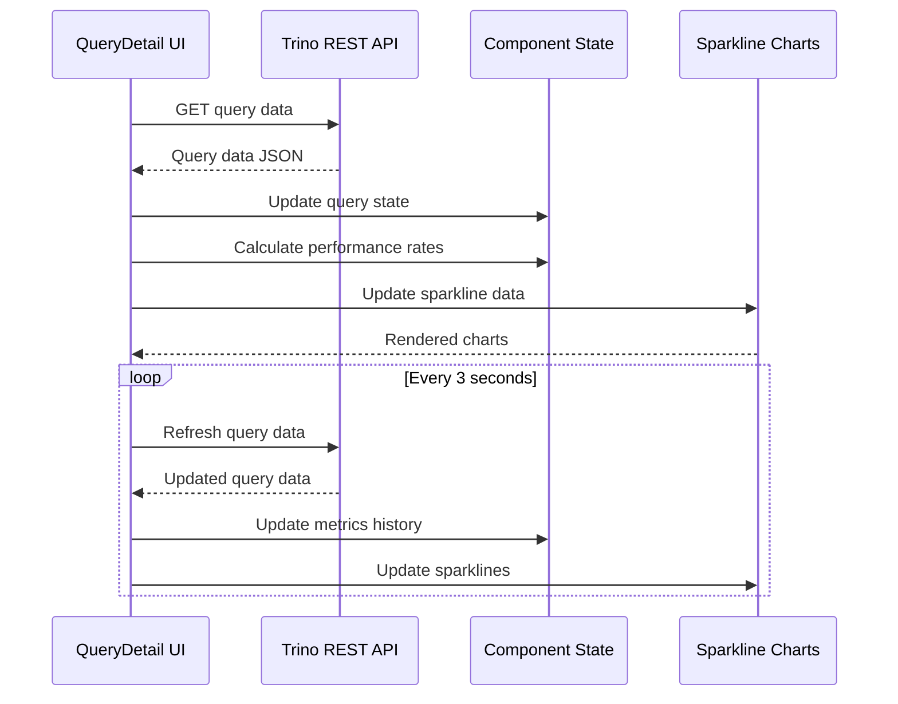
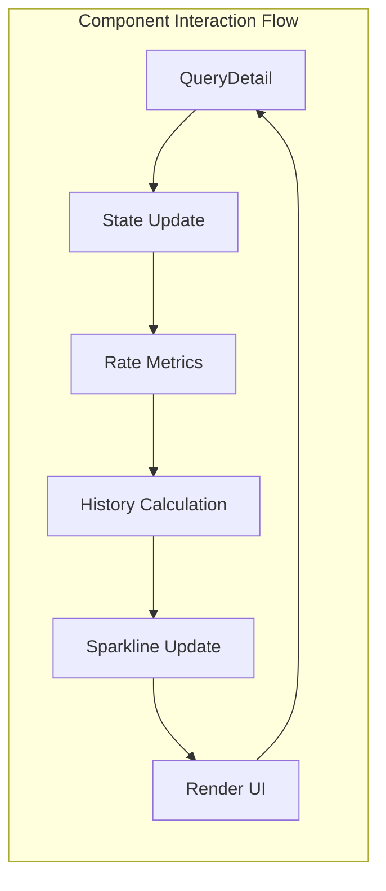
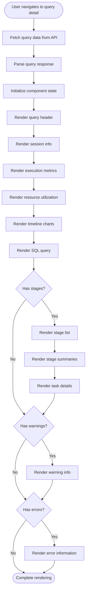

# QueryDetail Module Documentation

## Introduction

The QueryDetail module is a React-based web component that provides comprehensive visualization and monitoring of individual Trino query execution details. It serves as the primary interface for users to inspect query performance metrics, execution stages, task-level statistics, and resource utilization in real-time. This module is part of the Trino Web UI and offers deep insights into query execution patterns, bottlenecks, and performance characteristics.

## Architecture Overview

The QueryDetail module follows a component-based architecture with three main React components that work together to provide a hierarchical view of query execution:

## Core Components

### QueryDetail Component

The main container component that orchestrates the entire query detail view. It manages the query state, handles real-time data refresh, and coordinates the rendering of all sub-components.

**Key Responsibilities:**
- Query data fetching and state management
- Real-time refresh loop with 3-second intervals
- Performance metrics calculation and history tracking
- Sparkline chart data preparation
- Error handling and loading states

**State Management:**
- `query`: Current query data from API
- `lastSnapshotStages`/`lastSnapshotTasks`: Cached stage/task data
- Performance rate tracking arrays (CPU, memory, I/O)
- Refresh control flags (`stageRefresh`, `taskRefresh`)
- UI state flags (`initialized`, `queryEnded`, `renderingEnded`)

### StageSummary Component

Provides detailed visualization of individual query stages with expandable charts and task filtering capabilities.

**Key Features:**
- Stage performance metrics display
- Histogram generation for time distribution analysis
- Expandable bar charts for task-level time analysis
- Task filtering by state (All, Planned, Running, Finished, Failed)
- Real-time chart updates using Sparkline.js

### TaskList Component

Renders a sortable table of tasks within a stage, providing granular execution details.

**Capabilities:**
- Task ID parsing and formatting
- Host and port display with conflict resolution
- State formatting (including blocked state detection)
- Performance metrics calculation (rates, throughput)
- Sortable columns with custom comparison functions

## Data Flow Architecture

## Key Features

### Real-time Performance Monitoring

The module provides continuous monitoring of query execution with automatic refresh every 3 seconds. It tracks and visualizes:

- **CPU Time Rates**: Real-time CPU utilization across tasks
- **Memory Utilization**: Peak and current memory usage
- **I/O Throughput**: Input/output data rates
- **Physical Read Rates**: Storage system performance
- **Scheduled Time**: Task scheduling efficiency

### Advanced Visualization

**Sparkline Charts**: Miniature trend charts showing performance metrics over time
**Histograms**: Distribution analysis for scheduled and CPU time across tasks
**Bar Charts**: Detailed task-level time analysis in expandable sections
**Color-coded States**: Visual indicators for task and stage states

### Comprehensive Metrics Display

**Resource Utilization Summary:**
- CPU time (total and failed)
- Memory reservations (peak, current, cumulative)
- I/O statistics (rows, bytes, physical reads)
- Network data transfer metrics
- Spilled data tracking

**Execution Timeline:**
- Submission and completion times
- Elapsed, queued, analysis, planning, and execution times
- Parallelism visualization
- Real-time rate calculations

### Task-level Analysis

**Task Filtering:**
- All tasks view
- State-based filtering (Planned, Running, Finished, Failed)
- Performance metrics per task
- Host and port information
- Buffer and memory utilization

## Integration Points

### REST API Integration

The module integrates with Trino's REST API through the endpoint:
- **Endpoint**: `/ui/api/query/{queryId}`
- **Response Format**: JSON with comprehensive query metadata
- **Refresh Interval**: 3 seconds (configurable through task.info-update-interval)

### Utility Functions Dependency

Leverages a comprehensive utility module for:
- Data formatting (counts, sizes, durations)
- Rate calculations
- Date/time formatting
- Host/port parsing
- Data size parsing and formatting

### External Libraries

**Reactable**: Provides sortable table functionality
**Sparkline**: Renders miniature charts for trend visualization
**ClipboardJS**: Enables copy-to-clipboard functionality
**jQuery**: Used for DOM manipulation and AJAX requests

## Performance Considerations

### Optimization Strategies

**Rendering Throttling**: Prevents excessive chart updates by limiting renders to once per second
**State Caching**: Maintains snapshots of stages and tasks to reduce unnecessary re-renders
**Conditional Updates**: Only updates charts when query is actively running
**Memory Management**: Clears timeouts and intervals on component unmount

### Data Processing

**Rate Calculations**: Computes performance rates based on time elapsed between refreshes
**History Management**: Maintains rolling history for sparkline charts
**Data Parsing**: Efficiently parses duration and data size strings
**Sorting Algorithms**: Custom task ID comparison for proper numerical sorting

## Error Handling

### Failure Scenarios

**Query Not Found**: Displays appropriate error message when query ID is invalid
**API Failures**: Gracefully handles network failures and API errors
**Data Parsing**: Robust parsing of potentially malformed response data
**Component Errors**: Proper error boundaries and fallback rendering

### Stack Trace Processing

The module includes sophisticated stack trace formatting capabilities:
- Hierarchical error information display
- Shared stack frame detection and collapsing
- Suppressed exception handling
- Cause chain traversal

## User Experience Features

### Interactive Elements

**Expandable Sections**: Collapsible stage details with chart expansion
**Copy Functionality**: One-click copying of SQL queries and stack traces
**Tooltips**: Contextual help for metrics and icons
**Sorting**: Clickable column headers for table sorting
**Filtering**: Dropdown menus for task state filtering

### Visual Design

**Color Coding**: State-based color indicators
**Responsive Layout**: Adapts to different screen sizes
**Loading States**: Progress indicators during data fetching
**Empty States**: Appropriate messaging for missing data

## Dependencies

### Internal Modules

- **[Utils](utils.md)**: Formatting and utility functions
- **[QueryHeader](QueryHeader.md)**: Query header component
- **[SqlBlock](SqlBlock.md)**: SQL syntax highlighting

### External Dependencies

- **React**: Component framework
- **Reactable**: Table component library
- **Sparkline**: Chart rendering library
- **jQuery**: DOM manipulation and AJAX
- **ClipboardJS**: Copy functionality

## Configuration

### Refresh Behavior

The module's refresh behavior is controlled by:
- **Auto-refresh toggle**: User-controlled stage refresh
- **Task refresh**: Independent task data refresh control
- **Query completion detection**: Automatic refresh termination

### Display Options

**Port Number Display**: Automatically detects and displays port numbers when multiple instances run on the same host
**Task Retry Support**: Conditional display of retry-related metrics
**Memory Metrics**: Conditional display of revocable memory when applicable
**Spill Metrics**: Conditional display of spilled data when present

This comprehensive module provides Trino users with powerful tools for query performance analysis and optimization, making it an essential component of the Trino Web UI ecosystem.

## Process Flow

