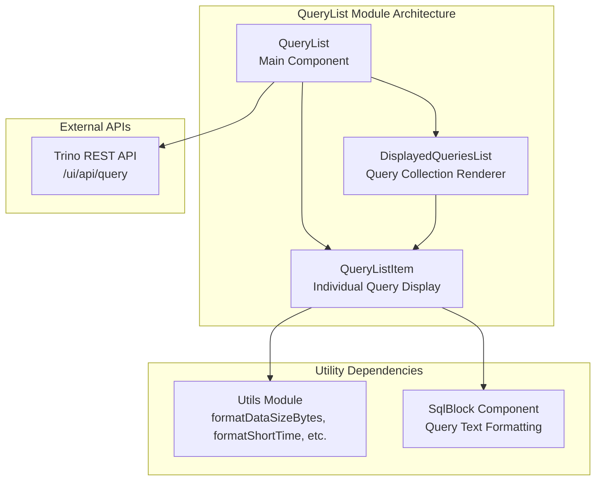
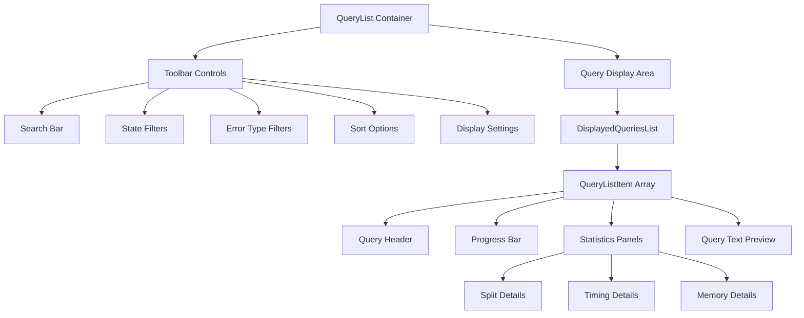
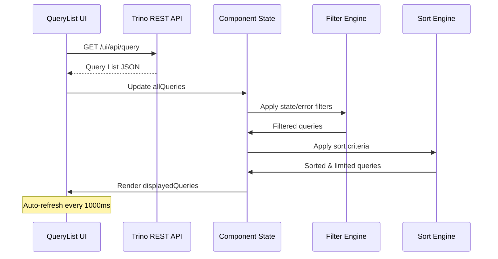
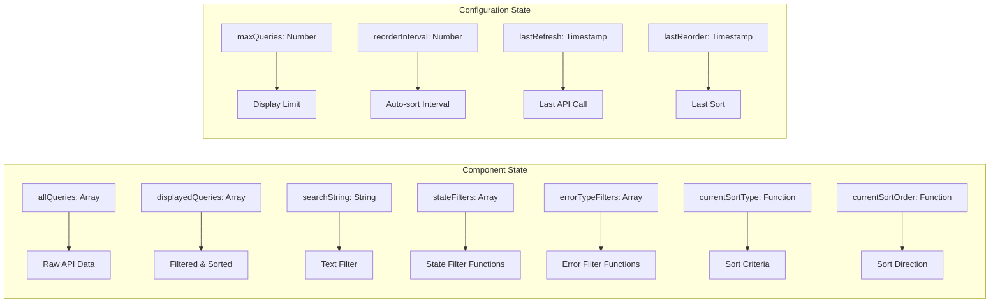
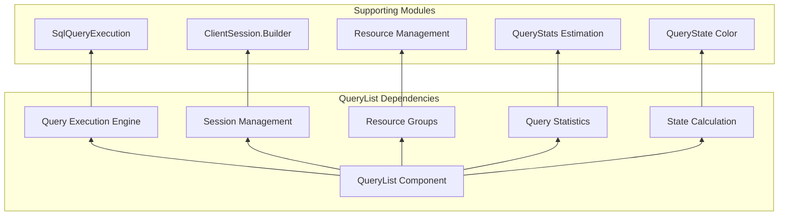

# QueryList Module Documentation

## Overview

The QueryList module is a React-based component within the Trino Web UI that provides real-time monitoring and management of SQL queries executing across the Trino cluster. It serves as the primary interface for administrators and users to observe query performance, track execution status, and analyze resource utilization patterns.

## Purpose and Core Functionality

The QueryList component delivers a comprehensive query monitoring dashboard that enables users to:

- **Monitor Active Queries**: Real-time tracking of running, queued, and completed queries
- **Performance Analysis**: Detailed metrics including execution time, CPU usage, and memory consumption
- **Resource Management**: Visibility into split execution, memory reservations, and task failures
- **Query Filtering**: Advanced filtering capabilities based on query state, error types, and search criteria
- **Historical Analysis**: Access to completed queries for performance review and troubleshooting

## Architecture and Component Structure

### Core Components



### Component Hierarchy



## Data Flow and State Management

### Query Data Lifecycle



### State Management Architecture



## Key Features and Capabilities

### Real-time Query Monitoring

The QueryList implements a sophisticated polling mechanism that:

- **Automatic Refresh**: Queries the Trino API every 1000ms for real-time updates
- **Incremental Updates**: Efficiently merges new query data with existing state
- **Smart Reordering**: Periodically re-sorts queries based on configurable intervals (1s, 5s, 10s, 30s, or off)
- **State Preservation**: Maintains user preferences across refresh cycles

### Advanced Filtering System

#### State-based Filtering
```javascript
FILTER_TYPE = {
    RUNNING: queries in active execution
    QUEUED: queries awaiting execution
    FINISHED: completed queries
}
```

#### Error Type Filtering
```javascript
ERROR_TYPE = {
    USER_ERROR: user-generated SQL errors
    INTERNAL_ERROR: Trino internal failures
    INSUFFICIENT_RESOURCES: resource exhaustion
    EXTERNAL: external system errors
}
```

#### Search Functionality
The search system supports filtering by:
- Query ID
- User name
- Source application
- Query state
- Resource group
- Error codes
- Client tags
- Query text content

### Comprehensive Metrics Display

Each query item displays a rich set of performance metrics:

#### Execution Metrics
- **Wall Time**: Total elapsed time vs. execution time
- **CPU Time**: Processing time consumed
- **Progress**: Visual progress bar with state-based coloring

#### Resource Utilization
- **Memory**: Current, peak, and cumulative memory usage
- **Splits**: Completed, running, and queued task distribution
- **Task Failures**: Failed task count (for TASK retry policy)

#### Query Metadata
- **User Information**: Session user with principal indicators
- **Source Details**: Client application source
- **Resource Groups**: Hierarchical resource group assignment
- **Protocol**: Data encoding method (spooled vs. non-spooled)

## Integration with Trino Ecosystem

### REST API Integration

The QueryList module integrates with the Trino Web UI REST API:

```
GET /ui/api/query - Retrieves all active queries
GET /ui/api/query/{queryId}?pretty - Individual query details
```

### Navigation Integration

Each query provides direct navigation to:
- **Query Details**: `query.html?{queryId}`
- **Stage Performance**: `stage.html?{queryId}`
- **Query Plan**: `plan.html?{queryId}`
- **References**: `references.html?{queryId}`

### Dependencies on Trino Systems



## User Interface and Experience

### Responsive Design

The QueryList implements a responsive grid layout that:
- **Adaptive Columns**: 4-column metadata, 8-column query details on desktop
- **Mobile Optimization**: Stacked layout for smaller screens
- **Progressive Disclosure**: Collapsible sections for detailed information

### Visual Indicators

#### State-based Color Coding
- **Running**: Blue progress indicators
- **Finished**: Green success indicators  
- **Failed**: Red error indicators
- **Queued**: Yellow waiting indicators

#### Icon-based Information
- **User**: Person icon for session user
- **Source**: Login icon for client source
- **Memory**: Scale icon for memory usage
- **Time**: Hourglass icon for execution time
- **Splits**: Various icons for task states

### Interactive Elements

#### Tooltips and Help
All metrics include Bootstrap tooltips providing:
- **Metric Descriptions**: Clear explanations of each statistic
- **Unit Information**: Data size and time unit clarifications
- **Contextual Help**: Usage guidance for complex metrics

#### Action Links
Direct access to detailed analysis tools:
- **JSON Export**: Raw query data download
- **Performance Analysis**: Stage-level execution details
- **Query Plan**: Execution plan visualization
- **Reference Tracking**: Table and column dependencies

## Performance Considerations

### Client-side Optimization

#### Efficient Rendering
- **Virtual Scrolling**: Handles large query lists efficiently
- **Conditional Updates**: Only re-renders changed query items
- **Debounced Search**: 200ms delay on search input to reduce filtering overhead

#### Memory Management
- **Query Limiting**: Configurable maximum display limits (20, 50, 100, or all)
- **State Cleanup**: Proper cleanup of timers and event listeners
- **Data Pruning**: Automatic removal of old queries beyond display limits

### Server-side Considerations

#### API Efficiency
- **Incremental Updates**: Merges new data rather than full replacements
- **Filtered Requests**: Could be optimized with server-side filtering parameters
- **Caching Strategy**: Client-side caching of query metadata

## Error Handling and Resilience

### API Failure Handling

The QueryList implements robust error handling:

```javascript
// Graceful degradation on API failure
.fail(function () {
    this.setState({
        initialized: true,
    })
    this.resetTimer()
})
```

### Data Validation

- **Null Safety**: Handles missing query properties gracefully
- **Type Coercion**: Safely parses numeric and date values
- **Fallback Values**: Provides sensible defaults for missing data

## Configuration and Customization

### Display Options

#### Query Limits
- **20 Queries**: Minimal display for focused monitoring
- **50 Queries**: Balanced view for typical workloads
- **100 Queries**: Comprehensive view for busy clusters
- **All Queries**: Complete visibility (performance impact consideration)

#### Refresh Intervals
- **1 Second**: Real-time monitoring for critical workloads
- **5 Seconds**: Standard monitoring with balanced performance
- **10 Seconds**: Reduced refresh for stable environments
- **30 Seconds**: Minimal refresh for historical analysis
- **Off**: Manual refresh for investigation scenarios

### Sort Options

#### Time-based Sorting
- **Creation Time**: Chronological query submission order
- **Elapsed Time**: Total wall clock duration
- **Execution Time**: Active processing duration
- **CPU Time**: CPU resource consumption

#### Resource-based Sorting
- **Current Memory**: Active memory reservation
- **Cumulative Memory**: Total memory usage over time

## Security and Access Control

### User Information Display

The QueryList respects security boundaries by:
- **User Identification**: Displaying session user information
- **Principal Indicators**: Showing authentication context
- **Resource Group Visibility**: Exposing resource group assignments

### Data Access Patterns

- **Read-only Interface**: No modification capabilities
- **Metadata Exposure**: Limited to operational metadata
- **Query Text Access**: Controlled through preview truncation

## Testing and Quality Assurance

### Component Testing Strategy

#### Unit Testing Considerations
- **Filter Functions**: Test state and error filtering logic
- **Sort Functions**: Verify sorting accuracy across data types
- **Search Functionality**: Test text matching across fields
- **Utility Functions**: Validate formatting and parsing

#### Integration Testing
- **API Integration**: Test REST API data consumption
- **State Management**: Verify state updates and rendering
- **User Interactions**: Test filter and sort interactions
- **Performance Testing**: Validate large dataset handling

## Future Enhancements and Roadmap

### Potential Improvements

#### Enhanced Filtering
- **Time-based Filters**: Query age and duration filters
- **Resource Filters**: Memory and CPU threshold filters
- **Pattern Matching**: Regular expression search support
- **Saved Filters**: User-defined filter presets

#### Advanced Analytics
- **Trend Analysis**: Historical query performance trends
- **Anomaly Detection**: Unusual query behavior identification
- **Resource Forecasting**: Predictive resource usage analysis
- **Comparative Analysis**: Query performance benchmarking

#### User Experience
- **Keyboard Navigation**: Full keyboard accessibility
- **Export Capabilities**: CSV/JSON export functionality
- **Customizable Columns**: User-defined display fields
- **Mobile Optimization**: Enhanced mobile interface

## Related Documentation

- [Trino Web UI](TrinoWebUI.md) - Parent module documentation
- [Query Execution Engine](QueryExecutionEngine.md) - Backend query execution
- [Trino Server & API](TrinoServerAPI.md) - REST API infrastructure
- [SQL Functions & Operators](SQLFunctionsOperators.md) - Query execution components

## Conclusion

The QueryList module represents a critical component of the Trino Web UI, providing comprehensive query monitoring and analysis capabilities. Its sophisticated filtering, sorting, and real-time update mechanisms make it an essential tool for database administrators, query authors, and performance analysts working with Trino clusters.

The module's architecture demonstrates best practices in React component design, state management, and API integration, while maintaining performance and usability across a wide range of use cases and cluster sizes.