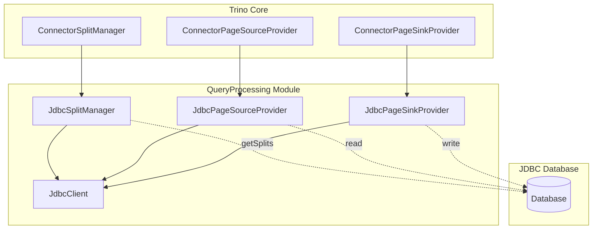
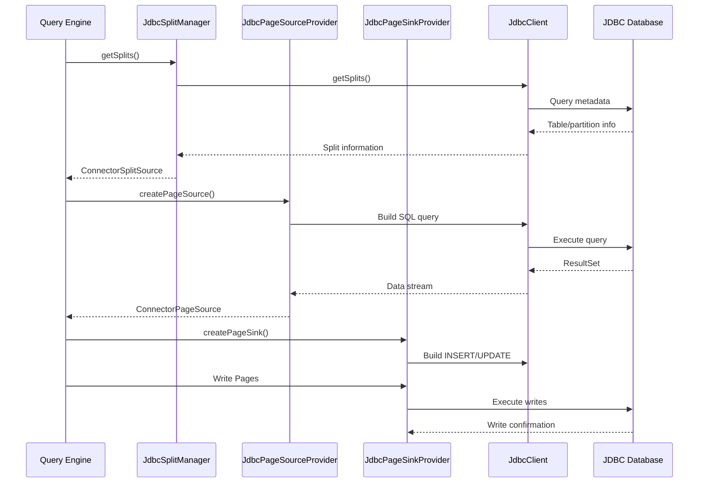
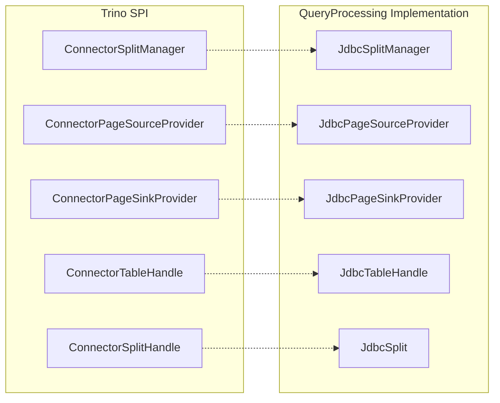

# QueryProcessing Module Documentation

## Introduction

The QueryProcessing module is a core component of Trino's JDBC connector framework, responsible for managing the execution of SQL queries against JDBC-compatible data sources. This module provides the essential infrastructure for splitting query execution, reading data from JDBC sources, and writing data back to them. It serves as the bridge between Trino's distributed query engine and traditional relational database systems.

The module is part of the Base JDBC Connector (`trino-base-jdbc`) and provides the foundational components that specific JDBC connectors (PostgreSQL, MySQL, SQL Server, etc.) extend and customize for their specific database implementations.

## Architecture Overview

The QueryProcessing module consists of three primary components that work together to handle different aspects of query execution:

### Core Components

1. **JdbcSplitManager** - Manages the splitting of query execution across multiple workers
2. **JdbcPageSourceProvider** - Handles reading data from JDBC sources and converting it to Trino's internal format
3. **JdbcPageSinkProvider** - Manages writing data back to JDBC sources

### Architecture Diagram



## Component Details

### JdbcSplitManager

The `JdbcSplitManager` is responsible for dividing query execution into manageable units called splits. It implements Trino's `ConnectorSplitManager` interface and provides the following key functionality:

- **Split Generation**: Creates splits for both regular table queries and procedure calls
- **Dynamic Filtering**: Integrates with Trino's dynamic filtering optimization to reduce data transfer
- **Transaction Management**: Handles splits within the context of database transactions

#### Key Methods

```java
public ConnectorSplitSource getSplits(
    ConnectorTransactionHandle transaction,
    ConnectorSession session,
    ConnectorTableHandle table,
    DynamicFilter dynamicFilter,
    Constraint constraint)
```

The method handles two types of table handles:
- **JdbcTableHandle**: For regular table queries
- **JdbcProcedureHandle**: For stored procedure execution

#### Dynamic Filtering Integration

When dynamic filtering is enabled, the `JdbcSplitManager` wraps the base split source with a `DynamicFilteringJdbcSplitSource`, which can significantly reduce the amount of data transferred from the database by applying filter predicates at the source.

### JdbcPageSourceProvider

The `JdbcPageSourceProvider` is responsible for creating page sources that read data from JDBC databases and convert it into Trino's internal `Page` format. It handles:

- **Data Reading**: Executes SQL queries against JDBC sources
- **Column Mapping**: Maps database columns to Trino's type system
- **Merge Operations**: Special handling for MERGE operations with row IDs
- **Retry Logic**: Implements retry policies for handling transient failures

#### Key Features

1. **Regular Query Execution**: Creates `JdbcPageSource` instances for standard SELECT operations
2. **Merge Support**: Handles complex MERGE operations with primary key tracking
3. **Column Adaptation**: Maps between database columns and Trino's expected output
4. **Error Recovery**: Implements retry logic for resilient data access

#### Merge Operation Handling

For MERGE operations, the provider:
- Identifies primary key columns
- Creates a special merge row ID column
- Builds column adaptations to map source columns to output columns
- Handles the complex logic of matching rows for updates/inserts

### JdbcPageSinkProvider

The `JdbcPageSinkProvider` manages the writing of data back to JDBC databases. It handles:

- **INSERT Operations**: Creates sinks for inserting new data
- **CREATE TABLE AS SELECT**: Handles output table creation and population
- **MERGE Operations**: Provides specialized merge sinks for upsert operations
- **Query Modification**: Applies remote query modifications for logging/auditing

#### Supported Operations

1. **Insert**: Standard INSERT operations via `createPageSink(ConnectorInsertTableHandle, ...)`
2. **Create Table**: CTAS operations via `createPageSink(ConnectorOutputTableHandle, ...)`
3. **Merge**: Upsert operations via `createMergeSink(ConnectorMergeTableHandle, ...)`

## Data Flow Architecture



## Integration with Trino Core

The QueryProcessing module integrates with Trino's core through several key interfaces:

### Connector Framework Integration



### Transaction Management

The module participates in Trino's transaction management through:
- **ConnectorTransactionHandle**: Manages database transactions
- **JdbcClient**: Handles connection lifecycle and transaction boundaries
- **Retry Logic**: Ensures operations are retried on transient failures

## Performance Optimizations

### Dynamic Filtering

The module implements dynamic filtering to reduce data transfer:
- Applies filter predicates at the database level
- Uses `DynamicFilteringJdbcSplitSource` to coordinate with Trino's dynamic filter framework
- Significantly reduces network traffic for join operations

### Column Pruning

The `JdbcPageSourceProvider` implements column pruning:
- Only fetches columns that are actually needed by the query
- Reduces memory usage and network transfer
- Improves query performance especially for wide tables

### Connection Pooling

Integration with connection pooling:
- Reuses database connections efficiently
- Configurable pool sizes per connector
- Connection lifecycle management through `JdbcClient`

## Error Handling and Resilience

### Retry Mechanism

The module implements comprehensive retry logic:
- **Transient Failures**: Automatically retries on network issues, timeouts
- **Configurable Policies**: Retry count and backoff strategies
- **Circuit Breaking**: Prevents cascading failures

### Exception Handling

- **SQL Exception Translation**: Converts database-specific errors to Trino exceptions
- **Connection Recovery**: Handles connection failures gracefully
- **Resource Cleanup**: Ensures proper cleanup of database resources

## Configuration and Extensibility

### Session Properties

The module supports various session properties:
- **Dynamic Filtering**: Enable/disable dynamic filtering
- **Retry Configuration**: Configure retry behavior
- **Connection Properties**: Database-specific connection settings

### Plugin Extension Points

Specific JDBC connectors can extend the QueryProcessing module by:
- **Custom JdbcClient**: Implement database-specific SQL generation
- **Type Mapping**: Define custom type conversions
- **Query Optimization**: Add database-specific optimizations

## Relationship to Other Modules

### Base JDBC Connector

The QueryProcessing module is part of the broader [Base JDBC Connector](BaseJdbcConnector.md) which provides:
- **JdbcClient**: Abstract interface for database operations
- **Type Mapping**: Integration with Trino's type system
- **SQL Generation**: Query building utilities

### Trino SPI

The module heavily relies on [Trino SPI](TrinoSpi.md) components:
- **Connector Interfaces**: Base interfaces for split management, page sources, and sinks
- **Type System**: Integration with Trino's type system
- **Session Management**: Access to session properties and configuration

### Query Execution Engine

Integration with Trino's [Query Execution Engine](QueryExecutionEngine.md):
- **Operator Framework**: Page sources and sinks are used by Trino's operators
- **Memory Management**: Coordinates with Trino's memory management
- **Task Execution**: Participates in distributed task execution

## Best Practices

### For Connector Developers

1. **Extend JdbcClient**: Implement database-specific behavior
2. **Optimize SQL Generation**: Generate efficient SQL for your database
3. **Handle Type Conversions**: Ensure proper type mapping
4. **Implement Pushdown**: Push operations to the database when possible

### For Query Optimization

1. **Enable Dynamic Filtering**: Reduces data transfer for joins
2. **Use Appropriate Indexes**: Ensure database tables are properly indexed
3. **Configure Connection Pools**: Optimize connection pool settings
4. **Monitor Query Performance**: Use Trino's query monitoring tools

## Future Enhancements

Potential areas for improvement:
- **Parallel Reading**: Enhanced parallel data reading capabilities
- **Streaming Support**: Better support for streaming data sources
- **Advanced Pushdown**: More sophisticated operation pushdown
- **Caching Integration**: Integration with Trino's caching layer