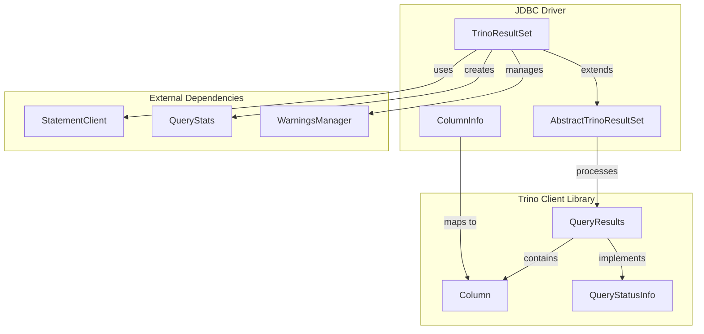
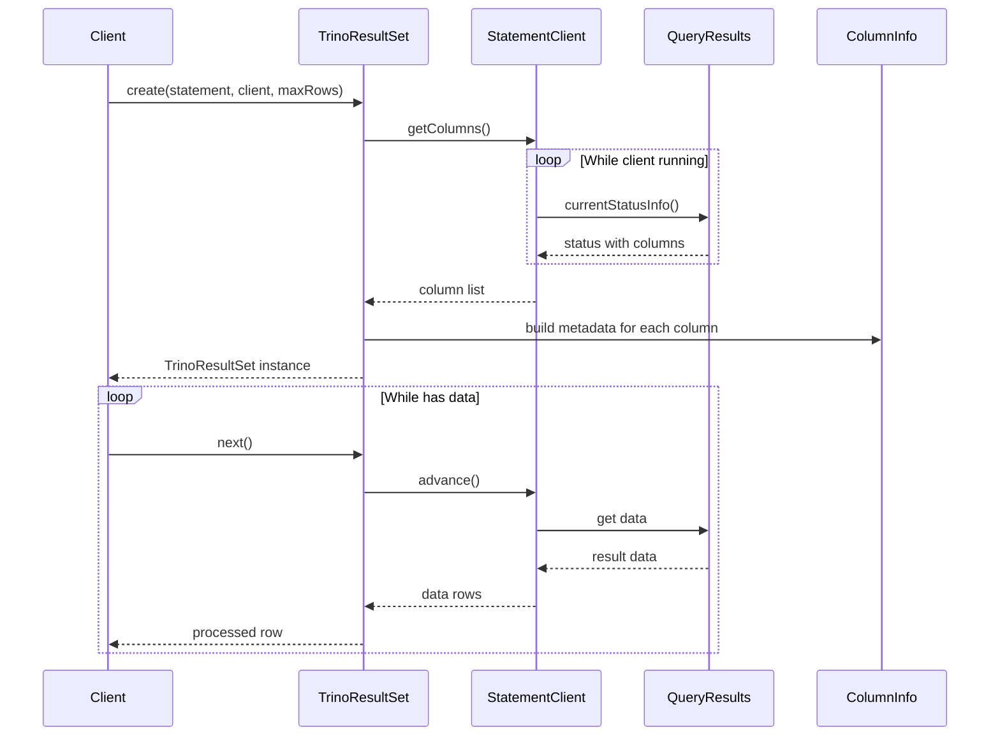
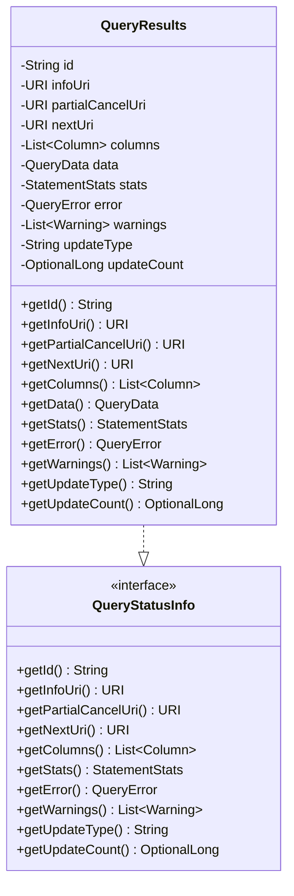
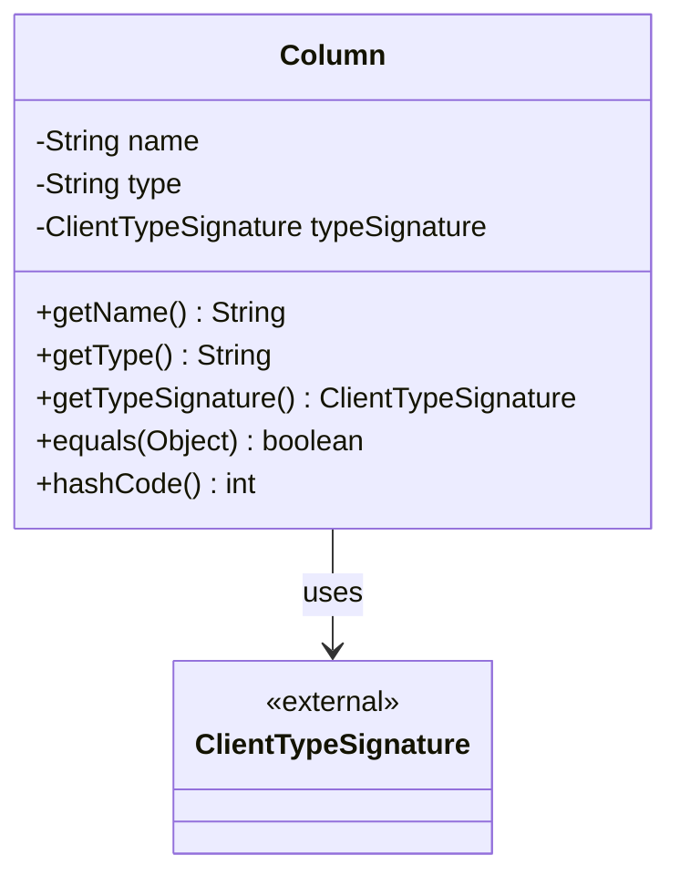
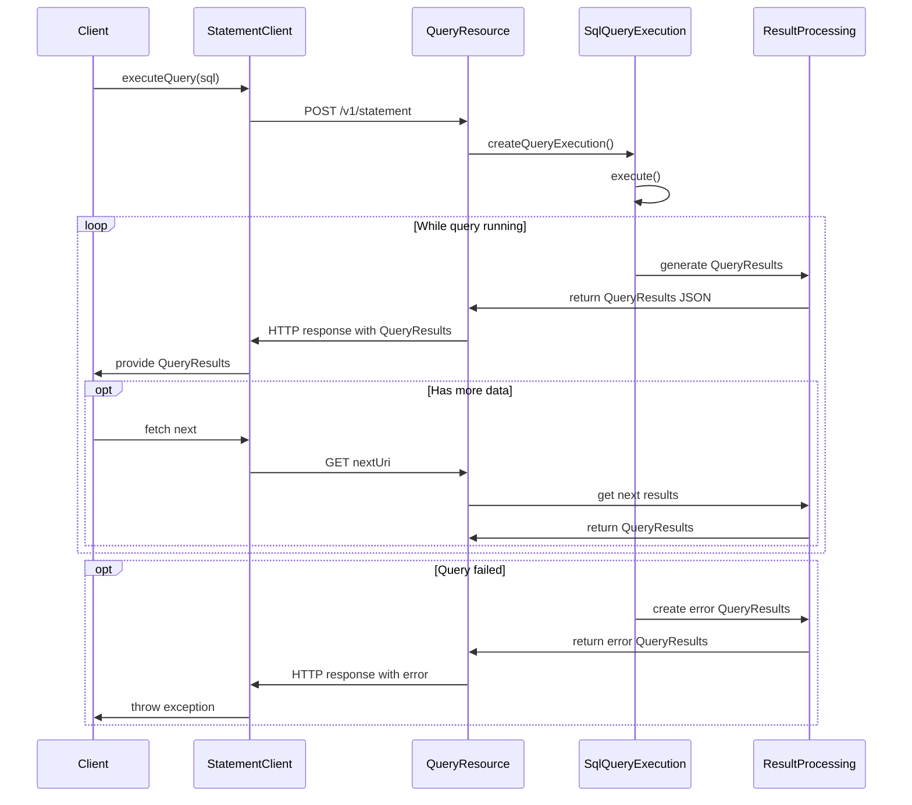
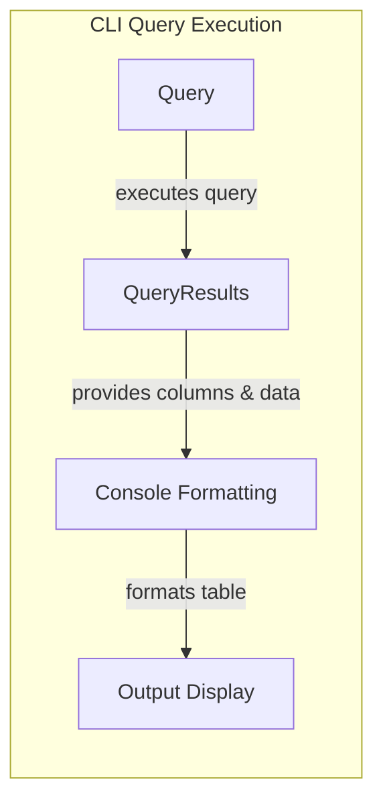
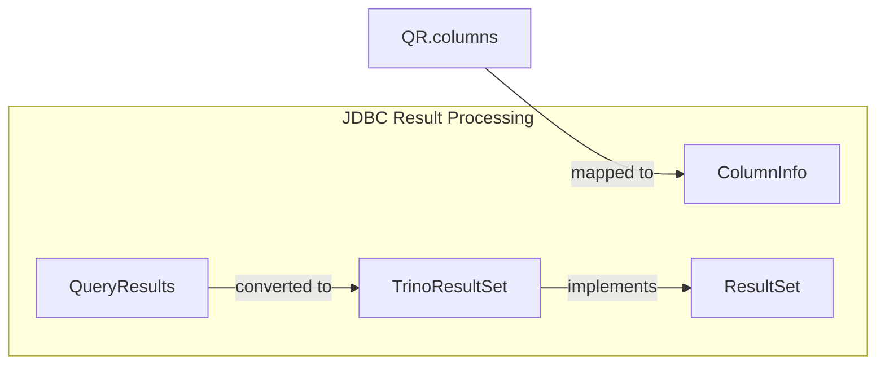

# Result Processing Module

The Result Processing module is responsible for handling query results in Trino's client libraries, providing standardized interfaces for accessing and processing query output data across different client implementations.

## Overview

The Result Processing module serves as the bridge between Trino's query execution engine and client applications, offering consistent APIs for result set handling, column metadata management, and query status tracking. It is implemented across multiple client libraries including the Trino Client Library, JDBC Driver, and CLI tools.

## Core Components

### 1. QueryResults (Trino Client Library)
**Location**: `client.trino-client.src.main.java.io.trino.client.QueryResults.QueryResults`

The `QueryResults` class is the primary data structure representing query execution results. It encapsulates all information about a query's output including:

- **Query Identification**: Unique query ID and status URIs
- **Column Metadata**: List of columns with their types and signatures  
- **Result Data**: Actual query data in a structured format
- **Execution Statistics**: Performance metrics and execution stats
- **Error Information**: Error details if the query failed
- **Warnings**: Any warnings generated during execution
- **Update Information**: For non-SELECT queries (UPDATE, INSERT, DELETE)

Key features:
- Immutable design for thread safety
- JSON serialization support for REST API communication
- Comprehensive status tracking through the `QueryStatusInfo` interface

### 2. Column (Trino Client Library)
**Location**: `client.trino-client.src.main.java.io.trino.client.Column.Column`

The `Column` class represents metadata for individual columns in query results:

- **Column Name**: The name of the column
- **Type Information**: Both string representation and structured type signature
- **Type Signature**: Detailed type information including parameters for complex types

### 3. QueryStatusInfo Interface (Trino Client Library)
**Location**: `client.trino-client.src.main.java.io.trino.client.QueryStatusInfo.QueryStatusInfo`

A comprehensive interface that defines the contract for query status information:

- Query identification and URIs
- Column metadata access
- Execution statistics
- Error and warning information
- Update type and count for non-SELECT queries

### 4. TrinoResultSet (JDBC Driver)
**Location**: `client.trino-jdbc.src.main.java.io.trino.jdbc.TrinoResultSet.TrinoResultSet`

The JDBC implementation of result set handling, extending `AbstractTrinoResultSet`:

- **JDBC Compliance**: Implements standard JDBC ResultSet interface
- **Async Processing**: Uses `AsyncResultIterator` for non-blocking data retrieval
- **Resource Management**: Proper cleanup of statement client resources
- **Query Lifecycle**: Manages query execution from start to completion
- **Progress Tracking**: Callback support for query progress monitoring

Key capabilities:
- Automatic column detection and metadata extraction
- Configurable row limiting through `CloseableLimitingIterator`
- Statement lifecycle integration with optional auto-close
- Partial query cancellation support

### 5. ColumnInfo (JDBC Driver)
**Location**: `client.trino-jdbc.src.main.java.io.trino.jdbc.ColumnInfo.ColumnInfo`

Comprehensive column metadata management for JDBC compatibility:

- **JDBC Type Mapping**: Maps Trino types to JDBC SQL types
- **Display Properties**: Column display size, precision, scale
- **Nullability**: Column nullability information
- **Type Parameters**: Support for parameterized types (VARCHAR(n), DECIMAL(p,s))
- **Builder Pattern**: Fluent API for constructing column information

Features comprehensive type handling for:
- Primitive types (boolean, integers, floating-point)
- String types (char, varchar) with length constraints
- Temporal types (date, time, timestamp) with timezone support
- Complex types (arrays, decimals) with parameter validation

## Architecture

### Component Relationships



### Data Flow Architecture



## Key Features

### 1. Type Safety and Metadata
- Comprehensive type mapping system
- Detailed column metadata including precision, scale, nullability
- Support for complex data types (arrays, maps, rows)

### 2. Performance Optimization
- Asynchronous result iteration
- Configurable row limiting
- Efficient memory management through streaming

### 3. Error Handling
- Comprehensive error information propagation
- Warning collection and reporting
- Graceful handling of partial results

### 4. Standard Compliance
- JDBC ResultSet interface implementation
- Standard SQL type mapping
- Compatible with existing JDBC tools and frameworks

## Usage Patterns

### Basic Result Processing
```java
// JDBC usage
TrinoResultSet resultSet = (TrinoResultSet) statement.executeQuery("SELECT * FROM table");
while (resultSet.next()) {
    String value = resultSet.getString(1);
    // Process result
}
```

### Column Metadata Access
```java
// Access column information
ColumnInfo columnInfo = resultSet.getColumnInfo(1);
int sqlType = columnInfo.getColumnType();
int precision = columnInfo.getPrecision();
int scale = columnInfo.getScale();
```

### Query Status Monitoring
```java
// Monitor query progress
QueryStats stats = resultSet.getStats();
long processedRows = stats.getProcessedRows();
Duration elapsedTime = stats.getElapsedTime();
```

## Error Handling

The Result Processing module implements comprehensive error handling:

- **SQLException Propagation**: JDBC-standard exception handling
- **Query Error Details**: Full error information from query execution
- **Resource Cleanup**: Automatic cleanup of client resources
- **Partial Results**: Graceful handling of failed queries with partial results

## Performance Considerations

### Memory Management
- Streaming result processing to minimize memory usage
- Configurable row limits to prevent memory exhaustion
- Automatic resource cleanup

### Network Efficiency
- Asynchronous data retrieval
- Efficient JSON serialization
- Connection pooling support

### Type Processing
- Cached type mappings for performance
- Efficient column metadata construction
- Optimized display size calculations

## Component Details

### QueryResults Class

The `QueryResults` class is the central data structure that encapsulates all information about a query execution result. It implements the `QueryStatusInfo` interface and provides comprehensive access to query results, metadata, and execution statistics.

#### Key Features:

- **Immutable Design**: Thread-safe, immutable data structure using `@Immutable` annotation
- **Jackson Integration**: Full JSON serialization/deserialization support with Jackson annotations
- **Comprehensive Metadata**: Includes query ID, URIs, columns, data, statistics, errors, and warnings
- **Flexible Data Representation**: Supports both present and absent data through nullable fields
- **Update Operations**: Handles both SELECT queries (with result data) and DML operations (with update counts)

#### Data Structure:



#### JSON Serialization:

The class is designed for JSON serialization with specific annotations:
- `@JsonProperty` for all serializable fields
- `@JsonIgnore` for internal data access
- `@JsonInclude(JsonInclude.Include.NON_EMPTY)` to omit empty data fields
- `@JsonCreator` for constructor-based deserialization

### Column Class

The `Column` class represents metadata for individual columns in the result set, providing essential information about data types and structure.

#### Key Features:

- **Type Information**: Both string representation and structured type signature
- **Immutable Design**: Thread-safe with `@Immutable` annotation
- **Jackson Integration**: JSON serialization support
- **Equality Support**: Proper equals() and hashCode() implementation

#### Data Structure:



### QueryStatusInfo Interface

The `QueryStatusInfo` interface defines the contract for accessing query status and metadata information. It provides a standardized way to access common query information across different implementations.

#### Interface Methods:

- `getId()` - Unique query identifier
- `getInfoUri()` - URI for detailed query information
- `getPartialCancelUri()` - URI for partial query cancellation
- `getNextUri()` - URI for retrieving next batch of results
- `getColumns()` - Result set column metadata
- `getStats()` - Query execution statistics
- `getError()` - Error information if query failed
- `getWarnings()` - List of execution warnings
- `getUpdateType()` - Type of update operation (INSERT, UPDATE, DELETE)
- `getUpdateCount()` - Number of rows affected by DML operations

## Data Flow Architecture

The Result Processing module participates in a multi-stage data flow that spans from query execution to client consumption:



## Integration with Client Interfaces

### CLI Integration

The Trino CLI uses QueryResults to display query output in a tabular format:



### JDBC Integration

The JDBC driver converts QueryResults into JDBC ResultSet format:



### Programmatic API Integration

Client applications can directly consume QueryResults for custom processing:

```java
// Example usage pattern
StatementClient client = StatementClientFactory.newStatementClient(session, sql);
while (client.isRunning()) {
    QueryResults results = client.current();
    
    if (results.getColumns() != null) {
        // Process column metadata
        for (Column column : results.getColumns()) {
            System.out.println(column.getName() + ": " + column.getType());
        }
    }
    
    if (results.getData() != null) {
        // Process result data
        Iterable<List<Object>> data = results.getData();
        for (List<Object> row : data) {
            // Process each row
        }
    }
    
    client.advance();
}
```

## Error Handling and Resilience

The Result Processing module includes comprehensive error handling capabilities:

### Error Information

QueryResults can contain error information through the `QueryError` field, which provides:
- Error message and error code
- Error location (line number, column position)
- Error type and failure info
- Stack trace for debugging

### Warning Handling

The module supports warning collection and propagation:
- Multiple warnings can be collected during query execution
- Warnings are preserved in QueryResults for client access
- Warnings do not fail the query but provide important information

### Partial Results

For long-running queries or queries with LIMIT clauses:
- Partial results can be returned before query completion
- `nextUri` provides pagination for large result sets
- `partialCancelUri` allows cancellation of partial results

## Performance Considerations

### Memory Management

- QueryResults uses immutable data structures to prevent memory leaks
- Large result sets are paginated to avoid memory pressure
- Data field can be null to represent absence of results efficiently

### Network Efficiency

- JSON serialization is optimized with selective field inclusion
- Optional fields are omitted when not present to reduce payload size
- Type signatures provide compact type representation

### Client-Side Optimization

- Column metadata is cached to avoid repeated lookups
- Data access patterns are optimized for streaming consumption
- Statistics provide query progress information for UI updates

## Security Considerations

### Data Exposure

- QueryResults contains actual query data that must be protected
- URIs provide controlled access to query information and operations
- Error messages may contain sensitive information and should be handled carefully

### Access Control

- QueryResults is tied to specific query IDs for access control
- URIs include authentication tokens for secure access
- Partial cancellation requires proper authorization

## Testing and Quality Assurance

The Result Processing module is extensively tested through:

- **Unit Tests**: Individual component testing for QueryResults, Column, and interfaces
- **Integration Tests**: End-to-end testing with client-server communication
- **Serialization Tests**: JSON serialization/deserialization round-trip testing
- **Performance Tests**: Large result set handling and memory usage validation

## Future Enhancements

Potential areas for future development include:

- **Streaming Support**: Enhanced streaming for very large result sets
- **Compression**: Optional compression for large data payloads
- **Binary Formats**: Support for binary serialization formats
- **Schema Evolution**: Handling of schema changes during query execution
- **Advanced Types**: Enhanced support for complex data types

## Related Modules

- [Trino Client Library](Trino%20Client%20Library.md) - Core client functionality
- [Trino JDBC Driver](Trino%20JDBC%20Driver.md) - JDBC-specific implementations  
- [Query Execution Engine](Query%20Execution%20Engine.md) - Query execution backend
- [Trino CLI](Trino%20CLI.md) - Command-line interface using result processing