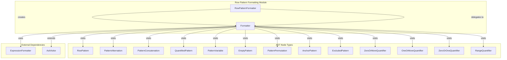
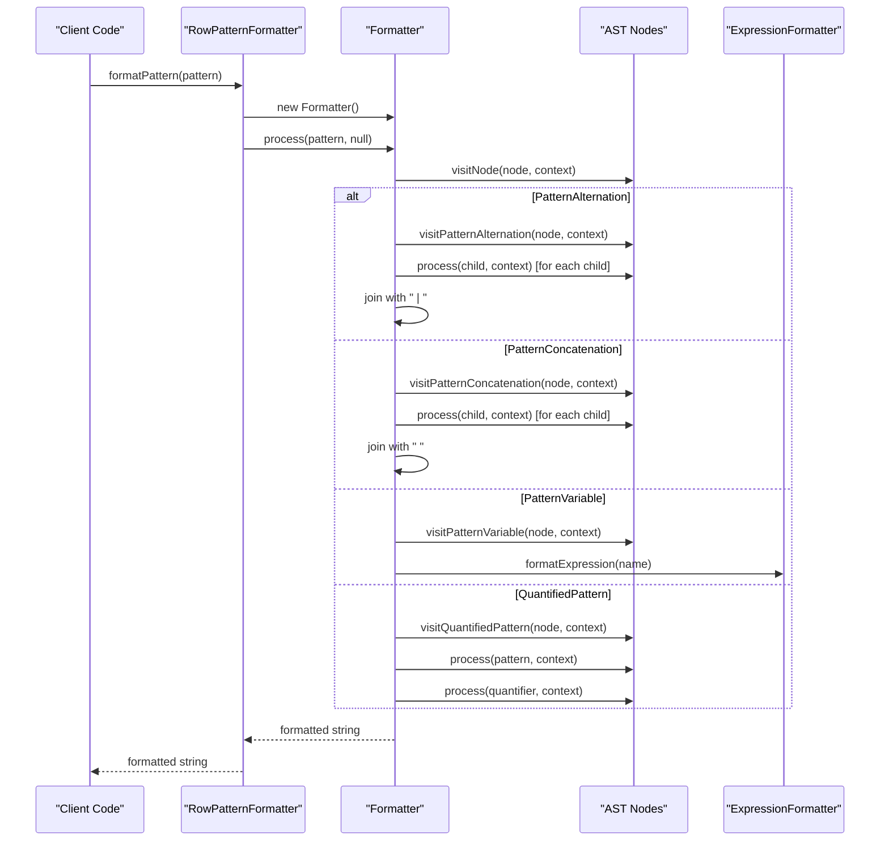
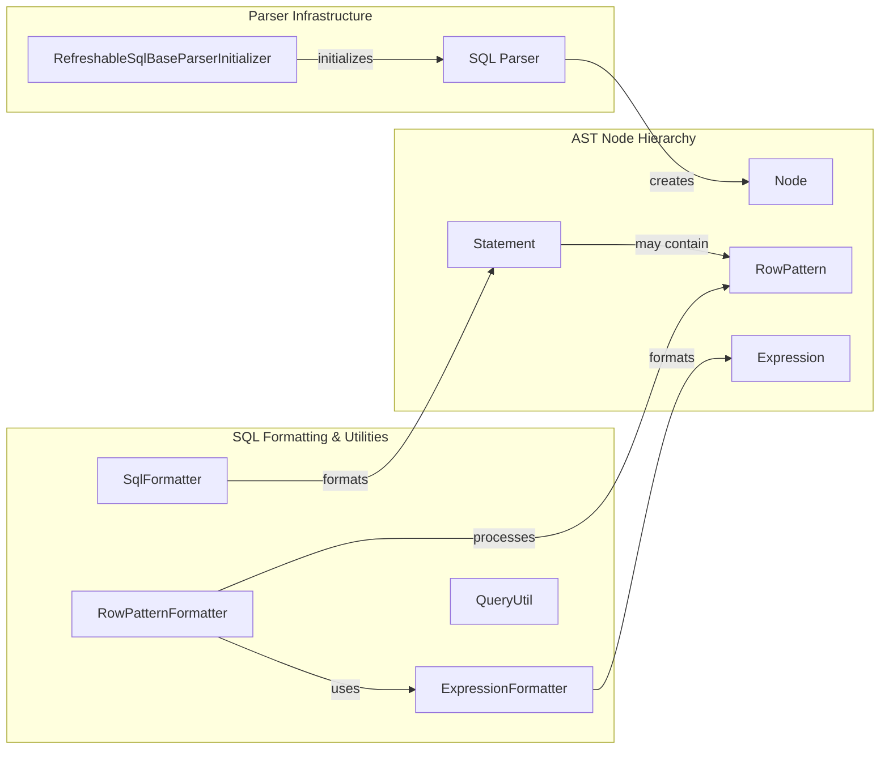

# Row Pattern Formatting Module

## Introduction

The Row Pattern Formatting module is a specialized component within Trino's SQL parser infrastructure that handles the formatting and serialization of row pattern expressions used in MATCH_RECOGNIZE clauses. This module provides the essential functionality to convert abstract syntax tree (AST) representations of row patterns back into human-readable SQL strings, enabling proper query formatting, logging, and debugging capabilities.

Row pattern expressions are a powerful feature in SQL that allow users to define complex pattern matching logic for sequence analysis in time-series data, event streams, and other ordered datasets. The Row Pattern Formatter ensures that these sophisticated pattern definitions can be accurately represented as strings while maintaining their semantic meaning and syntactic structure.

## Architecture Overview

The Row Pattern Formatting module is built around a visitor pattern architecture that systematically processes different types of pattern elements and constructs their string representations. The module integrates seamlessly with Trino's broader SQL formatting infrastructure while maintaining its specialized focus on pattern-specific constructs.



## Core Components

### RowPatternFormatter Class

The `RowPatternFormatter` class serves as the main entry point for the module, providing a static interface for formatting row pattern expressions. This class follows a singleton-like pattern with a private constructor and static utility methods, ensuring thread-safe access to formatting functionality.

**Key Characteristics:**
- Static utility class with no instantiation allowed
- Provides the primary `formatPattern()` method for external consumption
- Delegates actual formatting logic to the nested `Formatter` class
- Thread-safe design suitable for concurrent query processing

### Formatter Inner Class

The `Formatter` class is the core implementation component that extends `AstVisitor<String, Void>` to provide specialized handling for each type of row pattern node. This class implements the visitor pattern to traverse the AST and construct appropriate string representations for each pattern element.

**Key Responsibilities:**
- Visiting and processing different AST node types
- Constructing syntactically correct SQL strings
- Handling operator precedence and grouping
- Managing quantifier formatting (greedy vs. non-greedy)
- Preserving pattern semantics during string conversion

## Data Flow and Processing



## Pattern Type Handling

The formatter supports a comprehensive set of row pattern constructs, each with specific formatting rules:

### Basic Pattern Elements

**PatternVariable**: Represents named pattern variables (e.g., `A`, `B`, `UP`, `DOWN`)
- Delegates to `ExpressionFormatter` for proper identifier formatting
- Handles variable name escaping and qualification

**EmptyPattern**: Represents empty pattern matches `()`
- Always formatted as literal parentheses
- Used for epsilon transitions in pattern matching

### Pattern Composition

**PatternAlternation**: Represents OR operations between patterns
- Formatted as `(pattern1 | pattern2 | pattern3)`
- Uses pipe operator with proper grouping
- Recursive processing of child patterns

**PatternConcatenation**: Represents sequential pattern matching
- Formatted as `(pattern1 pattern2 pattern3)`
- Uses space separation with proper grouping
- Maintains left-to-right evaluation order

**PatternPermutation**: Represents any order matching
- Formatted as `PERMUTE(pattern1, pattern2, pattern3)`
- Uses comma separation within PERMUTE function
- Enables flexible ordering constraints

### Pattern Quantifiers

**ZeroOrMoreQuantifier**: Represents `*` quantifier
- Formatted as `*` or `*?` for non-greedy variants
- Handles greedy/non-greedy distinction

**OneOrMoreQuantifier**: Represents `+` quantifier
- Formatted as `+` or `+?` for non-greedy variants
- Ensures at least one occurrence

**ZeroOrOneQuantifier**: Represents `?` quantifier
- Formatted as `?` or `??` for non-greedy variants
- Optional single occurrence

**RangeQuantifier**: Represents bounded quantifiers
- Formatted as `{min,max}` or `{min,max}?`
- Supports optional bounds (e.g., `{3,}`, `{,5}`, `{3,7}`)
- Delegates bound expressions to `ExpressionFormatter`

### Special Pattern Constructs

**AnchorPattern**: Represents partition boundaries
- `^` for partition start
- `$` for partition end
- Enables pattern matching within specific ranges

**ExcludedPattern**: Represents negative pattern matching
- Formatted as `{-pattern-}`
- Enables exclusion of specific sequences

## Integration with SQL Parser Infrastructure

The Row Pattern Formatting module integrates with Trino's broader SQL formatting ecosystem through several key relationships:



## Dependencies and External Interfaces

### Internal Dependencies

**ExpressionFormatter**: Provides expression formatting capabilities
- Used for formatting pattern variable names
- Ensures consistent identifier formatting across the system
- Handles complex expressions within range quantifiers

**AstVisitor Framework**: Base visitor pattern implementation
- Provides traversal mechanism for AST nodes
- Enables extensible processing architecture
- Supports parameterized visitor context

### External Module Dependencies

The Row Pattern Formatting module is part of the SQL Parser & AST module tree and depends on:

- **AST Node Hierarchy**: Access to pattern-specific AST node definitions
- **Parser Infrastructure**: Integration with SQL parsing pipeline
- **SQL Formatting and Utilities**: Consistent formatting standards

For detailed information about these dependencies, refer to:
- [SQL Parser & AST](SQL Parser & AST.md)
- [AST Node Hierarchy](AST Node Hierarchy.md)
- [Expression Formatting](Expression Formatting.md)

## Usage Patterns and Examples

### Basic Pattern Formatting

```java
// Variable patterns
RowPattern pattern = new PatternVariable(new Identifier("A"));
String formatted = RowPatternFormatter.formatPattern(pattern);
// Result: "A"

// Concatenated patterns
RowPattern pattern = new PatternConcatenation(Arrays.asList(
    new PatternVariable(new Identifier("A")),
    new PatternVariable(new Identifier("B"))
));
String formatted = RowPatternFormatter.formatPattern(pattern);
// Result: "(A B)"
```

### Complex Pattern Formatting

```java
// Alternation with quantifiers
RowPattern pattern = new PatternAlternation(Arrays.asList(
    new QuantifiedPattern(
        new PatternVariable(new Identifier("A")),
        new OneOrMoreQuantifier(true)
    ),
    new PatternVariable(new Identifier("B"))
));
String formatted = RowPatternFormatter.formatPattern(pattern);
// Result: "(A+ | B)"

// Range quantifier
RowPattern pattern = new QuantifiedPattern(
    new PatternVariable(new Identifier("A")),
    new RangeQuantifier(Optional.of(new LongLiteral("3")), Optional.of(new LongLiteral("5")), true)
);
String formatted = RowPatternFormatter.formatPattern(pattern);
// Result: "(A{3,5})"
```

## Error Handling and Edge Cases

The Row Pattern Formatter implements several strategies for handling edge cases and potential errors:

### Unsupported Operations
- Throws `UnsupportedOperationException` for unimplemented node types
- Provides descriptive error messages with class names
- Ensures fail-fast behavior for incomplete implementations

### Null Safety
- Uses null context parameter consistently
- Handles optional values in range quantifiers
- Provides safe string concatenation operations

### Grouping and Precedence
- Automatically adds parentheses for complex patterns
- Preserves operator precedence during formatting
- Handles nested pattern structures correctly

## Performance Considerations

The Row Pattern Formatter is designed for efficiency in query processing environments:

### Memory Efficiency
- Uses string builders and streaming operations
- Minimizes intermediate string allocations
- Leverages efficient joining operations

### Thread Safety
- Stateless formatter instances
- No shared mutable state
- Safe for concurrent query processing

### Scalability
- Linear complexity with pattern size
- Efficient handling of deeply nested patterns
- Optimized for common pattern types

## Future Enhancements and Extensibility

The Row Pattern Formatting module is designed with extensibility in mind, supporting future enhancements such as:

### Additional Pattern Types
- Support for new SQL standard pattern constructs
- Custom pattern extensions for specific use cases
- Enhanced quantifier types and modifiers

### Formatting Options
- Configurable formatting styles (compact vs. verbose)
- Customizable operator precedence rules
- Syntax highlighting support for user interfaces

### Integration Improvements
- Enhanced error reporting with position information
- Support for pattern validation during formatting
- Integration with query optimization tools

## Testing and Quality Assurance

The Row Pattern Formatter is supported by comprehensive testing strategies:

### Unit Testing
- Individual visitor method validation
- Edge case and boundary condition testing
- Round-trip testing (parse → format → parse)

### Integration Testing
- End-to-end query formatting validation
- Compatibility with SQL parser output
- Performance benchmarking for large patterns

### Regression Testing
- Baseline comparison for formatted output
- Cross-version compatibility validation
- Integration with continuous testing pipelines

This comprehensive approach ensures that the Row Pattern Formatting module maintains high quality and reliability while supporting Trino's complex pattern matching capabilities.