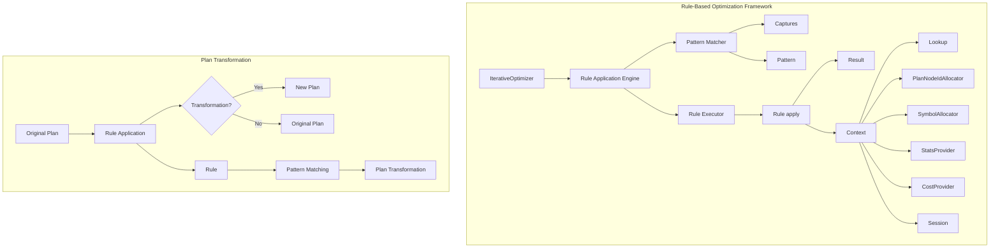
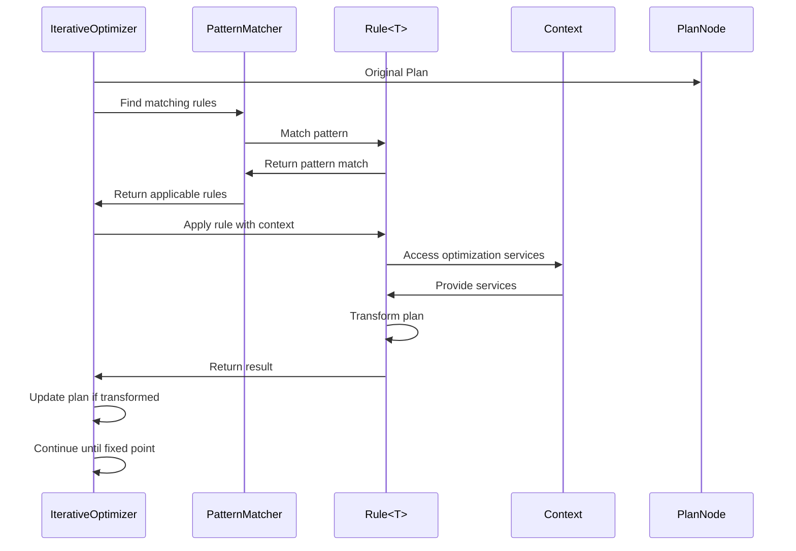

# Rule-Based Optimization Module

## Introduction

The Rule-Based Optimization module is a core component of Trino's query optimization framework that applies transformation rules to logical query plans. This module implements an iterative optimization approach where rules are repeatedly applied to plan nodes until no further optimizations can be made, resulting in more efficient query execution plans.

## Overview

Rule-based optimization in Trino uses a pattern-matching approach to identify suboptimal plan structures and transform them into more efficient alternatives. The system is built around the `Rule` interface, which defines the contract for all optimization rules, and the `IterativeOptimizer` framework that orchestrates the application of these rules.

## Core Architecture

### Rule Interface

The `Rule<T>` interface is the foundation of the rule-based optimization system. It defines a generic contract for optimization rules that can be applied to different types of plan nodes.

```java
public interface Rule<T>
{
    Pattern<T> getPattern();
    default boolean isEnabled(Session session) { return true; }
    Result apply(T node, Captures captures, Context context);
}
```

### Key Components

#### 1. Rule Pattern Matching
- **Pattern<T>**: Defines the structure of plan nodes that a rule can match
- **Captures**: Stores captured sub-patterns during pattern matching
- **Matching Engine**: Uses pattern matching to identify applicable rules

#### 2. Rule Context
The `Context` interface provides rules with access to essential optimization services:
- **Lookup**: Access to previously optimized plan fragments
- **PlanNodeIdAllocator**: Generates unique IDs for new plan nodes
- **SymbolAllocator**: Manages symbol allocation during transformations
- **Session**: Provides access to session-level configuration
- **StatsProvider**: Supplies table and column statistics
- **CostProvider**: Provides cost estimates for plan nodes
- **WarningCollector**: Collects optimization warnings

#### 3. Rule Results
Rules return a `Result` object containing:
- **Transformed Plan**: Optional new plan node (empty if no transformation)
- **Success/Failure Indication**: Whether the rule successfully transformed the plan

## Architecture Diagram



## Rule Application Process



## Integration with Trino Architecture

### Dependencies

The Rule-Based Optimization module integrates with several other Trino components:

#### 1. Plan Representation ([Query Planner & Plan Representation](Query%20Planner%20&%20Plan%20Representation.md))
- Uses `PlanNode` hierarchy for plan representation
- Leverages `PlanNodeIdAllocator` for node identification
- Integrates with `SymbolAllocator` for symbol management

#### 2. Cost and Statistics ([Cost & Statistics](Cost%20&%20Statistics.md))
- Utilizes `StatsProvider` for statistical information
- Employs `CostProvider` for cost-based decisions
- Accesses table and column statistics for optimization

#### 3. SQL Analysis ([SQL Analyzer](SQL%20Analyzer.md))
- Works with analyzed query plans from the analyzer
- Uses session information from the analysis phase
- Integrates with warning collection system

#### 4. Iterative Optimization Framework
- Part of the broader `IterativeOptimizer` system
- Coordinates with other optimization techniques
- Supports pluggable rule sets

## Rule Types and Categories

### Common Rule Categories

1. **Predicate Pushdown Rules**
   - Push predicates closer to data sources
   - Reduce data processing overhead
   - Example: `PredicatePushDown.Rewriter`

2. **Projection Pushdown Rules**
   - Eliminate unnecessary column reads
   - Optimize data transfer

3. **Join Reordering Rules**
   - Optimize join order based on statistics
   - Reduce intermediate result sizes

4. **Aggregation Optimization Rules**
   - Push aggregations through joins
   - Combine multiple aggregations

5. **Constant Folding Rules**
   - Evaluate constant expressions
   - Simplify complex expressions

## Rule Development

### Creating Custom Rules

To implement a custom optimization rule:

1. **Implement Rule Interface**
   ```java
   public class MyOptimizationRule implements Rule<ProjectNode>
   {
       private static final Pattern<ProjectNode> PATTERN = ...;
       
       @Override
       public Pattern<ProjectNode> getPattern()
       {
           return PATTERN;
       }
       
       @Override
       public Result apply(ProjectNode node, Captures captures, Context context)
       {
           // Implementation
           return Result.ofPlanNode(transformedNode);
       }
   }
   ```

2. **Define Pattern**
   - Specify the plan node structure to match
   - Use pattern variables for flexible matching

3. **Implement Transformation Logic**
   - Access context services as needed
   - Return appropriate result

### Rule Registration

Rules are typically registered through:
- Plugin systems for custom rules
- Built-in rule sets in the optimizer
- Configuration-based rule enabling/disabling

## Performance Considerations

### Rule Application Strategy

1. **Fixed Point Iteration**
   - Apply rules until no further changes
   - Ensure termination through rule design

2. **Rule Ordering**
   - Strategic ordering for maximum benefit
   - Dependency management between rules

3. **Timeout Management**
   - Prevent excessive optimization time
   - Balance optimization quality vs. compilation time

### Memory and Resource Management

- Efficient pattern matching algorithms
- Minimal memory allocation during transformation
- Cleanup of intermediate results

## Testing and Validation

### Rule Testing Framework

Rules are tested using:
- Unit tests for individual rules
- Integration tests with query plans
- Performance regression tests
- Correctness validation

### Test Utilities

The testing framework provides:
- Plan builders for test scenarios
- Assertion utilities for plan validation
- Performance measurement tools
- Rule application tracing

## Configuration and Tuning

### Rule Enablement

Rules can be configured through:
- Session properties for per-query control
- System properties for global configuration
- Rule-specific parameters

### Optimization Levels

Different optimization levels:
- Minimal: Essential rules only
- Standard: Balanced optimization
- Aggressive: All applicable rules

## Monitoring and Diagnostics

### Rule Application Metrics

- Number of rules applied
- Transformation success rates
- Optimization time spent
- Plan improvement measurements

### Debugging Support

- Rule application tracing
- Plan transformation logging
- Performance profiling
- Optimization result reporting

## Future Enhancements

### Planned Improvements

1. **Machine Learning Integration**
   - Learn optimal rule sequences
   - Adaptive rule selection

2. **Distributed Optimization**
   - Parallel rule application
   - Distributed cost calculation

3. **Advanced Pattern Matching**
   - More expressive patterns
   - Context-aware matching

4. **Rule Composition**
   - Composite rule definitions
   - Rule chaining mechanisms

## Related Documentation

- [Iterative Optimization Framework](Iterative%20Optimization%20Framework.md)
- [Query Planner & Plan Representation](Query%20Planner%20&%20Plan%20Representation.md)
- [Cost & Statistics](Cost%20&%20Statistics.md)
- [SQL Analyzer](SQL%20Analyzer.md)
- [Predicate Pushdown Optimizer](Predicate%20Pushdown%20Optimizer.md)

## Conclusion

The Rule-Based Optimization module provides a flexible and extensible framework for transforming logical query plans into more efficient execution plans. Through its pattern-matching approach and iterative application strategy, it enables significant performance improvements while maintaining query correctness. The modular design allows for easy extension with custom rules and integration with other optimization techniques, making it a cornerstone of Trino's query optimization capabilities.