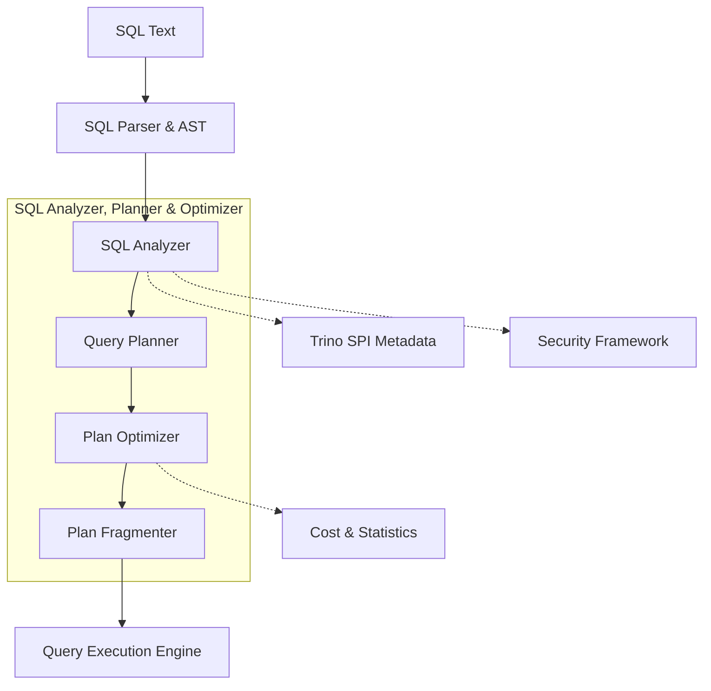
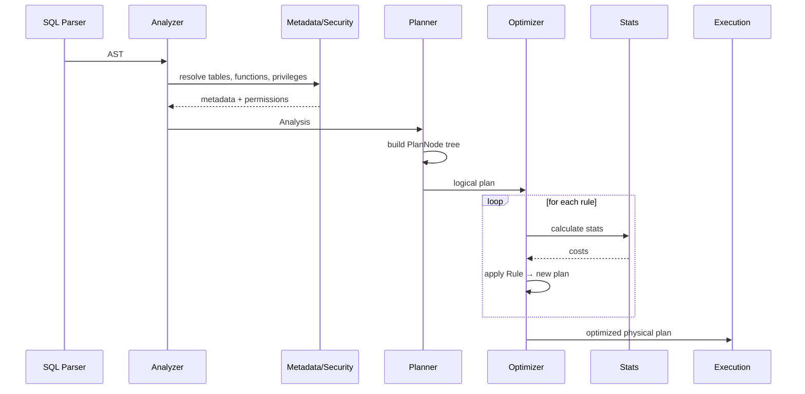

# SQL Analyzer, Planner & Optimizer Module

## Purpose

The SQL Analyzer, Planner & Optimizer module is the semantic heart of Trino's query engine. It transforms a raw SQL statement into an optimized, distributed execution plan that can be executed efficiently across the cluster. The module is responsible for:

- **Semantic Validation**: Ensuring SQL statements are valid beyond syntax (table/column existence, type correctness, privilege checks)
- **Query Planning**: Converting the analyzed query into a logical execution plan (tree of PlanNodes)
- **Query Optimization**: Applying rule-based and cost-based transformations to minimize runtime cost
- **Plan Fragmentation**: Splitting the optimized plan into fragments that can be scheduled independently on workers

## Architecture

## Core Components

### 1. SQL Analyzer (`core.trino-main/src/main/java/io/trino/sql/analyzer/`)
Validates semantics, resolves names, checks privileges and builds the `Analysis` object that carries all semantic information.

Key classes:
- `Analyzer` – entry point, coordinates analysis and final access-control checks
- `StatementAnalyzer.Visitor` – recursive visitor that validates each statement type
- `Analysis.Builder` – immutable container for all semantic results (types, scopes, permissions)
- `Scope` – manages lexical scopes for identifier resolution in nested queries

### 2. Query Planner (`core.trino-main/src/main/java/io/trino/sql/planner/`)
Turns the `Analysis` into a tree of `PlanNode`s (logical plan).

Key classes:
- `QueryPlanner` – generates `RelationPlan` for DML/DDL statements
- `PlanNode` – sealed hierarchy representing every relational operator (scan, project, join, aggregate, etc.)
- `SubPlan` – fragment of the plan that will be shipped to workers
- `PlanAndMappings` – plan together with symbol mappings for expression translation

### 3. Plan Optimizer (`core.trino-main/src/main/java/io/trino/sql/planner/optimizations/` & `iterative/`)
Iteratively rewrites the logical plan into a cheaper physical plan.

Key classes:
- `IterativeOptimizer.Context` – memoization engine that applies rules until fix-point
- `Rule` – pluggable transformation pattern (e.g. push predicate through join)
- `PlanOptimizer` – legacy interface for whole-plan rewrites
- `PredicatePushDown.Rewriter` – example rule that moves filters closer to scans

### 4. Cost & Statistics (`core.trino-main/src/main/java/io/trino/cost/`)
Supplies cardinality and size estimates so the optimizer can pick the cheapest alternative.

Key classes:
- `StatsCalculator` – connector-aware calculator for every PlanNode type
- `PlanNodeStatsEstimate.Builder` – immutable stats container (row count, nulls, distinct values, data size)

### 5. SQL Intermediate Representation (IR) (`core.trino-main/src/main/java/io/trino/sql/ir/`)
Normalized, type-safe expression tree used throughout planner and optimizer.

Key class:
- `Expression` – sealed hierarchy (Call, Constant, FieldReference, Lambda, etc.) with visitor pattern

## Data Flow

## References to Core Component Docs

- [SQL Analyzer](SQL%20Analyzer.md) – deep dive into semantic analysis, scope resolution and security validation
- [Query Planner & Plan Representation](Query%20Planner%20&%20Plan%20Representation.md) – plan node hierarchy, symbol management, plan fragmentation
- [Plan Optimizer](Plan%20Optimizer.md) – iterative rule engine, predicate push-down, join reordering, dynamic filtering
- [Cost & Statistics](Cost%20&%20Statistics.md) – cardinality estimation, connector stats integration, cost models
- [SQL Intermediate Representation](SQL%20Intermediate%20Representation.md) – expression IR, visitor pattern, serialization

Together these components ensure that every SQL statement entering Trino is validated, planned, optimized and ready for highly parallel, distributed execution.