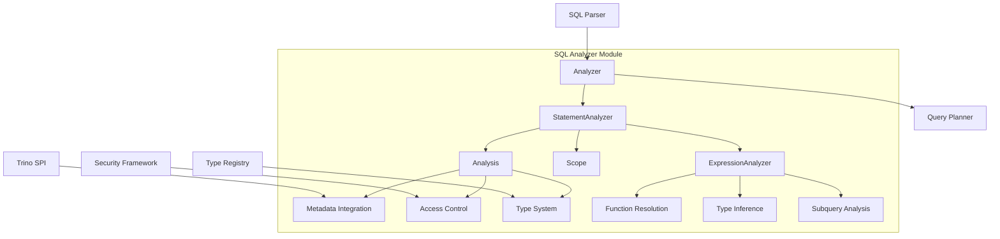
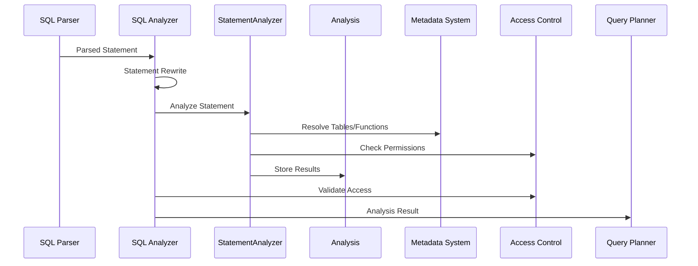

# SQL Analyzer Module

## Overview

The SQL Analyzer module is a critical component of Trino's query processing pipeline that performs semantic analysis of SQL statements. It validates SQL syntax, resolves identifiers, checks type compatibility, enforces access controls, and builds a comprehensive analysis structure that serves as the foundation for subsequent query planning and optimization phases.

## Purpose and Core Functionality

The SQL Analyzer serves as the semantic validation layer between the SQL Parser and the Query Planner. Its primary responsibilities include:

- **Semantic Validation**: Validates that SQL statements are semantically correct beyond syntactic parsing
- **Identifier Resolution**: Resolves table names, column references, function calls, and other identifiers
- **Type Analysis**: Performs type checking and inference for expressions and operations
- **Access Control**: Enforces security policies including table/column access permissions, row filters, and column masks
- **Scope Management**: Manages lexical scoping for identifiers in complex queries with subqueries, joins, and CTEs
- **Metadata Integration**: Interacts with Trino's metadata system to validate table structures, function signatures, and type information

## Architecture Overview

## Core Components

### 1. Analyzer (`Analyzer`)
The main entry point that orchestrates the analysis process. It coordinates statement rewriting, delegates to specialized analyzers, and performs final access control validation.

**Key Responsibilities:**
- Statement rewriting and preprocessing
- Delegation to StatementAnalyzer for detailed analysis
- Access control validation for table and column references
- Integration with Trino's tracing and monitoring systems

**Detailed Documentation**: [Main Analyzer](Main Analyzer.md)

### 2. StatementAnalyzer (`StatementAnalyzer`)
The core analysis engine that processes different types of SQL statements. It contains a comprehensive visitor pattern implementation to handle all SQL statement types.

**Key Responsibilities:**
- Statement-specific semantic validation
- Table and column resolution
- Expression analysis delegation
- Scope management for complex queries
- Join analysis and validation
- Subquery processing

**Detailed Documentation**: [Statement Analysis Engine](Statement Analysis Engine.md)

### 3. Analysis (`Analysis`)
A comprehensive data structure that captures all analysis results. It serves as the single source of truth for semantic information about the analyzed query.

**Key Responsibilities:**
- Storage of all analysis results
- Type information for expressions
- Resolved identifiers and references
- Access control information
- Query structure metadata

**Detailed Documentation**: [Analysis Data Structure](Analysis Data Structure.md)

### 4. Scope (`Scope`)
Manages lexical scoping for identifier resolution. It handles the complex scoping rules of SQL including nested subqueries, CTEs, and correlated references.

**Key Responsibilities:**
- Identifier resolution within scopes
- Field mapping and resolution
- Outer query scope management
- Named query (CTE) handling

**Detailed Documentation**: [Scope Management](Scope Management.md)

## Data Flow

## Integration with Other Modules

### SQL Parser & AST
The SQL Analyzer receives parsed AST nodes from the [SQL Parser & AST](SQL Parser & AST.md) module. It performs semantic validation on these parsed structures and enriches them with type and metadata information.

### Trino SPI
Integrates with the [Trino SPI](Trino SPI.md) to access metadata about tables, columns, functions, and types. This integration enables the analyzer to validate that referenced objects exist and have appropriate structures.

### Metadata & Connector Abstraction
Works closely with the [Metadata & Connector Abstraction](Metadata & Connector Abstraction.md) module to resolve table schemas, function signatures, and connector-specific information required for semantic validation.

### Security Framework
Leverages the [Security Framework](Trino SPI.md#security-framework) components from the Trino SPI to enforce access control policies, including table-level permissions, column-level security, row filters, and column masks.

## Key Features

### Advanced SQL Support
- **Window Functions**: Comprehensive support for window functions with proper frame analysis
- **CTEs and Recursive Queries**: Support for common table expressions including recursive queries
- **Complex Joins**: Validation of all join types including lateral joins and complex join conditions
- **Subqueries**: Deep analysis of correlated and uncorrelated subqueries
- **Set Operations**: Support for UNION, INTERSECT, EXCEPT with proper type checking

### Security Integration
- **Row-Level Security**: Enforcement of row filters defined by security policies
- **Column-Level Security**: Application of column masks and access controls
- **Privilege Checking**: Validation of SELECT, INSERT, UPDATE, DELETE privileges
- **View Security**: Proper handling of view access controls and run-as identities

### Type System Integration
- **Type Inference**: Sophisticated type inference for complex expressions
- **Type Coercion**: Automatic type conversion where appropriate
- **Function Resolution**: Overload resolution for built-in and user-defined functions
- **Generic Types**: Support for complex generic types like arrays, maps, and row types

## Error Handling and Diagnostics

The SQL Analyzer provides detailed error messages and diagnostics for common SQL mistakes:

- **Ambiguous References**: Clear identification of ambiguous column or table references
- **Type Mismatches**: Detailed type information when type checking fails
- **Missing Objects**: Specific information about missing tables, columns, or functions
- **Access Violations**: Clear indication of security policy violations
- **Semantic Constraints**: Validation of SQL semantic rules and constraints

## Performance Considerations

The analyzer is designed for efficiency:

- **Lazy Evaluation**: Analysis is performed on-demand where possible
- **Caching**: Results are cached to avoid redundant analysis
- **Incremental Processing**: Supports incremental analysis for complex queries
- **Memory Management**: Efficient data structures to minimize memory usage

## Extensibility

The SQL Analyzer is designed to be extensible:

- **Plugin Integration**: Support for connector-specific analysis rules
- **Custom Functions**: Automatic integration of user-defined functions
- **Type Extensions**: Support for custom types and their validation rules
- **Security Policies**: Integration with custom security implementations

This comprehensive semantic analysis ensures that only valid, secure, and well-formed SQL statements proceed to the query planning phase, providing early error detection and detailed diagnostics to users.