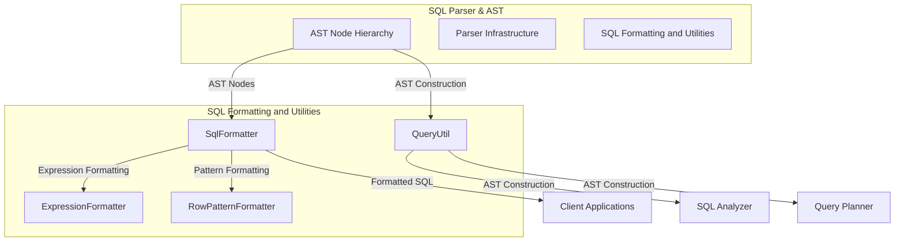
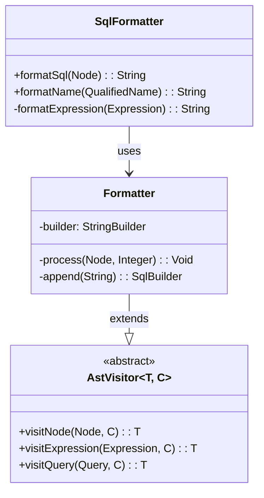
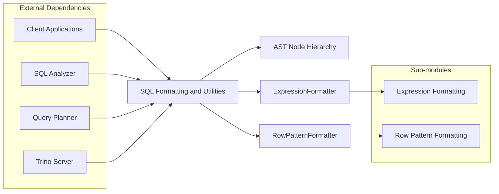

# SQL Formatting and Utilities Module

## Overview

The SQL Formatting and Utilities module is a core component of Trino's SQL Parser & AST system, providing essential functionality for SQL query formatting and utility operations. This module serves as the bridge between parsed SQL AST (Abstract Syntax Tree) nodes and their human-readable string representations, enabling query visualization, debugging, and manipulation.

## Purpose and Core Functionality

The module provides two primary capabilities:

1. **SQL Formatting**: Converts SQL AST nodes back into properly formatted SQL strings
2. **Query Utilities**: Provides helper methods for creating and manipulating SQL AST nodes

These capabilities are fundamental for:
- Query plan visualization and debugging
- SQL query transformation and optimization
- Client-server communication
- Query logging and auditing
- Development tools and interfaces

## Architecture



## Core Components

### SqlFormatter
The `SqlFormatter` class is the primary component responsible for converting SQL AST nodes back into properly formatted SQL strings. It implements a comprehensive visitor pattern that traverses the entire AST hierarchy and generates corresponding SQL text.

**Key Features:**
- Complete SQL statement formatting (SELECT, INSERT, UPDATE, DELETE, etc.)
- Expression formatting with proper operator precedence
- Complex query structure support (JOINs, subqueries, CTEs)
- Advanced SQL features (window functions, pattern matching, JSON operations)
- Proper indentation and formatting for readability

**Architecture Pattern:**


**Supporting Components:**
- [Expression Formatting](Expression Formatting.md) - Handles formatting of SQL expressions
- [Row Pattern Formatting](Row Pattern Formatting.md) - Specialized formatting for MATCH_RECOGNIZE patterns

### QueryUtil
The `QueryUtil` class provides a comprehensive set of utility methods for creating and manipulating SQL AST nodes programmatically. It serves as a factory for building complex query structures without dealing with the verbose AST construction details.

**Key Features:**
- Simplified AST node creation
- Common query pattern builders
- Expression construction helpers
- Relation and table reference utilities
- Standard SQL function call builders

## Module Dependencies



## Integration with Trino Ecosystem

The SQL Formatting and Utilities module integrates seamlessly with other Trino components:

### SQL Parser & AST Integration
- Works directly with AST nodes generated by the parser infrastructure
- Provides round-trip capability (SQL text → AST → formatted SQL text)
- Maintains semantic equivalence between original and formatted queries

### Query Processing Pipeline Integration
- Used by the SQL Analyzer for query validation and transformation
- Supports the Query Planner in generating execution plans
- Enables query optimization through AST manipulation

### Client Interface Integration
- Powers the Trino CLI for query display and formatting
- Supports the JDBC driver for query transmission
- Enables the Web UI for query visualization

## Key Capabilities

### SQL Statement Support
The module supports formatting for all major SQL statement types:

- **Data Query Language (DQL)**: SELECT queries with complex joins, subqueries, CTEs
- **Data Manipulation Language (DML)**: INSERT, UPDATE, DELETE, MERGE operations
- **Data Definition Language (DDL)**: CREATE, ALTER, DROP statements for tables, views, schemas
- **Transaction Control**: START TRANSACTION, COMMIT, ROLLBACK
- **Session Management**: SET SESSION, RESET SESSION
- **Access Control**: GRANT, REVOKE, CREATE ROLE, SET ROLE

### Advanced SQL Features
- **Window Functions**: Complete support for window specifications and frame definitions
- **Pattern Matching**: MATCH_RECOGNIZE clause with complex pattern expressions
- **JSON Operations**: JSON_TABLE, JSON path expressions, and JSON functions
- **Table Functions**: Support for table-valued functions and arguments
- **Prepared Statements**: PREPARE, EXECUTE, DEALLOCATE statements

### Utility Functions
The QueryUtil component provides builders for:
- Creating identifiers and qualified names
- Building expressions and function calls
- Constructing SELECT statements with various clauses
- Creating table references and aliases
- Building ORDER BY and GROUP BY clauses

## Usage Patterns

### Formatting SQL Queries
```java
// Format an AST node back to SQL text
String formattedSql = SqlFormatter.formatSql(astNode);

// Format qualified names
String tableName = SqlFormatter.formatName(QualifiedName.of("schema", "table"));
```

### Building Queries Programmatically
```java
// Create a simple SELECT query
Query query = QueryUtil.simpleQuery(
    QueryUtil.selectList(QueryUtil.identifier("column1")),
    QueryUtil.table(QualifiedName.of("table1"))
);

// Build complex expressions
Expression condition = QueryUtil.logicalAnd(
    QueryUtil.equal(QueryUtil.identifier("id"), QueryUtil.identifier("value")),
    QueryUtil.functionCall("upper", QueryUtil.identifier("name"))
);
```

## Performance Considerations

The module is designed for efficiency:
- **StringBuilder-based formatting**: Minimizes string concatenation overhead
- **Visitor pattern implementation**: Efficient AST traversal without recursion overhead
- **Lazy evaluation**: Components are formatted only when needed
- **Memory efficiency**: Minimal object creation during formatting process

## Extension Points

The module provides several extension points for customization:
- **Custom formatters**: Override formatting behavior for specific node types
- **Expression formatting**: Extend ExpressionFormatter for custom expression types
- **Utility methods**: Add custom QueryUtil methods for domain-specific query building

## Related Documentation

For more detailed information about related components, see:
- [AST Node Hierarchy](AST Node Hierarchy.md) - Detailed documentation of AST node types
- [Parser Infrastructure](Parser Infrastructure.md) - SQL parsing and AST generation
- [Expression Formatting](Expression Formatting.md) - Detailed documentation of expression formatting
- [Row Pattern Formatting](Row Pattern Formatting.md) - Specialized formatting for MATCH_RECOGNIZE patterns
- [SQL Analyzer](SQL Analyzer.md) - Query analysis and validation
- [Query Planner & Plan Representation](Query Planner & Plan Representation.md) - Query planning and optimization

## Conclusion

The SQL Formatting and Utilities module is a critical component that enables Trino to provide comprehensive SQL processing capabilities. Its dual role in formatting and utility operations makes it essential for query processing, client interfaces, and development tools. The module's comprehensive support for SQL standards and advanced features ensures that Trino can handle complex analytical workloads while maintaining code quality and performance.