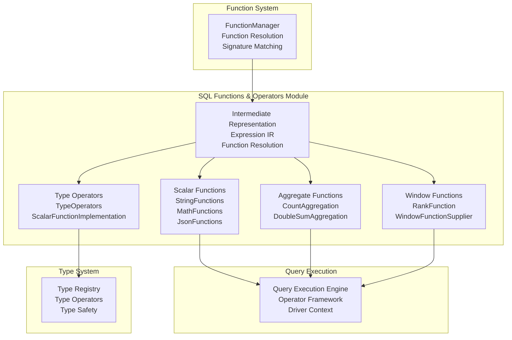
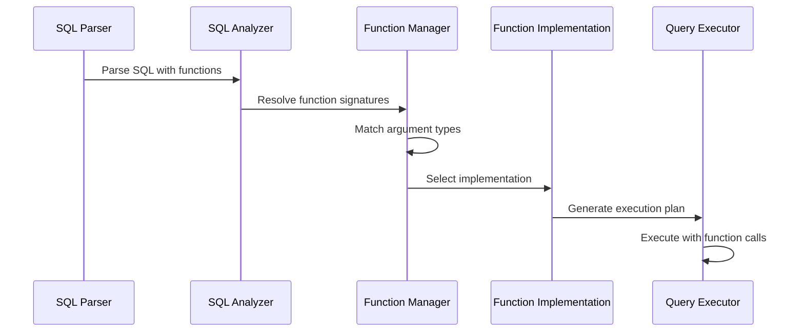

# SQL Functions & Operators Module

## Overview

The SQL Functions & Operators module is a core component of Trino that provides the implementation of all built-in SQL functions, operators, and aggregate functions. This module serves as the computational engine for SQL expressions, enabling users to perform data transformations, calculations, and aggregations within their queries.

## Purpose and Scope

The module implements:
- **Scalar Functions**: Single-row operations like string manipulation, mathematical calculations, and type conversions
- **Aggregate Functions**: Multi-row operations like SUM, COUNT, AVG that combine data across multiple rows
- **Window Functions**: Advanced analytical functions that operate over ordered partitions of data
- **Operators**: Binary and unary operations like +, -, *, /, =, <, >
- **Type System Integration**: Seamless integration with Trino's type system for type-safe operations

## Architecture Overview



## Core Components

### 1. Scalar Functions
Scalar functions operate on individual values and return a single result per input row. The module provides comprehensive implementations for:

- **String Functions**: Text manipulation, pattern matching, encoding/decoding
- **Mathematical Functions**: Arithmetic, trigonometric, statistical operations
- **JSON Functions**: JSON parsing, extraction, manipulation
- **Date/Time Functions**: Temporal calculations and formatting
- **Type Conversion Functions**: Safe type casting and conversion

### 2. Aggregate Functions
Aggregate functions combine multiple rows into a single result. Key implementations include:

- **Count Aggregation**: Row counting with NULL handling
- **Sum Aggregation**: Numeric summation with overflow protection
- **Average/Mean**: Statistical averaging with proper NULL handling
- **Min/Max**: Extremum finding across data sets

### 3. Window Functions
Window functions perform calculations across ordered partitions of data:

- **Ranking Functions**: ROW_NUMBER, RANK, DENSE_RANK
- **Analytical Functions**: LAG, LEAD, FIRST_VALUE, LAST_VALUE
- **Statistical Functions**: Moving averages, cumulative sums

### 4. Type Operators
Type-specific operations ensuring type safety and proper semantics:

- **Comparison Operators**: Type-aware comparisons
- **Arithmetic Operators**: Numeric operations with proper overflow handling
- **Logical Operators**: Boolean logic with three-valued logic support
- **String Operators**: Concatenation, pattern matching

## Function Resolution and Execution



## Integration with Other Modules

### Function System Integration
The module integrates with the [Function System](Function System.md) for:
- Function registration and discovery
- Signature matching and type resolution
- Dynamic function loading from plugins

### Type System Integration
Close integration with the [Type System](Type System.md) ensures:
- Type-safe function execution
- Proper type coercion and casting
- Type-specific optimization

### Query Execution Integration
Integration with the [Query Execution Engine](Query Execution Engine.md) provides:
- Vectorized function execution
- Parallel processing capabilities
- Memory-efficient operation

## Performance Optimizations

### Vectorized Execution
Functions are designed to work with Trino's columnar data format:
- Batch processing of multiple values
- SIMD optimizations where applicable
- Minimal memory allocation during execution

### Specialized Implementations
Different implementations for different data types:
- Optimized paths for common types (BIGINT, DOUBLE, VARCHAR)
- Specialized algorithms for specific type combinations
- Fallback to generic implementations when needed

### Runtime Code Generation
For complex expressions, the module can:
- Generate optimized bytecode at runtime
- Inline function calls for better performance
- Optimize based on actual data characteristics

## Error Handling and Safety

### Type Safety
- Compile-time type checking
- Runtime type validation
- Safe type conversions with proper error handling

### Numeric Safety
- Overflow detection and handling
- Division by zero protection
- NaN and infinity handling for floating-point operations

### String Safety
- UTF-8 validation and handling
- Buffer overflow protection
- Proper NULL handling

## Extensibility

### Plugin Integration
The module supports extending functionality through:
- Custom scalar functions via plugins
- User-defined aggregate functions
- External function integration

### Function Categories

#### String Functions
- `length()`, `substring()`, `replace()`
- `lower()`, `upper()`, `trim()`
- `split()`, `concat()`, `strpos()`
- Advanced functions: `levenshtein_distance()`, `soundex()`

#### Mathematical Functions
- Basic arithmetic: `abs()`, `sign()`, `mod()`
- Trigonometric: `sin()`, `cos()`, `tan()`, `atan2()`
- Exponential: `exp()`, `log()`, `power()`, `sqrt()`
- Statistical: `random()`, `normal_cdf()`, `beta_cdf()`

#### JSON Functions
- `json_extract()`, `json_extract_scalar()`
- `json_array_length()`, `json_array_contains()`
- `json_parse()`, `json_format()`
- `is_json_scalar()`

#### Aggregate Functions
- `COUNT()`, `SUM()`, `AVG()`, `MIN()`, `MAX()`
- Statistical: `STDDEV()`, `VARIANCE()`
- String: `STRING_AGG()`, `ARRAY_AGG()`

#### Window Functions
- `ROW_NUMBER()`, `RANK()`, `DENSE_RANK()`
- `LAG()`, `LEAD()`, `FIRST_VALUE()`, `LAST_VALUE()`
- `NTILE()`, `PERCENT_RANK()`, `CUME_DIST()`

## Usage Examples

### String Operations
```sql
SELECT 
    upper(customer_name) as name_upper,
    substring(email, 1, position('@' in email) - 1) as username,
    replace(phone, '-', '') as clean_phone
FROM customers
```

### Mathematical Calculations
```sql
SELECT 
    round(price * 1.1, 2) as price_with_tax,
    sqrt(power(x, 2) + power(y, 2)) as distance,
    random() * 100 as random_score
FROM products
```

### JSON Processing
```sql
SELECT 
    json_extract_scalar(metadata, '$.user_id') as user_id,
    json_array_length(tags) as tag_count,
    json_array_contains(categories, 'electronics') as is_electronics
FROM product_data
```

### Window Functions
```sql
SELECT 
    employee_id,
    salary,
    rank() OVER (PARTITION BY department ORDER BY salary DESC) as salary_rank,
    lag(salary, 1) OVER (PARTITION BY department ORDER BY salary) as previous_salary
FROM employees
```

## Related Documentation

- [Function System](Function System.md) - Function registration and management
- [Type System](Type System.md) - Type definitions and operations
- [Query Execution Engine](Query Execution Engine.md) - Query execution framework
- [SQL Parser & AST](SQL Parser & AST.md) - SQL parsing and representation
- [SQL Analyzer, Planner & Optimizer](SQL Analyzer, Planner & Optimizer.md) - Query analysis and optimization

## Implementation Details

For detailed implementation information, see the sub-module documentation:

- [Scalar Functions](Scalar Functions.md) - Individual function implementations including string, mathematical, and JSON functions
- [Aggregate Functions](Aggregate Functions.md) - Multi-row aggregation logic with COUNT and SUM implementations
- [Window Functions](Window Functions.md) - Analytical function implementations including ranking functions
- [Function Implementation Framework](Function Implementation Framework.md) - Core framework for scalar, aggregation, and type operators