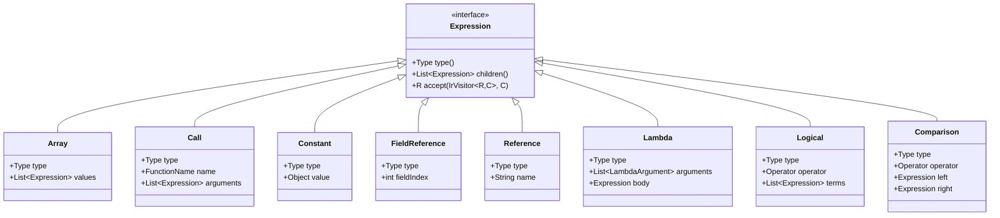
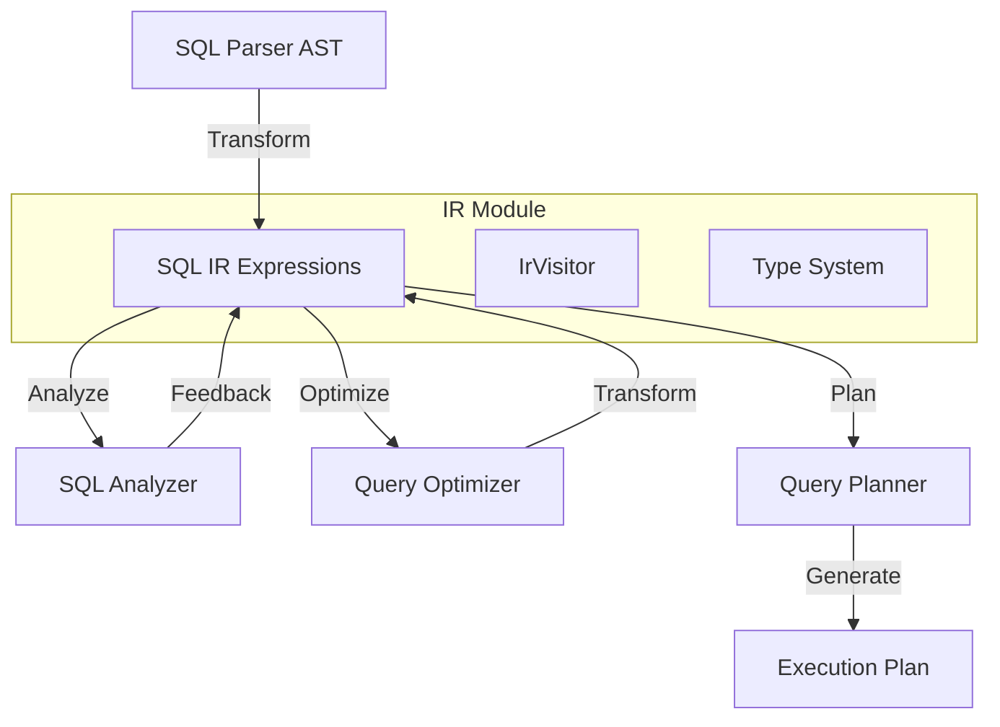
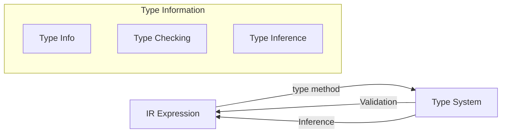
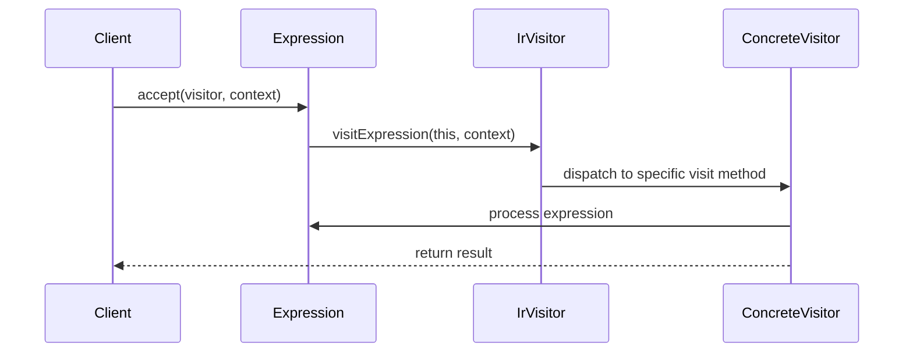
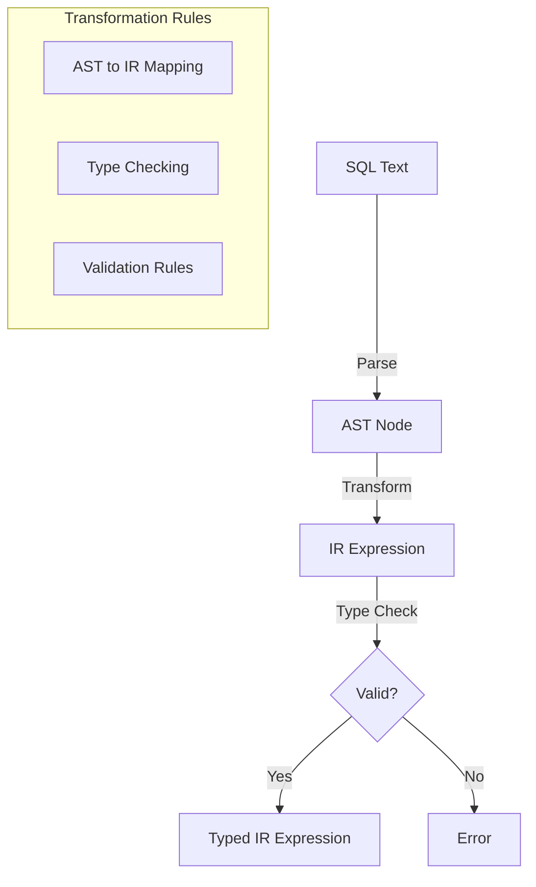
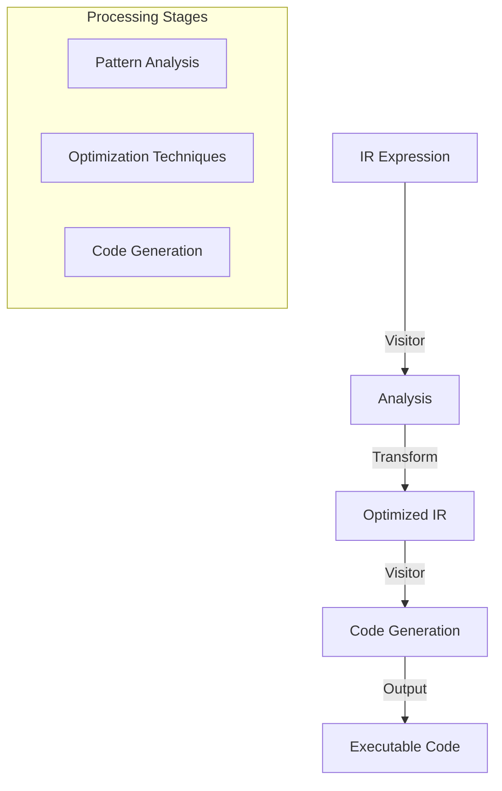

# SQL Intermediate Representation (IR) Module

## Introduction

The SQL Intermediate Representation (IR) module provides a normalized, type-safe representation of SQL expressions that serves as the bridge between the SQL Parser and the Query Planner/Optimizer components in Trino. This module transforms the raw Abstract Syntax Tree (AST) nodes into a more structured, analyzable format that can be efficiently processed by subsequent query processing stages.

## Purpose and Core Functionality

The SQL IR module serves several critical purposes in Trino's query processing pipeline:

1. **Expression Normalization**: Converts complex SQL expressions into a standardized intermediate format
2. **Type Safety**: Ensures all expressions carry type information for validation and optimization
3. **Visitor Pattern Support**: Provides a clean interface for traversing and transforming expressions
4. **Serialization Support**: Enables expressions to be serialized/deserialized for distributed processing
5. **Semantic Analysis Bridge**: Connects syntactic parsing with semantic analysis and planning

## Architecture

### Core Components



### Expression Hierarchy

The IR module implements a sealed interface hierarchy with the following expression types:

- **Array**: Represents array literals and constructors
- **Between**: Represents BETWEEN predicates
- **Bind**: Represents parameter binding
- **Call**: Represents function calls and operators
- **Case**: Represents CASE expressions
- **Cast**: Represents type casting operations
- **Coalesce**: Represents COALESCE functions
- **Comparison**: Represents comparison operators (=, <, >, etc.)
- **Constant**: Represents literal values
- **FieldReference**: Represents references to fields by index
- **In**: Represents IN predicates
- **IsNull**: Represents IS NULL predicates
- **Lambda**: Represents lambda expressions
- **Logical**: Represents logical operators (AND, OR, NOT)
- **NullIf**: Represents NULLIF functions
- **Reference**: Represents named references
- **Row**: Represents row constructors
- **Switch**: Represents SWITCH expressions

## Data Flow



## Component Relationships

### Integration with SQL Analyzer

The IR module works closely with the [SQL Analyzer](SQL%20Analyzer%2C%20Planner%20%26%20Optimizer.md) component:

- **Scope Resolution**: The `Scope` class uses IR expressions for field resolution
- **Type Inference**: The analyzer enriches IR expressions with type information
- **Validation**: Semantic validation is performed on IR expressions

### Integration with Query Planner

The IR module provides the foundation for the [Query Planner](SQL%20Analyzer%2C%20Planner%20%20%26%20Optimizer.md):

- **Expression Translation**: IR expressions are translated to execution-time representations
- **Optimization**: The planner transforms IR expressions for better performance
- **Code Generation**: IR expressions are compiled into executable code

### Integration with Type System

The IR module leverages Trino's [Type System](Trino%20SPI.md):



## Visitor Pattern Implementation

The IR module implements the visitor pattern through the `IrVisitor` interface, enabling:

- **Traversal**: Systematic traversal of expression trees
- **Transformation**: Expression transformation and rewriting
- **Analysis**: Expression analysis and validation
- **Code Generation**: Compilation to executable formats



## Serialization and Deserialization

The IR module uses Jackson annotations for JSON serialization:

- **@JsonTypeInfo**: Enables polymorphic serialization
- **@JsonSubTypes**: Defines concrete expression types
- **@JsonIgnore**: Excludes transient properties

This enables:
- **Distributed Processing**: Expressions can be serialized across nodes
- **Debugging**: Expressions can be logged and inspected
- **Persistence**: Query plans can be stored and restored

## Process Flow

### Expression Creation



### Expression Processing



## Key Features

### Type Safety
- All expressions carry type information
- Type checking occurs at IR level
- Prevents runtime type errors

### Immutability
- All IR expressions are immutable
- Enables safe sharing and caching
- Supports functional transformations

### Extensibility
- Sealed interface allows controlled extension
- Visitor pattern enables new operations
- Clean separation of concerns

### Performance
- Normalized representation enables optimizations
- Efficient traversal via visitor pattern
- Minimal memory overhead

## Usage Examples

### Expression Creation
```java
// Create a constant expression
Expression constant = new Constant(INTEGER, 42);

// Create a field reference
Expression fieldRef = new FieldReference(INTEGER, 0);

// Create a function call
Expression call = new Call(
    BOOLEAN,
    FunctionName.of("equals"),
    List.of(fieldRef, constant)
);
```

### Expression Analysis
```java
// Use visitor to analyze expressions
Expression expression = // ... create expression
ExpressionAnalyzer analyzer = new ExpressionAnalyzer();
AnalysisResult result = expression.accept(analyzer, context);
```

### Expression Transformation
```java
// Use visitor to transform expressions
Expression original = // ... original expression
ExpressionOptimizer optimizer = new ExpressionOptimizer();
Expression optimized = original.accept(optimizer, context);
```

## Dependencies

The IR module depends on:

- **[Trino SPI](Trino%20SPI.md)**: For type system integration
- **[SQL Parser](SQL%20Parser%20%26%20AST.md)**: For AST to IR transformation
- **[SQL Analyzer](SQL%20Analyzer%2C%20Planner%20%26%20Optimizer.md)**: For semantic analysis

## Related Documentation

- [SQL Parser & AST](SQL%20Parser%20%26%20AST.md) - Source of AST nodes that are transformed into IR
- [SQL Analyzer, Planner & Optimizer](SQL%20Analyzer%2C%20Planner%20%26%20Optimizer.md) - Consumers of IR expressions
- [Trino SPI](Trino%20SPI.md) - Type system and plugin integration
- [Query Execution Engine](Query%20Execution%20Engine.md) - Target of IR compilation

## Best Practices

1. **Always check types**: Use the type information for validation and optimization
2. **Use visitors**: Leverage the visitor pattern for systematic processing
3. **Maintain immutability**: Never modify IR expressions directly
4. **Handle all cases**: Ensure visitor implementations handle all expression types
5. **Cache results**: Consider caching analysis results for expensive operations

## Future Enhancements

Potential areas for improvement:

- **Additional Expression Types**: Support for new SQL constructs
- **Optimization Hints**: Embed optimization hints in IR
- **Better Error Messages**: Enhanced error reporting with IR context
- **Performance Metrics**: Built-in performance tracking for expressions