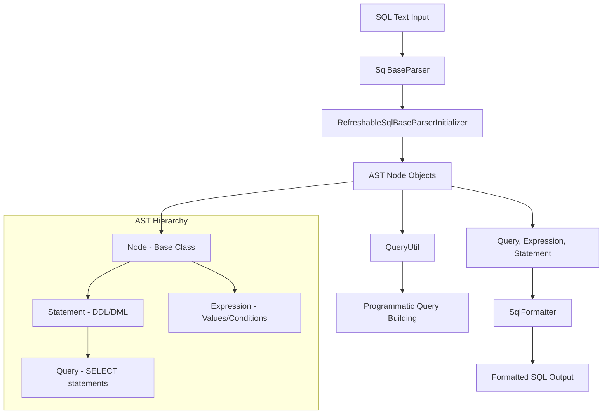
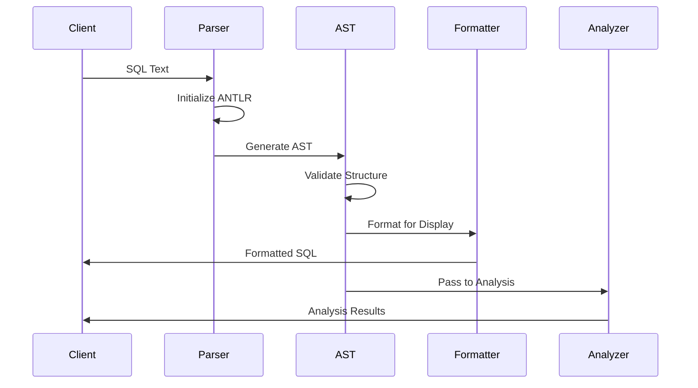

# SQL Parser & AST Module

## Overview

The SQL Parser & AST module is a fundamental component of Trino's query processing pipeline, responsible for parsing SQL text into an Abstract Syntax Tree (AST) representation. This module serves as the entry point for all SQL queries, transforming raw SQL strings into structured, programmatically accessible representations that can be analyzed, optimized, and executed by downstream components.

## Purpose and Core Functionality

The primary responsibilities of the SQL Parser & AST module include:

1. **SQL Text Parsing**: Converting SQL query strings into structured AST representations
2. **Syntax Validation**: Ensuring SQL queries conform to Trino's SQL grammar
3. **AST Representation**: Providing a comprehensive object model for all SQL constructs
4. **SQL Formatting**: Converting AST back to formatted SQL text for display and debugging
5. **Query Utilities**: Offering helper functions for programmatic query construction

## Architecture Overview

## Core Components

### 1. Parser Infrastructure

The parser infrastructure manages the ANTLR-based parsing system with performance optimizations.

**Key Component:**
- **RefreshableSqlBaseParserInitializer**: Manages ANTLR parser cache initialization for performance optimization
  - Thread-safe parser cache management
  - Lazy initialization of ANTLR ATN (Augmented Transition Network) structures
  - Reduces parsing overhead for repeated queries

For detailed information, see [Parser Infrastructure](Parser Infrastructure.md).

### 2. AST Node Hierarchy

The AST node hierarchy provides a comprehensive object model for representing SQL constructs.

**Core Classes:**
- **Node**: Abstract base class for all AST nodes with location tracking and visitor pattern support
- **Statement**: Base class for all SQL statements (DDL, DML, etc.)
- **Expression**: Base class for all SQL expressions (literals, functions, operators)
- **Query**: Represents SELECT queries with support for CTEs, functions, session properties, ordering, and limits

For detailed information, see [AST Node Hierarchy](AST Node Hierarchy.md).

### 3. SQL Formatting and Utilities

The formatting and utilities components provide tools for working with AST representations.

**Key Components:**
- **SqlFormatter**: Converts AST nodes back to formatted SQL strings with proper indentation and keyword casing
- **QueryUtil**: Provides utility methods for programmatic query construction with builder patterns

For detailed information, see [SQL Formatting and Utilities](SQL Formatting and Utilities.md).

## Data Flow

## Integration with Other Modules

### Upstream Dependencies
- **Client Libraries**: JDBC, CLI, and Web UI send SQL text to the parser
- **Server API**: REST endpoints receive SQL queries for parsing

### Downstream Consumers
- **[SQL Analyzer, Planner & Optimizer](SQL Analyzer, Planner & Optimizer.md)**: Receives AST for semantic analysis and query planning
- **[Query Execution Engine](Query Execution Engine.md)**: Executes the physical plan derived from AST
- **[Metadata & Connector Abstraction](Metadata & Connector Abstraction.md)**: Uses AST for metadata operations

## Key Features

### 1. Comprehensive SQL Support
The parser supports the full range of SQL constructs including:
- SELECT queries with complex joins, subqueries, CTEs
- DDL statements (CREATE, ALTER, DROP)
- DML statements (INSERT, UPDATE, DELETE, MERGE)
- Transaction control (START, COMMIT, ROLLBACK)
- Security statements (GRANT, REVOKE, ROLES)
- Advanced features (window functions, pattern matching, JSON operations)

### 2. Extensible Architecture
- Visitor pattern allows easy AST traversal and transformation
- Immutable AST nodes ensure thread safety
- Location tracking enables precise error reporting

### 3. Performance Optimization
- Cached parser initialization reduces parsing overhead
- Efficient AST representation minimizes memory usage
- Fast formatting for query display and logging

## Error Handling

The parser provides detailed error information including:
- Precise location information (line, column)
- Contextual error messages
- Suggestions for syntax corrections

## Testing and Validation

The module includes comprehensive test coverage:
- Unit tests for individual AST nodes
- Integration tests with the full parsing pipeline
- Fuzzing tests for robustness
- Performance benchmarks for parsing speed

## Future Enhancements

Potential areas for improvement:
- Incremental parsing for large queries
- Better error recovery for partial statements
- Enhanced support for SQL standard compliance
- Performance optimizations for complex queries

## Related Documentation

- [SQL Analyzer, Planner & Optimizer](SQL Analyzer, Planner & Optimizer.md) - Processes the AST for semantic analysis
- [Trino SPI](Trino SPI.md) - Provides type system and connector interfaces
- [Query Execution Engine](Query Execution Engine.md) - Executes plans derived from AST
- [Trino CLI](Trino CLI.md) - Command-line interface that sends SQL to parser
- [Trino JDBC Driver](Trino JDBC Driver.md) - JDBC driver that submits SQL queries