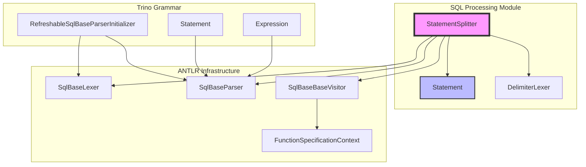
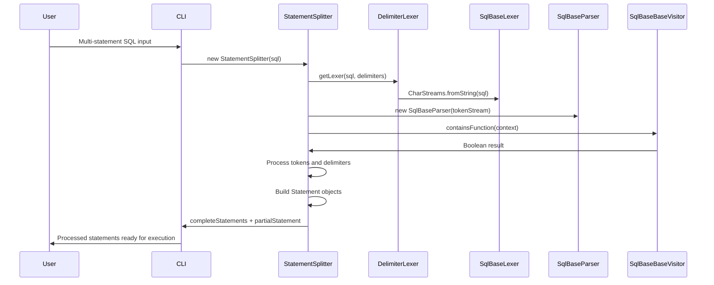
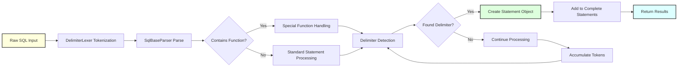

# SQL Processing Module

## Introduction

The SQL Processing module is a critical component of the Trino CLI that handles the lexical analysis and parsing of SQL statements. It provides intelligent statement splitting capabilities, allowing users to execute multiple SQL statements in a single input and handling complex SQL constructs such as function definitions. The module serves as the entry point for SQL text processing in the Trino command-line interface, bridging the gap between raw user input and the Trino SQL parser.

## Architecture Overview

The SQL Processing module is built around the `StatementSplitter` class, which leverages ANTLR-based lexical analysis to intelligently parse and split SQL statements. The architecture integrates with Trino's SQL grammar infrastructure to provide robust statement processing capabilities.

## Core Components

### StatementSplitter

The `StatementSplitter` class is the primary component responsible for parsing and splitting SQL statements. It provides sophisticated statement processing capabilities that go beyond simple string splitting.

**Key Features:**
- **Intelligent Delimiter Recognition**: Supports configurable statement delimiters (default: semicolon)
- **Function-Aware Parsing**: Special handling for function specifications to prevent incorrect splitting
- **Partial Statement Detection**: Identifies incomplete statements for multi-line input scenarios
- **Statement Normalization**: Provides utilities for statement squeezing and empty statement detection

**Core Methods:**
- `getCompleteStatements()`: Returns a list of complete, well-formed SQL statements
- `getPartialStatement()`: Returns any remaining partial statement text
- `squeezeStatement()`: Normalizes whitespace in SQL statements
- `isEmptyStatement()`: Determines if a statement contains only whitespace or comments

### Statement Class

The `Statement` class represents a complete SQL statement with its associated terminator. It provides immutable storage for parsed statements with proper equality and hashing semantics.

**Properties:**
- `statement()`: The actual SQL statement text
- `terminator()`: The delimiter that terminated the statement
- Immutable design with proper `equals()`, `hashCode()`, and `toString()` implementations

### DelimiterLexer Integration

The module integrates with a custom `DelimiterLexer` that extends the base ANTLR lexer to provide delimiter-aware tokenization. This allows for flexible statement termination based on user-defined or default delimiters.

## Data Flow Architecture

## Integration with Trino Parser

The SQL Processing module serves as a preprocessing layer for the Trino SQL parser infrastructure. It integrates with several key components:

### Parser Infrastructure
- **RefreshableSqlBaseParserInitializer**: Manages ANTLR parser and lexer cache initialization
- **SqlBaseLexer**: Provides tokenization based on Trino's SQL grammar
- **SqlBaseParser**: Generates parse trees for SQL statements
- **SqlBaseBaseVisitor**: Enables traversal of parse trees for function detection

### AST Node Hierarchy
The module works with Trino's Abstract Syntax Tree (AST) representation:
- **Statement**: Base class for all SQL statements
- **Expression**: Represents SQL expressions within statements
- **Node**: Base class for all AST nodes

## Statement Processing Workflow

## Key Features and Capabilities

### Multi-Statement Support
The module can handle multiple SQL statements in a single input string, properly splitting them based on configured delimiters while respecting SQL syntax rules.

### Function-Aware Processing
Special handling for function specifications prevents incorrect statement splitting within function bodies, which may contain semicolons or other delimiter characters.

### Partial Statement Handling
The module can detect when a statement is incomplete (e.g., missing terminator), allowing the CLI to prompt for additional input in interactive mode.

### Statement Validation
Provides utilities to validate statement content, including detection of empty statements and normalization of whitespace.

## Dependencies and Integration

### Direct Dependencies
- **ANTLR Runtime**: For lexical analysis and parsing
- **Google Guava**: For immutable collections and utilities
- **Trino Grammar**: SQL grammar definitions and parser infrastructure

### Related Modules
- **[SQL Parser & AST](SQL Parser & AST.md)**: Provides the underlying parsing infrastructure
- **[Trino CLI](Trino CLI.md)**: The main CLI application that uses this module
- **[Trino Client Library](Trino Client Library.md)**: Client-side query execution framework

## Usage Patterns

### Interactive CLI Usage
In interactive mode, the StatementSplitter processes user input line by line, handling multi-line statements and detecting when additional input is needed.

### Batch Processing
For script execution, the module can process entire files containing multiple SQL statements, properly splitting them for sequential execution.

### Statement Validation
The module provides utilities for validating SQL syntax before execution, helping to catch errors early in the processing pipeline.

## Error Handling and Edge Cases

### Syntax Errors
The module gracefully handles syntax errors by removing error listeners from the parser, allowing partial processing to continue.

### Complex Statements
Special handling for complex statements including:
- Function definitions with embedded delimiters
- Multi-line comments and string literals
- Nested SQL constructs

### Empty and Whitespace-Only Statements
The module provides utilities to detect and handle empty statements, preventing unnecessary processing overhead.

## Performance Considerations

### Token Stream Caching
The module leverages ANTLR's token stream caching to avoid re-tokenizing the same input multiple times.

### Efficient String Building
Uses StringBuilder for efficient string concatenation during statement assembly.

### Immutable Data Structures
Employs Guava's immutable collections for thread-safe, memory-efficient storage of parsed statements.

## Testing and Validation

The module's functionality is validated through comprehensive test suites that cover:
- Basic statement splitting scenarios
- Complex multi-statement inputs
- Edge cases with functions and special characters
- Performance benchmarks for large inputs

## Future Enhancements

Potential areas for enhancement include:
- Support for additional SQL dialects and custom grammars
- Enhanced error reporting with position information
- Integration with SQL formatting and beautification tools
- Support for parameterized statements and prepared queries

## Conclusion

The SQL Processing module serves as a crucial foundation for SQL text processing in the Trino CLI. Its intelligent parsing capabilities, robust error handling, and seamless integration with Trino's parser infrastructure make it an essential component for reliable SQL statement processing. The module's design allows for flexible configuration while maintaining high performance and accuracy in statement detection and splitting.