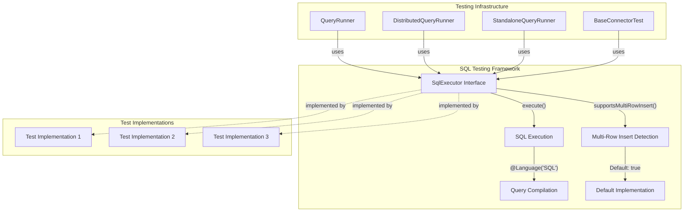
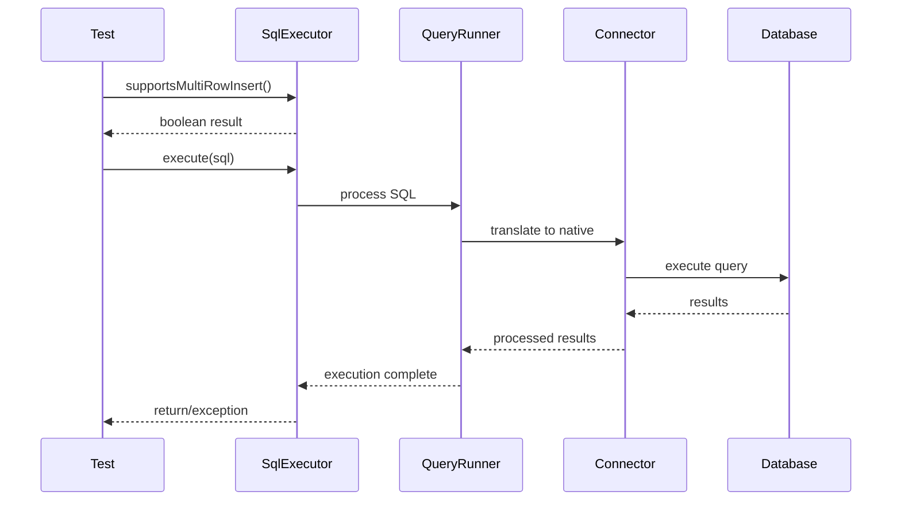

# SQL Testing Framework

## Introduction

The SQL Testing Framework is a core component of Trino's testing infrastructure that provides a standardized interface for executing SQL statements in test environments. This framework serves as the foundation for database-agnostic SQL testing across different connectors and data sources, enabling consistent testing patterns throughout the Trino ecosystem.

The framework abstracts the complexity of SQL execution details while providing essential testing capabilities like multi-row insert support detection and parameterized query execution. It forms the backbone of Trino's comprehensive testing strategy, supporting everything from unit tests to integration tests across distributed query environments.

## Architecture Overview

The SQL Testing Framework is designed with simplicity and extensibility in mind, providing a minimal yet powerful interface that can be implemented by various testing scenarios. The architecture follows the interface segregation principle, offering only the essential methods needed for SQL testing while allowing implementers to add additional functionality as required.



## Core Components

### SqlExecutor Interface

The `SqlExecutor` interface is the cornerstone of the SQL Testing Framework, providing a contract for SQL execution in test environments. Located at `testing.trino-testing.src.main.java.io.trino.testing.sql.SqlExecutor.SqlExecutor`, this interface defines the essential methods required for SQL testing.

#### Key Features

- **Multi-row Insert Support Detection**: The `supportsMultiRowInsert()` method allows tests to determine whether the underlying database or connector supports multi-row insert operations. This is crucial for writing portable tests that work across different SQL dialects and storage systems.

- **Parameterized SQL Execution**: The `execute()` method accepts SQL strings annotated with `@Language("SQL")`, providing IDE support and syntax highlighting while ensuring type safety during development.

- **Default Implementation**: The interface provides sensible defaults, with multi-row insert support enabled by default, reducing boilerplate code for common testing scenarios.

#### Interface Definition

```java
public interface SqlExecutor
{
    default boolean supportsMultiRowInsert()
    {
        return true;
    }

    void execute(@Language("SQL") String sql);
}
```

## Integration with Testing Infrastructure

The SQL Testing Framework integrates seamlessly with Trino's broader testing ecosystem, providing the SQL execution foundation for various testing scenarios.

### QueryRunner Integration

The framework is extensively used by different QueryRunner implementations:

- **QueryRunner**: The base interface for query execution in tests
- **DistributedQueryRunner**: Handles distributed query execution scenarios
- **StandaloneQueryRunner**: Manages single-node testing environments

These runners implement the `SqlExecutor` interface to provide consistent SQL execution capabilities across different deployment models.

### Connector Testing

The [BaseConnectorTest](BaseConnectorTest.md) leverages the SQL Testing Framework to provide comprehensive connector validation. This includes:

- Schema creation and management
- Data insertion and retrieval
- Query result validation
- Performance testing
- Error condition testing

## Data Flow Architecture



## Usage Patterns

### Basic SQL Execution

The primary use case involves direct SQL execution for test setup, data manipulation, and validation:

```java
SqlExecutor executor = // obtain implementation
executor.execute("CREATE TABLE test_table (id INT, name VARCHAR(50))");
executor.execute("INSERT INTO test_table VALUES (1, 'test')");
```

### Multi-Row Insert Detection

Tests can adapt their behavior based on multi-row insert support:

```java
if (executor.supportsMultiRowInsert()) {
    executor.execute("INSERT INTO test_table VALUES (2, 'test2'), (3, 'test3')");
} else {
    executor.execute("INSERT INTO test_table VALUES (2, 'test2')");
    executor.execute("INSERT INTO test_table VALUES (3, 'test3')");
}
```

### Integration with Test Assertions

The framework works in conjunction with [TrinoExceptionAssert](TrinoExceptionAssert.md) for comprehensive error testing:

```java
// Execute SQL that should fail
assertThatThrownBy(() -> executor.execute("INVALID SQL"))
    .isInstanceOf(SQLException.class);
```

## Dependencies and Relationships

The SQL Testing Framework has minimal dependencies by design, making it lightweight and portable:

### Internal Dependencies

- **IntelliJ Annotations**: Uses `@Language("SQL")` for IDE support and syntax validation
- **Java Standard Library**: Relies on standard exception handling and string processing

### Related Modules

- **[QueryRunner Infrastructure](QueryRunner.md)**: Provides the execution context for SQL operations
- **[BaseConnectorTest](BaseConnectorTest.md)**: Uses SQL Testing Framework for connector validation
- **[MaterializedResult](MaterializedResult.md)**: Handles result set processing and validation
- **[TrinoExceptionAssert](TrinoExceptionAssert.md)**: Provides assertion capabilities for SQL error testing

## Extension Points

The framework is designed for extensibility, allowing implementers to add functionality while maintaining compatibility:

### Custom Implementations

Implementers can create specialized `SqlExecutor` instances for different testing scenarios:

- **Database-specific executors**: Handle vendor-specific SQL dialects
- **Mock executors**: Provide controlled execution environments for unit testing
- **Performance-focused executors**: Add timing and profiling capabilities

### Enhanced Interfaces

The base interface can be extended to provide additional capabilities:

```java
public interface BatchSqlExecutor extends SqlExecutor {
    void executeBatch(List<String> sqlStatements);
    boolean supportsTransactions();
    void beginTransaction();
    void commitTransaction();
    void rollbackTransaction();
}
```

## Best Practices

### SQL Injection Prevention

Always use parameterized queries or proper SQL escaping when incorporating dynamic values:

```java
// Good: Use parameterized approach
String sql = String.format("SELECT * FROM %s WHERE id = %d", 
    tableName, id); // Ensure proper validation
executor.execute(sql);
```

### Error Handling

Implement robust error handling to provide meaningful test failure messages:

```java
try {
    executor.execute(sql);
} catch (SQLException e) {
    throw new AssertionError("Failed to execute SQL: " + sql, e);
}
```

### Test Isolation

Ensure SQL execution doesn't interfere with other tests through proper cleanup:

```java
@AfterEach
void cleanup() {
    try {
        executor.execute("DROP TABLE IF EXISTS test_table");
    } catch (SQLException e) {
        // Log but don't fail cleanup
    }
}
```

## Testing Scenarios

The SQL Testing Framework supports various testing scenarios across the Trino ecosystem:

### Connector Testing

Validates connector behavior across different SQL operations:
- Data type handling
- Query pushdown capabilities
- Transaction support
- Error handling

### Function Testing

Tests SQL functions and operators:
- Scalar function evaluation
- Aggregate function behavior
- Window function processing
- Type conversion operations

### Performance Testing

Supports performance validation scenarios:
- Query execution timing
- Resource utilization monitoring
- Scalability testing
- Benchmark comparisons

## Future Enhancements

The SQL Testing Framework is designed to evolve with Trino's testing needs:

### Planned Features

- **Async SQL Execution**: Support for non-blocking SQL operations
- **Batch Processing**: Enhanced batch execution capabilities
- **Transaction Management**: Expanded transaction support for complex testing scenarios
- **Performance Metrics**: Built-in performance monitoring and reporting

### Integration Opportunities

- **Test Reporting**: Enhanced integration with test result reporting systems
- **CI/CD Pipeline**: Better support for continuous integration workflows
- **Cloud Testing**: Enhanced support for cloud-based testing environments
- **Multi-database Testing**: Improved support for cross-database validation

## Conclusion

The SQL Testing Framework provides a solid foundation for SQL-based testing across the Trino ecosystem. Its minimalist design, combined with powerful extensibility capabilities, makes it an essential tool for ensuring the quality and reliability of Trino's SQL processing capabilities. By providing a consistent interface for SQL execution, the framework enables developers to write portable, maintainable tests that work across different connectors and deployment scenarios.