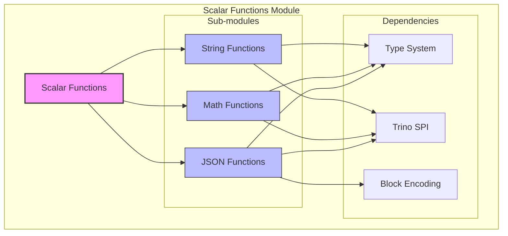
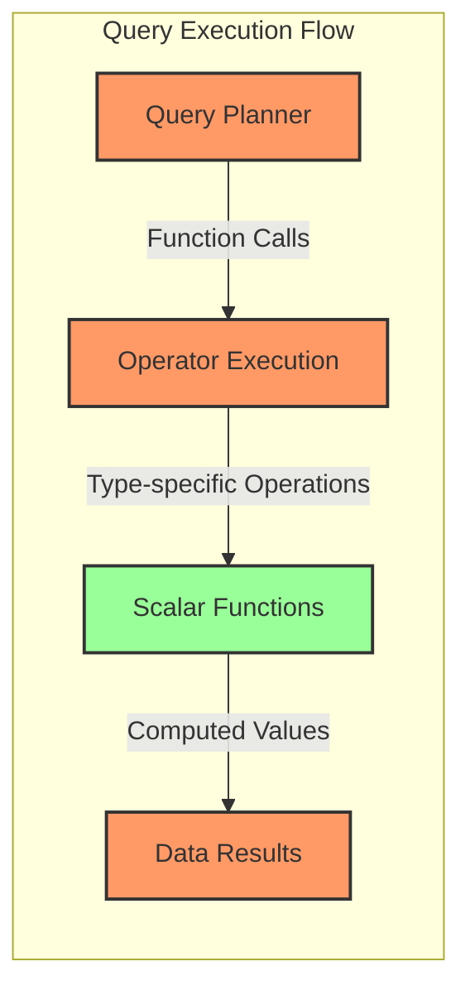

# Scalar Functions Module

## Overview

The Scalar Functions module is a core component of Trino's SQL function system, providing the implementation of built-in scalar functions that operate on individual values. This module contains the actual function implementations for string manipulation, mathematical operations, and JSON processing, forming the computational backbone of Trino's query execution engine.

## Purpose and Scope

Scalar functions are fundamental SQL functions that take one or more input values and return a single output value. The Scalar Functions module implements these functions with high performance, proper type safety, and comprehensive error handling. The module serves as the bridge between Trino's type system and the actual computational logic, enabling users to perform complex data transformations directly within SQL queries.

## Architecture

The Scalar Functions module is organized into three primary sub-modules, each specializing in different categories of scalar operations:

## Function Categories

### String Functions
The String Functions sub-module provides comprehensive string manipulation capabilities, including:
- **Text Processing**: substring extraction, string replacement, case conversion
- **Unicode Support**: proper handling of UTF-8 encoded strings and code points
- **Pattern Matching**: string position finding, prefix/suffix checking
- **Text Transformation**: trimming, padding, reversal operations
- **Advanced Operations**: Levenshtein distance, Hamming distance, Soundex encoding

### Mathematical Functions  
The Math Functions sub-module implements a complete mathematical function library:
- **Basic Arithmetic**: absolute value, rounding, truncation operations
- **Trigonometric Functions**: sine, cosine, tangent and their inverses
- **Exponential Functions**: power, logarithm, square root operations
- **Statistical Functions**: normal distribution, beta distribution, t-distribution
- **Advanced Math**: cosine similarity, width bucketing, base conversions

### JSON Functions
The JSON Functions sub-module provides JSON data processing capabilities:
- **JSON Validation**: checking if strings contain valid JSON
- **Data Extraction**: extracting values using JSONPath expressions
- **Array Operations**: array length, element access, containment checking
- **Format Conversion**: parsing and formatting JSON data

## Integration with Trino System

The Scalar Functions module integrates deeply with Trino's execution engine:

## Key Features

### Type Safety
All scalar functions are strongly typed with compile-time type checking, ensuring data integrity and preventing runtime type errors.

### Performance Optimization
Functions are implemented with performance in mind, utilizing efficient algorithms and memory management techniques suitable for large-scale data processing.

### Unicode Compliance
String functions properly handle Unicode text, supporting multi-byte characters and maintaining correct code point boundaries.

### Error Handling
Comprehensive error handling with meaningful error messages for invalid inputs, overflow conditions, and domain errors.

### Extensibility
The module provides a foundation for adding new scalar functions through Trino's plugin architecture.

## Related Documentation

For detailed information about specific function implementations, refer to the sub-module documentation:

- [String Functions](String Functions.md) - Comprehensive string manipulation operations including substring extraction, pattern matching, Unicode handling, and text transformation
- [Math Functions](Math Functions.md) - Mathematical and statistical function implementations including trigonometric functions, statistical distributions, and advanced mathematical operations  
- [JSON Functions](JSON Functions.md) - JSON data processing and extraction functions including JSONPath support, array operations, and format conversion

For information about the broader function system architecture, see [Function Implementation Framework](SQL Functions & Operators.md).

For details about how scalar functions integrate with query execution, refer to [Query Execution Engine](Query Execution Engine.md).

For type system integration details, see [Type System](Trino SPI.md#type-system).