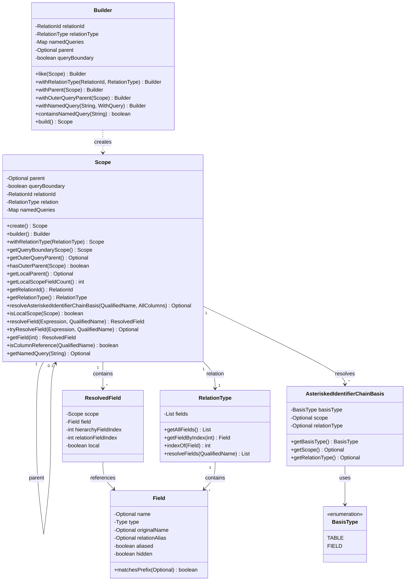
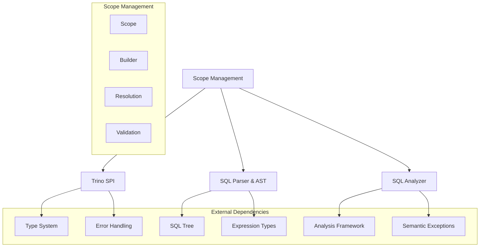
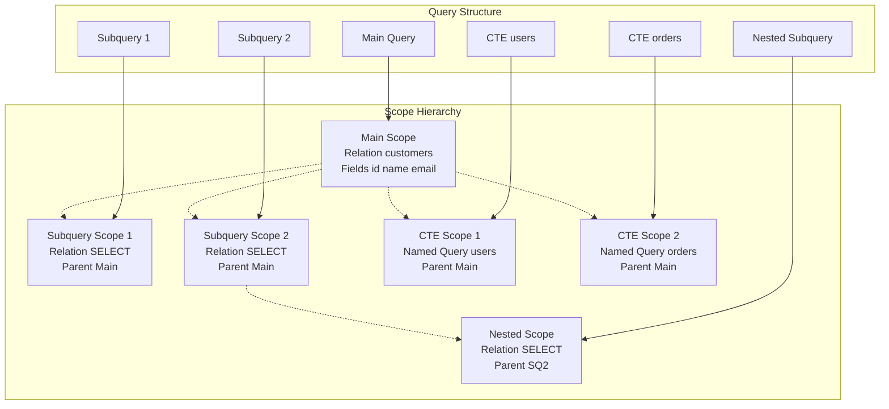
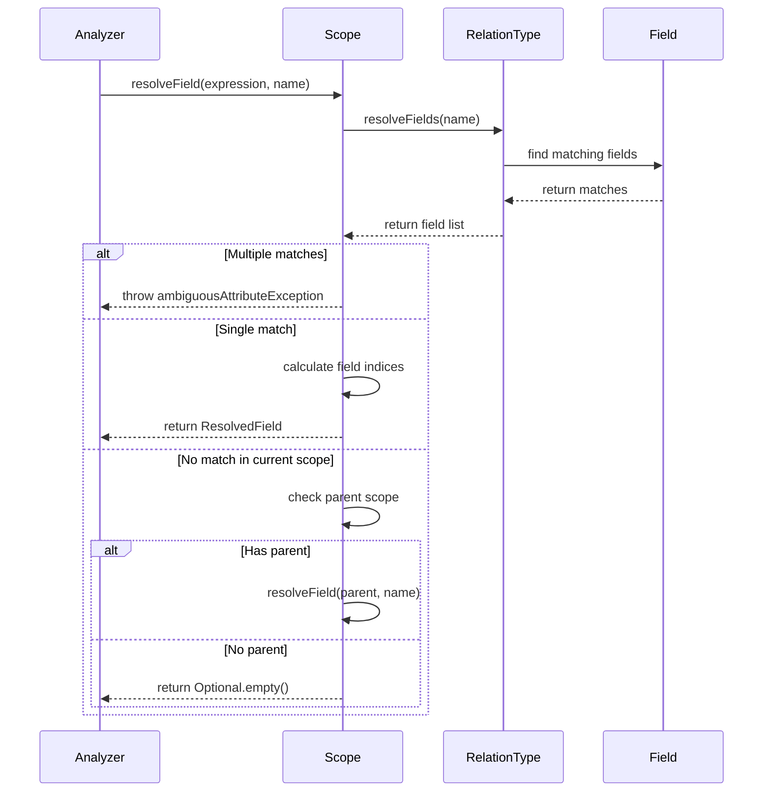
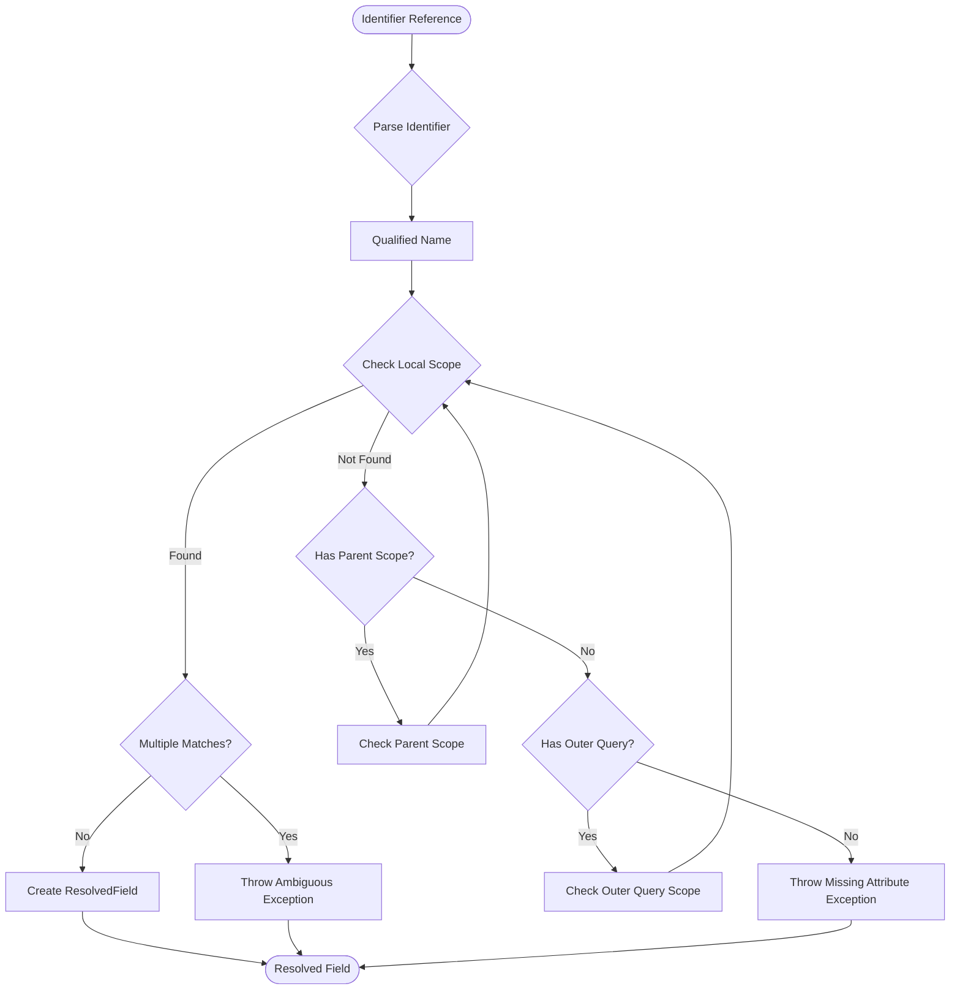
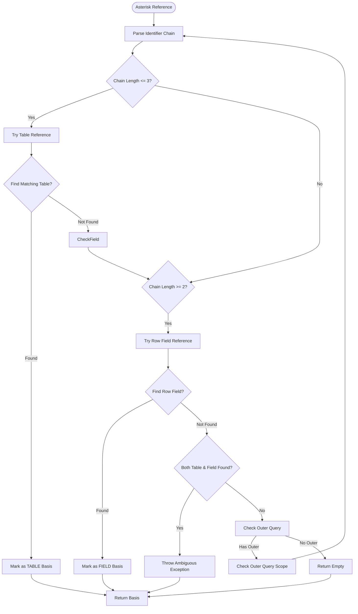
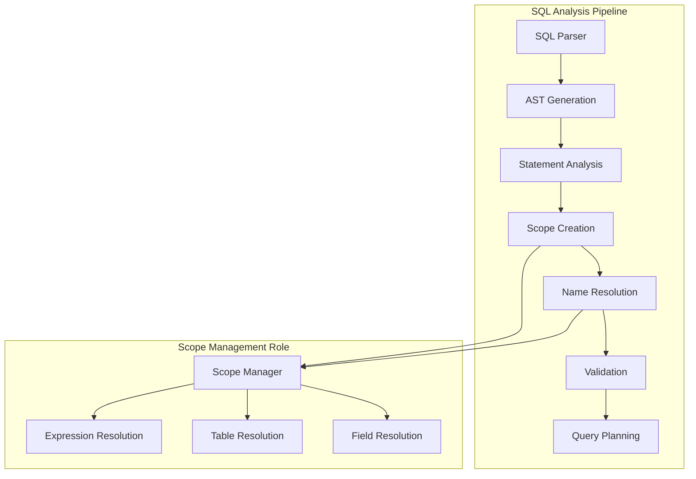

# Scope Management Module

## Introduction

The Scope Management module is a critical component of Trino's SQL Analyzer that manages the visibility and resolution of identifiers (tables, columns, expressions) during query analysis. It provides a hierarchical scoping mechanism that enables proper name resolution across different query contexts, including subqueries, joins, and nested expressions. The module ensures that SQL identifiers are correctly resolved according to SQL standard rules while maintaining proper isolation between different query scopes.

## Core Functionality

The Scope Management module provides:

- **Hierarchical Scope Resolution**: Manages nested scopes with parent-child relationships
- **Identifier Resolution**: Resolves table and column references within query contexts
- **Field Resolution**: Maps expressions to specific fields in relations
- **Named Query Management**: Handles CTE (Common Table Expression) references
- **Asterisk Resolution**: Resolves wildcard selections (`SELECT *`) with proper context
- **Scope Boundary Management**: Enforces query boundaries for proper isolation

## Architecture

### Core Components

### Module Dependencies

## Component Relationships

### Scope Hierarchy

### Field Resolution Process

## Data Flow

### Identifier Resolution Flow

### Asterisk Resolution Flow

## Key Features

### 1. Hierarchical Scope Management

The Scope class maintains a parent-child relationship between scopes, enabling proper name resolution across nested query contexts. Each scope can have:
- A parent scope for inheritance
- Query boundaries to isolate outer query contexts
- Local scope fields that are only visible within the current scope

### 2. Field Resolution

The field resolution mechanism handles:
- **Qualified Names**: Resolving `table.column` references
- **Ambiguous References**: Detecting and reporting ambiguous field references
- **Nested References**: Resolving fields in subqueries and CTEs
- **Outer Query References**: Allowing access to outer query fields

### 3. Asterisk Resolution

The asterisk resolution system implements SQL standard rules for:
- **Table References**: Resolving `table.*` to all fields from a specific table
- **Row Field References**: Resolving `row_field.*` for structured types
- **Ambiguity Detection**: Preventing ambiguous asterisk references
- **Outer Scope Resolution**: Resolving asterisks in outer query contexts

### 4. Named Query Management

Handles Common Table Expressions (CTEs) by:
- Storing named queries in scope
- Enabling recursive CTE resolution
- Preventing duplicate CTE definitions
- Supporting CTE inheritance across scopes

## Integration with SQL Analyzer

### Analysis Process Integration

### Statement Analysis Integration

The Scope Management module integrates with various statement analyzers:

- **SELECT Statement Analysis**: Resolves column references, table aliases, and join conditions
- **FROM Clause Analysis**: Handles table references and alias resolution
- **WHERE Clause Analysis**: Resolves predicate expressions
- **ORDER BY Analysis**: Resolves sort expressions
- **GROUP BY Analysis**: Resolves grouping expressions
- **HAVING Analysis**: Resolves filter expressions

## Error Handling

### Semantic Exceptions

The module throws specific semantic exceptions for various error conditions:

- **AmbiguousNameException**: When multiple fields match a reference
- **MissingAttributeException**: When no field matches a reference
- **SemanticException**: For general semantic errors

### Error Context

Each exception includes:
- **Expression Context**: The expression that caused the error
- **Qualified Name**: The name that couldn't be resolved
- **Location Information**: Line and column numbers when available
- **Suggestion Context**: Hints for resolving the issue

## Performance Considerations

### Optimization Strategies

1. **Lazy Resolution**: Fields are resolved only when needed
2. **Caching**: Resolved fields are cached within scope
3. **Early Termination**: Resolution stops at first match
4. **Scope Reuse**: Scopes are reused across similar contexts

### Memory Management

- **Immutable Design**: Scopes are immutable for thread safety
- **Builder Pattern**: Efficient scope construction
- **Optional Usage**: Minimal memory overhead for absent values
- **Relation Sharing**: Relation types are shared across scopes

## Testing and Validation

### Unit Testing

The module includes comprehensive unit tests for:
- Basic field resolution
- Nested scope resolution
- Outer query references
- Asterisk resolution
- Error conditions
- Edge cases

### Integration Testing

Integration tests verify:
- Complex query scenarios
- Multi-level nesting
- CTE interactions
- Join resolution
- Subquery correlations

## Related Documentation

- [SQL Analyzer](SQL Analyzer.md) - Parent module that uses Scope Management
- [SQL Parser & AST](SQL Parser & AST.md) - Provides the AST nodes that Scope analyzes
- [Trino SPI](Trino SPI.md) - Provides the type system and error handling infrastructure
- [Query Execution Engine](Query Execution Engine.md) - Uses resolved scopes for query execution

## Conclusion

The Scope Management module is fundamental to Trino's query analysis capabilities, providing the infrastructure for proper name resolution and scope management. Its hierarchical design enables complex query scenarios while maintaining SQL standard compliance and providing clear error messages for debugging.