# Security Framework

The Security Framework provides comprehensive authentication, authorization, and access control capabilities for the distributed SQL query engine. It implements a multi-layered security model that protects data and system resources while maintaining the flexibility needed for diverse deployment scenarios. The framework operates at both the SPI level for connector integration and the server level for system-wide security management.

## Overview

The Security Framework serves as the central security orchestration layer in Trino, managing user authentication, query authorization, and fine-grained access control across all system components. It provides pluggable security implementations that allow organizations to integrate with existing security infrastructure while maintaining consistent security policies across the entire Trino cluster.

The framework operates at multiple levels:
- **System Level**: Controls access to system resources, catalogs, and global operations
- **Catalog Level**: Manages access to specific data sources and their metadata
- **Schema Level**: Controls schema-level operations and data access
- **Table/View Level**: Provides fine-grained access control to tables, views, and columns
- **Function Level**: Manages execution permissions for user-defined functions
- **Row/Column Level**: Implements dynamic data masking and row-level security

The framework consists of two main architectural layers:
- **SPI Security Components**: Core identity and security abstractions for connector integration
- **Server Security Management**: System-wide access control and authentication orchestration

## Architecture

### Overall Security Architecture

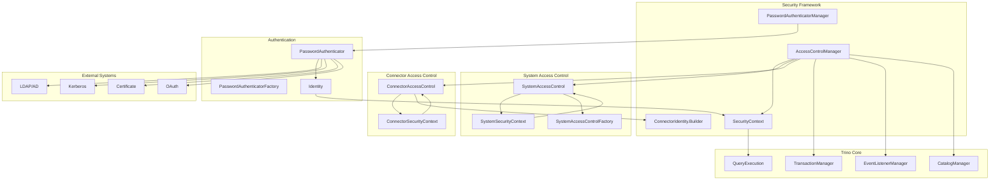

### SPI-Level Security Components

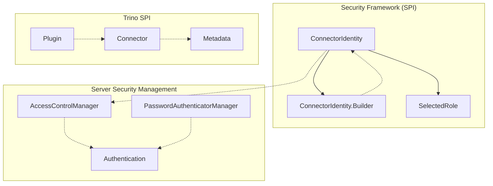

### Identity Management Architecture

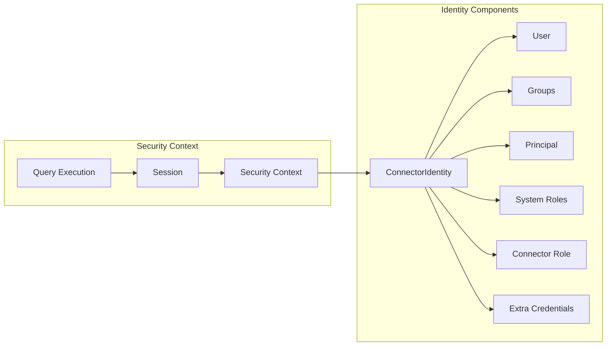

## Key Components

### ConnectorIdentity

The `ConnectorIdentity` class is the central component of the Security Framework, representing a user's identity within a specific connector context. It encapsulates all security-related information needed for authentication and authorization decisions.

#### Key Features:
- **User Identity**: Primary user identifier
- **Group Membership**: Set of groups the user belongs to
- **Principal**: Optional Java Principal object for authentication
- **System Roles**: Enabled system-level roles
- **Connector Roles**: Connector-specific role assignments
- **Extra Credentials**: Additional authentication credentials

#### Identity Structure:

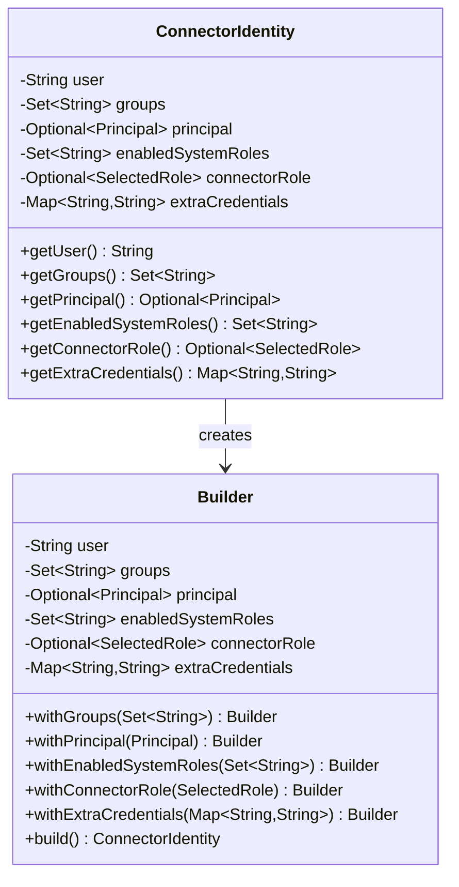

### Builder Pattern Implementation

The `ConnectorIdentity.Builder` class provides a fluent interface for constructing identity instances with various security attributes:

```java
// Example usage patterns
ConnectorIdentity identity = ConnectorIdentity.ofUser("alice");

ConnectorIdentity identityWithGroups = ConnectorIdentity.forUser("bob")
    .withGroups(Set.of("admin", "analytics"))
    .withPrincipal(new UsernamePrincipal("bob@company.com"))
    .withEnabledSystemRoles(Set.of("system_admin"))
    .withConnectorRole(new SelectedRole(SelectedRole.Type.ROLE, "connector_admin"))
    .withExtraCredentials(Map.of("api_key", "secret123"))
    .build();
```

## Security Integration Points

### Authentication Flow

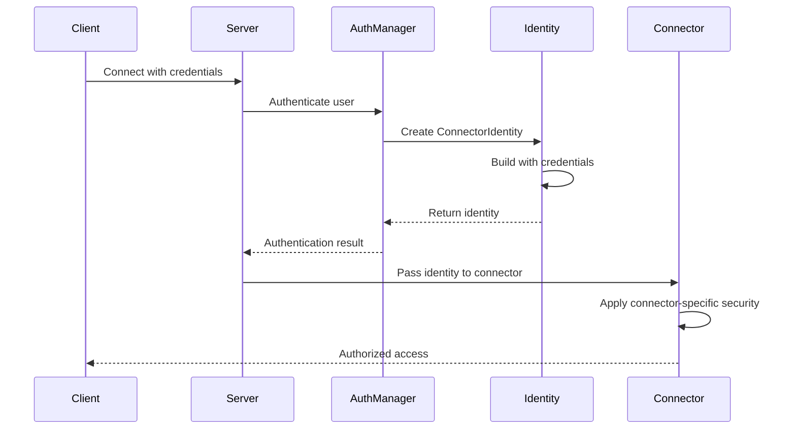

### Authorization Process

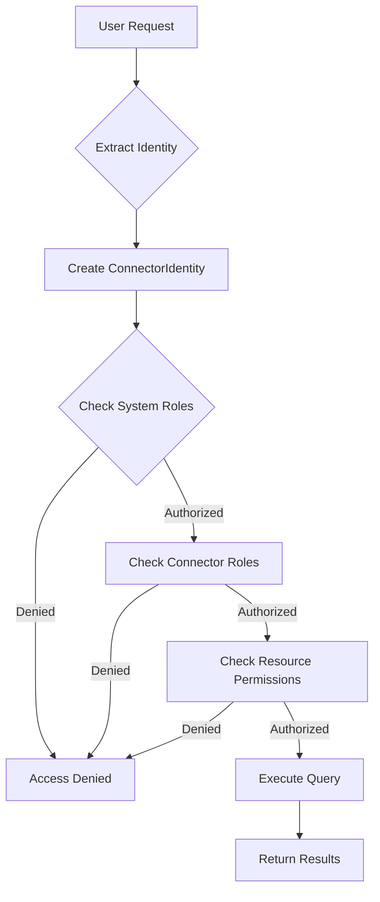

## Data Flow

### Identity Propagation

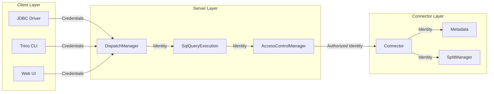

## Integration with Trino Ecosystem

### SPI Integration

The Security Framework integrates with other SPI components:

- **[Plugin Architecture](Plugin%20Architecture.md)**: Security plugins implement authentication and authorization
- **[Connector Framework](Connector%20Framework.md)**: Connectors use identities for access control
- **[Metadata & Connector Abstraction](Metadata%20&%20Connector%20Abstraction.md)**: Security policies applied to metadata operations

### Server Integration

- **[Trino Server & API](Trino%20Server%20&%20API.md)**: Authentication managers and access control
- **[SQL Analyzer, Planner & Optimizer](SQL%20Analyzer,%20Planner%20&%20Optimizer.md)**: Security checks during query analysis
- **[Query Execution Engine](Query%20Execution%20Engine.md)**: Identity propagation during execution

### Client Integration

- **[Trino Client Library](Trino%20Client%20Library.md)**: Client-side authentication handling
- **[Trino JDBC Driver](Trino%20JDBC%20Driver.md)**: JDBC authentication mechanisms
- **[Trino CLI](Trino%20CLI.md)**: Command-line authentication

## Security Features

### Authentication Mechanisms
- **Password Authentication**: Traditional username/password
- **Certificate-based**: SSL/TLS client certificates
- **Kerberos**: Enterprise SSO integration
- **OAuth/OIDC**: Modern token-based authentication
- **LDAP**: Directory service integration

### Authorization Levels
- **System Level**: Global permissions across all catalogs
- **Catalog Level**: Access to specific data sources
- **Schema Level**: Database/schema permissions
- **Table Level**: Table and view access control
- **Column Level**: Fine-grained column permissions
- **Row Level**: Row-level security policies

### Role-Based Access Control (RBAC)
- **System Roles**: Predefined roles like `system_admin`
- **Connector Roles**: Connector-specific role definitions
- **User-Defined Roles**: Custom role creation and management
- **Role Hierarchies**: Inheritance and delegation

## Configuration and Usage

### Basic Identity Creation
```java
// Simple user identity
ConnectorIdentity identity = ConnectorIdentity.ofUser("john_doe");

// Identity with groups
ConnectorIdentity identity = ConnectorIdentity.forUser("jane_smith")
    .withGroups(Set.of("analytics_team", "marketing"))
    .build();
```

### Advanced Identity Configuration
```java
// Complex identity with all attributes
ConnectorIdentity identity = ConnectorIdentity.forUser("admin_user")
    .withGroups(Set.of("administrators", "data_engineers"))
    .withPrincipal(new UsernamePrincipal("admin@company.com"))
    .withEnabledSystemRoles(Set.of("system_admin", "query_admin"))
    .withConnectorRole(new SelectedRole(SelectedRole.Type.ROLE, "catalog_admin"))
    .withExtraCredentials(Map.of(
        "service_account", "svc_trino_admin",
        "api_token", "secure_token_123"
    ))
    .build();
```

## Best Practices

### Identity Management
- Use strong, unique user identifiers
- Implement proper group management
- Regularly audit role assignments
- Secure credential storage and transmission

### Security Policies
- Apply principle of least privilege
- Use role hierarchies effectively
- Implement separation of duties
- Regular security reviews and updates

### Performance Considerations
- Cache identity information appropriately
- Minimize security check overhead
- Use efficient group membership lookups
- Optimize credential validation

## Extension Points

### Custom Authentication
Implement custom authentication mechanisms by:
- Extending authentication providers
- Implementing credential validators
- Creating custom principal types

### Custom Authorization
Extend authorization capabilities by:
- Implementing custom access control rules
- Creating connector-specific security policies
- Developing dynamic permission systems

### Identity Providers
Integrate with external identity systems:
- Enterprise directory services
- Cloud identity providers
- Custom user repositories

## Related Documentation

- [Trino SPI](Trino%20SPI.md) - Core service provider interface
- [Plugin Architecture](Plugin%20Architecture.md) - Plugin system overview
- [Connector Framework](Connector%20Framework.md) - Connector development
- [Trino Server & API](Trino%20Server%20&%20API.md) - Server security components including AccessControlManager and PasswordAuthenticatorManager
- [Query Execution Engine](Query%20Execution%20Engine.md) - Query execution with security integration
- [Metadata & Connector Abstraction](Metadata%20&%20Connector%20Abstraction.md) - Metadata operations with security controls

## Server-Level Security Management

### AccessControlManager

The `AccessControlManager` is the central orchestrator for all security operations in Trino. It implements the `AccessControl` interface and coordinates between system-level and connector-level access controls.

**Key Responsibilities:**
- Manages system access control implementations
- Coordinates with connector-specific access controls
- Provides unified security context for query operations
- Handles authorization checks for all database objects
- Implements row-level security and column masking
- Manages role-based access control (RBAC)

**Core Methods:**
- `checkCanExecuteQuery()`: Validates query execution permissions
- `checkCanSelectFromColumns()`: Controls column-level read access
- `checkCanCreateTable()`: Manages table creation permissions
- `filterTables()`: Applies table-level filtering based on user permissions
- `getRowFilters()`: Retrieves dynamic row-level security filters
- `getColumnMasks()`: Provides column masking expressions

**Authorization Flow:**
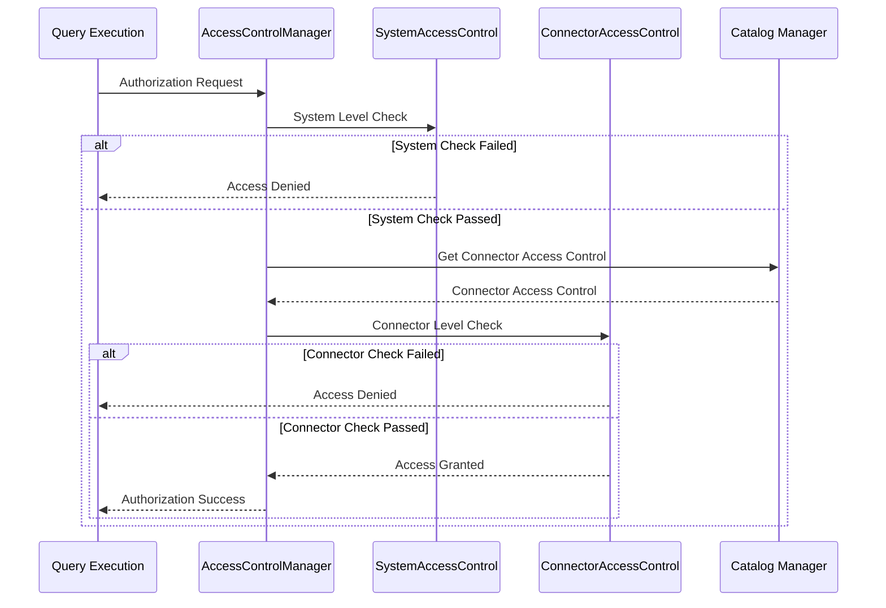

### PasswordAuthenticatorManager

The `PasswordAuthenticatorManager` handles user authentication through pluggable password authenticator implementations.

**Key Responsibilities:**
- Manages password authenticator lifecycle
- Loads and configures authenticator implementations
- Provides authentication services to the security framework
- Supports multiple authentication mechanisms

**Authentication Flow:**
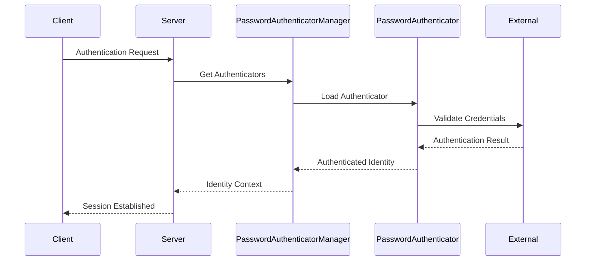

## System Access Control Implementation

### System Access Control

System access control operates at the cluster level and manages:
- Catalog access permissions
- System session properties
- Global query execution rights
- User impersonation capabilities
- System information access

**Built-in Implementations:**
- `AllowAllSystemAccessControl`: Permits all operations (development use)
- `ReadOnlySystemAccessControl`: Read-only access to all data
- `FileBasedSystemAccessControl`: JSON-based permission configuration
- `DefaultSystemAccessControl`: Standard permission model

### FileBasedSystemAccessControl

The `FileBasedSystemAccessControl` provides comprehensive rule-based security through configuration files. It implements fine-grained access control across all system resources with sophisticated rule matching and policy enforcement.

#### Architecture

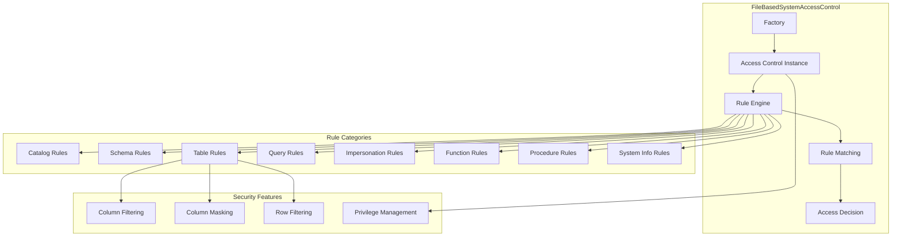

#### Rule-Based Access Control

The implementation uses a comprehensive rule engine that evaluates user requests against configured security policies:

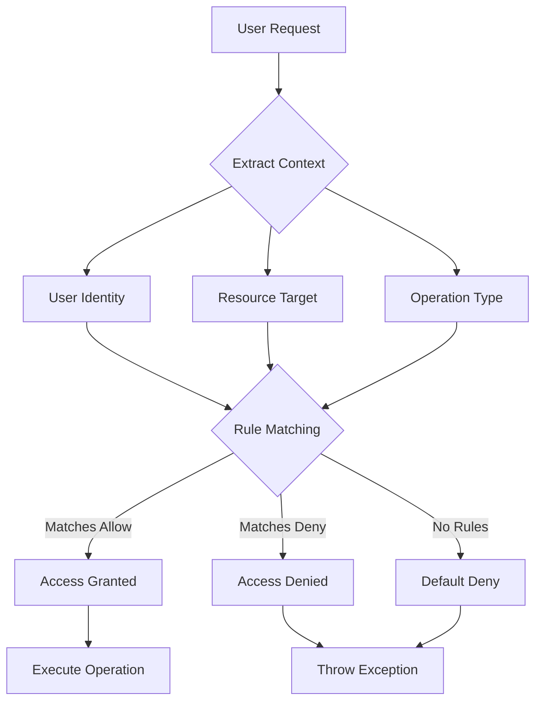

#### Rule Categories and Privileges

**Catalog Access Rules:**
- `ALL`: Full catalog access including creation and deletion
- `READ_ONLY`: Read-only access to catalog metadata and data
- `OWNER`: Catalog ownership with management privileges

**Table Access Rules:**
- `SELECT`: Read access to table data
- `INSERT`: Data insertion permissions
- `UPDATE`: Data modification permissions
- `DELETE`: Data deletion permissions
- `OWNERSHIP`: Full table control including schema changes
- `GRANT_SELECT`: Permission to grant select privileges to others

**Schema Access Rules:**
- Schema ownership and management
- Schema-level object creation permissions
- Schema metadata access control

#### Advanced Security Features

**Column-Level Security:**
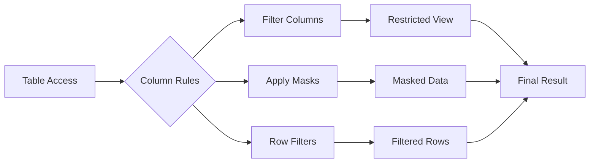

**Column Filtering:** Restricts access to specific columns based on user roles and permissions
**Column Masking:** Applies data masking expressions to sensitive columns
**Row Filtering:** Implements row-level security through dynamic filters

**Impersonation Control:**
- User impersonation permissions
- Principal-to-user mapping rules
- Role-based impersonation restrictions

**Query Access Control:**
- Query execution permissions
- Query viewing and management rights
- Query termination authorization

#### Configuration Structure

The FileBasedSystemAccessControl reads security policies from JSON configuration files:

```json
{
  "catalogs": [
    {
      "user": "admin",
      "catalog": ".*",
      "allow": "all"
    }
  ],
  "schemas": [
    {
      "user": "analytics",
      "schema": "analytics_.*",
      "owner": true
    }
  ],
  "tables": [
    {
      "user": "readonly",
      "privileges": ["SELECT"],
      "columns": ["public_.*"]
    }
  ]
}
```

#### Factory Implementation

```java
public static class Factory implements SystemAccessControlFactory {
    @Override
    public String getName() {
        return NAME; // "file"
    }
    
    @Override
    public SystemAccessControl create(Map<String, String> config, SystemAccessControlContext context) {
        // Bootstrap configuration and create instance
        Bootstrap bootstrap = new Bootstrap(
            binder -> configBinder(binder).bindConfig(FileBasedAccessControlConfig.class),
            new FileBasedSystemAccessControlModule()
        );
        
        Injector injector = bootstrap
            .doNotInitializeLogging()
            .setRequiredConfigurationProperties(config)
            .initialize();
            
        return injector.getInstance(SystemAccessControl.class);
    }
}
```

### AllowAllSystemAccessControl

The `AllowAllSystemAccessControl` provides a permissive security implementation that grants all access requests. This implementation is designed for development, testing, and environments with external security layers.

#### Characteristics

**Permissive Access:**
- All authentication checks pass without validation
- All authorization requests are granted
- No access control restrictions
- Minimal security overhead

**Use Cases:**
- Development and testing environments
- Proof-of-concept deployments
- Systems with external security layers
- Performance testing scenarios

**Implementation Pattern:**
```java
@Override
public void checkCanSelectFromColumns(SystemSecurityContext context, CatalogSchemaTableName table, Set<String> columns) {
    // No-op: All access granted
}

@Override
public boolean canAccessCatalog(SystemSecurityContext context, String catalogName) {
    return true; // Always allow
}
```

#### Factory Implementation

```java
public static class Factory implements SystemAccessControlFactory {
    @Override
    public String getName() {
        return NAME; // "allow-all"
    }
    
    @Override
    public SystemAccessControl create(Map<String, String> config, SystemAccessControlContext context) {
        checkArgument(config.isEmpty(), "This access controller does not support any configuration properties");
        return INSTANCE;
    }
}
```

#### Security Considerations

**Warning:** The AllowAllSystemAccessControl should never be used in production environments as it provides no security protections. It should only be used in:
- Secure development environments
- Isolated testing scenarios
- Demonstration systems with no sensitive data

## Rule Engine and Policy Enforcement

### Rule Matching Algorithm

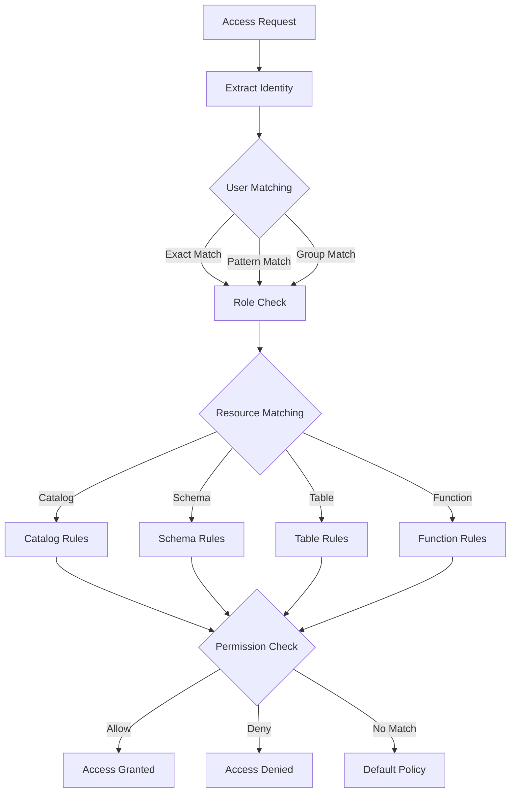

### Policy Evaluation Flow

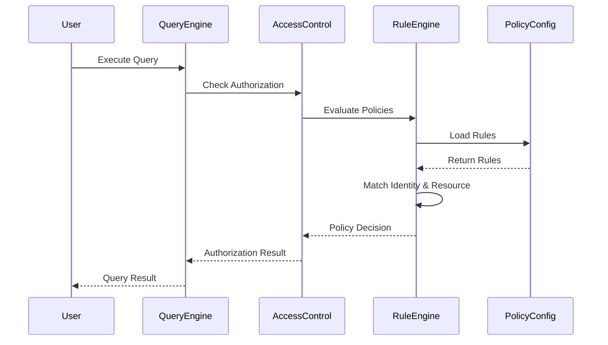

### Connector Access Control

Connector access control provides catalog-specific security policies:
- Schema-level permissions
- Table and view access control
- Column-level security
- Function execution rights
- Materialized view permissions

## Plugin Toolkit Security Integration

The Security Framework integrates with the [Plugin Toolkit](Plugin%20Toolkit.md) to provide security capabilities to connectors through standardized implementations.

### FileBasedSystemAccessControl.Factory

The `FileBasedSystemAccessControl.Factory` provides a standardized way for plugins to create file-based security implementations:

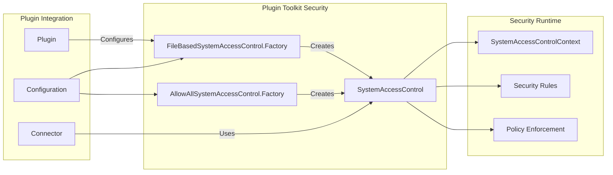

### AllowAllSystemAccessControl.Factory

The `AllowAllSystemAccessControl.Factory` provides a permissive security implementation for plugins:

**Use Cases:**
- Development and testing environments
- Connectors with external security layers
- Performance benchmarking scenarios
- Proof-of-concept implementations

**Integration Pattern:**
```java
// Plugin configuration for allow-all security
Map<String, String> securityConfig = Map.of();
SystemAccessControlFactory factory = new AllowAllSystemAccessControl.Factory();
SystemAccessControl accessControl = factory.create(securityConfig, context);
```

### Security Configuration in Plugins

Plugins can configure security through the toolkit:

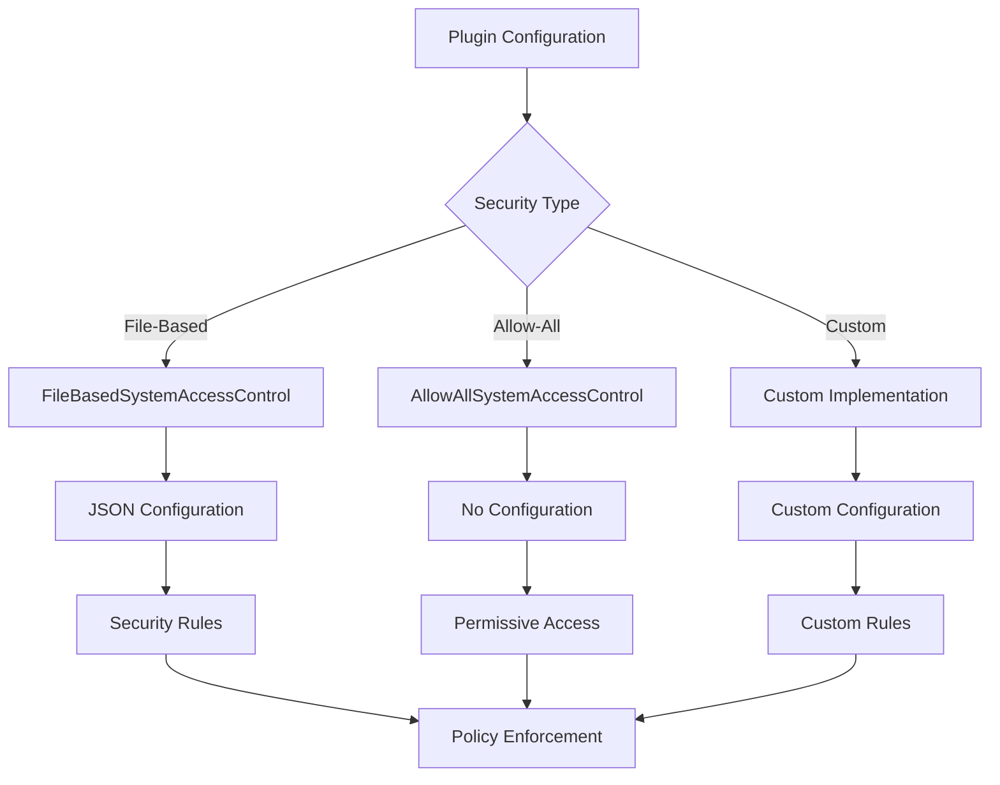

## Advanced Security Features

### Multi-Level Security Architecture

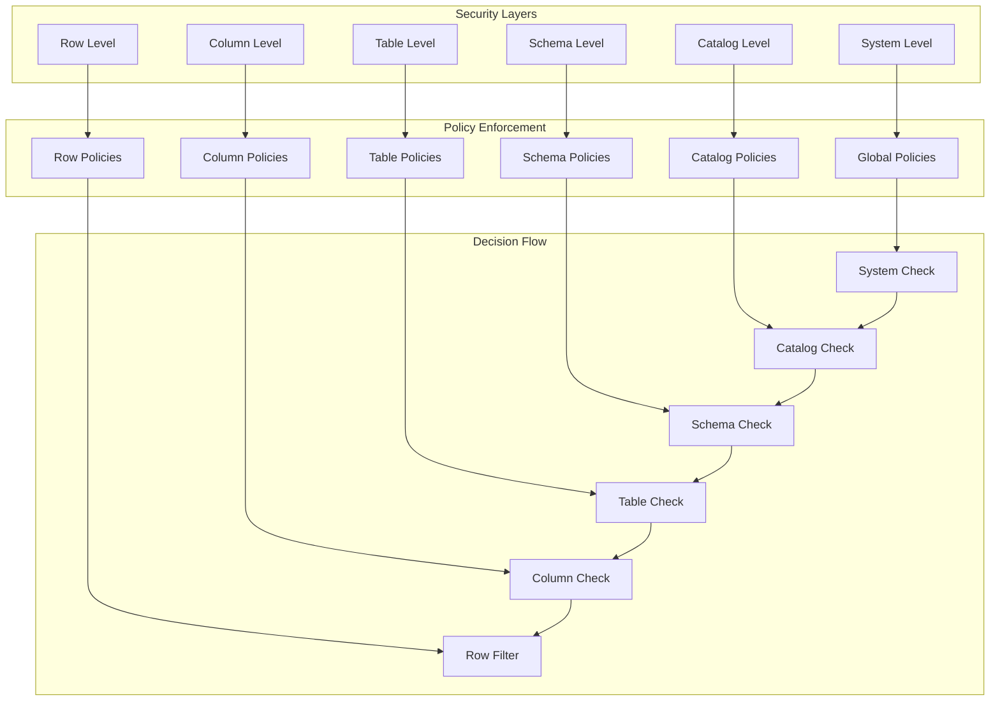

### Dynamic Security Policy Updates

The FileBasedSystemAccessControl supports dynamic policy updates:

- **Runtime Configuration Changes**: Update security policies without restart
- **Hot Reload**: Automatic detection of configuration file changes
- **Policy Validation**: Validate new policies before activation
- **Rollback Support**: Revert to previous policies if issues occur

### Performance Optimization

**Rule Caching:**
- Compiled rule caching for fast matching
- Identity context caching
- Resource permission caching
- Negative result caching

**Efficient Matching:**
- Indexed rule structures
- Pattern matching optimization
- Early termination strategies
- Batch permission evaluation

## Security Policy Management

### Policy Definition Best Practices

**Hierarchical Policies:**
```json
{
  "catalogs": [
    {
      "user": "admin",
      "catalog": ".*",
      "allow": "all"
    }
  ],
  "schemas": [
    {
      "user": "developer",
      "catalog": "dev_.*",
      "schema": ".*",
      "owner": true
    }
  ],
  "tables": [
    {
      "user": "analyst",
      "catalog": "analytics",
      "schema": "public",
      "table": "report_.*",
      "privileges": ["SELECT"]
    }
  ]
}
```

**Principle of Least Privilege:**
- Grant minimal necessary permissions
- Use role-based access control
- Implement separation of duties
- Regular permission audits

### Error Handling and Diagnostics

**Access Denied Messages:**
- Specific denial reasons
- Resource identification
- Suggested remediation
- Audit trail information

**Security Event Logging:**
- Authentication attempts
- Authorization decisions
- Policy changes
- Security violations

## Integration with External Security Systems

### LDAP Integration

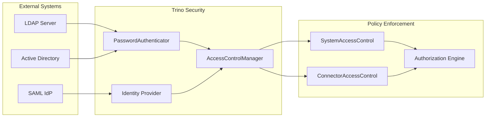

### Enterprise Security Features

**Single Sign-On (SSO):**
- Kerberos authentication
- SAML integration
- OAuth/OIDC support
- Certificate-based authentication

**Enterprise Authorization:**
- Role-based access control (RBAC)
- Attribute-based access control (ABAC)
- Policy-based access control (PBAC)
- Dynamic permission evaluation

## Compliance and Auditing

### Regulatory Compliance

**Data Protection:**
- GDPR compliance through data masking
- HIPAA compliance with access controls
- SOX compliance with audit trails
- PCI DSS compliance with encryption

**Audit Requirements:**
- Comprehensive access logging
- Policy change tracking
- User activity monitoring
- Compliance reporting

### Security Monitoring

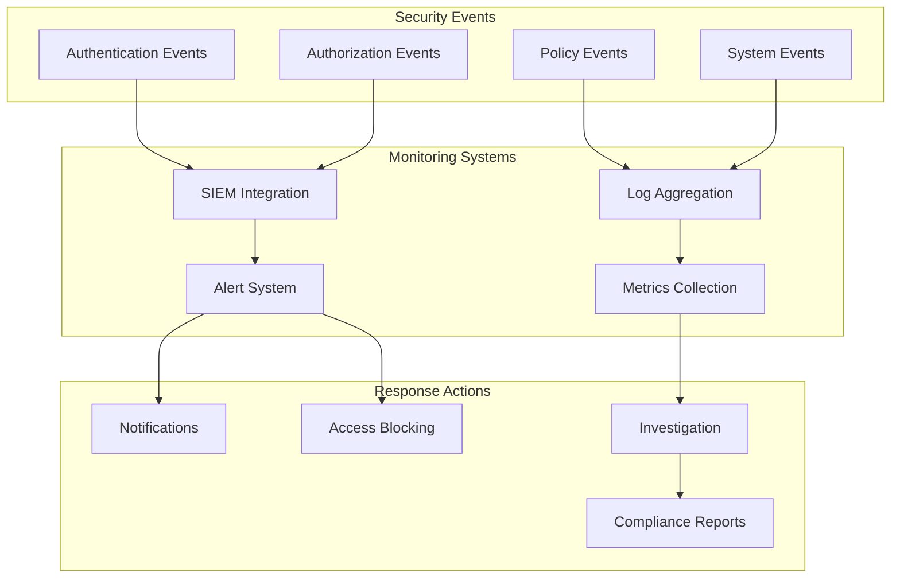

## Advanced Security Features

### Row-Level Security and Column Masking

The framework supports advanced data protection through:

#### Row-Level Security
- Dynamic filtering based on user context
- Custom filter expressions per table
- Integration with external policy engines
- Multi-level filter composition

#### Column Masking
- Automatic data masking for sensitive columns
- Configurable masking expressions
- User-specific masking policies
- Compliance with data privacy regulations

### Security Context and Identity Management

#### SecurityContext

The `SecurityContext` encapsulates all security-related information for a specific query or operation, including:
- User identity and authentication state
- Active roles and privileges
- Query-specific security attributes
- Transaction context

#### Identity and ConnectorIdentity

The identity system provides a hierarchical approach to user representation:
- **Identity**: System-level user identity with global attributes
- **ConnectorIdentity**: Catalog-specific identity with localized permissions

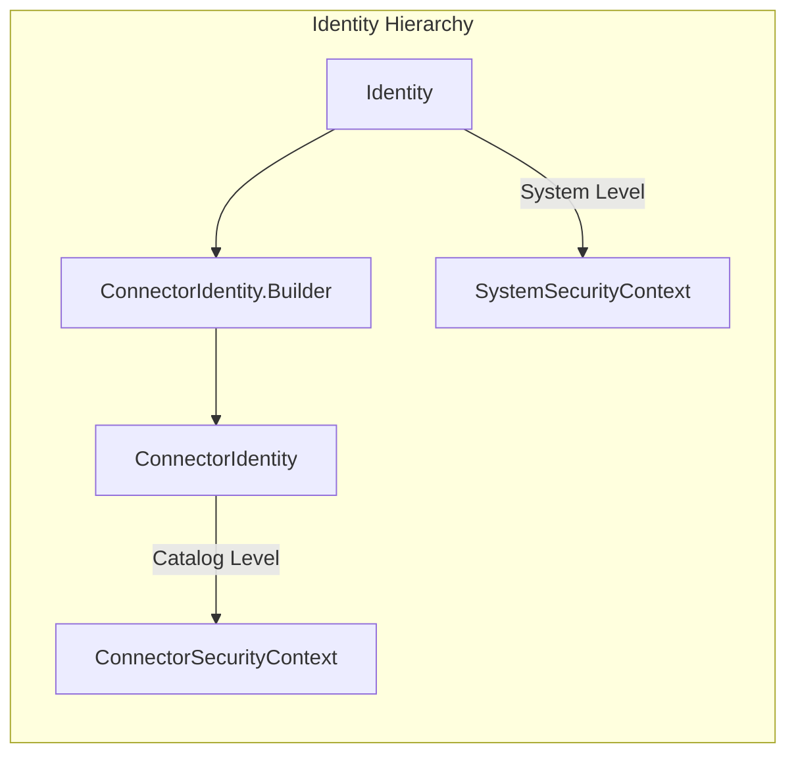

## Configuration and Deployment

### System Access Control Configuration
```properties
# etc/access-control.properties
access-control.name=file-based
security.config-file=etc/security.json
```

### Password Authentication Configuration
```properties
# etc/password-authenticator.properties
password-authenticator.name=ldap
ldap.url=ldap://ldap-server:389
ldap.user-base-dn=ou=users,dc=example,dc=com
```

## Security Best Practices

### Authentication
- Use strong authentication mechanisms (LDAP, Kerberos, certificates)
- Implement multi-factor authentication where possible
- Regular rotation of authentication credentials
- Secure storage of authentication configuration

### Authorization
- Follow principle of least privilege
- Regular audit of user permissions
- Use role-based access control for scalability
- Implement separation of duties

### Data Protection
- Enable column masking for sensitive data
- Implement row-level security for multi-tenant scenarios
- Use encryption for data in transit and at rest
- Regular security assessments and penetration testing

## Monitoring and Auditing

The security framework provides comprehensive monitoring capabilities:
- Authorization success/failure metrics
- Authentication attempt tracking
- Security event logging
- Integration with external SIEM systems

### Metrics and Monitoring
```mermaid
graph LR
    subgraph "Security Monitoring"
        ACM[AccessControlManager]
        PAM[PasswordAuthenticatorManager]
        EM[EventListenerManager]
        
        ACM --> |Authorization Metrics| MON[Monitoring System]
        PAM --> |Authentication Metrics| MON
        EM --> |Security Events| MON
        
        MON --> |Alerts| ADMIN[System Administrator]
        MON --> |Reports| AUDIT[Audit System]
    end
```

## Performance Considerations

### Caching Strategies
- Permission caching to reduce authorization overhead
- Identity context caching for repeated operations
- Configuration caching for security policies

### Scalability
- Distributed security context propagation
- Load balancing for authentication services
- Horizontal scaling of security components

## Integration Points

### Plugin Integration
The security framework integrates with the [Plugin Architecture](Plugin Architecture.md) to provide:
- Custom authenticator implementations
- Connector-specific access controls
- Event listener integration
- Configuration management

### Transaction Integration
Security contexts are maintained throughout the [Transaction Management](Trino Server & API.md) lifecycle:
- Transaction-scoped permissions
- Consistent security context propagation
- Multi-catalog transaction support

### Query Execution Integration
The framework integrates with [Query Execution Engine](Query Execution Engine.md) to provide:
- Runtime authorization checks
- Dynamic permission evaluation
- Query planning security validation

## Troubleshooting

### Common Issues
- Authentication failures due to misconfigured authenticators
- Authorization denials from incorrect permission mappings
- Performance degradation from excessive security checks
- Integration issues with external security systems

### Diagnostic Tools
- Security event logging and analysis
- Authorization decision tracing
- Authentication flow debugging
- Performance profiling of security operations

## Future Enhancements

The security framework continues to evolve with planned enhancements:
- Enhanced support for cloud-native security models
- Integration with external policy engines
- Advanced threat detection and prevention
- Automated security policy management
- Enhanced compliance reporting capabilities

## Conclusion

The Security Framework provides a comprehensive, multi-layered approach to security in Trino, combining SPI-level identity management with server-level access control orchestration. Its flexible architecture supports various authentication mechanisms, fine-grained authorization policies, and seamless integration with enterprise security systems. By providing unified identity models through `ConnectorIdentity` and centralized access control through `AccessControlManager`, it ensures consistent security enforcement across all connectors and system components while maintaining the performance and scalability required for production deployments.