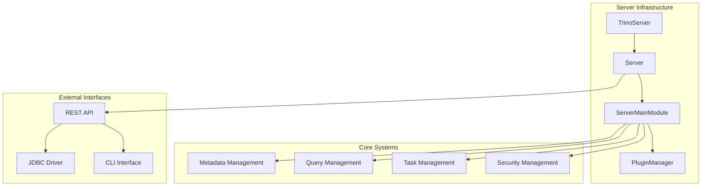
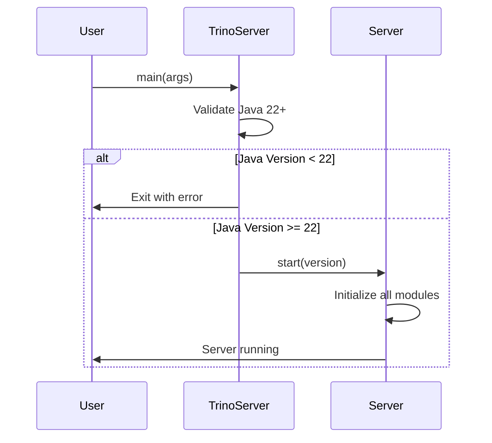
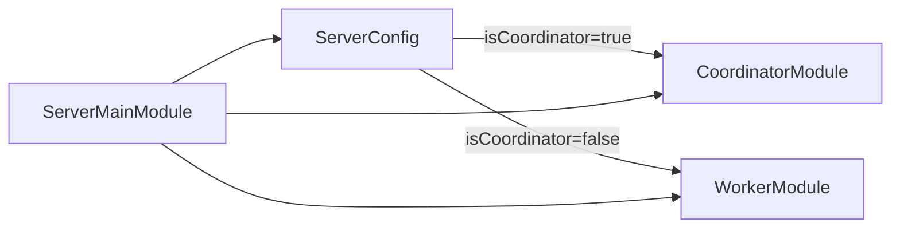
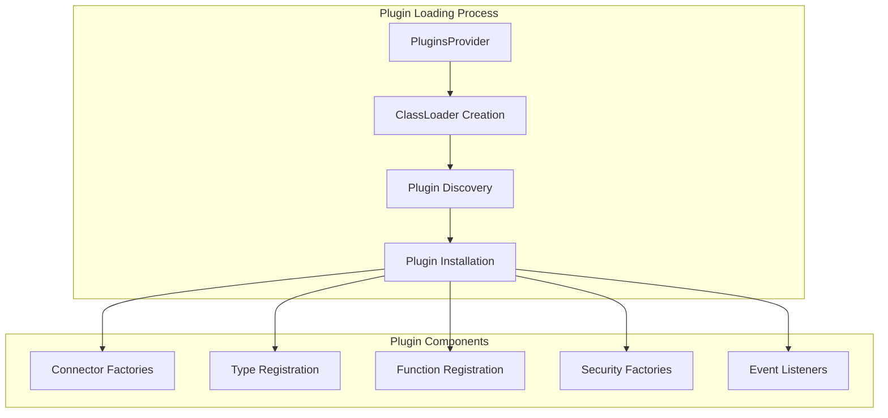
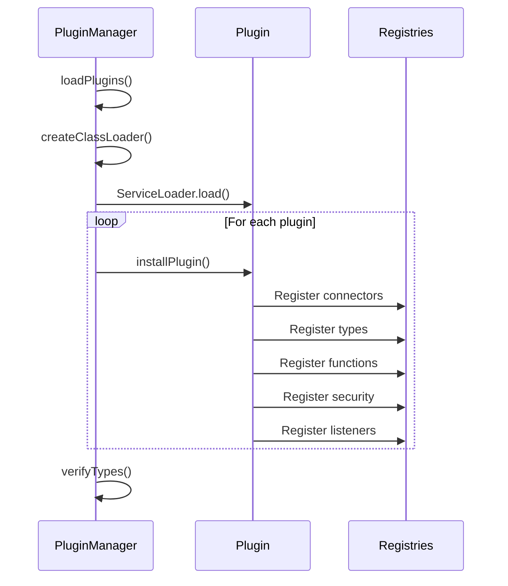
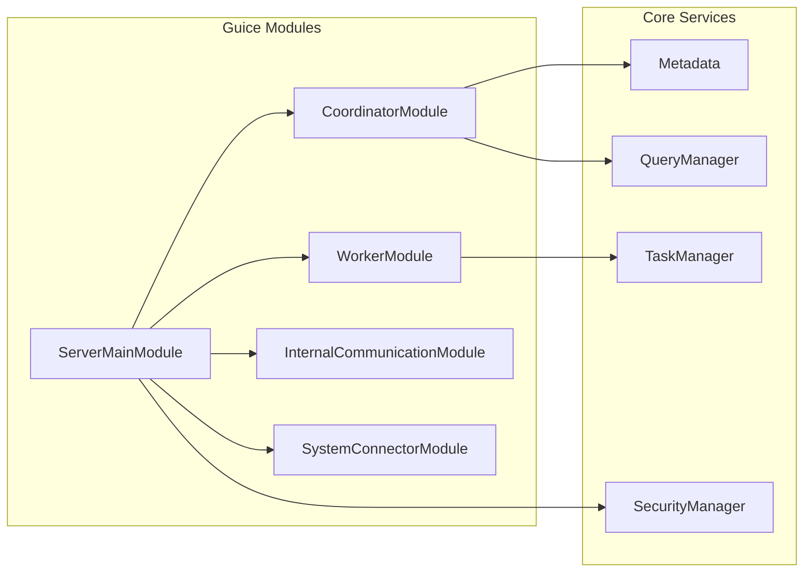
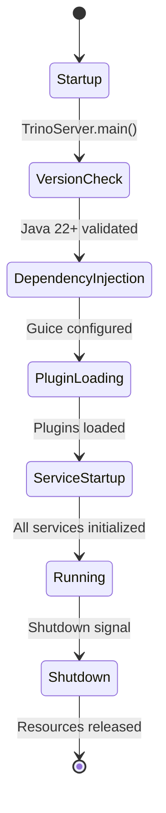
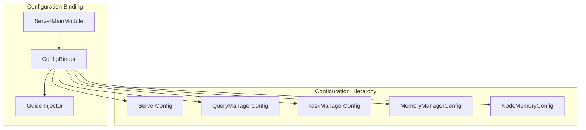
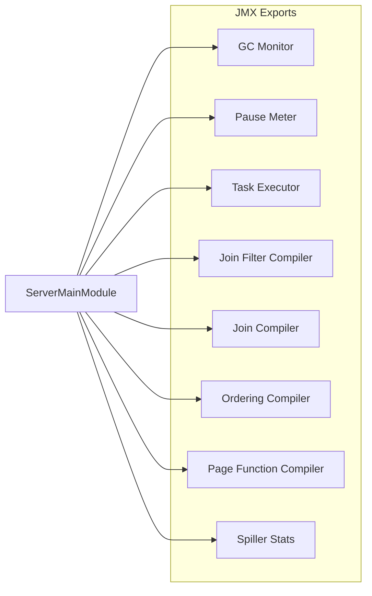

# Server Infrastructure Module

## Introduction

The Server Infrastructure module forms the backbone of the Trino distributed SQL query engine, providing the core server lifecycle management, dependency injection framework, and plugin system. This module is responsible for initializing and coordinating all major subsystems within Trino, ensuring proper startup sequencing, resource management, and extensibility through plugins.

## Architecture Overview

The Server Infrastructure module serves as the central orchestration layer that brings together all Trino components into a cohesive system. It manages the server lifecycle, handles dependency injection via Google Guice, coordinates plugin loading, and provides the foundation for both coordinator and worker nodes.



## Core Components

### TrinoServer

The `TrinoServer` class serves as the main entry point for the Trino server application. It performs essential pre-flight checks and delegates to the core `Server` class for actual initialization.

**Key Responsibilities:**
- Java version validation (requires Java 22+)
- Version detection and logging
- Delegation to the main Server class

**Process Flow:**


### ServerMainModule

The `ServerMainModule` is a comprehensive Google Guice module that configures and binds all core Trino services. It extends `AbstractConfigurationAwareModule` and provides dependency injection configuration for the entire system.

**Key Configuration Areas:**

#### Coordinator vs Worker Configuration


#### Core Service Bindings
- **Query Management**: `SqlQueryExecution`, `SqlTaskManager`, `DispatchManager`
- **Memory Management**: `LocalMemoryManager`, `MemoryRevokingScheduler`
- **Task Execution**: `TaskExecutor` (TimeSharing or ThreadPerDriver)
- **Metadata Management**: `MetadataManager`, `FunctionManager`, `TypeRegistry`
- **Data Processing**: `PageSourceManager`, `PageSinkManager`, `SplitManager`

#### RegisterFunctionBundles

The `RegisterFunctionBundles` class is responsible for automatically registering all function bundles during server startup:

```java
private static class RegisterFunctionBundles
{
    @Inject
    public RegisterFunctionBundles(GlobalFunctionCatalog globalFunctionCatalog, Set<FunctionBundle> functionBundles)
    {
        for (FunctionBundle functionBundle : functionBundles) {
            globalFunctionCatalog.addFunctions(functionBundle);
        }
    }
}
```

This ensures that all system functions, JSON functions, and plugin-provided functions are available immediately after server startup.

### PluginManager

The `PluginManager` implements a sophisticated plugin loading system that provides dynamic extensibility for Trino. It manages the complete plugin lifecycle from discovery to installation.

**Plugin Loading Architecture:**


**Key Features:**
- **Isolated Class Loading**: Each plugin gets its own `PluginClassLoader` with SPI package isolation
- **Service Provider Interface**: Uses Java's ServiceLoader mechanism for plugin discovery
- **Thread-Safe Operations**: All plugin operations are thread-safe with atomic loading flags
- **Comprehensive Registration**: Supports connectors, types, functions, security providers, and more

**Plugin Installation Process:**


## Dependency Injection Framework

The Server Infrastructure module leverages Google Guice for dependency injection, providing a modular and testable architecture:



## Server Lifecycle Management

The server lifecycle is carefully orchestrated to ensure proper initialization order and resource management:



## Integration with Other Modules

### SQL Parser & AST
The Server Infrastructure initializes the `SqlParser` as a singleton, which is used throughout the system for parsing SQL statements. See [SQL Parser & AST](SQL%20Parser%20&%20AST.md) for detailed parsing information.

### SQL Analyzer, Planner & Optimizer
The module provides `StatementAnalyzerFactory` and related components that are essential for query analysis and planning. Refer to [SQL Analyzer, Planner & Optimizer](SQL%20Analyzer,%20Planner%20&%20Optimizer.md) for planning details.

### Query Execution Engine
Task execution components like `SqlTaskManager` and `TaskExecutor` are configured here. See [Query Execution Engine](Query%20Execution%20Engine.md) for execution details.

### Metadata & Connector Abstraction
The `MetadataManager`, `CatalogManager`, and connector-related components are initialized to provide metadata services. See [Metadata & Connector Abstraction](Metadata%20&%20Connector%20Abstraction.md) for metadata management.

### Trino SPI
The plugin system heavily relies on the Trino SPI for extensibility. Plugin class loaders are configured to isolate SPI packages while allowing access to necessary dependencies. See [Trino SPI](Trino%20SPI.md) for SPI details.

## Configuration Management

The Server Infrastructure module integrates with Airlift's configuration system to manage server-wide settings:



## Security Integration

The module provides comprehensive security integration through various managers:

- **AccessControlManager**: System-level access control
- **PasswordAuthenticatorManager**: Password-based authentication
- **CertificateAuthenticatorManager**: Certificate-based authentication
- **HeaderAuthenticatorManager**: Header-based authentication
- **GroupProviderManager**: Group membership management

## Performance Considerations

### Executor Management
The module carefully manages various thread pools:
- **Startup Executor**: Bounded executor for concurrent startup operations
- **Exchange Executor**: Scheduled executor for data exchange
- **Async HTTP Executors**: Separate executors for HTTP responses and timeouts

### Memory Management
Memory-related components are configured with careful attention to:
- **Local Memory Manager**: Node-level memory tracking
- **Memory Revoking**: Automatic memory pressure handling
- **Spill Management**: Disk-based overflow handling

## Monitoring and Observability

The Server Infrastructure module integrates with JMX for monitoring:



## Error Handling and Recovery

The Server Infrastructure module implements robust error handling:

- **Version Validation**: Prevents startup on incompatible Java versions
- **Plugin Isolation**: Plugin failures don't affect core system
- **Graceful Degradation**: Optional components can fail without stopping the server
- **Resource Cleanup**: Proper cleanup through closing binders and finalizers

## Future Considerations

The Server Infrastructure module is designed for extensibility and evolution:

- **Modular Architecture**: Easy to add new services through Guice modules
- **Plugin System**: Supports dynamic addition of new capabilities
- **Configuration Flexibility**: Comprehensive configuration system for tuning
- **Monitoring Integration**: Extensible JMX export system for observability

This module serves as the foundation for all Trino operations, providing the stability and extensibility needed for a production-grade distributed SQL engine.