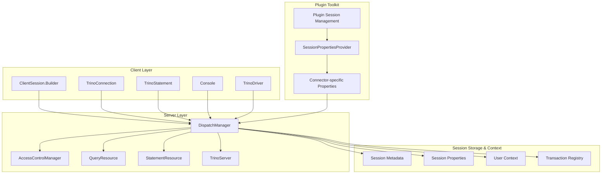
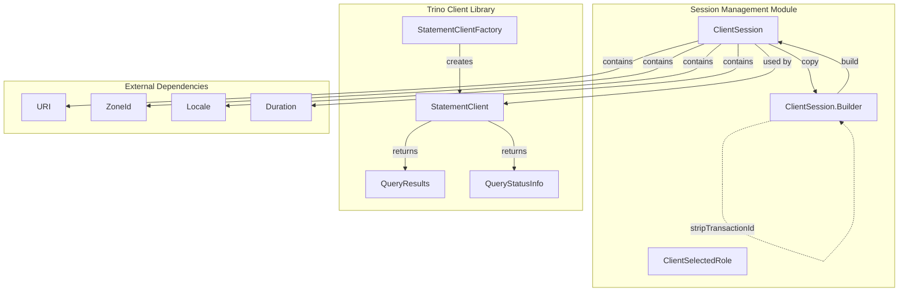
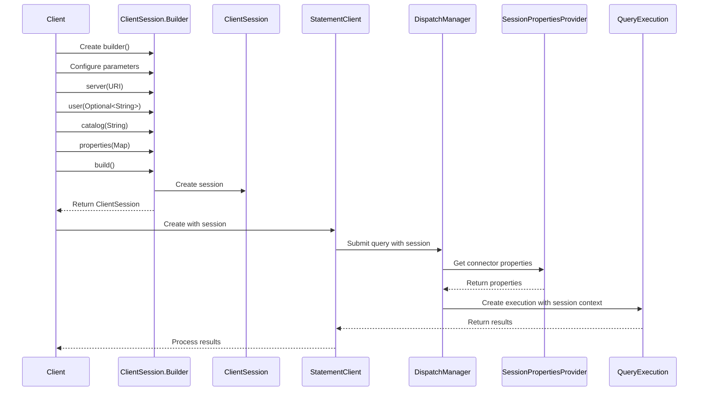
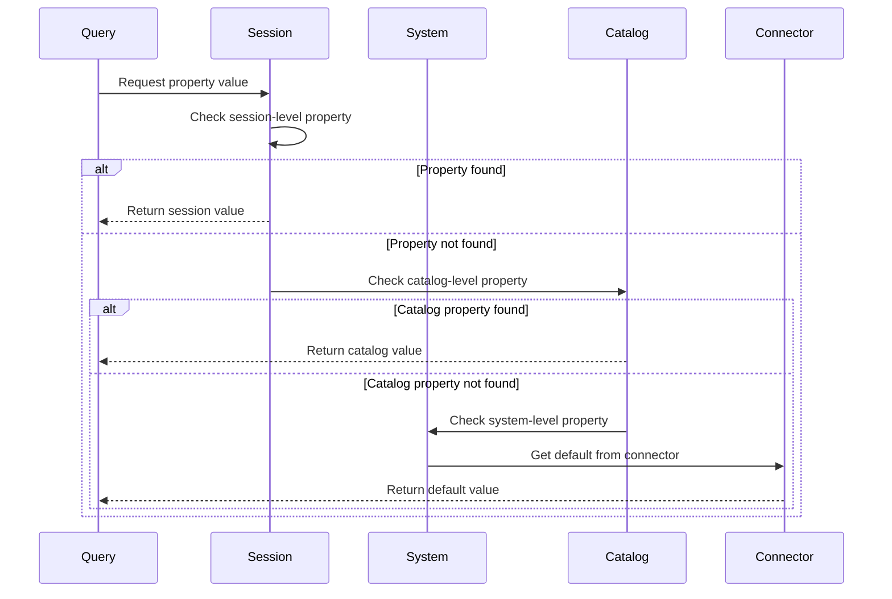
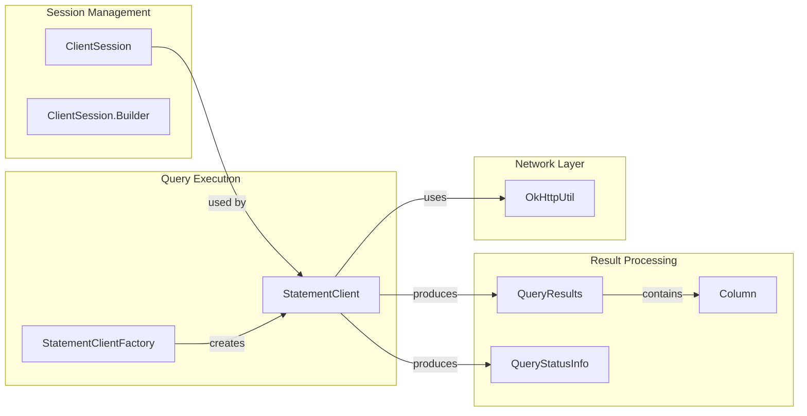
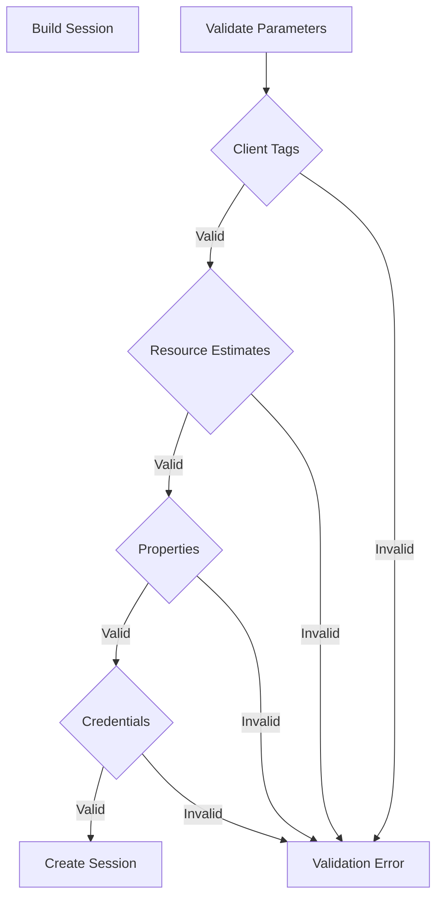

# Session Management Module

## Introduction

The Session Management module in Trino provides a comprehensive framework for managing user sessions, session properties, and configuration across the entire Trino ecosystem. This module serves as the central hub for handling session state, user preferences, and configuration parameters that affect query execution, resource allocation, and system behavior.

Originally focused on client-side session configuration through the Trino Client Library, the module has evolved to encompass multiple layers of the system architecture, from client libraries to server infrastructure, and extends into plugin toolkits for connector-specific session properties. The module ensures consistent session handling across different client interfaces (CLI, JDBC, Web UI) while providing flexibility for plugins to define their own session properties.

## Core Components

### ClientSession and ClientSession.Builder

The `ClientSession` class is the central component that encapsulates all session-related information for a Trino client connection. It is an immutable data structure that holds configuration parameters such as server URI, user credentials, catalog/schema information, session properties, and transaction details.

The `ClientSession.Builder` class provides a fluent API for constructing `ClientSession` instances. It supports both creating new sessions from scratch and copying existing sessions with modifications. The builder pattern ensures that all session parameters are properly validated before creating the session.

### SessionPropertiesProvider

The `SessionPropertiesProvider` interface, located in the plugin toolkit, enables connectors to expose their own session properties. This allows plugin developers to define configuration options that are specific to their data source while maintaining consistency with Trino's session management framework.

Key features:
- **Property Definition**: Standardized way to define session properties using `PropertyMetadata`
- **Type Safety**: Strong typing for property values through Trino SPI
- **Validation**: Built-in validation for property values
- **Documentation**: Self-documenting property metadata
- **Extensibility**: Allows connectors to contribute their own session properties

### Server-Side Session Management

The server-side components handle session lifecycle, validation, and enforcement:

- **DispatchManager**: Central coordinator for query dispatch and session management
- **AccessControlManager**: Enforces security policies based on session context
- **QueryResource/StatementResource**: REST endpoints for session-aware query execution

## Architecture

### Comprehensive Session Management Architecture



### Client-Side Session Architecture



## Key Features

### Session Configuration
- **Server Connection**: URI and connection parameters
- **User Authentication**: Multiple user identity levels (user, session user, authorization user)
- **Catalog and Schema**: Default query context
- **Time Zone and Locale**: Client-specific localization settings
- **Client Information**: Source, tags, and trace tokens for monitoring

### Security and Authentication
- **Role Management**: Per-catalog role selection with `ClientSelectedRole`
- **Extra Credentials**: Additional authentication credentials
- **Authorization**: Support for different authorization levels

### Query Context
- **Session Properties**: Key-value pairs for session-specific configuration
- **Prepared Statements**: Named prepared statement storage
- **Resource Estimates**: Query resource requirement hints
- **Transaction Management**: Transaction ID handling

### Network Configuration
- **Request Timeouts**: Client request timeout configuration
- **Compression**: HTTP compression control
- **Encoding**: Character encoding preferences
- **Heartbeat**: Keep-alive interval settings

## Session Properties Framework

### Property Definition and Metadata

Session properties are defined using the `PropertyMetadata` class from the Trino SPI, providing a standardized way to describe configuration options:

- **Name**: Unique property identifier within its scope
- **Type**: Strongly typed value (String, Boolean, Integer, Long, Double, Duration, etc.)
- **Default Value**: Fallback value when not explicitly set
- **Description**: Human-readable documentation
- **Validation**: Custom validation logic and constraints
- **Hidden**: Whether the property should be visible in documentation
- **Required**: Whether the property must be explicitly set

### Property Scoping Hierarchy

Properties can be defined at different levels, creating a hierarchical override system:

1. **System Level**: Global properties affecting all queries across the cluster
2. **Catalog Level**: Properties specific to a particular data source or connector
3. **Session Level**: User-defined properties for the current session
4. **Query Level**: Properties overriding session defaults for specific queries

### Connector-Specific Properties

The `SessionPropertiesProvider` interface enables connectors to contribute their own session properties:

```java
public interface SessionPropertiesProvider
{
    List<PropertyMetadata<?>> getSessionProperties();
}
```

This allows plugin developers to:
- Define connector-specific configuration options
- Maintain consistency with Trino's property framework
- Provide type-safe property access
- Include comprehensive validation and documentation

## Data Flow

### Session Creation and Query Execution Flow



### Property Resolution Flow



## Component Relationships



## Integration with Trino Architecture

The Session Management module integrates with several other Trino components:

### Client Library Integration
- **StatementClient**: Uses `ClientSession` to configure query execution
- **QueryResults**: Returns results based on session configuration
- **Network Layer**: Applies session settings to HTTP requests

### Server-Side Integration
- **Authentication**: Session credentials are validated server-side
- **Authorization**: Role information is used for access control
- **Query Processing**: Session properties affect query planning and execution

## Configuration Validation

The module implements comprehensive validation for all session parameters:



## Usage Patterns

### Basic Session Creation
```java
ClientSession session = ClientSession.builder()
    .server(URI.create("http://trino-server:8080"))
    .user(Optional.of("alice"))
    .catalog("hive")
    .schema("default")
    .build();
```

### Session Modification
```java
ClientSession newSession = ClientSession.builder(existingSession)
    .catalog("iceberg")
    .schema("analytics")
    .build();
```

### Transaction Management
```java
ClientSession sessionWithoutTransaction = ClientSession.stripTransactionId(sessionWithTransaction);
```

## Security Considerations

### Authentication and Identity Management

Session management integrates with Trino's comprehensive security framework:

- **Multi-Level Authentication**: Support for user, session user, and authorization user distinctions
- **Credential Security**: All credential information is stored securely within the session
- **Character Validation**: Ensures only US-ASCII characters are used for sensitive data to prevent encoding attacks
- **Session Immutability**: Session data is immutable once created, preventing unauthorized modifications
- **Role-Based Access**: Per-catalog role selection with `ClientSelectedRole` for fine-grained permissions

### Property Security

- **Sensitive Property Handling**: Special treatment for passwords, secrets, and confidential configuration
- **Property Filtering**: Role-based access control for viewing and modifying session properties
- **Input Validation**: Comprehensive validation to prevent injection attacks through property values
- **Audit Trail**: Logging of session property changes for security monitoring
- **Encryption**: Secure transmission of session data over network connections

### Access Control Integration

The session management system works closely with the AccessControlManager to:
- Validate user permissions for session property modifications
- Enforce catalog-level security policies
- Manage role transitions and authorization checks
- Provide security context for query execution

## Performance Characteristics

### Session Lifecycle Performance

- **Immutable Design**: Thread-safe and suitable for concurrent use without synchronization overhead
- **Efficient Copying**: Builder pattern allows efficient session modification through structural sharing
- **Validation**: Comprehensive validation prevents runtime errors and reduces debugging overhead
- **Memory Usage**: Uses immutable collections for efficient memory usage and garbage collection

### Scalability Considerations

- **Session Pooling**: Reuse of session objects to reduce allocation overhead in high-throughput scenarios
- **Lazy Initialization**: Properties and resources loaded on-demand to minimize startup time
- **Caching**: Strategic caching of validated properties and frequently accessed values
- **Distributed Handling**: Efficient propagation of session context across cluster nodes

### Property Resolution Performance

- **Hierarchical Cache**: Cached property resolution to avoid repeated lookups
- **Connector Optimization**: Efficient aggregation of properties from multiple SessionPropertiesProvider implementations
- **Validation Caching**: Cached validation results for frequently used property combinations
- **Network Optimization**: Minimized network round-trips for property resolution

### Resource Management

- **Automatic Cleanup**: Expired sessions are automatically cleaned up to prevent memory leaks
- **Resource Limits**: Configurable limits on session count and resource usage per user
- **Heartbeat Mechanism**: Efficient keep-alive mechanism to maintain session validity
- **Failover Support**: Graceful handling of node failures with session recovery

## Configuration Management

### Default Configuration Strategy

Session management implements a comprehensive default configuration system:

- **System Defaults**: Cluster-wide default values for all session properties
- **Catalog Defaults**: Connector-specific default values that override system defaults
- **User Defaults**: Per-user default configurations stored in user profiles
- **Client Defaults**: Client application-specific default settings

### Runtime Configuration Updates

- **Dynamic Property Updates**: Ability to modify session properties during query execution
- **Validation**: Runtime validation of property changes with immediate feedback
- **Rollback Support**: Ability to revert property changes to previous values
- **Change Notification**: Propagation of property changes to affected components
- **Atomic Updates**: All-or-nothing property updates to maintain consistency

### Configuration Persistence

- **Session Persistence**: Optional persistence of session state across client disconnections
- **Property History**: Tracking of property value changes for audit and debugging
- **Profile Management**: Storage and retrieval of user-defined session profiles
- **Migration Support**: Automatic migration of session configurations across Trino versions

## Error Handling and Recovery

### Session Error Categories

- **Validation Errors**: Invalid property values, type mismatches, or constraint violations
- **Authentication Errors**: Failed user authentication or authorization checks
- **Resource Errors**: Session resource exhaustion or quota violations
- **Network Errors**: Connection failures or communication timeouts
- **System Errors**: Internal server errors or configuration problems

### Error Recovery Mechanisms

- **Graceful Degradation**: Continued operation with reduced functionality when possible
- **Automatic Retry**: Configurable retry logic for transient failures
- **Session Reset**: Ability to reset session to known good state
- **Fallback Values**: Use of default values when property resolution fails
- **Error Propagation**: Clear error messages and recovery suggestions

### Debugging and Diagnostics

- **Session Inspection**: Tools for examining current session state and properties
- **Property Tracing**: Detailed logging of property value changes and resolution
- **Performance Metrics**: Session-related performance and resource usage data
- **Error Reporting**: Comprehensive error context and troubleshooting information

## Monitoring and Observability

### Session Metrics

- **Active Sessions**: Real-time count of active sessions across the cluster
- **Session Duration**: Statistics on session lifetime and user engagement
- **Property Usage**: Analytics on most frequently used session properties
- **Error Rates**: Monitoring of session creation and management errors
- **Resource Utilization**: Session memory, CPU, and network resource usage

### Performance Monitoring

- **Property Resolution Time**: Tracking of property lookup and validation performance
- **Session Creation Overhead**: Measurement of session initialization time
- **Query Impact**: Correlation between session properties and query performance
- **Scalability Metrics**: Session system behavior under high load conditions

### Alerting and Notifications

- **Threshold Monitoring**: Alerts for session count, duration, or resource usage limits
- **Error Detection**: Real-time notification of session management failures
- **Security Alerts**: Notification of suspicious session activity or access violations
- **Performance Degradation**: Alerts for session-related performance issues

## Best Practices

### For Application Developers

1. **Use Appropriate Scoping**: Choose the right property scope (system, catalog, session, query) based on intended impact
2. **Validate Input**: Always validate user-provided property values before setting them
3. **Document Custom Properties**: Provide clear documentation for any custom session properties
4. **Handle Errors Gracefully**: Implement proper error handling for session operations with meaningful user feedback
5. **Monitor Performance**: Track the performance impact of session properties and adjust usage accordingly
6. **Secure Sensitive Data**: Never store passwords or sensitive information in regular session properties
7. **Use Connection Pooling**: Reuse sessions efficiently to minimize overhead

### For Plugin Developers

1. **Implement SessionPropertiesProvider**: Expose connector-specific configuration options through the standard interface
2. **Provide Sensible Defaults**: Ensure all properties have reasonable default values
3. **Document Thoroughly**: Include comprehensive property documentation with examples and use cases
4. **Validate Carefully**: Implement robust validation for all property values with clear error messages
5. **Consider Performance**: Minimize property lookup overhead and cache frequently accessed values
6. **Test Extensively**: Test property behavior across different scenarios and edge cases
7. **Version Compatibility**: Maintain backward compatibility when adding or modifying properties

### For System Administrators

1. **Configure System Defaults**: Set appropriate cluster-wide default values for session properties
2. **Monitor Resource Usage**: Track session resource consumption and implement appropriate limits
3. **Implement Security Policies**: Define and enforce access control policies for session properties
4. **Plan Capacity**: Size infrastructure appropriately for expected session load and concurrency
5. **Regular Auditing**: Periodically review session usage patterns and security configurations
6. **Backup and Recovery**: Implement backup strategies for critical session configurations
7. **Performance Tuning**: Optimize session management parameters for your specific workload

## Integration Patterns

### Multi-Client Environments

- **Session Sharing**: Strategies for sharing session state across multiple client applications
- **User Profiles**: Centralized user session profiles accessible from different clients
- **Single Sign-On**: Integration with enterprise authentication systems
- **Session Migration**: Transferring sessions between different client types (CLI to Web UI)

### Enterprise Integration

- **LDAP/AD Integration**: Corporate directory integration for user authentication and roles
- **Kerberos Support**: Enterprise-grade authentication for secure environments
- **Certificate-Based Auth**: PKI integration for enhanced security
- **Audit Integration**: Centralized logging and compliance reporting

## Advanced Features

### Dynamic Property Injection

- **Runtime Discovery**: Automatic discovery of available session properties
- **Conditional Properties**: Properties that become available based on context
- **Property Dependencies**: Support for properties that depend on other property values
- **Computed Properties**: Dynamic properties calculated from other session attributes

### Session Templates

- **Predefined Templates**: Common session configurations for specific use cases
- **Custom Templates**: User-defined session templates for recurring scenarios
- **Template Inheritance**: Hierarchical template system with override capabilities
- **Template Sharing**: Community sharing of useful session templates

## Related Documentation

- [Trino Client Library](Trino Client Library.md) - Client-side session management and query execution
- [Plugin Toolkit](Plugin Toolkit.md) - Connector session property framework and extension points
- [Trino Server & API](Trino Server & API.md) - Server-side session handling and REST API
- [Security Framework](Security Framework.md) - Session security integration and access control
- [Query Execution Engine](Query Execution Engine.md) - Session-aware query execution and optimization

## Dependencies

The Session Management module depends on:
- **Java Standard Library**: URI, TimeZone, Locale, Duration, and networking components
- **Guava**: Immutable collections, utilities, and caching mechanisms
- **Airlift Units**: Duration and other unit type implementations
- **Trino SPI**: PropertyMetadata and session property framework
- **Trino Client Types**: ClientSelectedRole and other client-specific type definitions
- **Jackson**: JSON serialization for session data transmission

## Future Enhancements

### Planned Improvements

- **Enhanced Property Validation**: More sophisticated validation rules and dependencies
- **Session Analytics**: Advanced analytics and machine learning integration for session optimization
- **Cloud Integration**: Native integration with cloud identity and access management systems
- **Mobile Support**: Enhanced support for mobile and IoT client applications
- **GraphQL Interface**: GraphQL API for session management operations

### Community Contributions

The session management framework is designed to be extensible, welcoming community contributions for:
- New property types and validation mechanisms
- Additional connector-specific session properties
- Enhanced monitoring and observability features
- Integration with emerging authentication standards
- Performance optimizations and scalability improvements