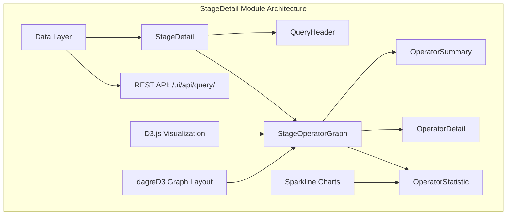
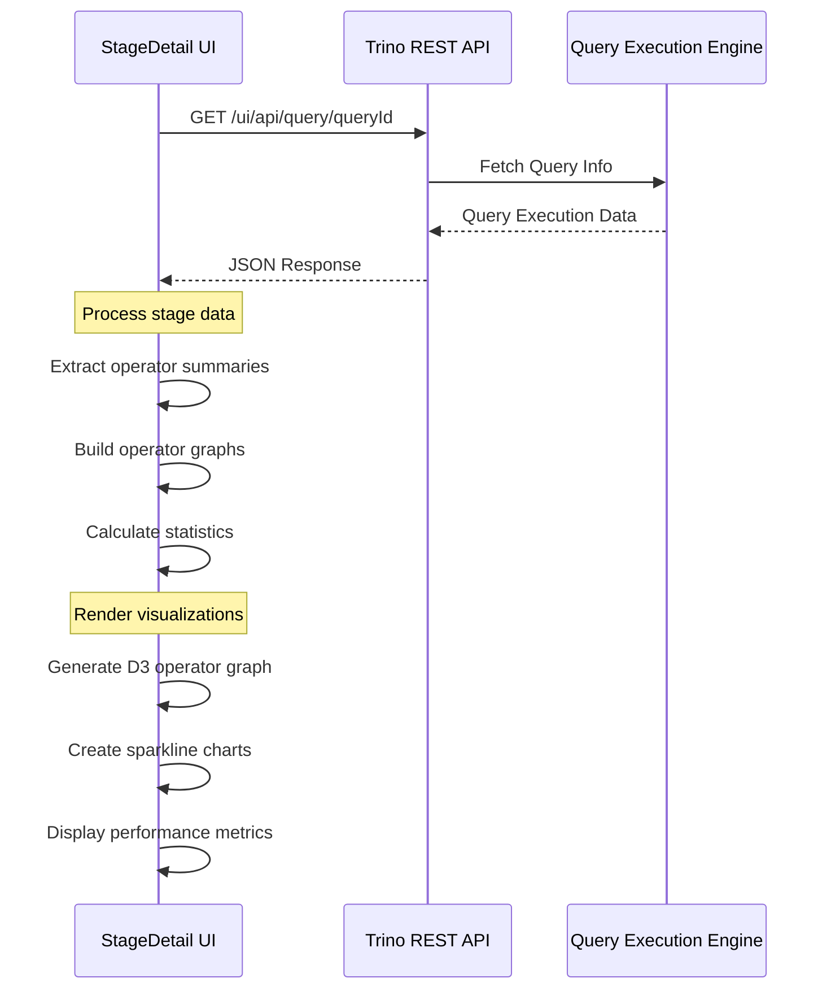

# StageDetail Module Documentation

## Introduction

The StageDetail module is a React-based web component within the Trino Web UI that provides detailed visualization and monitoring of individual query execution stages. It serves as a critical tool for query performance analysis, offering real-time insights into operator-level execution statistics, data flow patterns, and resource utilization within each stage of a distributed Trino query.

## Module Overview

The StageDetail component is part of the Trino Web UI's query monitoring infrastructure, specifically designed to display comprehensive execution details for individual query stages. It integrates with Trino's execution engine to provide operators, database administrators, and developers with deep visibility into query execution patterns, performance bottlenecks, and resource consumption at the stage level.

## Architecture

### Component Structure



### Key Components

#### 1. StageDetail (Main Component)
The root component that orchestrates the entire stage detail view. It manages:
- Query state and refresh cycles
- Stage selection and navigation
- Integration with the QueryHeader component
- Error handling and loading states

#### 2. StageOperatorGraph
Responsible for rendering the operator execution graph using D3.js and dagreD3. It:
- Constructs operator graphs from plan nodes and operator summaries
- Handles operator click events for detailed views
- Manages the visual layout of operator pipelines

#### 3. OperatorSummary
Displays concise operator statistics including:
- Input/output row counts and data sizes
- CPU and wall time metrics
- Driver counts and blocked time
- Processing rates (rows/second, bytes/second)

#### 4. OperatorDetail
Provides comprehensive operator analysis through:
- Detailed performance metrics
- Task-level statistics visualization
- Input/output rate calculations
- Resource utilization breakdown

#### 5. OperatorStatistic
Renders sparkline charts for various operator metrics across all tasks, enabling visual identification of performance patterns and anomalies.

## Data Flow



## Key Features

### 1. Real-time Stage Monitoring
- Automatic refresh every 1000ms during query execution
- Live updates of operator statistics and performance metrics
- Dynamic visualization of data flow through operators

### 2. Operator Graph Visualization
- Interactive DAG representation of operator pipelines
- Click-to-drill-down functionality for detailed operator analysis
- Color-coded performance indicators and edge relationships

### 3. Performance Analytics
- Comprehensive timing metrics (CPU time, wall time, blocked time)
- Data throughput analysis (input/output rates, data sizes)
- Task-level performance distribution via sparkline charts

### 4. Multi-stage Navigation
- Stage selection dropdown for navigating between query stages
- Consistent visualization across all execution stages
- Stage-specific performance isolation and analysis

## Integration Points

### REST API Integration
The module integrates with Trino's REST API through:
- **Endpoint**: `/ui/api/query/{queryId}`
- **Response Format**: JSON containing query execution data
- **Data Structure**: Query info, stages, tasks, and operator summaries

### Query Execution Engine
Interfaces with the execution engine to access:
- [QueryExecution](QueryExecution.md) for overall query state
- [StageExecution](StageExecution.md) for stage-level statistics
- [TaskStatus](TaskStatus.md) for individual task performance data
- Operator summaries and pipeline information

### Web UI Framework
Part of the larger Trino Web UI ecosystem:
- [QueryList](QueryList.md) for query selection
- [QueryDetail](QueryDetail.md) for parent query view
- [WorkerList](WorkerList.md) for cluster-wide monitoring

## Performance Metrics

### Operator-Level Statistics
- **Input Metrics**: Row count, data size, input rates
- **Output Metrics**: Row count, data size, output rates
- **Timing Metrics**: CPU time, wall time, blocked time
- **Resource Metrics**: Driver count, task distribution

### Calculation Methods
```javascript
// Input rate calculation
rowInputRate = operator.inputPositions / (totalWallTime / 1000.0)
byteInputRate = parseDataSize(operator.inputDataSize) / (totalWallTime / 1000.0)

// Total time calculations
totalWallTime = addInputWall + getOutputWall + finishWall + blockedWall
totalCpuTime = addInputCpu + getOutputCpu + finishCpu
```

## Error Handling

### Query State Management
- Handles missing query data gracefully
- Manages query completion states
- Provides user-friendly error messages

### Data Validation
- Validates operator summary data availability
- Checks for required plan node information
- Handles edge cases in timing calculations

### UI Resilience
- Loading states during data fetching
- Error boundaries for component failures
- Fallback visualizations for missing data

## Usage Patterns

### For Query Performance Analysis
1. Identify slow-running queries in [QueryList](QueryList.md)
2. Navigate to specific stage showing performance issues
3. Analyze operator graph for bottlenecks
4. Examine task-level statistics for data skew
5. Review input/output rates for optimization opportunities

### For Resource Utilization Monitoring
1. Monitor CPU time vs wall time ratios
2. Identify operators with high blocked time
3. Analyze driver distribution across tasks
4. Track data throughput rates
5. Compare performance across different stages

## Dependencies

### External Libraries
- **React**: UI framework and component lifecycle management
- **D3.js**: Data visualization and SVG manipulation
- **dagreD3**: Directed graph layout and rendering
- **jQuery**: DOM manipulation and AJAX requests
- **ClipboardJS**: Copy-to-clipboard functionality

### Internal Dependencies
- [QueryHeader](QueryHeader.md): Shared query information display
- [Utils](../utils): Formatting and utility functions
- Trino REST API: Query execution data source

## Configuration

### Refresh Intervals
- Default refresh rate: 1000ms during query execution
- Automatic refresh termination on query completion
- Configurable through UI state management

### Visualization Settings
- Graph layout algorithms via dagreD3
- Sparkline chart configurations
- Color schemes and styling through CSS

## Best Practices

### Performance Optimization
- Efficient data processing and state management
- Optimized re-rendering through React lifecycle methods
- Minimal DOM manipulation through D3.js selections

### User Experience
- Intuitive navigation and stage selection
- Clear visual hierarchy and information organization
- Responsive design for various screen sizes

### Data Accuracy
- Robust error handling for missing or invalid data
- Consistent formatting across all metrics
- Real-time updates with minimal latency

## Future Enhancements

### Potential Improvements
- Historical performance comparison
- Advanced filtering and search capabilities
- Export functionality for performance reports
- Integration with query optimization recommendations
- Enhanced visualization options and customizations

### Scalability Considerations
- Performance with large operator graphs
- Memory management for long-running queries
- Efficient data processing for high-cardinality metrics

## Related Documentation

- [QueryDetail](QueryDetail.md) - Parent query monitoring component
- [QueryList](QueryList.md) - Query selection and overview
- [QueryExecution](QueryExecution.md) - Query execution engine
- [StageExecution](StageExecution.md) - Stage-level execution management
- [TaskStatus](TaskStatus.md) - Individual task performance tracking