# Statement Analysis Engine

## Introduction

The Statement Analysis Engine is a core component of Trino's SQL processing pipeline responsible for analyzing and validating SQL statements. It serves as the semantic analysis layer that transforms parsed SQL statements into analyzed query representations, performing crucial validation, type checking, and metadata resolution tasks.

## Overview

The Statement Analysis Engine operates as the bridge between the SQL Parser and the Query Planner, taking abstract syntax trees (AST) and enriching them with semantic information. It validates SQL statements against the database schema, resolves references, checks permissions, and prepares statements for optimization and execution.

## Architecture

### Core Components

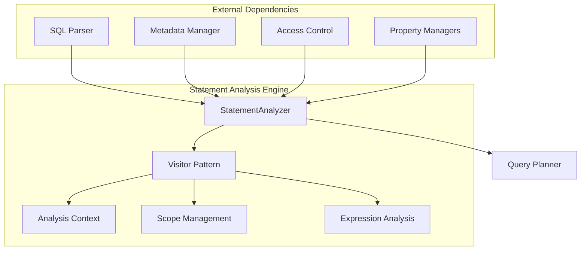

### Component Relationships

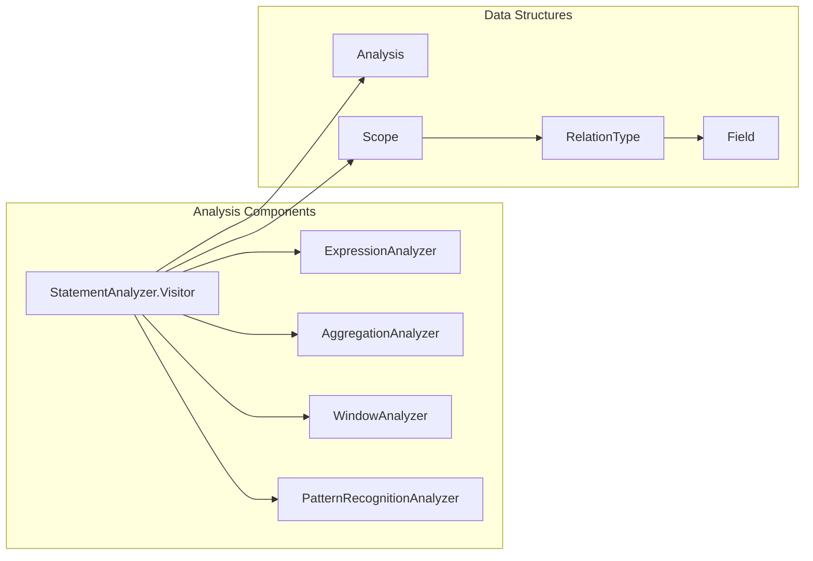

## Core Functionality

### Statement Analysis Process

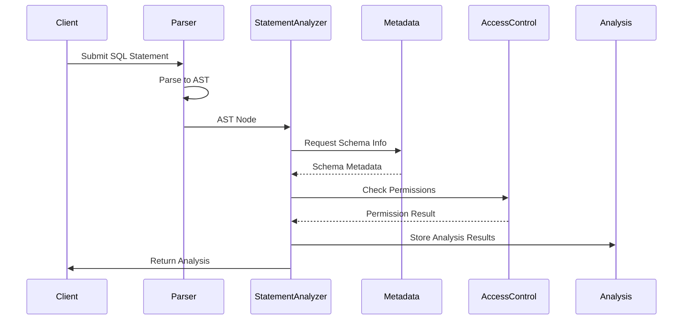

### Visitor Pattern Implementation

The Statement Analysis Engine employs the visitor pattern to traverse and analyze different types of SQL statements:

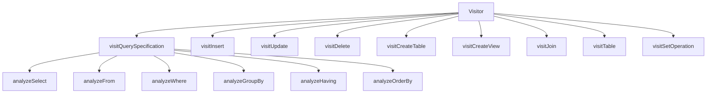

## Key Features

### 1. Semantic Validation

- **Schema Resolution**: Validates table and column existence
- **Type Checking**: Ensures type compatibility in expressions
- **Reference Resolution**: Resolves table and column references
- **Function Validation**: Validates function calls and signatures

### 2. Security Integration

- **Access Control**: Integrates with Trino's security framework
- **Row-Level Security**: Applies row filters and column masks
- **Permission Checking**: Validates user permissions for operations

### 3. Query Analysis

- **Aggregation Analysis**: Validates GROUP BY and HAVING clauses
- **Window Function Analysis**: Analyzes window specifications
- **Subquery Analysis**: Handles correlated and uncorrelated subqueries
- **Join Analysis**: Validates join conditions and types

### 4. Metadata Management

- **Table Metadata**: Retrieves and validates table information
- **Column Metadata**: Handles column types and constraints
- **View Expansion**: Expands views and materialized views
- **Function Resolution**: Resolves function implementations

## Detailed Component Analysis

### StatementAnalyzer.Visitor

The core visitor class that implements the analysis logic for each SQL statement type:

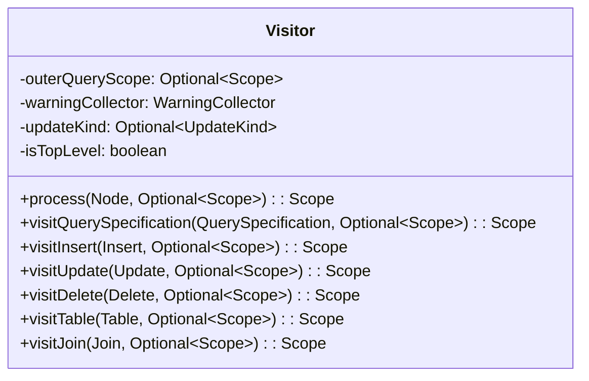

### Scope Management

Manages variable and relation scoping during analysis:

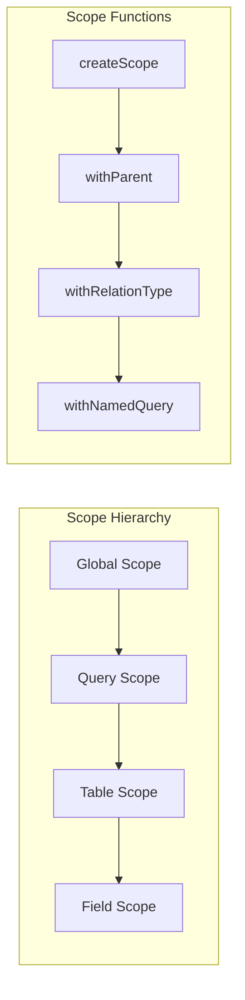

### Analysis Context

Stores analysis results and intermediate state:

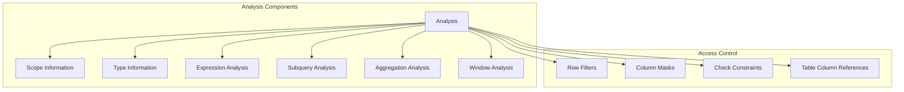

## Data Flow

### Analysis Data Flow

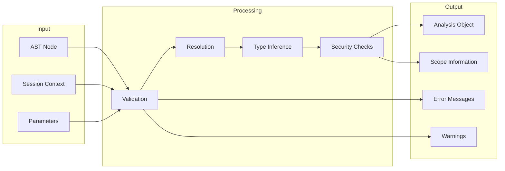

### Expression Analysis Flow

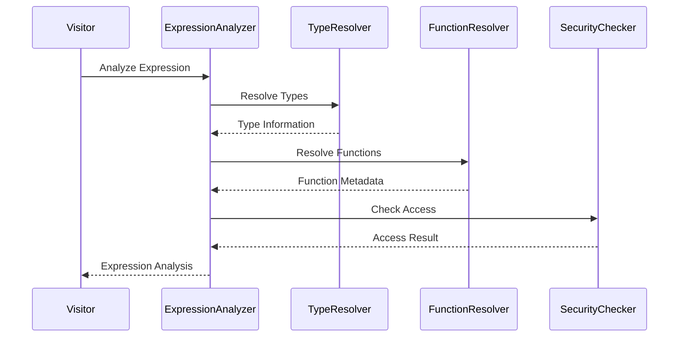

## Integration Points

### With SQL Parser

- Receives parsed AST nodes from the SQL Parser
- Validates parser output for semantic correctness
- Handles parser errors and provides context

### With Metadata Manager

- Queries table and column metadata
- Resolves function implementations
- Validates schema objects
- Retrieves view definitions

### With Access Control

- Checks table and column access permissions
- Applies row-level security filters
- Validates function execution permissions
- Enforces column-level security

### With Query Planner

- Provides analyzed statements to the planner
- Supplies type information for optimization
- Passes security constraints
- Transfers scope and metadata information

## Error Handling

### Validation Errors

The Statement Analysis Engine handles various types of validation errors:

- **Schema Errors**: Table/column not found, invalid references
- **Type Errors**: Type mismatches, incompatible operations
- **Security Errors**: Access denied, insufficient permissions
- **Semantic Errors**: Invalid SQL constructs, constraint violations

### Error Context

Provides detailed error information including:

- Error location in the SQL statement
- Suggested corrections
- Related metadata information
- Security context details

## Performance Considerations

### Caching

- Caches metadata lookups to reduce database queries
- Reuses analysis results for similar statements
- Maintains scope information for efficient lookups

### Optimization

- Lazy evaluation of expensive operations
- Efficient scope resolution algorithms
- Optimized type checking procedures

## Security Features

### Row-Level Security

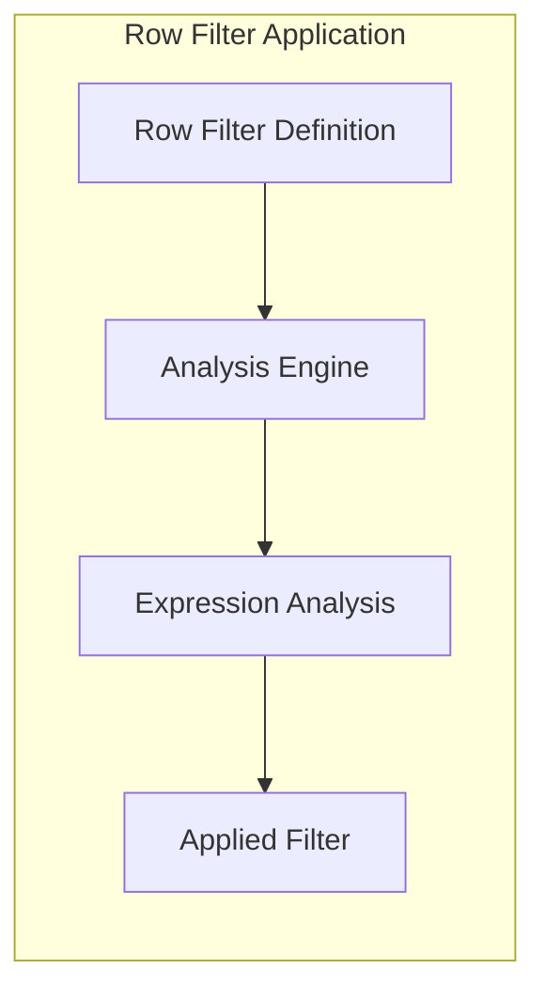

### Column-Level Security

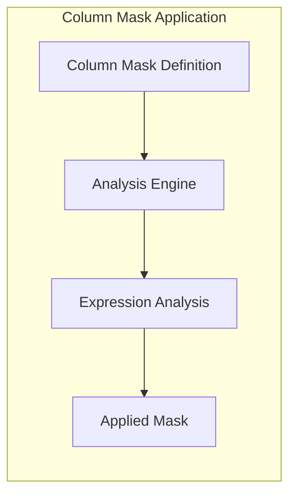

## Advanced Features

### Recursive Query Analysis

Supports analysis of recursive WITH queries:

- Validates recursive query structure
- Ensures proper termination conditions
- Handles recursive references
- Validates type consistency

### Window Function Analysis

Comprehensive window function support:

- Window specification validation
- Frame boundary analysis
- Partition and order by validation
- Function-specific validation

### Pattern Recognition

Advanced pattern matching analysis:

- MATCH_RECOGNIZE clause analysis
- Pattern validation
- Measure expression analysis
- Partition and order by validation

## Testing and Validation

### Unit Testing

- Comprehensive test coverage for all statement types
- Edge case validation
- Error condition testing
- Performance benchmarking

### Integration Testing

- End-to-end query analysis testing
- Cross-component integration validation
- Security feature testing
- Performance validation

## References

- [SQL Parser & AST](SQL Parser & AST.md) - For AST structure and parsing details
- [SQL Analyzer, Planner & Optimizer](SQL Analyzer, Planner & Optimizer.md) - For overall analysis pipeline
- [Metadata & Connector Abstraction](Metadata & Connector Abstraction.md) - For metadata integration
- [Security Framework](Security Framework.md) - For security integration details

## Conclusion

The Statement Analysis Engine is a critical component that ensures SQL statements are semantically valid, secure, and ready for optimization and execution. Its comprehensive validation capabilities, security integration, and support for advanced SQL features make it essential for Trino's query processing pipeline.