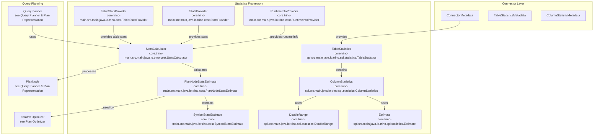
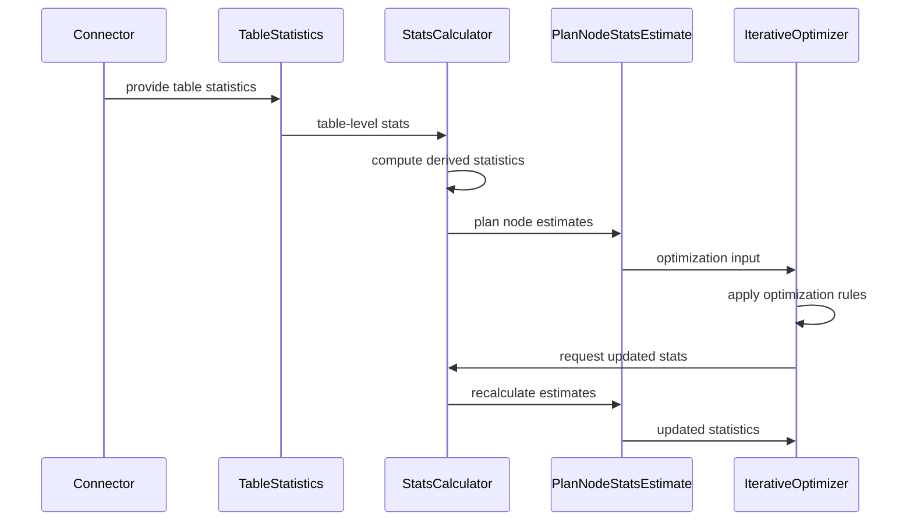

# Statistics Framework

The Statistics Framework is a core component of Trino's query optimization system that provides comprehensive statistical information about data distribution, cardinality, and characteristics. It enables the cost-based optimizer to make informed decisions about query execution plans by estimating the size, selectivity, and cost of different operations.

## Overview

The Statistics Framework serves as the foundation for Trino's cost-based query optimization by providing statistical estimates about tables, columns, and query operations. It bridges the gap between raw data characteristics and the optimizer's need for accurate cost estimations, enabling intelligent query plan selection and resource allocation decisions.

The framework operates at multiple levels of abstraction, from table-level statistics provided by connectors to detailed symbol-level statistics used during query planning and optimization. It handles both known statistics from external sources and derived statistics computed through complex estimation algorithms.

## Architecture



## Core Components

### Table Statistics (SPI Level)

The `TableStatistics` class represents statistical information about an entire table, serving as the primary interface between connectors and the Trino optimizer.

**Key Features:**
- **Row Count Estimation**: Provides estimated number of rows in a table
- **Column Statistics**: Maps column handles to their respective statistics
- **Immutable Design**: Thread-safe with unmodifiable collections
- **Builder Pattern**: Fluent API for constructing statistics objects

**Usage Pattern:**
```java
TableStatistics stats = TableStatistics.builder()
    .setRowCount(Estimate.of(1_000_000))
    .setColumnStatistics(columnHandle, columnStats)
    .build();
```

**Validation Rules:**
- Row count must be non-negative when known
- Column statistics cannot be null
- Unknown values are represented using `Estimate.unknown()`

### Column Statistics (SPI Level)

The `ColumnStatistics` class encapsulates statistical information about individual columns, providing detailed metrics that enable sophisticated optimization decisions.

**Statistical Metrics:**
- **Nulls Fraction**: Estimated proportion of null values (0.0 to 1.0)
- **Distinct Values Count**: Estimated number of unique values
- **Data Size**: Estimated size of column data in bytes
- **Value Range**: Optional range information for numeric types

**Validation Constraints:**
- Nulls fraction must be between 0 and 1 when known
- Distinct values count must be non-negative when known
- Data size must be non-negative when known
- Range is optional but provides valuable optimization hints

### Estimate (SPI Level)

The `Estimate` class provides a unified representation for statistical estimates, handling both known values and unknown cases gracefully.

**Design Philosophy:**
- **NaN Representation**: Unknown values are represented as NaN
- **Immutable Values**: All instances are immutable and thread-safe
- **Special Values**: Predefined constants for common cases (unknown, zero)
- **Validation**: Prevents infinite values and ensures numerical stability

**Usage Patterns:**
```java
Estimate known = Estimate.of(1000);        // Known estimate
Estimate unknown = Estimate.unknown();     // Unknown value
Estimate zero = Estimate.zero();           // Zero estimate
```

### DoubleRange (SPI Level)

The `DoubleRange` class represents value ranges for numeric data types, enabling range-based optimizations and cardinality estimations.

**Key Capabilities:**
- **Type Conversion**: Converts from Trino's native type representation
- **Range Operations**: Supports union operations for combining ranges
- **Validation**: Ensures min ≤ max and handles NaN values appropriately
- **Optional Presence**: Range information is optional in column statistics

### Plan Node Statistics Estimate (Main Level)

The `PlanNodeStatsEstimate` class represents statistics at the query plan level, bridging table statistics with symbol-level estimates used during optimization.

**Advanced Features:**
- **Symbol Statistics**: Per-symbol statistics for complex expressions
- **Output Size Calculation**: Estimates data size based on type information
- **Row Count Tracking**: Tracks estimated row counts through plan transformations
- **Immutable Updates**: Functional updates preserve immutability

**Size Estimation Logic:**
- Fixed-width types: Uses type-specific size calculations
- Variable-width types: Applies average row size estimates
- Accounts for null bitmap overhead
- Includes offset array overhead for variable-width types

### Statistics Calculator (Main Level)

The `StatsCalculator` interface defines the contract for computing statistics during query planning, with a context-based approach for accessing required information.

**Context Components:**
- **StatsProvider**: Provides statistics for plan nodes
- **TableStatsProvider**: Supplies table-level statistics from connectors
- **RuntimeInfoProvider**: Provides runtime information for dynamic statistics
- **Session**: Contains session-specific configuration
- **Lookup**: Enables recursive plan node resolution

## Data Flow



## Integration Points

### Connector Integration

Connectors provide statistics through the `ConnectorMetadata` interface, implementing methods to supply `TableStatistics` objects for tables and partitions.

**Connector Responsibilities:**
- Collect and maintain table-level statistics
- Provide column-specific statistical information
- Update statistics based on data modifications
- Handle partition-level statistics for partitioned tables

### Query Planning Integration

The statistics framework integrates deeply with Trino's query planning process, providing essential information for plan optimization decisions.

**Planning Integration Points:**
- **Table Scan Planning**: Uses table statistics for initial cost estimates
- **Join Ordering**: Leverages cardinality estimates for optimal join ordering
- **Filter Selectivity**: Applies column statistics to estimate filter selectivity
- **Aggregation Planning**: Uses distinct value counts for aggregation optimization

### Optimizer Integration

The iterative optimizer uses statistics extensively when applying transformation rules and evaluating plan alternatives.

**Optimizer Usage:**
- **Cost Comparison**: Compares estimated costs of alternative plans
- **Rule Application**: Uses statistics to determine rule applicability
- **Property Derivation**: Propagates statistics through plan transformations
- **Decision Making**: Makes optimization decisions based on statistical evidence

## Statistical Computation

### Table Statistics Rules

The framework includes specialized rules for computing statistics for different plan node types:

- **TableScanStatsRule**: Computes statistics for table scans
- **FilterStatsRule**: Estimates statistics after applying filters
- **ProjectStatsRule**: Computes statistics for projection operations
- **JoinStatsRule**: Estimates join result statistics
- **AggregationStatsRule**: Computes aggregation statistics

### Statistical Formulas

The framework employs sophisticated statistical formulas for accurate estimation:

**Filter Selectivity:**
```
selectivity = 1 - nulls_fraction + (nulls_fraction * filter_selectivity)
```

**Join Cardinality:**
```
result_rows = left_rows * right_rows / max(left_distinct, right_distinct)
```

**Union Cardinality:**
```
result_rows = left_rows + right_rows - intersection_estimate
```

## Performance Considerations

### Caching Strategy

The framework implements multi-level caching to avoid redundant computations:

- **Table Statistics Cache**: Caches connector-provided statistics
- **Plan Node Statistics Cache**: Caches computed plan-level statistics
- **Runtime Information Cache**: Caches dynamic statistics from query execution

### Memory Management

Careful memory management ensures the framework scales to large queries:

- **Immutable Data Structures**: Uses persistent collections for efficient updates
- **Lazy Computation**: Defers expensive calculations until needed
- **Size Limits**: Implements reasonable limits on cached statistics
- **Garbage Collection**: Facilitates efficient garbage collection

## Error Handling

### Unknown Statistics

The framework gracefully handles missing or unknown statistics:

- **Unknown Estimates**: Uses NaN to represent unknown values
- **Conservative Estimates**: Applies conservative assumptions when statistics are missing
- **Fallback Strategies**: Implements fallback estimation strategies
- **Logging**: Provides appropriate logging for debugging

### Validation

Comprehensive validation ensures statistical consistency:

- **Range Validation**: Validates statistical ranges and proportions
- **Consistency Checks**: Ensures internal consistency of statistics
- **Type Safety**: Validates type compatibility in statistical operations
- **Error Reporting**: Provides clear error messages for debugging

## Extension Points

### Custom Statistics

Connectors can provide custom statistical information beyond the standard metrics:

- **Histograms**: Value distribution histograms for complex types
- **Correlation Statistics**: Inter-column correlation information
- **Skew Information**: Data skew indicators for optimization
- **Partition Statistics**: Detailed partition-level statistics

### Statistics Providers

The framework supports pluggable statistics providers for different data sources:

- **Connector Providers**: Native connector statistics
- **External Providers**: Statistics from external systems
- **Computed Providers**: Derived statistics from query history
- **Hybrid Providers**: Combined statistics from multiple sources

## Best Practices

### For Connector Developers

1. **Provide Accurate Statistics**: Invest in accurate statistics collection
2. **Maintain Freshness**: Keep statistics up-to-date with data changes
3. **Handle Unknown Cases**: Gracefully handle cases where statistics are unavailable
4. **Validate Ranges**: Ensure statistical values are within valid ranges
5. **Document Limitations**: Clearly document any statistical limitations

### For Query Optimization

1. **Trust Statistics**: Rely on statistics for optimization decisions
2. **Handle Unknowns**: Implement conservative fallbacks for unknown statistics
3. **Propagate Updates**: Ensure statistics are properly propagated through plans
4. **Monitor Accuracy**: Track the accuracy of statistical estimates
5. **Adjust Dynamically**: Consider runtime feedback for statistical refinement

## Related Documentation

- [Connector Framework](Connector%20Framework.md) - For connector-level statistics integration
- [SQL Analyzer, Planner & Optimizer](SQL%20Analyzer%2C%20Planner%20%26%20Optimizer.md) - For query planning integration
- [Cost & Statistics](SQL%20Analyzer%2C%20Planner%20%26%20Optimizer.md#cost--statistics) - For cost-based optimization details
- [Type System](Type%20System.md) - For type-specific statistical handling