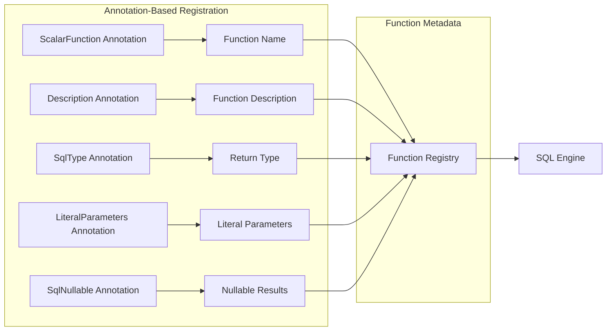
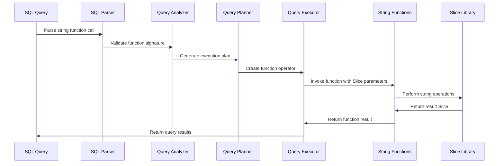
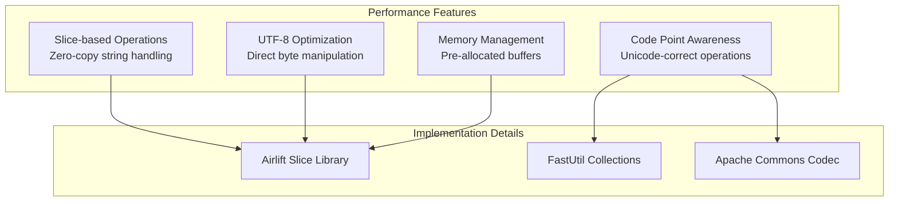

# String Functions Module

## Introduction

The String Functions module provides comprehensive string manipulation capabilities within Trino's SQL function system. It implements a wide range of scalar functions for text processing, including string transformation, searching, comparison, and encoding operations. These functions are essential for data cleaning, text analysis, and general string operations in SQL queries.

## Architecture Overview

The String Functions module is built on Trino's scalar function framework and integrates deeply with the type system and execution engine.

```mermaid
graph TB
    subgraph "String Functions Module"
        SF[StringFunctions Class]
        
        subgraph "Function Categories"
            TRANSFORM[Transformation Functions<br/>lower, upper, reverse, trim]
            SEARCH[Search Functions<br/>strpos, substr, replace]
            SPLIT[Split Functions<br/>split, split_part]
            DISTANCE[Distance Functions<br/>levenshtein, hamming]
            ENCODE[Encoding Functions<br/>fromUtf8, toUtf8, normalize]
            UTILITY[Utility Functions<br/>length, chr, codepoint]
        end
        
        SF --> TRANSFORM
        SF --> SEARCH
        SF --> SPLIT
        SF --> DISTANCE
        SF --> ENCODE
        SF --> UTILITY
    end
    
    subgraph "Trino Function Framework"
        SFI[ScalarFunctionImplementation]
        SFN[ScalarFunction Annotation]
        SFT[SqlType Annotation]
        SFD[Description Annotation]
    end
    
    subgraph "Type System"
        ST[StandardTypes]
        VT[VARCHAR Type]
        CT[CHAR Type]
        CPT[CodePointsType]
    end
    
    subgraph "Execution Engine"
        SL[Slice Library]
        SU[SliceUtf8 Utilities]
        BB[BlockBuilder]
    end
    
    SF -.-> SFN
    SF -.-> SFT
    SF -.-> SFD
    SF --> SL
    SF --> SU
    SF --> BB
    SF --> ST
    SF --> VT
    SF --> CT
    SF --> CPT
```



## Core Components

### StringFunctions Class

The `StringFunctions` class is the main container for all string manipulation functions. It uses Trino's annotation-based function registration system to expose methods as SQL functions.

**Key Characteristics:**
- All methods are static and stateless
- Functions operate on `Slice` objects (Trino's binary string representation)
- Unicode-aware operations using UTF-8 encoding
- Comprehensive error handling with `TrinoException`

### Function Registration System

Functions are registered using annotations from the Trino SPI:



## Function Categories

### 1. String Transformation Functions

#### Case Conversion
- `lower(string)` - Converts string to lowercase
- `upper(string)` - Converts string to uppercase

#### String Reversal
- `reverse(string)` - Reverses all code points in the string

#### Trimming Functions
- `trim(string)` - Removes whitespace from both ends
- `ltrim(string)` - Removes whitespace from the beginning
- `rtrim(string)` - Removes whitespace from the end
- `trim(string, characters)` - Removes specified characters from both ends
- `ltrim(string, characters)` - Removes specified characters from the beginning
- `rtrim(string, characters)` - Removes specified characters from the end

### 2. String Search and Extraction Functions

#### Position Functions
- `strpos(string, substring)` - Returns position of first occurrence
- `strpos(string, substring, instance)` - Returns position of nth occurrence

#### Substring Functions
- `substring(string, start)` - Returns substring from start position
- `substring(string, start, length)` - Returns substring of specified length
- `substr(string, start)` - Alias for substring
- `substr(string, start, length)` - Alias for substring

#### Replacement Functions
- `replace(string, search)` - Removes occurrences of search string
- `replace(string, search, replacement)` - Replaces occurrences with replacement

### 3. String Splitting Functions

#### Split Operations
- `split(string, delimiter)` - Splits string into array
- `split(string, delimiter, limit)` - Splits with maximum number of parts
- `split_part(string, delimiter, index)` - Returns specific part from split

### 4. String Distance and Comparison Functions

#### Distance Calculations
- `levenshtein_distance(string1, string2)` - Computes Levenshtein distance
- `hamming_distance(string1, string2)` - Computes Hamming distance

#### Character Analysis
- `length(string)` - Returns number of code points
- `chr(codepoint)` - Converts Unicode code point to string
- `codepoint(string)` - Returns Unicode code point of single character

### 5. String Encoding Functions

#### UTF-8 Operations
- `from_utf8(binary)` - Decodes UTF-8 encoded binary data
- `from_utf8(binary, replacement)` - Decodes with replacement for invalid sequences
- `to_utf8(string)` - Encodes string to UTF-8 binary

#### Normalization
- `normalize(string, form)` - Normalizes string to Unicode form (NFD, NFC, NFKD, NFKC)

### 6. Utility Functions

#### String Operations
- `translate(string, from, to)` - Translates characters based on mapping
- `soundex(string)` - Encodes string to Soundex value
- `starts_with(string, prefix)` - Checks if string starts with prefix
- `concat(string1, string2)` - Concatenates two strings

#### Padding Functions
- `lpad(string, length, padstring)` - Pads string on the left
- `rpad(string, length, padstring)` - Pads string on the right

## Data Flow Architecture



## Integration with Trino System

### Function Framework Integration

The String Functions module integrates with Trino's function framework through:

1. **Scalar Function Registration**: Uses `@ScalarFunction` annotation for automatic registration
2. **Type System Integration**: Works with VARCHAR, CHAR, and specialized types like CodePointsType
3. **Literal Parameter Support**: Uses `@LiteralParameters` for compile-time type constraints
4. **Null Handling**: Supports nullable parameters and return values

### Performance Optimizations



### Error Handling

The module implements comprehensive error handling:

- **Invalid Function Arguments**: Throws `TrinoException` with `INVALID_FUNCTION_ARGUMENT` error code
- **UTF-8 Validation**: Handles invalid UTF-8 sequences gracefully
- **Unicode Validation**: Validates Unicode code points and sequences
- **Bounds Checking**: Validates string indices and lengths

## Dependencies

The String Functions module depends on several key Trino components:

### Core Dependencies
- **[Function System](Function System.md)**: Provides scalar function framework and annotations
- **[Type System](Type System.md)**: Defines VARCHAR, CHAR, and CodePointsType
- **[Trino SPI](Trino SPI.md)**: Provides function annotations and type definitions

### Utility Dependencies
- **Airlift Slice Library**: High-performance string operations
- **Apache Commons Codec**: Soundex encoding implementation
- **FastUtil**: Efficient primitive collections for character mapping

### Execution Dependencies
- **[Query Execution Engine](Query Execution Engine.md)**: Integrates with operator framework
- **[SQL Functions & Operators](SQL Functions & Operators.md)**: Part of the broader function ecosystem

## Usage Examples

### Basic String Operations
```sql
-- Case conversion
SELECT lower('HELLO WORLD'); -- 'hello world'
SELECT upper('hello world'); -- 'HELLO WORLD'

-- String trimming
SELECT trim('  hello  '); -- 'hello'
SELECT ltrim('  hello'); -- 'hello  '
SELECT rtrim('hello  '); -- '  hello'
```

### String Search and Extraction
```sql
-- Position and substring
SELECT strpos('hello world', 'world'); -- 7
SELECT substring('hello world', 7); -- 'world'
SELECT substring('hello world', 7, 5); -- 'world'

-- Replacement
SELECT replace('hello world', 'world', 'universe'); -- 'hello universe'
```

### String Splitting
```sql
-- Split operations
SELECT split('a,b,c', ','); -- ['a', 'b', 'c']
SELECT split_part('a,b,c', ',', 2); -- 'b'
```

### Advanced Functions
```sql
-- Distance calculations
SELECT levenshtein_distance('kitten', 'sitting'); -- 3
SELECT hamming_distance('karolin', 'kathrin'); -- 3

-- Encoding operations
SELECT normalize('café', 'NFD'); -- Unicode normalization
SELECT soundex('Smith'); -- 'S530'
```

## Unicode Support

The String Functions module provides comprehensive Unicode support:

- **UTF-8 Encoding**: All operations work with UTF-8 encoded strings
- **Code Point Awareness**: Functions operate on Unicode code points, not bytes
- **Normalization Support**: Supports Unicode normalization forms
- **Grapheme Cluster Limitations**: Current implementation works with code points, not grapheme clusters

## Performance Characteristics

### Time Complexity
- **Basic Operations**: O(n) where n is string length
- **Search Operations**: O(n*m) for substring search
- **Distance Calculations**: O(n*m) for Levenshtein distance
- **Split Operations**: O(n) where n is string length

### Memory Usage
- **Slice Operations**: Minimal memory allocation through slice reuse
- **Buffer Management**: Pre-allocated buffers for complex operations
- **Temporary Objects**: Minimized through efficient algorithms

## Future Enhancements

Potential improvements to the String Functions module:

1. **Grapheme Cluster Support**: Enhanced Unicode text segmentation
2. **Collation Support**: Locale-aware string comparison
3. **Regular Expression Functions**: Pattern matching capabilities
4. **Additional Distance Metrics**: More string similarity algorithms
5. **Performance Optimizations**: SIMD operations for bulk processing