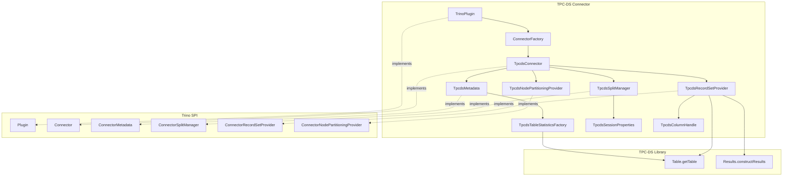
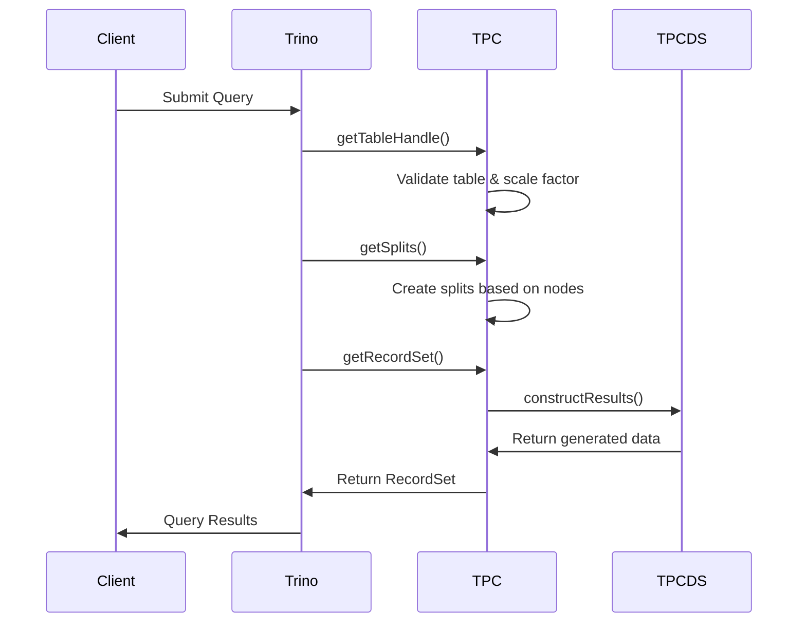

# TPC-DS Connector

## Overview

The TPC-DS Connector is a specialized Trino connector that provides read-only access to TPC-DS (Transaction Processing Performance Council - Decision Support) benchmark datasets. This connector generates synthetic data on-demand based on the TPC-DS specification, making it an invaluable tool for testing query performance, validating optimizer behavior, and benchmarking Trino deployments without requiring large physical datasets.

## Purpose and Use Cases

The TPC-DS Connector serves several critical purposes within the Trino ecosystem:

- **Performance Testing**: Provides standardized benchmark datasets for consistent performance testing across different Trino configurations
- **Query Optimization Validation**: Enables testing of query optimizer improvements using complex decision support queries
- **Scalability Testing**: Supports multiple scale factors from tiny (0.01) to massive (100,000) for testing different data volumes
- **Development and Debugging**: Offers predictable, repeatable datasets for developing and debugging Trino features
- **Educational Resource**: Serves as a reference implementation for connector development

## Architecture

### High-Level Architecture



### Data Flow Architecture



## Core Components

### 1. TpcdsPlugin
The entry point for the connector that registers the TPC-DS connector factory with Trino's plugin system. See [TpcdsPlugin.md](TpcdsPlugin.md) for detailed documentation.

### 2. TpcdsConnector
The main connector implementation that coordinates all connector operations including transaction management, metadata access, and data retrieval. See [TpcdsConnector.md](TpcdsConnector.md) for detailed documentation.

### 3. TpcdsMetadata
Handles schema and table metadata operations, including table discovery, column mapping, and statistics generation. See [TpcdsMetadata.md](TpcdsMetadata.md) for detailed documentation.

### 4. TpcdsSplitManager
Responsible for dividing data generation work across available Trino worker nodes to enable parallel processing. See [TpcdsSplitManager.md](TpcdsSplitManager.md) for detailed documentation.

### 5. TpcdsRecordSetProvider
Generates the actual TPC-DS data by interfacing with the underlying TPC-DS library and converting it to Trino's internal format. See [TpcdsRecordSetProvider.md](TpcdsRecordSetProvider.md) for detailed documentation.

## Scale Factor Support

The connector supports multiple scale factors that determine the size of generated datasets:

| Schema Name | Scale Factor | Description |
|-------------|--------------|-------------|
| tiny | 0.01 | Minimal dataset for development |
| sf1 | 1 | 1 GB dataset |
| sf10 | 10 | 10 GB dataset |
| sf100 | 100 | 100 GB dataset |
| sf300 | 300 | 300 GB dataset |
| sf1000 | 1,000 | 1 TB dataset |
| sf3000 | 3,000 | 3 TB dataset |
| sf10000 | 10,000 | 10 TB dataset |
| sf30000 | 30,000 | 30 TB dataset |
| sf100000 | 100,000 | 100 TB dataset |

## Supported Tables

The connector provides access to all 24 TPC-DS benchmark tables:

- **Store Sales**: `store_sales`
- **Store Returns**: `store_returns`
- **Catalog Sales**: `catalog_sales`
- **Catalog Returns**: `catalog_returns`
- **Web Sales**: `web_sales`
- **Web Returns**: `web_returns`
- **Inventory**: `inventory`
- **Store**: `store`
- **Call Center**: `call_center`
- **Catalog Page**: `catalog_page`
- **Web Site**: `web_site`
- **Web Page**: `web_page`
- **Warehouse**: `warehouse`
- **Customer**: `customer`
- **Customer Address**: `customer_address`
- **Customer Demographics**: `customer_demographics`
- **Date Dimension**: `date_dim`
- **Household Demographics**: `household_demographics`
- **Item**: `item`
- **Income Band**: `income_band`
- **Promotion**: `promotion`
- **Reason**: `reason`
- **Ship Mode**: `ship_mode`
- **Time Dimension**: `time_dim`

## Data Type Mapping

The connector maps TPC-DS column types to Trino types:

| TPC-DS Type | Trino Type | Description |
|-------------|------------|-------------|
| IDENTIFIER | BIGINT | Surrogate keys |
| INTEGER | INTEGER | Integer values |
| DATE | DATE | Date values |
| DECIMAL(p,s) | DECIMAL(p,s) | Decimal numbers |
| CHAR(n) | CHAR(n) | Fixed-length strings |
| VARCHAR(n) | VARCHAR(n) | Variable-length strings |
| TIME | TIME | Time values |

## Configuration

### Connector Configuration

The TPC-DS connector requires minimal configuration:

```properties
connector.name=tpcds
```

### Session Properties

The connector provides session-level configuration options:

- **tpcds.splits_per_node**: Number of splits per worker node (default: 4)
- **tpcds.with_no_sexism**: Enable "no sexism" mode for data generation
- **tpcds.split_count**: Override total split count

## Performance Characteristics

### Data Generation
- Data is generated on-demand during query execution
- No persistent storage requirements
- CPU-intensive operation that scales with data volume

### Parallelization
- Automatic parallelization across available worker nodes
- Configurable splits per node for fine-grained control
- Balanced workload distribution using consistent hashing

### Caching
- No built-in caching (data is regenerated for each query)
- Relies on Trino's query result caching when enabled

## Integration with Trino Ecosystem

### Plugin Architecture
The TPC-DS connector integrates with Trino's plugin system through the [Trino SPI](Trino%20SPI.md), providing a complete implementation of the connector interfaces.

### Query Planning
Works seamlessly with Trino's [SQL Analyzer, Planner & Optimizer](SQL%20Analyzer%2C%20Planner%20%26%20Optimizer.md) for complex decision support queries.

### Statistics
Provides accurate table and column statistics to enable cost-based optimization through integration with the [Statistics Framework](Trino%20SPI.md#statistics-framework).

## Limitations

- **Read-Only**: No support for INSERT, UPDATE, DELETE operations
- **No Transaction Support**: Data consistency is not guaranteed across queries
- **No Indexing**: All queries perform full table scans
- **No Partitioning**: Data is generated as a single logical unit
- **No Versioning**: No support for table versioning or time travel

## Testing and Benchmarking

### Query Templates
The connector is designed to work with standard TPC-DS query templates, providing a standardized benchmark for:
- Decision support queries
- Complex joins and aggregations
- Window functions and subqueries
- Date and time-based analysis

### Performance Validation
Use the connector to validate:
- Query execution plans
- Join algorithm selection
- Aggregation performance
- Memory usage patterns
- Network efficiency

## Development and Extension

### Adding New Features
The connector can be extended to support:
- Additional TPC-DS variants
- Custom data generation rules
- Specialized statistics
- Performance monitoring

### Best Practices
- Use appropriate scale factors for testing scenarios
- Monitor CPU usage during data generation
- Consider network bandwidth for large-scale factors
- Test with realistic query patterns

## Related Documentation

- [TPC-H Connector](TPC-H%20Connector.md) - Similar connector for TPC-H benchmark datasets
- [Base JDBC Connector](Base%20JDBC%20Connector.md) - Reference for connector development patterns
- [Trino SPI](Trino%20SPI.md) - Service Provider Interface documentation
- [Query Execution Engine](Query%20Execution%20Engine.md) - Understanding query execution
- [SQL Functions & Operators](SQL%20Functions%20%26%20Operators.md) - Available functions for queries